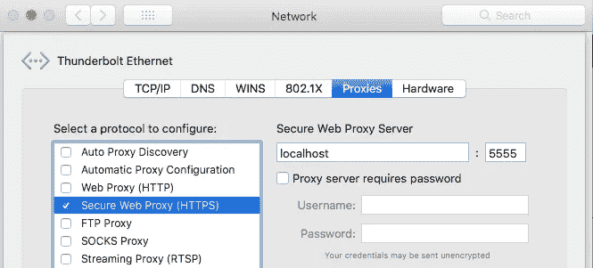

# 嘲笑它，直到你拥有它

> 原文：<https://medium.com/hackernoon/mock-it-until-you-have-it-c0785d327476>


Photo by [rawpixel](https://unsplash.com/photos/HId6JGZ7urI?utm_source=unsplash&utm_medium=referral&utm_content=creditCopyText) on [Unsplash](https://unsplash.com/search/photos/startup?utm_source=unsplash&utm_medium=referral&utm_content=creditCopyText)

## 模仿 HTTP 和 HTTPS 网站和 REST APIs，这样你在进行任何相关的开发或自动化测试时就不会依赖这些服务或互联网。

当开发面向桌面、web 或移动应用的新客户端时，最大的挑战之一是正确的 API web 服务的可用性，如果您要将您的应用集成到第三方系统，它可能是您自己的服务器或其他一些第三方 web 服务的一部分。如果由于不可避免的情况而并行开发应用程序和需要消费的 web 服务，也会出现这个问题。

这个问题不仅仅局限于开发，它也是自动化/手动测试中的一个挑战。任何测试只有在可靠的情况下才有用。考虑到这一点，如果所需的第三方服务/网站更改、宕机或其他问题，或者即使您正在使用自己的 web 服务，每次测试期间正确和完整数据的可用性本身都会是一个巨大的挑战。

如果有时您的测试由于任何这些服务中的数据契约变化而失败，确实很难找出确切的原因。

幸运的是，有许多工具可以帮助您模拟 web 服务，这样您就不再因为服务的不可用或变化而等待或停滞不前。

[Betamax](https://github.com/betamaxteam/betamax) (其正式死亡)和[闪回](https://github.com/linkedin/flashback)是其中两个名字。Betamax 自身面临的挑战很少，因为它需要始终连接互联网才能工作，如果您正在做一些安全关键的事情，并且您正在隔离的系统中工作，这可能会是一个问题。

在本文中，我们将学习如何使用**闪回**来管理 web 服务。闪回由 LinkedIn 开发，于 2017 年 6 月开源。

# **什么是闪回**

Flashback 基于 Java 的跨平台工具，用于模仿 HTTP 和 HTTPS 服务/REST API。基本上，它记录 HTTP 和 HTTPS 请求并存储在本地，然后通过基于各种请求匹配规则匹配请求来回放相同的请求。每个这样的请求记录被称为场景。匹配规则将传入的请求与先前记录的请求相关联，然后使用该请求生成响应。HTTP 请求通常包含 URL、方法、头和主体。闪回允许为这些组件的任意组合定义匹配规则。

你可以在这里阅读更多关于闪回以及它是如何运作的:[***https://github.com/linkedin/flashback***](https://github.com/linkedin/flashback)

# 模仿 HTTP 请求

使用闪回模仿 HTTP 请求非常简单。闪回的工作方式就像中间人代理一样，截取并记录所有的网络流量。闪回有两个部分:

**闪回管理服务器** —它集中控制为记录和重放 HTTP 和 HTTPS 场景而创建的闪回代理。

**闪回代理服务器—** 它实际上拦截 HTTP/HTTPS 流量，并记录和回放它们。将这些记录保存为场景，然后根据各种匹配规则和提供配置回放它们。

## 记录 HTTP 场景

在我们实际模拟服务之前，让我们首先设置闪回来模拟 HTTP 服务。首先，如果你使用的是 MAC，确保你的机器上启用了 http 服务器。

```
sudo apachectl start
```

**1。**克隆闪回回购

```
git clone [https://github.com/linkedin/flashback.git](https://github.com/linkedin/flashback.git)
```

**2。**在终端上，将当前工作目录更改为此克隆存储库目录，并通过运行以下脚本启动闪回管理服务器:

```
./startAdminServer.sh -port 1234
```

**3。一旦管理服务器启动，您可以使用它公开的 REST APIs 与它进行交互。下一步是启动闪回 HTTP 代理服务器来记录 HTTP 场景。只需使用 Curl 或任何您喜欢的 REST 客户端点击下面的 API，我在这个演示中使用了 Postman:**

```
POST [http://localhost:1234/admin?action=startFlashback](http://localhost:1234/admin?action=startFlashback)
```

**请求正文:**

```
{
"sceneMode": "record",
"sceneName": "test1",
"matchRule": "matchMethodBodyUri",
"scenePath": "/tmp",
"proxyHost": "localhost",
"proxyPort": "5555"
}
```

在 body 中，我们传递了各种 config 参数，您可以在这里参考 [**以了解更多关于**](#4015) **参数的详细信息。**

**4。**现在一切都已完成，我们的代理正在运行以记录流量，但在此之前，您需要在运行此代理的设备或 MAC 上配置此 HTTP 代理设置，并且您要在该设备或 MAC 上记录流量(通常是同一台机器)。下面是 MAC 上的示例设置。


配置完成后，保存设置并重新启动浏览器或您正在使用的任何其他客户端。

> 如果您正在使用任何 REST 客户端，您也可以选择仅在该 REST 客户端中配置代理设置，而不是在系统中配置，但是要确保您的所有请求都有这个代理。

**5。**只需点击任何 HTTP 网站或 REST API，一旦完成，停止闪回代理服务器。闪回只有在停止后才会将场景保存在磁盘上。

```
POST [http://localhost:1234/admin?action=shutDownFlashback](http://localhost:1234/admin?action=shutDownFlashback)
```

6。要验证是否一切顺利，只需转到您在启动代理服务器时配置的“scenePath”位置，您应该会看到一个与“sceneName”同名的文件，只需打开它，您就会找到您访问过的所有 HTTP 网站/API。

## 回放 HTTP 场景

要重放先前存储的场景，请使用与录制时相同的基本设置；唯一的区别是，您在上面的步骤 3 中将“场景模式”设置为“回放”:

```
POST [http://localhost:1234/admin?action=startFlashback](http://localhost:1234/admin?action=startFlashback)
```

**请求正文:**

```
{
"sceneMode": "playback",
"sceneName": "test1",
"matchRule": "matchMethodBodyUri",
"scenePath": "/tmp",
"proxyHost": "localhost",
"proxyPort": "5555"
}
```

验证响应来自场景而非外部源的一种方法是，在执行步骤 1 至 6 时，暂时禁用互联网连接。另一种方法是修改您的场景文件，并查看响应是否与文件中的内容相同。确保您的计算机中仍然配置了系统代理设置，如上面第 4 步所述。

闪回管理服务器有各种配置参数可用于启动或停止 HTTP 到 HTTPS 代理服务，您将需要这些参数。闪回的 git 页面上的任何地方都没有直接提供这些参数中的大多数。唯一的办法就是挖掘代码找出答案。别担心，你不必这样做，我已经找到了一些你可以直接使用的。让我们来看看这些参数:

# 嘲笑 HTTPS 的请求

模拟 HTTPs 事务类似于 HTTP 事务，但是它需要更多的配置。默认情况下，HTTPS 事务是加密的，闪回无法对事务进行编码。为了启用闪回，我们需要创建一个证书颁发机构(CA)证书。Flashback 将使用此证书通过攻击中间人来拦截 HTTPS 流量。

有两种方法可以获得并向闪回提供证书。

*   从任何受信任的 CA 购买中间 CA 证书。
*   创建您自己的 CA 和证书，并将其添加到您的计算机的可信存储中。您需要将它作为自己的证书添加到 CA 可信存储中，它不会被操作系统识别和信任，因为它不是由可信 CA 颁发的。因此，所有通信都将被阻止。一旦您将证书添加到系统可信存储中，它就变得可为操作系统所信任。

我现在将介绍如何创建您自己的 CA 证书，您可以按照下面的指南一步一步地盲目创建您自己的证书:

[**https://Jamie Linux . com/docs/OpenSSL-certificate-authority/create-the-root-pair . html**](https://jamielinux.com/docs/openssl-certificate-authority/create-the-root-pair.html)

一旦您获得证书，它只是一些配置来模拟 HTTPS 流量的问题。如果您按照上述步骤创建证书，您将获得一个证书' *ca.cert.pem* '和一个私钥' *ca.key.pem* '以及这些证书的证书和私钥的密码(说其' *secretpassword* ')。把它们放在手边，我们很快就会需要它们。

有两种方式可以提供证书闪回或者直接输入身份。 *pem* 文件或创建。 *p12* 文件。

来创建。 *p12* 文件，获得以上两个文件后，运行以下命令:

```
openssl pkcs12 -export -out intermediateCA.p12 -inkey private/ca.key.pem -in certs/ca.cert.pem -name “secretpassword”
```

它将为您生成 intermediateCA.p12 证书。现在我们已经准备好了所有的先决条件。

## 记录和重放 HTTPS 场景

**1** 。只需点击下面的 API

```
POST [http://localhost:1234/admin?action=startFlashback](http://localhost:1234/admin?action=startFlashback)
```

**请求正文:**

```
{
"sceneMode": "record",
"sceneName": "httpsTestScene",
"matchRule": "matchMethodBodyUri",
"scenePath": "/tmp",
"proxyHost": "localhost",
"proxyPort": "5555",
"caCertPath":"<Path to your intermediateCA.p12 file>/intermediate.p12",
"caCertPwd":"secretpassword", //or the password you have chosen
"caAlias": "<CA alias name you provided when creating the CA certificate>",
"caKeyPwd": "secretpassword", //or the password you have chosen
"caCertOU": "",
"caCertO": "",
"caCertCN": "",
"caCertL": "",
"caCertCC": ""
}
```

**R**[efer 此处了解更多参数详情](#4015) **。**

**2** 。确保您的系统代理配置如下，您可以删除 HTTP 代理，如果你想我们之前配置。



> 如果您正在使用任何 REST 客户端，您也可以选择仅在该 REST 客户端中配置代理设置，而不是在系统中配置，但是要确保您的所有请求都有这个代理。

**3。**点击任何 HTTPS 网站或网络服务

**4。**停止闪回代理服务器:

```
POST [http://localhost:1234/admin?action=shutDownFlashback](http://localhost:1234/admin?action=shutDownFlashback)
```

**5** 。重播 HTTPS 录制的场景:

```
POST [http://localhost:1234/admin?action=startFlashback](http://localhost:1234/admin?action=startFlashback)
```

**请求正文:**

```
{
"sceneMode": "playback",
"sceneName": "httpstest2",
"matchRule": "matchMethodBodyUri",
"scenePath": "/tmp",
"proxyHost": "localhost",
"proxyPort": "5555",
"caCertPath":"<Path to your intermediateCA.p12 file>/intermediate.p12",
"caCertPwd":"secretpassword",
"caAlias": "HTS",
"caKeyPwd": "secretpassword",
"caCertOU": "",
"caCertO": "",
"caCertCN": "",
"caCertL": "",
"caCertCC": ""
}
```

6。确保您的系统代理按照**步骤 2** 进行配置。从您最喜欢的 REST 客户端或浏览器点击 web 服务或 REST api。恭喜你成功了！

# 闪回管理服务器的附加配置参数

以下是对各种闪回 REST APIs 的描述和其他可能的值。你可以根据自己的需要来选择。 ***匹配规则* '** 可能是使用最多的。

```
sceneMode-> Should be either record or playback
sceneName-> Name of the scene, you can pass any value
matchRule-> Rule to match a request URL while replaying the scene. Possible match rules are matchEntireRequest, matchMethodUri, matchMethodBodyUri, matchMethodUriBodyWithAnyBoundary
scenePath-> Where to store the recorded scene with 'sceneName'
proxyHost-> HTTP or HTTPS proxy hostname to start
proxyPort-> HTTP or HTTPS proxy port on which proxy should start
caCertPath-> CA certificate path, required only for HTTPS proxy
caCertPwd-> CA certificate password, required only for HTTPS proxy
caAlias-> CA certificate Alias name, required only for HTTPS proxy
caKeyPwd-> CA private key password, required only for HTTPS proxy
caCertOU-> optional, required only for HTTPS proxy
caCertO-> optional, required only for HTTPS proxy
caCertCN-> optional, required only for HTTPS proxy
caCertL-> optional, required only for HTTPS proxy
caCertCC-> optional, required only for HTTPS proxy
```

*免责声明:请注意，本文可能包含少量来自官方* [*闪回 git 页面*](https://github.com/linkedin/flashback) *的内容，以免改写。*

如果你有任何问题，请在下面发帖。快乐的嘲笑！