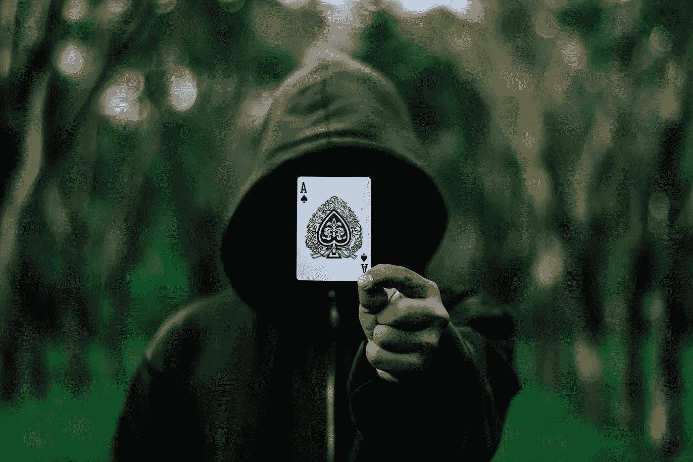

# 区块链隐私模型

> 原文：<https://medium.com/hackernoon/models-of-blockchain-privacy-64aecb4363d8>

Source: [Pexels](https://pixabay.com/en/users/pexels-2286921/)

鉴于区块链的交易是假名，而不是匿名的，而且区块链本身是透明的，因此存在许多协议来纳入更大的隐私，以保护个人免受那些试图将他们与他们的交易联系起来的人的攻击。不言而喻，这背后的动机包括促进对法律实体的保护，但也希望保护个人隐私，防止有人为了招揽或更严重的犯罪而窃取资金或识别持有大量资金的人。记住这一点，并不是所有的隐私协议都是一样的。有不同的方法来实现手头的目标，即模糊交易历史，以至于跟踪某人的余额历史变得非常耗费资源，如果不是完全不可能的话。在这里，我们讨论三种最常见的实现方法，以及它们的应用。

**零知识证明(ZCash，PIVX)**

上周我们在 ZKPs 上发表了一篇详细的文章，可以在这里阅读[。有证据表明，这可能是最受欢迎的隐私技术，正如以太坊、Cardano、Tron 和其他公司所承诺的那样。](https://hackernoon.com/the-rush-for-zero-knowledge-proofs-and-where-it-leaves-privacy-coins-32efdf27f18b)

**戒指签名(Monero)**

最早的保密硬币 Bytecoin 使用了一个叫做环签名的概念，这个概念早在 2001 年在一篇提交给 ASIACRYPT 的论文中就被理论化了。这个概念是作为一种匿名泄露秘密的方式提出的，例如在白宫或董事会中，通过让相关小组的所有成员在输出上签名，即使输出仅来自一个人。在加密货币中，环签名从一个组的成员发送交易，在该组中所有成员都有自己的账户密钥并对交易进行签名。这就产生了一组个人账户，理论上所有账户都可以发送交易，但只有一个账户发送了交易。更简单地说，不可能说出该组中的哪一个实际上发送了该事务。

Monero 是一个 Bytecoin fork，它保持了对环签名的使用，并在 2017 年增加了“环 CT”(机密交易)，除了发送者和接收者之外，它对所有人隐藏了交易的细节。Monero 每笔交易至少有 7 个签名，当结合今年 Bulletproofs 更新引入的范围证明时，可以说 Monero 仍然是最全面的隐私区块链平台(事实上这是市场公认的，Monero 在市值最高的 100 枚硬币中排名第 13，领先于所有其他隐私令牌)。

**硬币混合和改变地址(破折号)**

在比特币的早期，对于那些在非法活动网站上交易的人来说，混合硬币很受欢迎，以扰乱他们的交易历史，并使通过区块链追踪资金变得更加困难。这不是比特币区块链的一项功能，而是一项第三方服务，混合硬币，收取 1%至 3%的费用。这个概念很简单:将一种面值的比特币换成另一种同等大小的比特币，从而混淆两者的踪迹，加大识别难度。

正如我们在 Dash masternodes 及其功能的[文章中所讨论的，Dash 引入了一个隐私功能，最初称为 DarkSend(现在的 PrivateSend)，它使用 masternodes 将一种硬币直接混合到他们的区块链中。当被请求时，这些 masternodes 将交易分成面额，在将交易发送回用户控制的更改地址之前，使用 PrivateSend 将它们与其他交易的面额混合。在这种情况下，跟踪交易历史就困难得多了。最值得注意的是，这是一个可选的功能，使 Dash 成为一种罕见的具有可选隐私或透明性的货币，这取决于用户的目标和供应商的要求，从而避免了黑名单问题，该问题可能会使因隐私措施而贬值的特定令牌贬值。](/@viewnodes/on-masternodes-65b7cf2344c8)

Viewnodes 编辑拜伦·墨菲的文章。我们帮助客户为当前支持他们的货币建立和维护主节点。要联系我们了解 masternode 服务的信息，请提交此[联系表](https://docs.google.com/forms/d/e/1FAIpQLSd6AXWZtPnmeklGFg-l4tAAKWsxHJ0LW-d0wFUxT4NRJ__e9Q/viewform)。