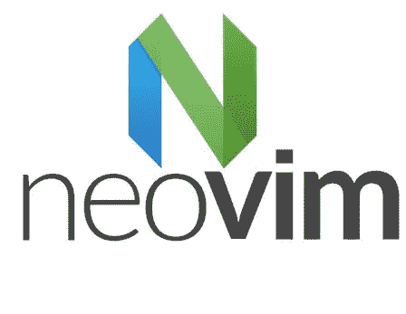
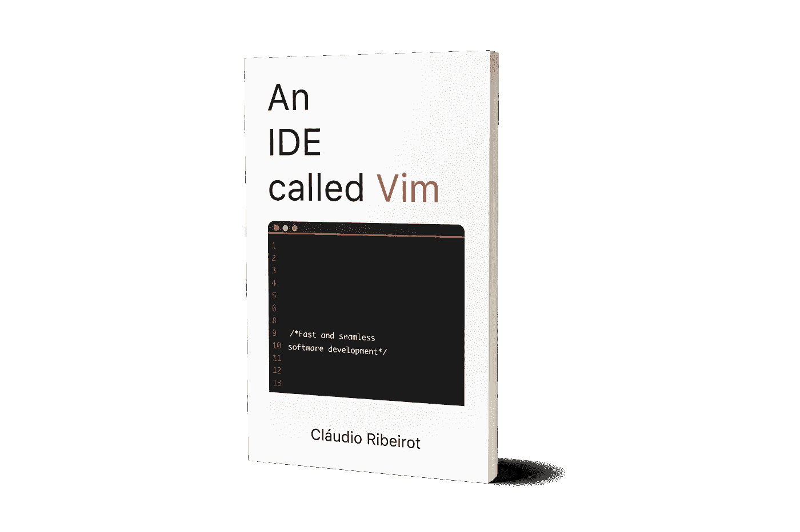

# 现代 Vim

> 原文：<https://medium.com/hackernoon/modern-day-vim-ab4d3aa0cf6b>

当谈到 Vim 时，大多数人认为它是上个世纪过时的软件。

虽然 Vim 确实来自上个世纪，但它多年来一直能够不断重塑自己，以保持自己的相关性。

Vim 的最后几次迭代(Vim 8+和 Neovim)最终采用了一些非常有用和必要的功能。但是在我们开始讨论功能之前，让我们先快速了解一下这个故事。

# **历史**

2014 年，几个 Vim 社区成员对他们重构和现代化代码库的努力没有得到任何支持感到不满，决定启动 Neovim 项目。

The Neovim official logo.

他们分叉了 Vim 项目(开源之美！)，重构了代码库，并添加了一些新的、备受期待的功能。另一方面，为了适应新的代码，他们放弃了对一些旧的、非常小众的平台的支持。

Neovim 在社区中取得了巨大的成功，因此，由 vims 创建者 Bram Moolenar 维护的原始 Vim 项目必须实现其中的一些新功能，以便跟上这个新“竞争对手”的步伐。

这让我们走到了今天。今天，我们可以在两个不同的现代 Vim 发行版 Vim 8+和 Neovim 之间进行选择。

# **新功能**

在本文的前面，我们讨论了在这些新的 Vim 版本中实现的新的、非常需要的功能。但是那些是什么？为了你我的时间，让我们集中讨论其中最重要的两个:

**异步执行**

在经典的 Vim 发行版(7-)中，所有插件代码同步运行。这意味着，如果任何插件代码正在执行，Vim 基本上是冻结的。

随着异步执行的出现，诸如实时语法检查、拼写检查或自动完成等功能变得可用。在过去，任何此类任务都需要通过额外的操作来触发。

如今，由于 Vim 中的异步执行，像[de complete](https://github.com/Shougo/deoplete.nvim)和 [ale](https://github.com/w0rp/ale) 这样的插件帮助世界各地的程序员使用 Vim 更加高效。

A.L.E Asynchronous Linting Engine plugin for Vim.

**端子**

又一个大的。在过去，将 Vim 与终端操作结合使用时，必须使用 screen 或 tmux 这样的屏幕管理器几乎是必然的。它要么是一个屏幕管理器，要么在我们想使用终端时必须随时退出 Vim。拥有两个终端窗口也是解决这个问题的常见方法。

自从 Neovim 发布以来，我们终于在 vim 中实现了终端仿真。这允许我们在 Vim 缓冲区中使用终端，并在不同的缓冲区中继续工作。此外，像在同一个 Vim 实例中运行电子邮件、代码、聊天和其他应用程序这样的工作流现在也是可能的。

# 结论

这两个功能都是 Vim 开启许多新奇和酷的可能性的关键。这就是为什么我认为我们现在可能只是冰山一角。插件将会不断发展并利用新的特性。Vim 用户的未来一片光明！

It’s just the beginning for Vim!

你呢？你对新的现代 Vim 功能和用法有什么看法？还缺少什么，我们最终可以用它来构建什么？请在下面的评论中告诉我！

想了解更多关于 Vim 的知识？想学习如何将其用作 IDE？检查我的新书[一个叫做 Vim](https://leanpub.com/anidecalledvim) 的 IDE。从基本的 Vim 使用到文件查找、自动完成、文件管理器等等，它都有。

