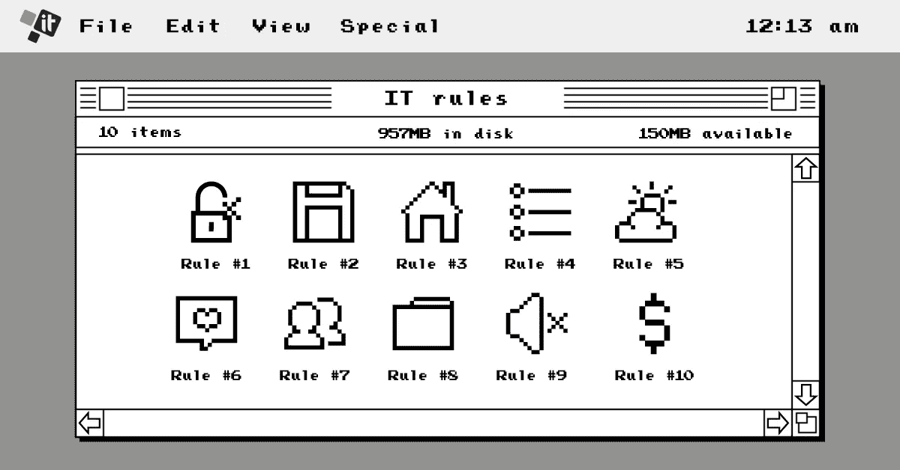
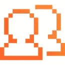
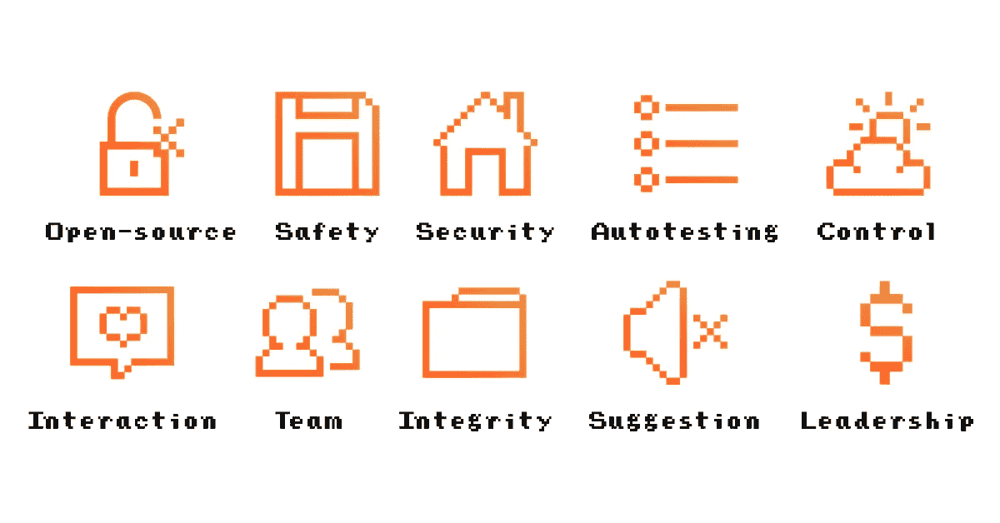

# 10 个传统 IT 规则的现代面孔

> 原文：<https://medium.com/hackernoon/modern-face-of-10-old-school-it-rules-9903f38aaef4>

IT 行业是一个活生生的存在，它在成长和发展，以满足 21 世纪快节奏业务的需求。然而，尽管在很大程度上进行了调整，这 10 条老派的 IT 规则仍然适用。

如今的 IT 行业充满了目光闪烁的年轻人，他们谈论着敏捷软件开发、DevOps 工作流、测试驱动开发(TDD)、Docker 容器、不可变基础设施、大数据分析、机器学习模型、物联网、Spark、React Native 以及其他流行词汇。他们对在瀑布模型下工作的老派系统管理员知之甚少(很少见到),他们编写 bash 脚本，不得不与原始开发工具的约束作斗争，其中许多工具是他们自己编写的。

然而，如果现代开发人员想要交付一流的产品并取得成功，他们必须应用这些老派程序员必须遵循的软件开发最佳实践。这些 IT 规则保持不变，尽管它们与行业一起发展。这里有 10 条老派的 IT 规则，是在不眠之夜和无数升咖啡中写下的；确保软件产品高质量、顺畅工作流程和业务成功的规则:

1.  开源产品和专有产品一样好；通常他们更好
2.  要保证软件的安全性，就要保证硬件的安全
3.  安全的产品比安全的工作场所更重要
4.  自动化测试应该在代码本身之前编写。经常测试，大量测试，在云端测试
5.  应该严格控制生产环境的更新。和恢复计划
6.  保持敏捷，迭代并与团队和客户互动
7.  团队是任何企业的主要资产；学会成为其中的一部分
8.  完整的软件生态系统优于沿着链接自动更新的分散孤岛
9.  IT 部门应该建议和讨论，而不是默默服从命令。
10.  IT 团队是整个企业变革的主要驱动力

我们将简要解释这些规则对我们的意义，也许它们对你也有同样的意义。

# 开源产品和专有产品一样好；通常他们更好

在过去，开发人员必须从非常有限的专有软件开发工具中选择一种或另一种，以利用其优势并接受其局限性。如果选择的技术不能提供某些功能，开发人员必须自己编写定制的解决方案，或者搜索第三方模块、附件和插件。如今，有各种各样的平台、框架和现成的工具来完成开发者可能需要的任何任务，其中最受欢迎的往往是开源的，背后有巨大而热情的社区。

# 要保证软件的安全性，就要保证硬件的安全

在云时代之前，这意味着确保对内部服务器机房的强大物理保护，或者从顶层专用数据中心租赁设备。如今，这意味着选择像 GCP、 [Azure 或 AWS](https://itsvit.com/blog/aws-vs-ms-azure-cloud-provider-choose/) 这样值得信赖的提供商的云产品，并最大限度地利用它们的安全特性。这种方法既保证了位于美国和欧盟高度保护的第 4 层云数据中心的物理设备的安全性，也保证了软件开发和服务交付渠道的连续性。

# 安全的产品比安全的工作场所更重要

几十年前，安全威胁大多是物理性的，源于对系统间连接的保护不足。因此，对有限用户权限和防火墙的需求是显而易见的。如今，SSL 和企业安全实践几乎无处不在，主要的危险来自代码缺陷本身，就像最近发现的 [Meltdown 和 Spectre](https://www.vox.com/business-and-finance/2018/1/4/16850004/meltdown-spectre-intel-security-flaw-update) 。因此，如今编写安全的代码比配置安全的工作场所重要得多。

# 自动化测试应该在代码本身之前编写。经常测试，大量测试，在云端测试

从长远来看，将测试过程转移到左边(到软件开发生命周期的最开始)可以极大地缩短修复 bug 所需的时间和精力，更不用说从一开始就将安全需求编织到代码中的能力了。编写自动化测试并将它们推送到云中允许创建持续集成/持续交付工作流，其中新的代码批次被自动推送到构建、测试和生产环境中。

# 应该严格控制生产环境的更新。和恢复计划

一段时间以前，为了最大限度地减少人为错误，必须有一个严格的过程来将更新推送到产品中(使用检查表和多个批准级别)。如今，自动化的软件交付管道使得过程更加流畅和防错。如果测试通过，新代码将通过滚动更新推向生产，如果测试失败，将发出智能警报。云让这一切变得更加容易。但是，如果仍然需要回滚，则需要定期备份。

# 保持敏捷，迭代并与团队和客户互动

开发不是在过程中遵循规则，而是最终做出一个工作产品。瀑布失败是因为无论是产品所有者还是项目经理都无法写出 30 页绝对正确的规格说明，从字面上提及产品必须做的每件事以及应该如何做。敏捷方法有助于将迭代和交互引入到领域中，因此开发人员和产品所有者可以交流和协作，以小的迭代步骤完成工作。

# 团队是任何企业的主要资产；学会成为其中的一部分

这一点怎么强调都不为过。今天的企业不再是一群拥有孤立的任务、工具和项目的部门，它们在食堂里几乎彼此不说话。当今高效的企业是遵循 [DevOps 文化](https://itsvit.com/blog/devops-culture-huge-step-mankind/)的跨职能团队。为了完成工作，他们与同事和客户进行了大量的沟通和协作。关系先于项目，比支付更持久。最终，团队决定了企业的成败，它是任何公司的主要资产。

# 完整的软件生态系统优于沿着链接自动更新的分散孤岛

让您的生态系统中的所有软件能够互操作，对于构建简化的工作流程至关重要。然而，现在的软件是如此的多样化，以至于没有人为的可能性为任何产品和任何其他产品提供开箱即用的兼容性。这样做的唯一方法是以微服务的形式构建软件，微服务通过 API 相互通信。当有一个集中的消息代理来帮助各种模块相互通信和交互时，数据同步的问题就一去不复返了。

# IT 部门应该建议和讨论，而不是默默地服从命令

当任务设定后，就由 it 部门来完成它，但是有时团队发现提议的方法不是最佳的或者工具不合适。主要的错误是试图用加班来解决问题，或者提供一个临时的解决方案，然后再润色。IT 团队应该准备好并愿意说出某些技术进步(如云过渡)何时必须发生，以使任务可行。

# IT 团队是整个企业变革的主要驱动力

技术领先对于帮助企业蓬勃发展至关重要，但公司的销售、计费或管理套件通常不太懂技术，不会承认他们没有使用最佳工具或遵循最佳实践。

It 部门负责建议和讨论所需的变化，如数字化转型或向 DevOps 的过渡。首席信息官的任务是为该计划提供最高管理层的支持和全心全意的支持，但首先还是要由基层 It 团队成员来建议这一举措。

# 关于 10 个传统 IT 规则的现代面貌的最后思考

如您所见，这 10 条 IT 规则确实是适用于任何现代企业的最佳实践，无论是初创企业还是大型企业。毕竟，IT 部门的存在是为了支持业务并使其具有成本效益和竞争力，不是吗？

你对题目有什么看法？你认为这些 IT 原则重要并遵循它们吗？我们错过了什么或者我们应该从列表中删除一些东西吗？请在下面的评论中分享你的观点！

这个故事最初发表在我公司的博客上——[https://its vit . com/blog/modern-face-of-10-old-school-it-rules/](https://itsvit.com/blog/modern-face-of-10-old-school-it-rules/)