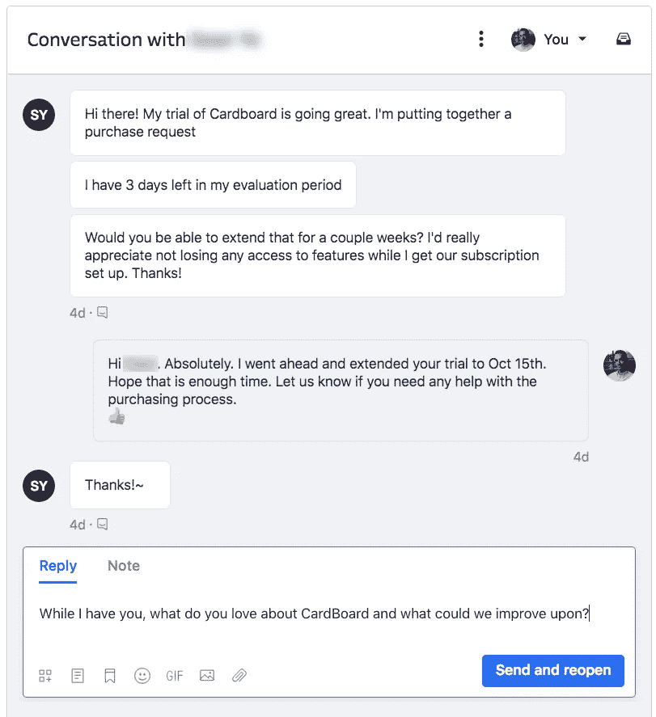
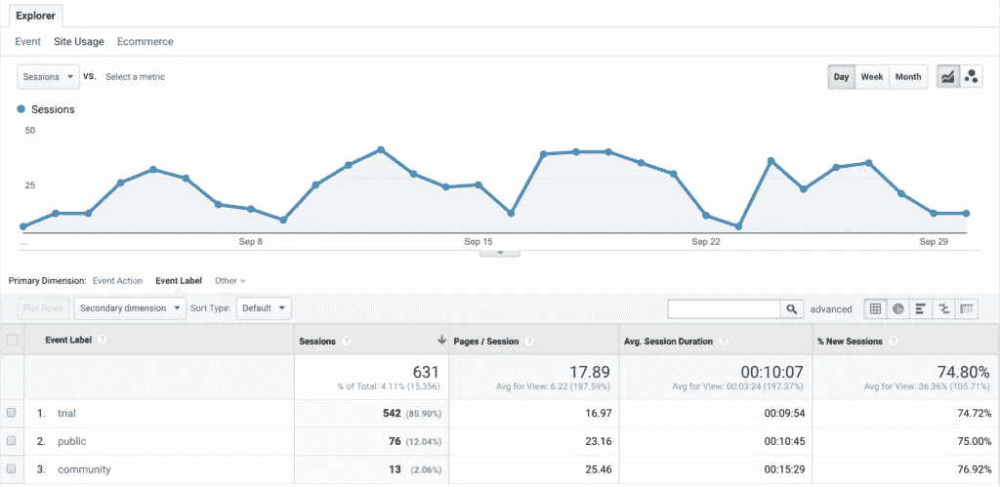
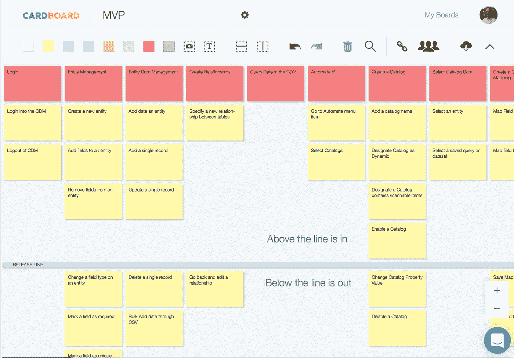

# 当今 SaaS 企业的现代产品管理技术

> 原文：<https://medium.com/hackernoon/modern-product-management-techniques-for-todays-saas-business-877f1a4ce108>

管理软件即服务(SaaS)产品可能是一个相当大的挑战，但并不总是如此。在过去的 18 个月里，我一直是 SaaS 一款名为 [CardBoard](https://cardboardit.com) 的产品的产品经理，我想分享一些帮助我更好地管理产品的事情。

引导你的 SaaS 产品的最好方法之一就是**使用其他 SaaS 产品**。每当你需要做某件事的时候，一定要看看是否有人已经提供了解决方案。最棒的是，他们中的大多数都提供免费试用。所以，如果你不喜欢它，你没有钱，你可以尝试其他东西。

话不多说，这里有一些我们喜欢并每天在 [CardBoard](https://cardboardit.com/) 使用的产品管理服务。

# 了解谁是你的客户，并与他们互动

如果你今天开始一份产品经理的新工作，首先你需要做两件简单的事情:

1.了解产品。使用它，成为最了解你的产品的人。毕竟你是产品领导。

2.了解谁是你的客户，并与他们进行互动。

对于#2，我们使用服务呼叫[对讲机](https://www.intercom.com/)。当你考虑支持客户时，许多人仍然依赖电话或电子邮件联系 support@blah.blah.com。虽然这些事情都没问题，但这是客户服务的未来。内置在你的应用程序中的聊天应用才是正确的选择。它们为客户寻求帮助提供了一种简单的方式，让您能够做出响应。

我加入了一个试用客户最近的对话，他想延长他们的试用期。我很乐意为他们这样做，但也能够开始交谈，并获得一些关于我们产品的有价值的反馈。利用一切机会与客户接触，这样你可以更多地了解他们和你的产品。

对讲机不仅仅是一种客户服务工具。我们还使用它向我们的客户发送自动消息。当我们让某人注册免费试用时，我们也会给他们一些教程信息来帮助他们入门。入职是帮助免费试用转化为收入的关键步骤。不要过度，但要在正确的时间找到正确的内容，帮助你的新客户了解你的产品，以及它如何帮助他们。

# 分析和报告

这是一个显而易见的。如今，SaaS 的每一款产品都应该收集使用数据，并对这些数据进行审查。也许真正的问题是我们有太多的数据，我们需要更好地提问。在美好的一天(*意味着我们有时会在这方面失败*)，我们会提出我们想知道的问题，更重要的是，我们会试图理解答案将如何帮助我们推动业务。如果你收集数据却不做任何处理，它真的有存在的必要和价值吗？

谷歌分析目前是我们营销分析的“首选”。可能是因为它是免费的，我们没有足够的时间去寻找更好的东西。当我们的客户注册一个帐户时，他们有三个选择:开始免费试用，创建一个有限的免费帐户，或购买订阅。我们想知道有限的免费帐户是否会阻止人们尝试全功能试用，并可能导致收入损失。通过添加一个谷歌分析事件，我们能够知道大约 12%的注册用户注册了免费账户。这比我预期的要好，所以我们决定保持现状。

# 金丝雀和早期采用者

当你在构建新的特性时，可能会有一个持续的斗争，要么用所有的华而不实来构建一个完美的东西，要么为了获得反馈而提前发布一些不完整的东西。后者与[精益创业](http://theleanstartup.com/principles)运动配合得很好，通常是我喜欢使用的方法。作为一个产品经理，你怎么能接受把没有完成的东西放在外面？首先，你不需要给每一个客户新的特性。如果你已经和几个关键客户建立了良好的关系，那就主动接触他们，询问他们是否愿意尝试一项新功能。如果他们说“是”，那太好了！向他们设定正确的期望，即它仍在开发中。确保从客户那里获得反馈，并了解可能需要做出的调整。这是精益启动方法的“测量和学习”部分。

微软 Windows 10、谷歌 Chrome 和 Instagram 等几款产品利用 Canary 版本向一小部分客户群发送“前沿”功能。我认为这有助于他们开发更好的产品，并在你的整个客户群之前发现大问题。和你的开发人员谈谈，他们可能已经准备好做这件事了。它应该与持续改进和持续交付(CI/CD)非常契合。

有一些服务可以帮助你实现这个策略。我们用过的一个叫做[暗黑发射](https://launchdarkly.com/blog/how-we-beta-test-at-launchdarkly/)。总的想法是，你的应用程序有特性标志和开关，允许你开发打开和关闭的规则。

# 构建最小可行产品(MVP)

在多年与几位产品经理的合作中，有人一直告诉他们“向开发团队要求比你想要的更多的功能，因为他们总是会削减你的清单”。不管是谁告诉新产品经理这些，我希望他们停止(至少如果产品是 SaaS 产品)。产品的领导和开发人员需要一起工作。

为了将产品快速推向市场并获得反馈，然后进行下一步开发，MVP 是一个不错的选择。现在，MVP 并不是开发者运送“垃圾”的许可证。SaaS 企业的美妙之处在于，我们总是可以在此基础上不断发展壮大。拥有合适管道的优秀开发团队可以在同一天将变更推向生产。对大多数企业来说，在生产后改变某些东西是有害的，而且代价极高。作为产品经理，利用这一点。

便利贴甚至用户故事映射是发现和计划 MVP 发布的好方法。在下图中，团队合作，为他们下一步要构建的内容创建了一个故事地图。然后，他们放下一个水平分割线，协商第一次发布的内容。

如果你想亲自尝试一下故事地图，请点击这里免费试用[。](https://cardboardit.com/)

> 在[脸书](https://www.facebook.com/cardboardit)、[推特](https://twitter.com/cardboardit)或 [LinkedIn](https://www.linkedin.com/company/cardboardit/) 上关注我们
> 
> p:317 . 844 . 4366| E:[SUPPORT@CARDBOARDIT.COM](mailto:support@cardboardit.com)
> 
> 纸板由 [SEP](http://sep.com/) 供电