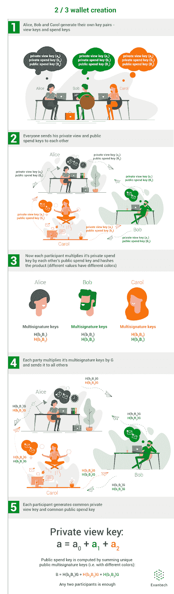

# Monero 多重签名解释

> 原文：<https://medium.com/hackernoon/monero-multisignatures-explained-46b247b098a7>

本文开启了一个新的系列，在这个系列中，我们将探索目前业界使用的各种区块链的内部工作原理。今天，我很高兴向大家介绍我们的第一个研究对象:Monero，XMR 背后的区块链，这是一种相当知名的以隐私为中心的加密货币。由于是匿名的，该网络实现了许多有趣的算法和加密解决方案，包括多重签名(或简称为多重签名)，这是一种允许多个用户作为一个群体一起签署文件的数字签名方案。


虽然 Monero 在几个月前就增加了对多重签名协议的支持，但关于这项技术如何工作的在线信息仍然存在一定的不足，因此我们希望首先填补这一空白。由于创建多重签名交易的过程相当复杂，我们决定只关注其最重要的方面，包括创建钱包和交换密钥的过程，我们认为这足以理解该技术的优缺点。

我们试图让文章更具可读性，去掉了大部分公式，代之以图表和插图，所以我们希望它不仅对有经验的工程师有用，对初学者也有用。

在 Monero 区块链上，多签名相关的功能主要用于允许有多个用户的钱包——这并不新鲜，因为之前比特币和以太坊等其他数字货币也实施了几乎相同的解决方案。简而言之，它允许共同拥有存储在特定钱包中的令牌。共同所有权意味着每个参与者对全部金额拥有完全的权利，因此对其处置有一个合理的限制:每笔交易都必须得到一定份额参与者的授权，这一点在钱包创建时就已确定。

拥有者总数和审批门槛定义了一个钱包的所谓“方案”。例如，3/3 multisig 钱包有三个所有者，他们必须一致批准每笔交易，而在 2/3 钱包的情况下，每个所有者只需要再投一票就可以转移资金。

**密码术**

和大多数数字货币一样，莫内罗区块链依赖于椭圆曲线加密(了解更多关于[维基百科](https://en.wikipedia.org/wiki/Elliptic-curve_cryptography))。简而言之，这种加密系统的价值在于其相对加密强度、较小的密钥大小以及与许多同类产品相比更快的执行速度。

每个 Monero 钱包都使用两套私人和公共加密密钥，每套密钥由一个“消费密钥”和一个“查看密钥”组成。总的来说，给定钱包的公共视图密钥和公共花费密钥构成了用于接收资金的地址。同样，将私人视图密钥添加到公共支出密钥将创建一个跟踪密钥，您的同行可以使用它来跟踪发送到您的钱包的资金(但决不会反过来，因此您的隐私保持安全)。

正如您可能已经猜到的那样，对钱包的完全访问是由它的私人消费和私人查看密钥的组合来保护的，所以您的私人消费密钥必须保密。

为了简洁起见，从现在开始，我们将使用大写字母表示公钥(即“B”表示“公共支出密钥”)，小写字母表示私钥(即“B”表示“私人支出密钥”)。为了帮助您理解下面使用的符号，让我们来看一个简短的公式，它显示了公钥是如何从私钥派生出来的:


其中 G 是椭圆曲线上的一个固定点。私钥(标量)乘以 G 得到公钥，公钥也是同一曲线上的一点。

# Monero 的多重签名

multisig 技术背后的想法非常简单:让每个参与者只保留一部分钱包的私人消费密钥，这样转移资金就需要得到许多其他参与者的批准。

任何给定的参与者几乎不可能获得对整个私人花费密钥的控制，而他们都有自己唯一的公共花费密钥，以及私人和公共查看密钥的副本，从而允许每个参与者监控流入的资金。

**在 Monero 中创建 multisig 钱包**

目前，Monero 软件仅支持 N/N 和 N-1/N 方案。要设置 N/N multisig 钱包，用户需要完成一轮计算，而 N-1/N 方案只需要一个额外的步骤。创建一个 2/2 钱包的过程如图 1 所示。


Figure 1\. Creating a 2/2 multisig wallet

首先，参与者共享他们所有的私人视图和公共支出密钥，然后计算他们各自的总和。私有视图键的总和成为新 wallet 的私有视图键，其公共视图键从私有视图键派生而来。然后，以同样的方式计算公钥。如果选择了 N/N 方案，就这些了。钱包现在创建完毕。

如果用户选择 N-1/N 方案，他们仍然必须彼此共享他们的私人视图和公共花费密钥，但是每个参与者必须将所有接收的公共花费密钥乘以他们自己的私人花费密钥。因此，创建了一组新的私人消费密钥，称为“多重签名密钥”，如图 2 所示。



Figure 2\. Creating a 2/3 multisig wallet

您可能已经注意到，在上图中，相同颜色的键具有相同的值。这是因为这种多重签名密钥具有由以下等式表示的一个重要属性:


简而言之，当私钥乘以公钥时，可以随意移动索引而不影响结果(顺便说一下，这正是椭圆曲线 Diffie-Hellman 密钥交换协议的基础)。这意味着每个多重签名密钥正好在两个参与者之间共享。

为了计算对所有参与者都必须相同的公共支出密钥，每个参与者从他们各自的多重签名密钥中导出一个公共密钥，并与其他人共享结果。然后，通过对所有公共多重签名密钥的不同值求和来计算公共支出密钥。

现在，参与者只需计算一个视图密钥，其计算方式与 2/2 钱包相同。

现在，钱包已经创建好了，让我们继续来看看如何使用它。

**Monero 交易**

为了解释如何发起 multisig 交易，让我们简要考虑一下 Monero 一般如何处理资金转移。在一个非常简单的形式中(不考虑环签名和环 CT)，它是这样工作的:


Figure 3\. Simplified representation of a transaction

右边是交易输出，或交易产生的货币，左边是输入，或当所述交易完成时被销毁的货币。

因此，当 Alice 想要向 Bob 发送 1 XMR 时，她从她未用完的输出中取出 1 XMR，加上必要的佣金，将其放入她的输入中，为每个输入计算一个密钥映像，最后为 1 XMR 生成输出并为每个输出生成一个输出密钥。

为了完成交易，Bob 使用他的私有视图和公共支出密钥来恢复 Alice 生成的每个输出的输出密钥，如果在恢复的密钥和传入的密钥之间存在匹配，他将认为该输出是为他准备的。

从网络的角度来看，多签名交易在任何意义上都没有什么不同，尽管启动起来稍微复杂一点。它通常分几个步骤完成:

*   参与者交换所有已知输出的部分关键图像；
*   参与者重新同步他们的钱包，以便了解其考虑到关键图像的准确平衡；
*   发送方准备交易，签署交易，并将其发送给一个对应方；
*   每个随后的参与者添加其自己的 RingCT 签名部分；
*   最后一个签名者完成 RingCT 的创建。

**生成关键图像并共享输出**

当扫描区块链时(即在同步期间)，钱包无法确定某些输入是否以其输出为目标，因为它没有数据来计算它们的关键图像，所以可以肯定地说，它只考虑传入的交易。

为了正确运行事务，用户需要恢复每个输出的关键映像，然后与区块链同步以确定哪些输出已经被消耗，然后继续生成事务。在图 4 中，恢复关键图像的过程显示为 2/3 钱包的情况。


Figure 4\. Restoring key images as in case of a 2/3 wallet

同样，简单地说，每个输出的关键图像是通过对所有部分关键图像的不同值求和来计算的。从上图可以看出，这可以由三个参与者中的任何两个来完成，最重要的是，他们的私钥在交易期间保持不公开，使得第三方不可能恢复完整的支出密钥并控制他们的资金。

利用这些数据，发起方可以完成交易，然后将交易发送给所有确认的参与者，以生成环 CT 签名。然后，在最后阶段，交易被签名并广播到网络。

**数据交换自动化**

以上是用于交换密钥部分和密钥图像的过程，需要执行一次，或者在发送每个交易之后执行。在 Monero Core Wallet 的当前版本中，这些过程应该通过在安全通信通道上交换必要的数据来手动执行(即从 Wallet 中导出必要的数据，并通过信使或其他方式发送它们)。

以下是创建 2/3 钱包和签署交易所需程序的示例。每个参与者使用 monero-wallet-cli 实用程序执行以下命令:

```
[wallet 9uKCgo]: prepare_multisig
MultisigV1baCWviNomMXe271W8HW4imh8SsnNEWP2bCswQfoB9MGzNZ8FUG3e8UCNm5toKQzSQH2e8rUWUCGazaCcvej1ToCQYBMovJZYaYiYWQvzsvyWruXycZdVDSsyugjEzwQNK3FUEkug2LXiH91NmekGb7kp9gK9kuoxDDhGn1nLKXUpnXR5
```

将此 multisig 信息发送给所有其他参与者，然后将`make_multisig <threshold> <info1> [<info2>…]`用于其他人的 multisig 信息。

这包括私人视图密钥，因此只需向该 multisig wallet 的参与者披露:

```
[wallet 9uKCgo]: make_multisig 2 MultisigV1XQugvU4JwcwTQbKdH5qGFnavxUX54wGxNis2iN6zoLD94DahnXbyNxH1NQBp2rYRFFJCT2uiJbssHLJYEAb8X1tS5UCqTXYu3FkgRNSZt5mRNgE58iXZHPj839Pbm3ozGcXmRT6GcRMMxMjRonfYKpnPq1UyZSMN7Qr9AYin1gYyoJSh MultisigV1HVqTW8P4UNWUE8QfBaEdwDWJuXBWEPnTrKqVJiUudGG14cHREk9TKmeR9xzSs4wf4jd22mV94C2ehSViApawnpp2SpRqp19eKXLHz2JmNp7eGR6TJMt4VsDTqANRwb1FtD9weef342f5KXDRZK7iQT1MTubyHhEcFyV5aLCjjQ8owMkHAnother step is needed*MultisigxV1PQwytRuYGkB6UEVJ7v2S7q492cwNTdwySXyasToAuQQq73TvM1rBrog5bcYz5w2P6Z4jwKtzrHr7shRGo5mAShvLVbYtBdQNhQsizMb51K7iaWQB4te5mQaiB1cok84CbvA9WKnVpTJGyb7SbS7NwAgmpEhU812RTdzrdHp5sD41duYtRNW6qna5mTMYmtTjAEdKpKCvM6EwhV4ncWscpvoBfyYP*
```

将此 multisig 信息发送给所有其他参与者，然后将`finalize_multisig <info1> [<info2>…]`与其他人的 multisig 信息一起使用:

```
*[wallet 9uKCgo]: finalize_multisig MultisigxV1PdeMJo5rxcWTXDJ7rbyuacBseugsn2djZKKEdwvFYVmz73TvM1rBrog5bcYz5w2P6Z4jwKtzrHr7shRGo5mAShvLUxykuq5gho7gGQBCEa3JmBaY7rNHqqUaCUs1WWQi9tojZTMmCJJ4evwJzcXEDqcAd7ShwxsJtJtXdiATs54BbBfyCbwXbnDRKAtagJF36z74KJA58NgEmnHv23ZQeePCoacM MultisigxV1RTwyE53FjKPQaAn4ZMWM5hc8C92eJndpyKby4L9HpF2TUxykuq5gho7gGQBCEa3JmBaY7rNHqqUaCUs1WWQi9tojVbYtBdQNhQsizMb51K7iaWQB4te5mQaiB1cok84CbvA928U2yJFK86jNxtMopxHkcnYjjeYfp8TAB53Y1CukBiHfL2M4EztDALXLReXjJxkMry65Jw6vVePJp2T5CW8T8QE5*
```

在发送交易之前，各方必须交换部分密钥图像:

```
*[wallet 9uKCgo]: export_multisig_info ki1*Multisig info exported to ki1.*[wallet 9uKCgo]: import_multisig_info ki2 ki3**Height 1103873, txid <f7e648915287fafca1dc67eb26267e09f92bba7ab7fd52a12600c3e6440db0eb>, 2.000000000000, idx 0/0**Height 1103882, txid <2e3a5591c741c0943a47a2bcbd1ec26493158088c88308bcbfc97423ea95c491>, 0.009000000000, idx 0/0*Multisig info imported
```

然后钱包被重新同步以考虑完整的密钥。在收到关于支出支付的数据后，其中一个参与者可以设置交易:

```
*[wallet 9uKCgo]: transfer 9vUnTucAioDHD4ZqrFHXAgfLqrsC3LkZ6JFr5axBLhDiFMaHuEk33aqXimoZEMtQh5ibdYxcNSBw2hBZLAsCnuw4B4rBeZX 1*No payment id is included with this transaction. Is this okay? (Y/Yes/N/No): YThere is currently a 2 block backlog at that fee level. Is this okay? (Y/Yes/N/No)YTransaction 1/1:Spending from address index 0Sending 1.000000000000\. The transaction fee is 0.012000000000Is this okay? (Y/Yes/N/No): YUnsigned transaction(s) successfully written to file: multisig_monero_tx
```

然后，将生成的文件传送给另一个参与者进行签名并广播到网络:

```
*[wallet 9twQxU]: sign_multisig multisig_monero_tx**Loaded 1 transactions, for 1.031762770000, fee 0.012000000000, sending 1.000000000000 to 9vUnTucAioDHD4ZqrFHXAgfLqrsC3LkZ6JFr5axBLhDiFMaHuEk33aqXimoZEMtQh5ibdYxcNSBw2hBZLAsCnuw4B4rBeZX, 0.019762770000 change to 9uKCgopHzXrQLnph1ZNFQgdxZZyGhKRLfaNv7EEgWc1f3LQPSZR7BP4ZZn4oH7kAbX3kCd4oDYHg6hE541rQTKtHB7ufnmk, with min ring size 7, no payment ID. Is this okay? (Y/Yes/N/No): Y*Transaction successfully signed to file multisig_monero_tx, txid 1d28af64bc78d05b625c4f7af7c321d4c8943c4c2692f57aa53e303387f40db6*[wallet 9twQxU]: submit_multisig multisig_monero_tx**Loaded 1 transactions, for 1.031762770000, fee 0.012000000000, sending 1.000000000000 to 9vUnTucAioDHD4ZqrFHXAgfLqrsC3LkZ6JFr5axBLhDiFMaHuEk33aqXimoZEMtQh5ibdYxcNSBw2hBZLAsCnuw4B4rBeZX, 0.019762770000 change to 9uKCgopHzXrQLnph1ZNFQgdxZZyGhKRLfaNv7EEgWc1f3LQPSZR7BP4ZZn4oH7kAbX3kCd4oDYHg6hE541rQTKtHB7ufnmk, with min ring size 7, no payment ID. Is this okay? (Y/Yes/N/No): Y*Transaction successfully submitted, transaction <1d28af64bc78d05b625c4f7af7c321d4c8943c4c2692f57aa53e303387f40db6>
```

你可以使用`show_transfers`命令来检查它的状态。

显然，如果非常希望使用 multisig 钱包，这是可能的，但这种方法不太可能适合初学者或移动用户。

因此，我们正在开发自己的解决方案，使我们能够在不侵犯各方隐私和交易安全的情况下自动交换此类数据，让更多人能够使用 Monero 上的 multisig 应用程序。我们的解决方案旨在支持标准和多签名钱包，并在一个开放的服务器上运行，该服务器向相应的钱包提供数据交换和传输。

关于我们对 Monero 的贡献的更多信息可以在[https://exan.tech/en/projects/monero/](https://exan.tech/en/projects/monero/)找到，也可以在[的项目网页 https://wallet.exan.tech.](https://wallet.exan.tech/) 找到

**简历**

目前，仅支持有限的一组签名方案，但是开发者计划扩展该列表以允许任意值，例如 2/5 等。唯一支持的交换必要数据的方式相当不方便，但由于 Monero 的开放生态系统，社区对正在开发的第三方解决方案寄予厚望，以改善这种情况。

在本系列的后面，我们将讨论 Monero 区块链的其他方面，如 RingCT 和 ring signatures、wallet 体系结构和 libwallet 库，以及网络的未来前景。

请在评论区提出您的问题，建议新的加密货币相关文章的主题，并订阅我们的博客，以了解我们即将举办的活动和有价值的出版物。