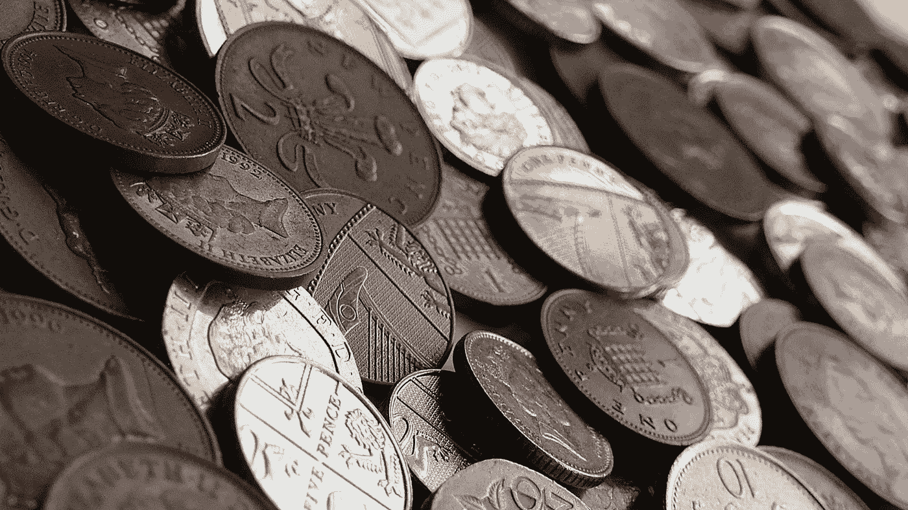
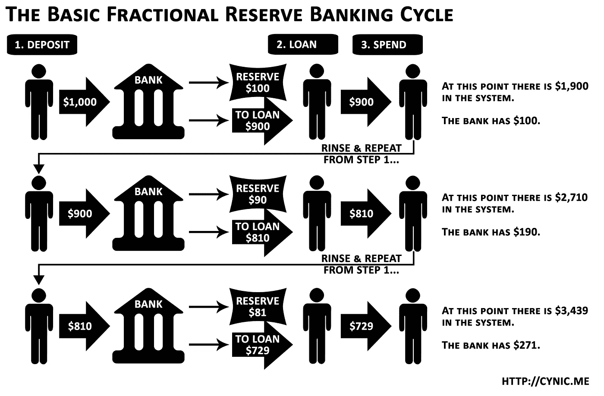
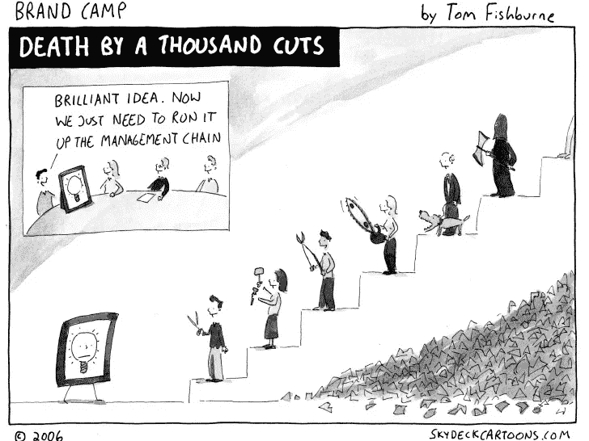
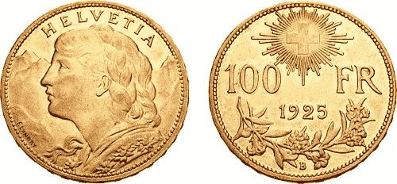
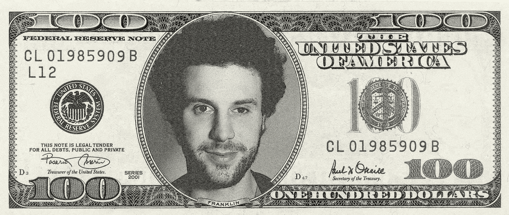

# 金钱 101——抛弃物物交换的神话，更好地理解比特币

> 原文：<https://medium.com/hackernoon/money-101-discarding-the-myth-of-bartering-to-understand-bitcoin-better-3b8e66cd2e77>

货币是我们现代社会的一个关键因素:其机制的微小变化可能会产生比简单影响经济更广泛的影响。因此，更好地理解这些机制将使您更好地掌握从政治经济到加密货币的各种主题。

法国的货币。

货币是一个复杂的主题，如果我们考虑到所有的**错综复杂的系统和协议**逐步建立在它的基础上，那就更是如此:货币创造、中央银行、通货膨胀……通过这篇文章，我们将回到基础，最终回到加密货币:什么定义了货币？我们为什么需要它们？存在哪些类型的货币？

系好安全带，开始一次相当冒险的旅程，在这次旅程中，我们抛弃了旧的但仍然流行的故事，并提出了必要的新故事，以使复杂的机制变得清晰。

# 货币起源的故事

当你听说货币时，你经常会听到一个简单易懂、引人入胜的故事；然而，这只是一个故事。事情是这样的:

> 一开始，我们是以物易物，用我的鸡肉换你的玉米。然后，由于物物交换效率不高，我们需要一种更标准化的交换方式:一种可以作为价值储存手段的商品。贵金属是完美的候选者——它们变成了硬币，一种货币形式。
> 
> 然而，后来，这些硬币又一次演变成了纸币——仍然是一种货币，但它们的价值来源发生了变化:虽然硬币的价值来自它的材料(制造它的贵金属)，但纸币需要一个机构来发行它，并以某种方式保证它的价值。
> 
> 最后，在数字时代，货币又进化了一次。现在一切都是“数字的”——只是位于服务器某处的比特、0 和 1，并且几乎在光纤[网络](https://hackernoon.com/tagged/network)中即时传输。

我们必须花时间有条不紊地解构这个故事，以消除它，我们会学到不少东西:

# 金钱不是价值的储存手段

金钱不是价值的储存手段，而是对价值的要求。*【1】*

## 让我们烧一些现金来更好地理解金钱

让我们一起来研究一下这个例子，它让我清楚地认识到了这两者之间的区别:假设我烧掉了一张 20 美元的钞票——会不会有任何价值被毁掉？

Thanks to the Joker for helping with the experiment

嗯……根本没有！被摧毁的是我宣称上述价值的能力:我不能用账单的灰烬换一瓶啤酒。

## 让它下雨！

理解价值储存和对价值的要求之间的区别，也能让我们理解对流通货币的痴迷。事实上，金钱本身并不是财富:只要钱没有被索取(用于购买商品或服务)，它对特定国家的财富就没有任何贡献。

让我们回到之前的烧钱实验，深入探究一下:当我烧掉我的 20 美元钞票时，它对美国的 GDP(国内生产总值)没有影响。然而，如果我开始烧掉数百万美元，我们可能会开始看到**影响国内生产总值的二次后果**:由于流通的货币减少，可能会有更少的人用它来要求价值(啤酒、衣服……)，因此对国家的实体经济产生影响。

这些次要后果将**只发生在我烧掉的现金本该被花掉的时候**——如果烧掉这些钞票阻止我主张它们所承载的价值。因此，如果我是一个亿万富翁(所以让我们假设:无法花光我所有的钱)，我可以烧掉数百万美元而不会对经济产生任何影响:这些数百万美元无论如何都不会回流到经济中。

阻止资金的流动就像阻止其他人工作来提供价值一样，如果不阻止资金流动，资金就会易手；如果货币自由流通，这个价值就会被兑换成货币。

## 假币，真值吗？

为了打破货币作为价值储存手段的神话，让我们考虑第三种也是最后一种情况。比方说，我印了一堆非常好的假币，每个人都把它当成真的了。现在我把这些钞票分发给普通的美国公民，为了这个例子的简单，美联储没有注意到。

在这种情况下，获得免费的真实但伪造的钞票的快乐公民将开始用它们购买商品和服务——他们将要求理应属于他们的东西，因为他们拥有这些钞票，因此增加了该国的 GDP。

然而，所有这些都是骗局，实际上没有创造任何价值:我只是印制和分发人们认为合法的假钞。

钱几乎不是打开金盒子的钥匙。当货币本身，它的物理媒介，仍然有价值(如金币或银币)时，箱子里的东西仍然与钥匙上写的数量联系在一起。现在，我们处在一个钥匙不断更换的系统中，无需返回打开箱子。**我们对自己货币的信任度如此之高，以至于写在钥匙上的金额是充足的，甚至是权威的**。

# 物物交换的神话及其低效率

让我们回到本文开头的第一个关于货币起源的故事:物物交换真的像故事看起来那样普遍吗？*【2】*

我们需要在一定的背景下回答这个问题。我们在谈论一个尚不存在货币的世界；见鬼,“财产”的概念甚至还很清晰。**当然有交换，但是“交换协议”与我们描绘的物物交换背后的想法**非常不同。

前现代农业社会在很大程度上是自给自足的:特定社区成员之间的交换遵循基于关系的非正式系统:“经济”由礼物和互惠驱动。*【3】*

实际上，与其说是`my goat for your corn`类交易，不如说更像是`I will help you build this house because I know how to do it. Later on, you'll help me furnish this other house since you're a skilled woodworker. If you don't, it can put an end to 1/our relationship, 2/your very place in the community`

*注意:考虑到上面描述的系统是非正式的,“如果你不……”部分不需要陈述，这是可以理解的。*

在上面描述的前现代农业社会中，物物交换也存在，但不是主要的交换方式:能够与不同于我们描述的那种关系的人进行交换是有用的——例如社区之间的交换。

## 历史学家视角的扭曲

可能还有另一个原因来解释为什么从物物交换到货币的演变故事仍然盛行。为了重现过去，历史学家使用在现代发现的遗迹。硬币经得起时间的考验。相反，非正式的礼物/反礼物几乎不会留下任何痕迹。*【4】*

Helixism was born when Reddit started to play Pokemon, together ([Twitch Plays Pokemon](https://en.wikipedia.org/wiki/Twitch_Plays_Pok%C3%A9mon)) — [The Origin of Ancient Helixism](https://www.reddit.com/r/twitchplayspokemon/comments/20cz6i/the_origin_of_ancient_helixism/)

此外，经常被用来说明物物交换制度的例子也是可疑的。我们在谈论`goat vs corn`交易，但它在前现代农业社会的背景下现实吗？因为它们大多是自给自足的，所以物物交换是为了社区生存所不需要的商品，因为这些商品已经在社区内生产了。

## 淡化银行的作用

在货币起源的故事中，银行看起来仅仅是中介。它们提供了或多或少实用的系统，允许资金流动:过去是分类账，现在仍然是，但现在我们有了一个笨重的网络界面来编写/编辑其中的内容。

然而，这忽略了银行在我们当前货币体系中扮演的关键角色:货币创造。为了让这篇文章易于理解，我不会在这里深入探讨，简单介绍一下就够了。这种机制被称为部分准备金银行。*【5】*

这里有一个简短而(过于)快速的解释——中央银行发行基础货币，允许商业银行通过贷款自行发行货币。当 Bob 向美国银行贷款 10，000 美元时，BA 没有从准备金中提款记入 Bob 的账户。不，实际情况是这样的:写在美国银行分类账中鲍勃名字旁边的金额增加了 10，000，差不多就是这样。人们的信心是，银行体系通过强制准备金得到了保护，相当于贷款总额的一小部分(~10%)。这就引出了我们的下一个问题。

## 比特的神话:数字分类账仍然是好的旧分类账

既然我们清楚了货币创造——由银行创造，只不过是分类账上的输入——让我们来解决关于货币的最后一个神话，即货币变成 0 和 1，存储在服务器某处的比特。

**在现实生活中，金钱的本质并没有改变**:古老的银行账本仍然具有权威性。它的权威来自于它并不存在于真空中:它的权威来自于围绕它的整个**政治、社会和司法系统**。我们与账本(模拟或数字)互动的方式不会重新洗牌。

随着信用卡、自动取款机、网上银行和所有其他“创新”的出现，我们的货币体系似乎在进化。事实上，我们仍然非常接近我们的第一个货币体系，我们的现代货币遵循与旧货币几乎相同的规则。创新和变化大多发生在界面层面:我们如何与分类账互动。

大多数变化发生在货币创造层面，过去要简单得多，是国家的事情，但其他方面没有太大变化。我们的现代货币与我们想象中的金法郎有更多的相似之处。汇率方面还没有出现混乱，迄今为止，我们只是进行了一系列的改版。

# 对真正的货币创新的一次窥探

为了最终达到这一点，我们需要打好基础，这是最有趣的部分:真正的货币创新是什么样的？答案不像“比特币”那么简单，它可以采取多种形式:

## 改变分类账的治理机制

快速提醒:我们分类帐中的当前信任是由于:

*   管理货币体系的机构的声誉，无论是央行、私人银行还是其他机构。
*   围绕银行建立的政治、法律和社会框架。
*   公众对货币管理机制的无知。

你可能认为支撑整个货币体系并不重要；别担心，你不是唯一一个。批评家已经为数众多，而且很早；在 80 年代，赛博朋克运动已经在寻找替代货币来摆脱法定货币。*【8】*

法定货币本质上是无用的物品，只是作为交换媒介。它们之所以有价值，是因为政府维护和保证了它们。

Cypherpunk 对数字货币进行了实验，并最终将我们引向了由 Satoshi 引入的比特币。有了比特币，**不再需要对货币机构的信任**(“无信任”)。事实上，简而言之，这个想法是这样的:与其让银行和其他机构来维护账本，为什么不把账本公之于众(=区块链)，转而依靠我们的同行呢？这个系统还需要使用加密技术和机制来对公共分类帐达成共识(因此只有一个)，但这将在另一篇文章中讨论。

## 改变金钱固有的正当性

一种不使用就会贬值的货币呢？这将有助于保持它的流通。这个想法并不新鲜，西尔维奥·格塞尔早在 1916 年就提出了理论，被称为滞期费。*【九】*

一种货币随着时间的推移而贬值的想法起初可能看起来很可怕，因为它与我们对货币的直觉理解相矛盾("*)如果它的价值随着时间的推移而缩水，它怎么能成为价值的储存手段呢？”*)。我们已经证实，这种对金钱的直觉理解与现实世界的真相相去甚远。这种资金对衰退阶段有明显的兴趣，因为它促进快速花钱，并“惩罚”囤积行为。

## 限制金钱可以索赔的项目种类

我们甚至可以在不改变货币固有特性的情况下，改变货币的交换对象。当地货币就是一个很好的例子。如果精心设计，这种货币可以帮助振兴当地经济和独立企业。当地货币充足；布里克斯顿镑(B)是最著名的之一。团队认为他们很好地解释了他们的思维过程。*【10】*

# 结论

我希望这篇文章能让你对金钱有更好的理解，但最重要的是，它激发了你的兴趣，让你想了解更多！真正的货币创新尚未发生。好消息是**现在我们有了加密货币，创造新的货币就容易多了**——几乎任何人都可以做，这是一个极好的消息！

这意味着我们谈到的所有机制以及更多机制都将得到大规模实施和测试。它们已经存在了:有超过 1500 种交易的加密货币，另外还有 1 万种本地的、保密的或为学习目的开发的加密货币。你也想铸造你自己的硬币吗？下面是一份[入门指南。](https://blog.ethereum.org/2015/12/03/how-to-build-your-own-cryptocurrency/)

Soon in your wallets: the Brice paper e-Dollar coin pegged on sand

除了区块链所能提供的，也许这就是聪最有价值的贡献。**通过创造比特币，他铺平了道路，并提醒全世界，铸造货币不是国家的专利**——这也是普通人的事情:你、我、我们，甚至你那不识字的电脑奶奶都应该有发言权。

像所有的变化一样，这听起来很可怕，但如果你仔细想想，这就很有意义:**谁能比未来的用户自己更能设计出最符合他们需求的货币呢？**

如果你喜欢这篇文章，请告诉我，并查看我的维基以获得更多类似的内容。 **别忘了拍拍它** **帮它传播:**可以一直按👏高达 50 次鼓掌。

本文是一篇原创(法语)EcoCrypto.fr 故事的翻译。

## 来源:深入挖掘

我要特别感谢布雷特·斯科特，他极大地帮助了我理解什么是金钱以及与金钱相关的不同机制。去看看他的博客，值得一读！

1.  [*货币不是价值的储存手段。这是对价值的要求*](https://suitpossum.blogspot.com/2016/03/money-is-not-store-of-value.html)——Brett Scott，2016 年 3 月 10 日，为《全球金融忙乱指南》撰写
2.  创造货币是为了战胜物物交换吗？ —雷诺·f·内西巴《新经济视角》，2013 年 9 月 23 日
3.  [*联结的纽带:文化与农业，纽芬兰村渔业中的财产与礼仪*](https://www.tandfonline.com/doi/abs/10.1080/03071028008567469)——杰拉尔德·M·滑块 2008 年 5 月 30 日
4.  [*金钱的未来取决于打破关于其过去的神话*](https://howwegettonext.com/the-future-of-money-depends-on-busting-the-fairy-tales-you-believe-about-its-past-30cbd90619e0)——Brett Scott 为媒介——我们如何进入下一步？，2016 年 3 月 30 日
5.  *、维基百科*
6.  *[*银行能无中生有单独创造货币吗？—理论与实证*](https://www.sciencedirect.com/science/article/pii/S1057521914001070) —理查德·A·韦尔纳，《国际金融分析评论》，2014 年 12 月*
7.  *[金法郎](https://en.wikipedia.org/wiki/Gold_franc)，维基百科。*
8.  *[赛博朋克](https://en.wikipedia.org/wiki/Cypherpunk)，维基百科*
9.  *[*【滞期费(货币)*](https://en.wikipedia.org/wiki/Demurrage_(currency)) —维基百科*
10.  *[*什么是布里克斯顿镑？*](http://brixtonpound.org/what) —英国英镑官方网站*