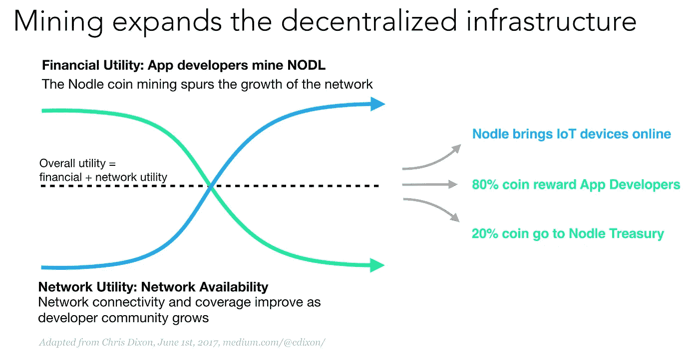

# 免费的钱，几乎免费的代币？

> 原文：<https://medium.com/hackernoon/money-for-nothing-tokens-nearly-free-5e2d252dbd08>

## 基于区块链的新技术为开发者带来了并发收入

Dire Straits — Money For Nothing Music Video

你听说过《可怕的海峡》中的歌曲《白花钱》(上图)吗？这首歌是根据现实生活中的解说吉他手马克·诺普弗勒的作品改编的，是他在纽约一家电器商店无意中听到的，当时一名穿着棒球帽、工作靴和格子衬衫的男子站在他旁边看 MTV，正在送盒子。人们普遍认为音乐家真的做得不多，不像像他这样努力工作的人，“也许你的小指会起水泡，也许你的拇指会起水泡”？我只记得那段视频，是在计算机[动画](https://hackernoon.com/tagged/animation)的早期。呀，事情发生了多大的变化。虽然我们可能还没有达到真正可以“免费赚钱”的阶段，但我们可以非常接近——现在有了[区块链](https://hackernoon.com/tagged/blockchain)的技术，开发者可以通过在他们的机器上运行一小段代码，让机器做他们通常做的事情。

> 可以这样想——作为一名开发人员，你的收入主要来自编码——无论是一次性的还是持续的:当你编码时，你会得到报酬。有了这项技术，你可以在代码运行时获得报酬，而不仅仅是在你编码时——你的代码为你赚钱，就像作者为书籍或投资者为房地产赚钱一样。

> 这真的是“一边睡觉一边赚钱”。

**为什么这很重要？**根据数字判断，您和您的客户可能已经下载并正在使用广告拦截器。广告拦截器和私人浏览器的使用在过去一年中飙升了 30%,实际上消除了许多广告。

**为什么这样不好？互联网的首要商业模式，也是谷歌和脸书(以及许多其他公司)收入的主要来源，是广告支持的。随着越来越多的人开始使用广告拦截器和对话界面，一种新的互联网商业模式必须出现。**

我们需要做什么？我们需要想出新的、更少干扰的商业模式，而不是那些涉及出售客户私人数据的模式(还记得剑桥分析公司、Equifax、Target、Ebay、家得宝、JP 摩根或其他公司[的个人数据被使用、出售或黑客攻击时的愤怒吗？](http://www.informationisbeautiful.net/visualizations/worlds-biggest-data-breaches-hacks/)

这个需要在什么平台上运行？忘记笔记本电脑吧，[研究](https://www.information-age.com/smartphone-primary-device-google-123464707/)显示，人们正迅速将智能手机作为他们的主要随身设备。随着全球超过 25 亿部功能强大的智能手机，它们正在成为众包带宽、存储和计算资源的真正基础设施。一旦更大更好的处理和存储能力在手机上可用，并通过超高速 5G 连接，实现设备的动态网状网络，利用所有多余的计算能力和存储，并允许用户和开发人员通过将多余部分出租给其他人或设备来赚取加密。

**今天是谁在做这件事？这里有一些公司正在这样做的例子。**

## **计算能力**

总部位于华沙 [***的假人***](https://golem.network/) 自称是电脑的 Airbnb:它出租计算能力。当网络上的一台计算机空闲时，它让它的 CPU 工作，为所提供的性能向所有者付费。最终他们计划开发一个去中心化、自组织的网络(等等，这不就是《硅谷》第四季的情节吗？)他们专注于让网络参与繁重的工作，如 CGI 渲染(想象一下典型的超级英雄动作电影所需的计算能力，比音乐视频好得多！)，数学计算，DNA 分析，医学和机器学习。

[***强子***](https://hadron.cloud/) 让人们在手机和电脑的网络浏览器中挖掘密码，从而在全球范围内实现令人难以置信的强大人工智能计算。它创造了一个市场，使高级人工智能功能的访问民主化，同时奖励选择分享闲置设备进行有用工作的日常用户。他们将闲置的资源集中起来，在自动化的自由市场交易所出售。用户和公司可以访问服务和专业知识，为他们自己和他们的公司利用人工智能。

## **储存**

在家庭网络中，大部分空闲的巨型多 TB 驱动器中有多余的空间吗？[***FileCoin***](https://filecoin.io/)拥有端到端的加密分散存储网络和文件托管平台，让用户租用自己的空间换取令牌。这不仅降低了价格，而且更加安全，因为文件被分解并存储在多个位置。

[***新航***](https://sia.tech/) 利用其 P2P 网络将数据存储在存储容量过剩的主机上，并为主机在网络上所做的工作支付报酬。他们在分布于 50 个国家的 1000 多台主机上拥有大约 5pb 的存储容量。它将每个文件复制 50 份，加密后分发给它的主机。它允许主机建立自己的价格，这个价格可能比你每月支付给谷歌云和微软 Azure 的价格低 10%。

## **带宽**

信不信由你，仍然有很多人没有上互联网(至少占世界的 56%)——就像有很多人没有银行账户一样，也有很多人没有联网？加拿大的[***right mesh***](https://www.rightmesh.io/)使用的是去中心化的移动网状网络平台，它的目标是通过区块链连接世界，廉价且不受集中控制。他们使用手机形成网状网络，通过 Wifi、蓝牙和 Wifi Direct 以对等方式实现。

[***开放花园***](https://www.opengarden.com/) ，旨在帮助人们最大限度地提高互联网订阅量，停止浪费。用户与网络上的其他用户共享他们的 Wifi 和互联网订阅，以换取一些 OG 令牌。

[***Nodle***](https://www.nodle.io/)(嘿，就是我们！)创建了一个网状网络，以支持使用蓝牙和现有智能手机的物联网设备的爆炸式增长。我们没有不断改变 3G、4G、LoRa 或 SigFox 协议，而是利用现有设备创建了一个基于软件的无线网络。通过使用蓝牙来众包连接，我们降低了制造商的连接成本，因此各方都是赢家。我们让应用开发者在不出卖他们的用户群或用户信息的情况下赚钱。此外，这对于基于智能手机的采矿服务来说是一个大问题，我们的远程采矿解决方案不会耗尽电池，我们从头开始设计我们的软件，对电池消耗的影响非常低。我们称这个网络为 [***市民网络***](http://thecitizennetwork.com) ！

想想看:数十亿的物联网设备已经存在，( [Statista](https://www.statista.com/statistics/471264/iot-number-of-connected-devices-worldwide/) 说已经有 23B 个了，他们预计到 2025 年将超过 750 亿个)利用你的微小带宽，对你来说是不可见的，而你为此获得了报酬。每当这些设备中的一个检查温度、改变你的窝、捕捉爱洛图像或检测你的三星智能冰箱中还剩多少牛奶时，你都会得到一份。

> **这可能不是“不劳而获”，但也很接近了。**