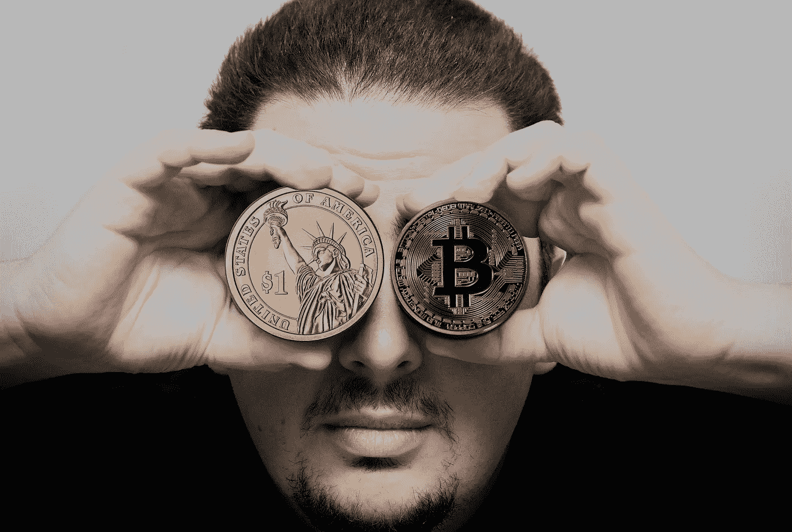
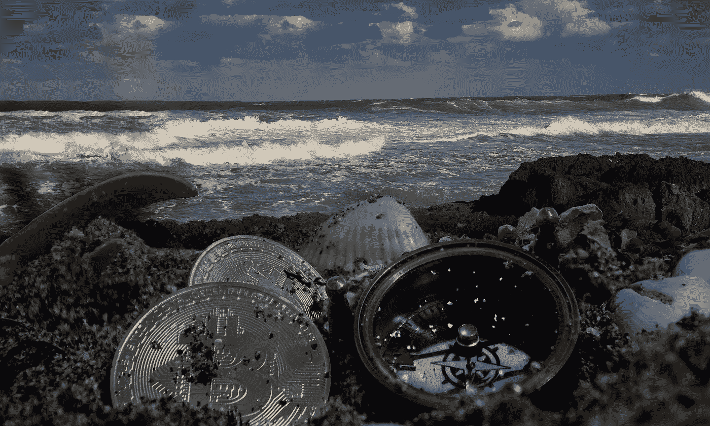

# 金钱在心中:激进的记忆，为了极端的秘密生存

> 原文：<https://medium.com/hackernoon/money-in-mind-radical-remembering-for-extreme-crypto-survival-1459b2d41cd3>

你把钱放在哪里？

你的法定资产可能存在某个银行账户里，可能不止一个。你很可能有某种在线访问账户的方式，所以你可以随时登录并检查它在哪里，看到任何账户移动或支付，并从本质上看到你的钱(即使我们知道银行本身并不需要实际持有超过一小部分你的财富，以备你需要时提取)。你的钱包里也有一些日常开销，用于现金交易和小额支付——尤其是因为零售商通过借记卡接受小额支付的成本很高。

你的[加密货币](https://hackernoon.com/tagged/cryptocurrency)资产有望保存在一个安全的钱包里，因为作为本博客的常客，你理解永远不要把你的私人钥匙留在集中交易所的重要性。你可能会在某种投资组合应用程序上查看你的余额，但钱包是钥匙所在的地方。

然而，虽然我们使用了钱包这个词，但这是一个有点无益的隐喻——因为你的加密硬币实际上并不在里面，不像你的折叠钱实际上存在于你的牛仔裤口袋里。你的加密货币存在于[区块链](https://hackernoon.com/tagged/blockchain)上，它们是在这个分布式账本上被创造出来的，这才是真正的关键:是什么让加密货币既不可改变又安全。

钱包里有什么？你的私钥是，证明你拥有和控制特定的加密资产——你可以移动它，花掉它，或兑现给菲亚特，因为你有一串代码将你唯一地连接到它。

在大多数情况下，您的私钥由一个恢复种子控制，它是一个 12 或 24 个字的字符串。BIP39 单词表是硬件钱包使用的一种协议，用人类可读的转录取代计算机生成的私钥随机性，同时保持安全性。它由 2048 个独特的单词组成，从中生成一个种子短语(顺便说一下，这只是英语单词列表，还有其他几个)。选择这些单词是为了避免相似性，这样您只需要前四个字母就可以明确地识别出这个单词(如果恢复一个界面非常复杂的硬件钱包，这将非常有用)。

因为您可以使用这个短语来恢复任何钱包上的私钥，所以您可以将这个短语视为真正的资产，您需要随时保持它的安全和可检索性。

有许多解决方案可以解决这个问题，从老式的纸笔(最好放在不止一个地方)，到设计用于防火防水的雕刻钢或钛。

你可以考虑在一个地方保存这个单词表的备份——在你的大脑里。虽然我们从来不推荐这是你保存列表的唯一地方，但这是一个值得探索的地方。

我第一次接触到链接记忆法是在一本书里，作者是才华横溢的心理表演家达伦·布朗，书名是《心灵的把戏》。如果你不认识德伦，那就去看看他吧，他小心翼翼地坚持说他的职业是艺人和骗子，而不是拥有超自然力量(他已经揭穿了许多骗子)，但他利用自己众多智力资产中训练有素的记忆来完成他令人难以置信的特技。他在这本书中描述了许多记忆不同事物的技巧，但是链接法(记忆宫殿概念的一种变体)非常适合种子短语中的单词列表。

这个想法是为了在一个单词和下一个单词之间建立强大的感官联系，并将它们植入你的大脑。例如，假设你的恢复短语的前四个词是:

*主播
蜜糖
熬制
镜像*

(这些单词都取自 BIP39 列表，但没有一个出现在“我的”恢复短语中。只是说说而已……)

所以你从前两个字开始，你需要用蜜汁连接主播。也许你会想象一艘船的锚滴着金色的蜂蜜，渗出的甜味与生锈的金属透明地混合在一起。或者也许一艘大船正被压得沉甸甸的，有一大罐蜂蜜挂在海底，一个像《小熊维尼》原版插图那样的大陶瓷罐。

一旦你的第一个脑海中的图片在你的脑海中得到巩固，创建第二个图片将蜂蜜与煮沸联系起来。如果煮蜂蜜会怎么样？也许是一大堆黏糊糊的东西。它闻起来像什么，听起来像什么？尽你所能使用多种感官，尽可能地将视觉三维化。

第三张图片链接*沸腾*和*镜像*。如果你之前在锅里煮蜂蜜，选择不同的东西——也许用这个词作为名词，想象一下照镜子时看到你的鼻子上爆发出一个巨大的疖子——啊！也许它感觉像是又烫又痒。

…你明白了。这种方法的有效性依赖于创造两个词的真正富有想象力的多感官表达，这种表达将两个词有力地联系在一起。每个单词都与两个图像相关联，因此也与另外两个单词相关联，按照严格的顺序，每个单词都有助于你回忆下一个单词。

我喜欢这种方法的一点是，你创造了这些生动的精神画面，把单词像链条一样连接在一起。你自己的精神区块链，控制着对你的加密资产的访问。

您可能会认为这听起来像是一种奇怪的、不可靠的保护您的私钥的方式，但是想想我们生活的这个世界的复杂性和不确定性。如果[运输安全管理局可以让你打开你的智能手机](https://www.nytimes.com/2017/02/14/business/border-enforcement-airport-phones.html)供他们阅读，我们真的还有任何隐私可言吗？你的思想是一个私人空间，你可以把它带到世界的任何地方。你绝对控制对它的访问，它不会被偷，或丢失(希望如此)。即使当记忆被遗忘或抑制时，它们也经常会被一些刺激所触发，比如催眠回归。这是我们都可以免费使用的终极安全存储。

或者想象一个难民，徒步逃离饱受战争蹂躏的叙利亚。一次危险而复杂的陆路旅行，她在那里被袭击和虐待，导致她一生的积蓄被人贩子偷走，利用她重建被摧毁的生活的迫切需要。随着超载的船下沉，她失去了她的 ID 和最后一捆世俗的财产消失在海浪下，疯狂地游向远处地平线上的海滩是唯一的希望。

幸运的是，随着潮水，她手脚并用爬上岸。当她抬头看着欧洲的海岸和一个生活、繁荣、重生的机会时，你可以听到咒语般的内心独白:“锚，锚是蜂蜜做的。这是一个糟糕的锚，因为当装满蜜蜂的船离开时，它在海底溶解成粘性。然后我要在我公寓厨房炉子上的大锅里煮蜂蜜，那个政权把它炸成了碎片……”

生活和环境剥夺了她曾经为之生活、为之工作、学会爱的一切*。除了她财富的钥匙是安全的，没人能碰它们或拿走它们。*

这是一个令人信服的想法，不是吗？