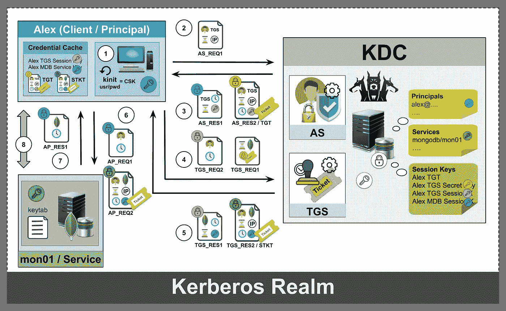

# 用 Kerberos 身份验证配置 MongoDB

> 原文：<https://medium.com/hackernoon/mongodb-kerberos-a3dfdf322d1c>

大型企业中的 [MongoDB](https://hackernoon.com/tagged/mongodb) 数据库管理员可能需要配置 MongoDB 来支持 Kerberos 身份验证。如果您具备一些 Kerberos 知识，那么配置带有 [Kerberos](https://hackernoon.com/tagged/kerberos) 认证的 MongoDB 非常简单。MongoDB 文档文章,[在 Linux 上使用 Kerberos 身份验证配置 MongoDB](https://docs.mongodb.com/manual/tutorial/control-access-to-mongodb-with-kerberos-authentication/),对这个主题进行了广泛的讨论。然而，该文章指出— *“设置和配置 Kerberos 部署超出了本文档的范围”*，导致一些对 Kerberos 了解有限的初学者/爱好者无法继续下去。这篇文章旨在弥补这一差距，并帮助您理解

*   Kerberos 如何工作
*   如何在实验室中设置 Kerberos 和 MongoDB
*   最后，如何将 MongoDB 与 Kerberos 身份验证集成

这是多部分系列文章之一，[掌握 MongoDB —一天一个技巧](/p/mastering-mongodb-5544e16df023)，专为您创建，通过学习*“一天一个技巧”*来掌握 [MongoDB](https://www.mongodb.com/) 。在几篇系列文章中，我将给出各种各样的技巧来加强 MongoDB 的安全性。在本文中，我将讨论“*如何将 MongoDB 与 Kerberos 身份验证集成起来”*。

# 主控—带 Kerberos 身份验证的 MongoDB

# 什么是 Kerberos

[Kerberos](https://web.mit.edu/kerberos/) 是一种计算机网络认证协议。它旨在通过使用密钥加密技术为客户机/服务器应用程序提供强身份验证。它基于票证工作，允许节点通过不安全的网络进行通信，以安全的方式相互证明自己的身份。Kerberos 协议消息可以防止窃听和重放攻击。[礼仪](https://en.wikipedia.org/wiki/Cerberus)是以希腊神话中的角色 Kerberos(或 [Cerberus](https://en.wikipedia.org/wiki/Cerberus) )命名的，它是冥府中凶猛的三头看门狗。

# Kerberos 是如何工作的

Kerberos 允许使用票证进行单点登录，而不是要求客户端为他们访问的每个服务输入用户名/密码凭证。这些*身份证明票据*由可信的第三方(密钥分发中心)发布，并且通常用秘密/对称密钥加密。本节讨论 Kerberos 领域中的各种资源在身份验证过程中如何相互交互。

## 密钥分发中心

为了通过 Kerberos 管理对资源的访问，所有的组件、服务和用户都必须在 *Kerberos 领域*中。Kerberos 发行中心(KDC)是 Kerberos 领域的核心，具有以下关键服务器组件

*   **数据库服务器** —存储注册用户和服务的密钥
*   **认证服务器** —提供访问票据授予服务器的票据
*   **票据授予服务器** —提供访问感兴趣的服务的票据

KDC 的数据库存储了用户机器和服务的所有密钥。秘密密钥依次是密码的散列值加上一个盐。数据库本身进一步用主密钥*加密，以防止任何人从数据库的文件系统中窃取密钥。*

## 身份验证过程中的事件流

假设您想要使用 Kerberos 身份验证来访问 MongoDB 服务。在身份验证过程中，以下资源根据定义的目标处理/交换信息

*   客户。目标:使用 kinit 登录
*   客户端和认证服务。目标:获得赠票票
*   客户和票据授予服务。目标:获取服务票
*   客户端和 MongoDB 服务。目标:访问 MongoDB 服务

The sequence of events occurring during Kerberos authentication process

上图显示了 *Kerberos* 认证过程中涉及的各种资源/组件，并说明了它们如何相互交互。让我们试着理解每一步的内部细节。

> 请特别注意锁图标的颜色，这是一条加密的消息。它只能由具有相同颜色密钥的资源解密。

## 使用 kinit 登录

*用户*(又名客户/委托人)必须通过登录计算机或运行命令`kinit <username>`向*认证服务器*自我介绍

## 用户和认证服务器之间的通信

每个*用户*在访问任何*服务*之前，都必须拥有由*认证服务器*颁发的*赠票* (TGT)。 *TGT* 是一种票证，允许用户获得*票证*以访问他们感兴趣的服务。

用户的目标是通过向*认证服务器*发送请求来获得*票据授予票据*。该请求消息包含

*   用户名:用户名/客户端 ID
    请求的服务:票据授予服务
    网络地址:客户端的 IP 地址
    有效期:TGT 的生存期
    时间戳:请求消息创建的时间

*认证服务器*处理请求并检查消息中的*时间戳*是否在 5 分钟内，检查*用户*和请求的*服务*是否在 KDC。它最终发布*票据授予票据，*生成*票据授予会话密钥*并与*用户共享。*

*认证服务器*用两条消息响应用户的请求。响应#1 用`Client Secret Key`(青色密钥)加密，消息内容如下—

*   服务:`Ticket-Granting Service` 时间戳:创建时间
    有效性:TGT 的生存期
    TGS 会话密钥(洋红色密钥)

响应#2 是 TGT 的*票授予票*，用`TGS Secret Key`(黄色密钥)加密。它只能被 *KDC* 解密。该消息包含以下内容—

*   用户名:您的姓名/ ID
    服务:`Ticket-Granting Service` 时间戳:创建时间
    网络地址:IP 地址
    有效性:TGT 的生存期
    TGS 会话密钥

*客户端*处理*认证服务*响应，并使用用户的密钥(青色密钥)解密`Response #1`。解密成功后，*用户*和 *KDC* 都有`TGS Session Key`(洋红色密钥)。`TGS Session Key`用于加密客户端与*票证授予服务器之间的通信。*客户端无法解密`Response #2`、 *TGT* ，因为它没有 *TGS 密钥*，但它会存储在客户端的凭证缓存中。

## 用户和票据授予服务器之间的通信

有了*票据授予票据*，客户机就可以向`Ticket-Granting Server`请求一张访问 MongoDB 服务的票据。在验证了 *TGT* 后，*票据授予服务器*将发出`Service Ticket`、 *STKT、*请求访问 *MongoDB 服务器*。

用户的目标是通过向*票据授予服务器*发送请求来获得*服务票据*。请求#1 消息包含以下内容—

*   有效期:TGT
    生命周期请求服务:`MongoDB Service` *出票*(只有 KDC 可以解密)

请求#2 用 TGS 密钥(品红色密钥)加密，消息包含以下内容

*   用户名:您的姓名/ ID
    时间戳:创建时间

*票据授予服务器*处理该请求，检查消息中的*时间戳*是否在 5 分钟内，检查服务`MongoDB Service`是否向 KDC 注册。它最终发布一个*服务票，*生成并与*用户共享 *MongoDB 服务会话密钥*(皇家蓝色密钥)。*

*票据授予服务器*用两条消息响应用户的请求。响应#1 用`TGS Session Key`(洋红色密钥)加密，消息包含以下内容

*   请求的服务:MongoDB 服务
    时间戳:创建时间
    有效性:TGT 服务会话密钥(皇家蓝密钥)的生存期

响应#2 用`MongoDB Secret Key`(绿色密钥)加密，只能由 *MongoDB 服务器*解密。该消息包含以下消息内容—

*   用户名:您的姓名/ ID
    服务:MongoDB 服务
    时间戳:创建时间
    网络地址:IP 地址
    有效性:STKT 的生存期
    MongoDB 服务会话密钥

`MongoDB Service Session Key`用于加密*用户*和 *MongoDB 服务器之间的通信。*客户端无法解密`Response #2`、 *STKT* ，因为它没有 *MongoDB 密钥*，但是它会存储在客户端的凭证缓存中。

## 用户和 MongoDB 服务之间的通信

有了*服务票*，客户端可以向`MongoDB Server`发送登录请求。MongoDB 服务器将验证*服务票*，并为用户的登录会话设置授权角色和特权。

用户的目标是通过向 *MongoDB 服务器*发送登录请求来访问 *MongoDB 服务*。请求#1 使用 *MongoDB 会话密钥*(皇家蓝色密钥)加密，消息包含以下内容—

*   用户名:您的姓名/ ID
    时间戳:创建时间

请求#2 是*服务票*本身，它只能由 *MongoDB 服务器*使用它的*密钥*(绿色密钥)解密。该消息包含以下内容—

*   用户名:您的姓名/ ID
    服务:MongoDB 服务
    时间戳:创建时间
    网络地址:IP 地址
    有效性:STKT 的生存期
    MongoDB 服务会话密钥

*MongoDB 服务器*处理请求，检查消息中的*时间戳*是否在 5 分钟内，检查*用户*是否在数据库中注册。它最后为*用户设置角色和权限。*

*MongoDB 服务器*用一条消息响应用户的请求。响应#1 用`MongoDB Session Key`(皇家蓝色密钥)加密，消息内容如下—

*   用户名:您的姓名/ ID
    服务:MongoDB 服务

*客户端*处理 *MongoDB 服务*响应，并使用 *MongoDB 会话密钥*(皇家蓝色密钥)解密`Response #1`。在成功解密和验证后，客户端将直接与 *MongoDB 服务器*通信，以获得进一步的数据库请求。

我知道这需要消化大量的信息，尤其是如果您对 Kerberos 一无所知的话。关于 Kerberos 的进一步阅读，我强烈建议您阅读 *Lynn Root 的*文章[像我 5 一样解释:Kerberos](http://www.roguelynn.com/words/explain-like-im-5-kerberos/) 和/或观看 YouTube 视频[Kerberos—CompTIA Security](https://www.youtube.com/watch?v=VpBCJ8vS7T0)作者*刀子乐队教授*。

# 动手实验练习

既然您已经理解了 Kerberos 身份验证过程中的理论和信息流，那么让我们来设置一个实验室环境。本实验练习帮助您了解如何在 CentOS 7.5 上设置 Kerberos、MongoDB 和配置客户端以使用它们。

## 设置环境

首先，你需要一个玩耍的环境。在这个例子中，我创建了 3 个 AWS EC2 实例，每个服务器一个——KDC、MongoDB 服务器和用户机器。如果您缺少资源，您可以将它们全部安装在同一台实验室服务器上。

请确保[配置您的防火墙/安全组](https://uit.stanford.edu/service/kerberos/firewalls)以允许端口 88、749、27017 上的传入流量用于各自的服务。

A bash script to install ntpd service on all three servers (KDC, MongoDB Server and User machine)

## 安装和配置 KDC 服务器

登录到 KDC 服务器以安装/配置 Kerberos 服务器。

A bash script to install Kerberos server on KDC server and configure the files with MDBKRB5.NET realm

为了方便起见，我展示了运行上述命令后文件内容的样子。

The file contents of Kerberos configuration files

接下来，您需要为领域创建一个 Kerberos 数据库，并为用户、服务等创建主体条目

A bash script to create a Kerberos database for the Realm and create the Principal entries for the Users, Services etc

## 设置 MongoDB 服务器

登录到 MongoDB 服务器以安装/配置 MongoDB 服务器，mdb01.mdbkrb5.net

A bash script to install the Kerberos client and display the Kerberos configuration file

接下来，您需要安装 MongoDB Enterprise server，创建 MongoDB keyfile，配置`/etc/mongod.conf`文件，等等

A bash script to install the MongoDB and set the MongoDB configuration files

创建一个 keytab 文件来存储 Kerberos 服务主体和加密密钥

A bash script to help you create the Kerberos keytab file

将文件夹权限设置为仅允许用户`mongod`读取它们。

A bash script to configure environment variables and set permissions for the folders

最后，让我们在 MongoDB 服务器中创建以下内容

*   `superuser`拥有 root 权限
*   `alex`在*管理*数据库中具有*根*角色的主体
*   `bob`在*社交*数据库上具有*读写*角色的负责人

A bash script using mongo client to create replica set and user privileges on $external database

## 在 client01.mdbkrb5.net 上安装 MongoDB 客户端

登录 MongoDB 客户机服务器，安装 Kerberos 和 MongoDB 客户机。

A bash script to install the Kerberos client and display the Kerberos configuration file on the User machine

首先，使用 *Yum* 安装 MongoDB shell 和企业依赖项。

A bash script to install the MongoDB shell and the MongoDB Enterprise dependencies

以 *bob* 的身份登录 Kerberos，然后登录 *MongoDB 服务器*来测试对*社交*数据库的*读写*权限。

A bash script illustrating authentication to MongoDB via Kerberos SSO and authorization on MongoDB

> 如果您为用户 alex 运行相同的测试，那么您将能够查询 *social* 和 *admin* 数据库，因为他的 *root* 角色。

# 摘要

> 正如文章开头所述— *“用 Kerberos 身份验证配置 MongoDB 非常简单！”*。然而，没有适当的 Kerberos 知识，您的手很难完成简单的 *POC* 。

希望本文简化了对 Kerberos 事件的理解，并对*“如何将 MongoDB 与 Kerberos 身份验证集成起来”*有所启发。

MongoDB Enterprise 提供了与 Kerberos 以及 LDAP 认证机制的集成。尽管 MongoDB 使用 Kerberos 身份验证，但是用户管理仍然需要在 MongoDB 中创建用户特权。如果您的组织有 100 多个用户需要访问 MongoDB，那么您可以探索使用 LDAP 进行身份验证和授权。但那是另一天的话题。希望你今天在通往“[掌握 MongoDB——一天一个技巧](https://hackernoon.com/mastering-mongodb-one-tip-a-day-series-5544e16df023)”的道路上学到了一些新东西。

# 以前发表的文章

*   技巧# 005: [开始使用 MongoDB Enterprise Operator](/@shyam.arjarapu/getting-started-with-mongodb-enterprise-operator-for-kubernetes-bb5d5205fe02)
    现在，您可以在一分钟之内在 Kubernetes 中部署 MongoDB
*   提示# 004: [更快的选举](/@shyam.arjarapu/mongodb-faster-elections-a567ae5416f5)
    滚动维护时减少选举时间的措施
*   提示# 003: [交易](/@shyam.arjarapu/mongodb-transactions-5654cdb8fd24)
    许多人期待已久、最想拥有的功能终于到来了
*   提示# 002: [createRole](/@shyam.arjarapu/mongodb-createrole-e1ca1346d3bb)
    啊啊啊啊啊啊啊啊啊啊啊啊啊啊啊啊啊啊啊啊啊啊啊啊啊啊啊啊啊啊啊啊啊啊啊啊啊啊啊啊啊啊啊啊啊啊啊啊啊啊啊啊啊啊啊啊啊啊啊啊啊啊啊啊啊啊啊啊啊啊啊啊啊啊啊啊啊啊啊啊啊啊啊啊啊啊啊啊啊啊啊啊啊啊啊啊啊啊啊啊啊啊啊啊啊啊啊啊啊啊啊啊啊啊啊啊啊啊啊啊啊啊啊啊啊啊啊啊啊啊啊啊啊啊啊啊啊啊啊啊啊啊啊啊啊啊啊啊啊啊啊啊啊啊啊啊有人刚刚丢了一个收藏
*   技巧# 001:[current top](/p/mongodb-currentop-18fe2f9dbd68)
    彻底了解 MongoDB 服务器上当前正在执行的操作