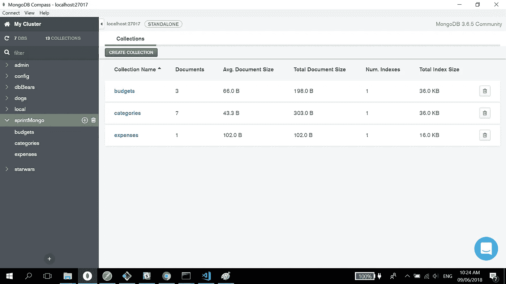

# MongoDB，Mongoose，有趣的是数据

> 原文：<https://medium.com/hackernoon/mongodb-mongoose-and-the-fun-thing-that-is-data-911e28d8c3af>

我从没想过我会这么说，但本周我在处理(阅读:修补、操作、摆弄)数据和数据库方面获得了很多乐趣。

(这么说是不是超级极客？我是说，谁说的？什么样的人类居然说自己喜欢“[管理数据](https://hackernoon.com/tagged/managing-data)”。真是个书呆子。)

然而，这是真的。这周[学习](https://hackernoon.com/tagged/learning)关于 MongoDB 和 Mongoose，我玩得非常开心。

**猫鼬是什么动物？**

这就是我们整个星期在 Lambda 学校学习的内容。特别是，我们讨论了以下主题:

1.  将数据导入 MongoDB 数据库。
2.  建模集合之间的关系。
3.  在模式中嵌入文档。
4.  通过引用将收藏链接在一起。
5.  在端点中填充数据。
6.  查询数据。
7.  创建中间件。
8.  自定义验证。

本质上，MongoDB 是一个数据库。猫鼬呢？嗯，它可以用几种技术方法来定义:一个 JavaScript 框架，你可以用它来与你的 Mongo 数据库进行交互；一个对象数据建模(ODM)库，可帮助您对数据建模；等等。但是对我来说最有帮助的是把它简单地想象成一种帮助你更有效地使用 MongoDB 的工具或技术，就像 Express 是一种帮助你更好地利用 Node.js 的工具或技术一样。

【MongoDB 解决的问题

如果可以用 Node.js 为什么要用 MongoDB？Node.js 的问题是，一旦你的服务器宕机，你的数据也会随之宕机。所以没有数据持久性。使用 MongoDB，即使您“杀死”了服务器，数据仍然存在。这就是 MongoDB 解决的问题。

如果你想知道它看起来像什么，这里是(运行在 Windows 终端):

文本“[initandlisten]在端口 27017 上等待连接”表明您的 Mongo 服务器已经启动并正在运行。

一旦有了这些，您需要打开第二个终端来运行您的“Mongo Shell”。看起来是这样的:

你现在可以从这里浏览你的 Mongo 数据库。您只需要几个基本命令:

1.  显示数据库(*显示数据库列表*
2.  使用 <insert database="" name="" here="">( *选择特定的数据库*)</insert>
3.  显示收藏(*打开数据库并列出其中的收藏*
4.  db。<insert database="" name="" here="">。查找()。pretty() ( *显示每个集合中的文档或数据*)</insert>

**学习 MongoDB 时你需要知道的第一件事**

因此，在第一次学习 MongoDB 时，您需要学习的最重要的术语是:

1.  数据库
2.  收集
3.  文档

文档只是包含在集合中的数据(例如，JSON 文件)，而集合又是包含在数据库中的目录。

您可以通过 Mongo Shell 对 MongoDB 数据库中的数据进行 CRUD 操作，就像您可以通过 Postman 和 Compass 对数据进行 CRUD 操作一样。也就是说，Mongo Shell、Postman 和 Compass 是这些超级酷的工具，可以帮助您创建、检索、更新和删除 MongoDB 数据库中的数据或文档。

邮递员长这样:

指南针看起来像这样:

一开始用起来很吓人，但是一旦你习惯了，玩起来会很有趣。

当您创建后端应用程序和测试端点时，一起使用它们肯定非常有用。

**冲刺挑战**

顺便说一下，我很高兴今天在我们的每周冲刺挑战中，我能够得到一个最低限度可行的产品。我担心我做不到，因为我最初陷入了试图将我的头脑包裹在模型、模式、引用和数据填充的概念中。当我能够创建新的数据库和集合并将文档存储到其中时，以及当我在 Postman 中成功测试它们时，我欣喜若狂。像这些技术上的东西怎么会如此让人快乐呢？

***

***λ大使计划***

我已经报名参加了 Lambda 学校的大使项目，因为我简直无法停止谈论我的学校。如果你有兴趣进入他们的全栈 Web 开发和软件工程课程，请点击这里:[*【https://mbsy.co/lambdaschool/37941124*](http://email.getambassador.com/wf/click?upn=mN-2FWU3VjO8iVXRKpwiK4dKqE5VRn5QpLO8b2xO51xZC2R3H1noQTJubaje7XACAg_vg8a3lxrsWTnGXKGCzr0MfKKWrkEgHsF0suKDaYJYLlyokM7V7nVWRyI24mV8iOKJ6olwcNh8PP8X7OGjTrVT5pdMr8qNyg6iInTylOnnjwwiUmyb9cMfRNi6E9K17hfXxcwKzPt74gLC-2Bpv0GqVFWFhcLBXCqsToxrIZrGxWsuQli-2Bz3-2BX0mf4Rm0-2BZYq8iFZueYb80l0XJAq4p5t3yqHtWSaCnOQDc3-2BXoWUztwQkJVsixK5HiiHS5-2FTSL9dnk-2BYcBOgKW5IbKn-2Bzkzq3plaky7w-2Bsb0-2BUFtTE3cB3nLA-3D)*。*