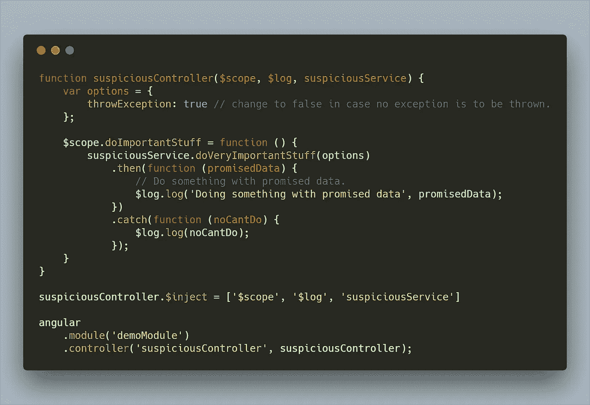
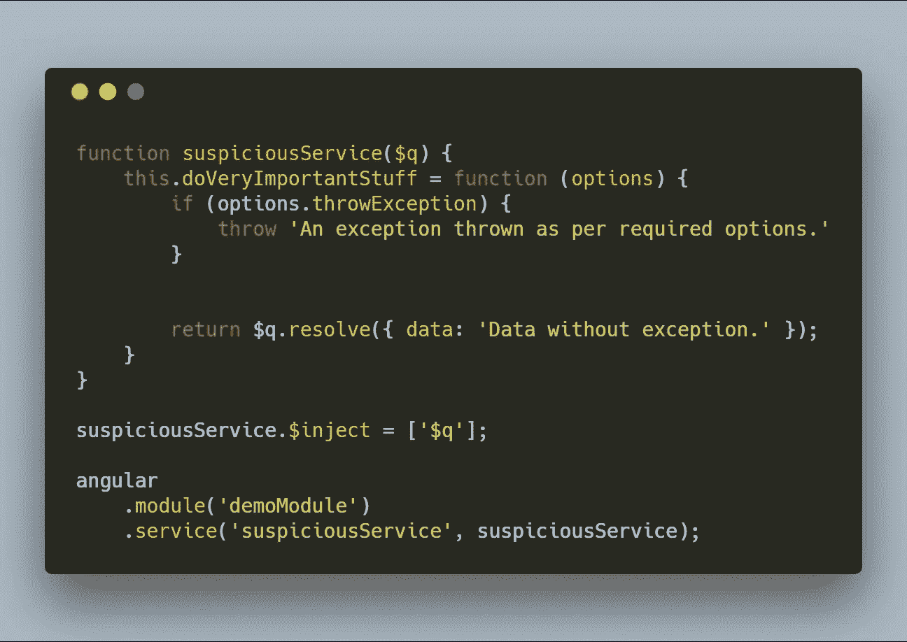
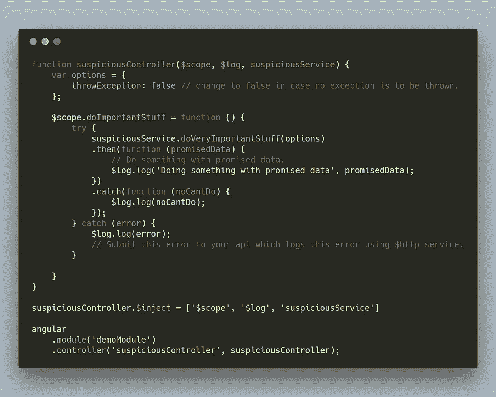
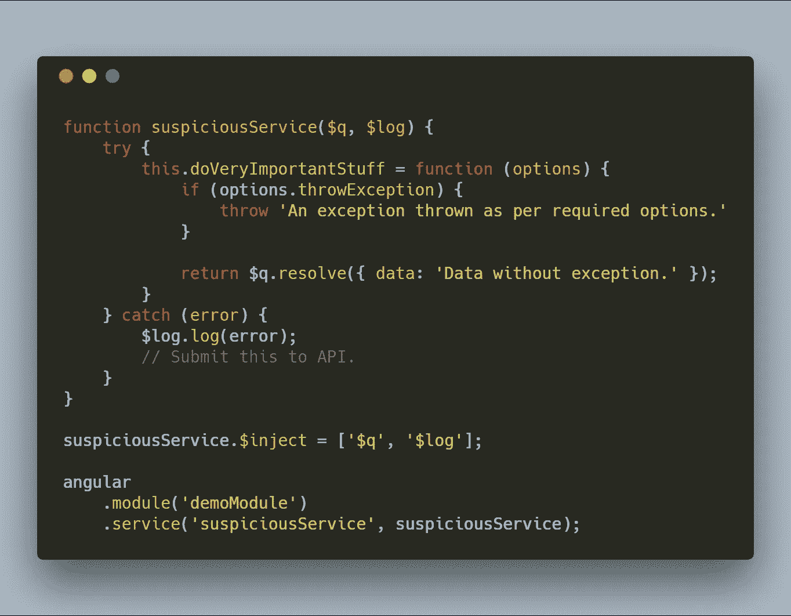
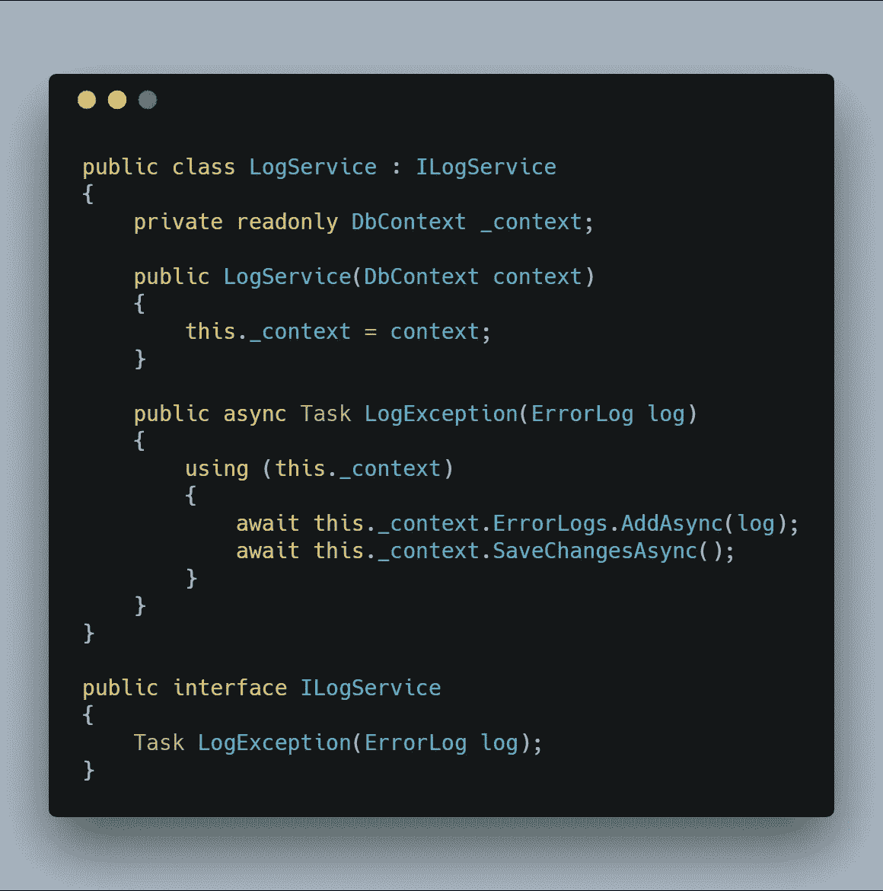
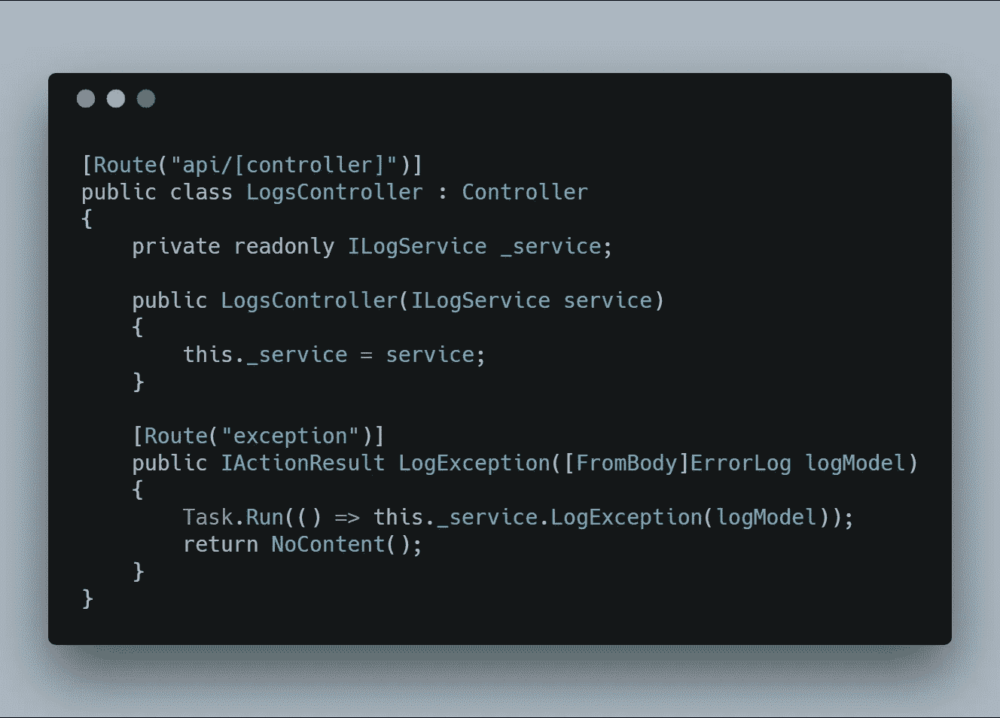
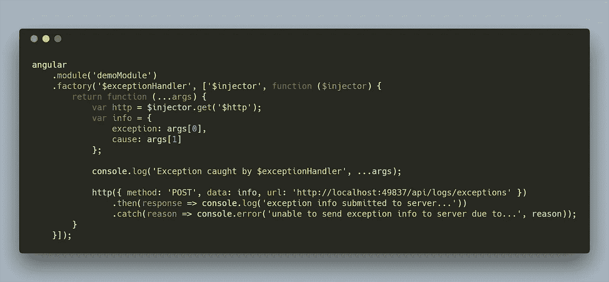
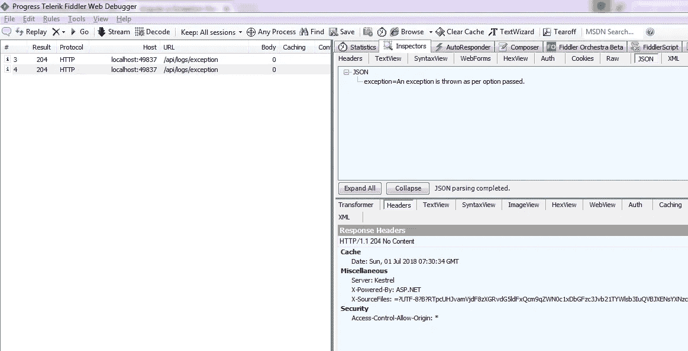

# 像 angularjs 中的 boss 一样监控和处理异常

> 原文：<https://medium.com/hackernoon/monitor-and-handle-exceptions-like-a-boss-in-angularjs-c5b034404fad>

Photo by [rawpixel](https://unsplash.com/photos/PG3NsaGpY3s?utm_source=unsplash&utm_medium=referral&utm_content=creditCopyText) on [Unsplash](https://unsplash.com/search/photos/computer?utm_source=unsplash&utm_medium=referral&utm_content=creditCopyText)

# **我为什么要写这个**

有时候，您可能希望能够更好地控制您的错误记录系统。您可能会考虑为 angularjs 应用程序实现一个异常处理机制，但是阻止您的可能是您必须编写的大量代码。此外，为了将代码包装到异常处理机制中，您可能需要进行大量的重构。

# 问题是

让我们从分析一些您可能已经编写或在您的应用程序中遇到的代码开始。

[suspiciousController.js](https://gist.github.com/saurabhpati/fca91e9a51861502e6ff2802074ea45d)

你可以在这里查看上面的代码[。](https://gist.github.com/saurabhpati/fca91e9a51861502e6ff2802074ea45d)

## 简单解释一下:

这个控制器有一个功能`doImportantStuff` ，它主要调用`suspiciousService`的一个服务`doVeryImportantStuff`。options 对象只是告诉服务是否抛出异常。如果是真的，它抛出一个 JavaScript 异常，这个异常不会在 catch 块中处理，因为 catch 块本质上是 promise 的拒绝处理程序。只有当承诺在服务中被拒绝时，它才会被执行，而不是在抛出异常时。

如果你想知道`suspiciousService.js`长什么样。在这里。

[suspicousService.js](https://gist.github.com/saurabhpati/2921d9762d1a0d2f0a86aa720ec11566)

你可以在这里查看代码

现在，一个更实用的方法是将您的控制器代码包装在一个 try catch 块中，这意味着您的代码将如下所示。

[A pragmatic suspiciousController](https://gist.github.com/saurabhpati/83ad684ff478091ccce338811505d865)

你可以在这里查看上面的代码[。](https://gist.github.com/saurabhpati/83ad684ff478091ccce338811505d865)

现在，您的 JavaScript 异常将被捕获并记录下来，如果您有一个从 API 中公开的端点来记录客户端错误，那么您可以向 API 提交错误，API 会将它们记录到数据库中。

# 这个想法

如果您在想，为什么首先要将客户端异常记录到数据库中呢？你可以把它作为一个插件来实现，例如，想象一下这样一种情况，你无法理解某个特定用户出了什么问题，因为他使用了你的应用程序可能不完全支持的特定浏览器/操作系统/机器等。因此，您可以暂时打开这个数据库记录前端异常*设置*或*标志*，并让用户重复这些步骤，将*设置*设为“关闭”，瞧！您将确切地了解由于用户使用特定的浏览器/操作系统/机器或由于用户面临特定问题的任何原因而导致该用户出错的信息。

没有必要花费无数的时间去弄清楚你写的代码哪里出错了。只需注入一个错误日志记录服务，将您的异常提交给数据库，您将获得修复该错误所需的内容。如果您的应用程序运行在像 [*Outlook 桌面加载项*](https://docs.microsoft.com/en-us/outlook/add-ins/quick-start?tabs=visual-studio) 这样无法调试的环境中，这就变得尤为重要。

所有这些听起来不错，但仍然有一个小问题。

还记得我们将代码包装在 try catch 块中吗？我们需要对所有的控制器都这样做。这太恶心了。那一点也不整洁。它散发着不想要的和丑陋的代码。现在，您可能希望通过将 try catch 块应用到您的服务来解决这个问题，因为这是异常真正重要的地方，如果发生异常，应该记录并知道。举个例子，如果主页出了问题，但是其他页面工作正常，并且您的所有服务都插入了异常处理，那么最有可能的原因就是`homeController.js`文件(或者您用于主页的任何控制器)。

在这种情况下，`suspiciousService.js`看起来会像这样

suspiciousService.js

但是，即使我们把 catch 块从我们的控制器转移到我们的服务中，它仍然是令人讨厌的！在没有其他出路之前，没有人愿意在他们清醒的头脑中编写这种代码，不是吗？angularjs 的猫里可能有什么东西可以救我们。

# 解决方案:输入$exceptionHandler

angularjs 有一个`[$exceptionHandler](https://docs.angularjs.org/api/ng/service/$exceptionHandler)`服务，您可以使用它来委托在那里处理所有未捕获的异常。然而，`$exceptionHandler`的默认实现将它委托给`[$log.error](https://docs.angularjs.org/api/ng/service/$log#error)`，后者将它记录到浏览器控制台。这不是我们想要的。我们需要将这个错误发送到我们的 API，它将记录到数据库或电子邮件/通知某人。这意味着我们需要修改`$exceptionHandler`的实现

# API 端点

在我们修改`$exceptionHandler`之前，让我们看一下将异常记录到数据库中的日志服务。如果您现在不太关注 API 端点，可以跳过这一部分。为了文章的完整性，我已经包括了这一点。

我已经使用 [dot net core API](https://docs.microsoft.com/en-us/aspnet/core/tutorials/first-web-api?view=aspnetcore-2.1) 实现了这一点，如果你愿意，你可以使用 [node](https://nodejs.org/) 和 [express](https://expressjs.com/) 做同样的事情。

`LogService.cs`是一个有作用域的服务，只有在遇到记录异常的请求时才会被创建。

[*logservice . cs*](https://gist.github.com/saurabhpati/5cef411b8db8fdd916bcc243353df0c8)

LogService.cs

[*logs controller . cs*](https://gist.github.com/saurabhpati/5cef411b8db8fdd916bcc243353df0c8)

LogsController.cs

# 修改$exceptionHandler

按照我们的用例，我们以这种*方式修改$exceptionHandler。*

[*$异常处理程序*](https://gist.github.com/saurabhpati/415050b92f3b5b6e3591332c33462f3f) *:*

Implementing your own $exceptionHandler

你可以在这里查看代码[。](https://gist.github.com/saurabhpati/415050b92f3b5b6e3591332c33462f3f)

# 结论

*   如果你查看任何网络调试工具，如 [fiddler](https://www.telerik.com/fiddler) 或[浏览器](https://code.tutsplus.com/articles/chrome-dev-tools-networking-and-the-console--net-28167)，你可以看到细节被提交给服务器。

Exception Submitted to Server.

*   随着 try catch 块的消失，我们的控制器和服务变得更加干净。
*   所有未捕获的异常都被处理和报告，并且可以根据需要打开和关闭。
*   我们已经转向更有效的异常处理机制，该机制可靠、灵活、可维护，更重要的是，它让我们能够在用户选择的时间处理他们已经记录或报告的错误。

如果你已经读到这里，感谢你阅读它。我会关注这篇文章的任何反馈或建议。