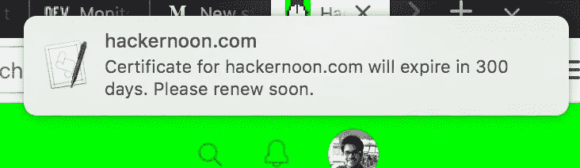

# 使用此脚本监控您的 HTTPS 证书到期时间

> 原文：<https://medium.com/hackernoon/monitor-your-https-certificate-expiry-with-this-script-1338bf5acfe9>

去年除夕，我接到客户的电话。他们说他们的网站被病毒感染了，没有人能访问它。

现在，我的客户经营着一家果汁店，他不知道网络在技术上是如何工作的，所以我放弃了“病毒”问题，但他说网站无法访问，所以我启动了手机中的 Firefox，看到了`Your connection is not secure`页面。

自从 Let's [Encrypt](https://hackernoon.com/tagged/encrypt) 发布测试版以来，我一直用它将我和我客户的所有网站转换成通过 [HTTPS](https://hackernoon.com/tagged/https) 的安全连接。我已经按照 [certbot](https://certbot.eff.org/) 的指示建立了一个 cron 来定期更新证书，但是它曾经每隔一段时间就会失败，因为我没有更新 python 包，或者类似的事情。Let's Encrypt 非常友好，可以在过期前发送邮件，但初始安装是由一名员工完成的，因此邮件会发送到她的地址。

因为那天是 12 月 31 日，我在一个聚会上，没有靠近我的机器的地方，我可以用 ssh 进入服务器并杀死这个怪物。我的手机上有 JuiceSSH，我用它登录到服务器(感谢上帝我已经按照授权添加了我的密钥)，更新了包并更新了证书。

与此同时，我周围的人从 10 开始倒数。

# 不宣誓

这甚至不是第一次发生这种情况，所以我当时就决定，我要自己解决这个问题。我小心翼翼地选择不把它作为我的新年决心，否则明年我还会讲同样的故事。

因此，在 1 月 1 日，我写了一个 Ruby 脚本(一分钟后会有更多内容)并不断改进它，以捕捉 HTTPS 安装的各种危险信号，包括证书是否被吊销、受[赛门铁克混乱](https://security.googleblog.com/2017/09/chromes-plan-to-distrust-symantec.html)影响、自签名或超过/接近到期日期、验证信任链等。该脚本最终被转换成一个名为 [Monitor Certificates](https://monitorcertificates.com/) 的 web 应用程序，但现在让我们回到脚本上来。

# 获取证书

您需要做的第一件事是从一个域获取证书。令人惊讶的是，这很难实现。我是用 Ruby 发出请求的`[HTTParty](https://github.com/jnunemaker/httparty/)`的忠实粉丝，但不幸的是我找不到让它返回证书的方法。

所以我向下一层抽象，使用了`Net::HTTP`。要获得证书，你必须跑步

```
require 'net/http'
require 'openssl'

domain_name = "example.com"

uri = URI::HTTPS.build(host: domain_name)
response = Net::HTTP.start(uri.host, uri.port, :use_ssl => true)
cert = response.peer_cert
```

这在`cert`变量中给了你一个证书对象。该变量属于`OpenSSL::X509::Certificate`类型。这些被称为 [X.509 证书](https://en.wikipedia.org/wiki/X.509)，它们是公钥证书的标准。

X.509 证书为我们提供了许多关于证书的详细信息，包括谁颁发的、何时颁发的、何时到期、如何发现证书是否被吊销，以及大量其他有用的信息。

# 查找到期日期

要找到证书失效的日期，你只需要打电话给`cert.not_after`。这将返回一个 Time 对象，它告诉我们证书何时到期。

因此，如果您希望在证书到期前的 2 周内每天都收到通知，那么您的脚本将如下所示

```
require 'net/http'
require 'openssl'

domain_name = "example.com"

uri = URI::HTTPS.build(host: domain_name)
response = Net::HTTP.start(uri.host, uri.port, :use_ssl => true)
cert = response.peer_cert

two_weeks = 14 * 86400 # 14 * One Day

if Time.now + two_weeks > cert.not_after
  # send reminders
end
```

# 提醒你自己

你可以用很多东西来发送这些提醒。我现在已经在[我的应用](https://monitorcertificates.com/)中实现了[短信](https://hackernoon.com/tagged/sms)、邮件(发给多人)、Slack 和 Stride。

我有一些朋友使用这个脚本向他们自己推送手机通知(使用 Pusher)，网页通知， [Geckoboard](https://hackernoon.com/tagged/greckboard) 更新，添加到待办事项列表，添加到 Trello 板，等等。任何交流平台都是公平的游戏。

例如，如果你在 Mac 上，有一个[简洁的小命令](https://apple.stackexchange.com/questions/57412/how-can-i-trigger-a-notification-center-notification-from-an-applescript-or-shel/115373#115373)可以用来给自己发送通知。

因此，我将在脚本中包含该命令，以便向我们发送通知。

```
require 'net/http'
require 'openssl'

domain_name = "example.com"

uri = URI::HTTPS.build(host: domain_name)
response = Net::HTTP.start(uri.host, uri.port, :use_ssl => true)
cert = response.peer_cert

two_weeks = 14 * 86400 # 14 * One Day

if Time.now + two_weeks > cert.not_after
  time_remaining = (cert.not_after - Time.now)
  days_remaining = time_remaining / 86400

  `osascript -e 'display notification "Certificate for #{domain_name} will expire in #{days_remaining.to_i} days. Please renew soon." with title "#{domain_name}"'`
end
```

我删除了`if`条件并运行脚本，今天的输出如下所示



This is what the notification looks like today.

现在你需要做的就是将它添加到你的 crontab 中，当你的证书即将更新时，它会不断提醒你。

# 结论

显然，我给你看的这个脚本不是最优雅的软件，但是它完成了任务。如果您想要监视多个域，只需将脚本转换成一个方法，并对您的数组`domain_names`的每个元素运行该方法。

我们只是触及了表面，但这是构建您的监控基础架构和更多功能的坚实开端，以确保您的证书没有被吊销，或者如果是付费证书，谁是发行者。

我已经在我的应用程序中添加了所有这些和更多内容，以帮助了解 HTTPS 问题。

希望这能对像我这样的人有所帮助，他们不断破坏他们的“让我们加密”自动化，或者忘记了证书需要更新，管理人员忘记告诉你他们正在从供应商那里收到邮件来发布新的证书。😁

编码快乐！