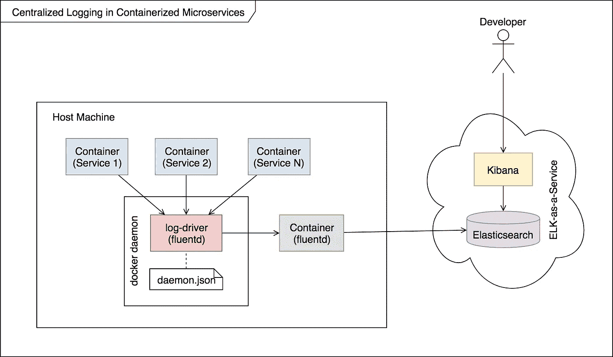

# 使用集中式日志架构监控容器化的微服务。

> 原文：<https://medium.com/hackernoon/monitoring-containerized-microservices-with-a-centralized-logging-architecture-ba6771c1971a>

## 【Horus 项目案例研究

Situation Room, 51 Pegasi System — Illustration by yours truly

让小型的专业化服务协同工作来实现业务目标，要比让一个庞大的整体服务做所有的事情要好。这就是[微服务](https://hackernoon.com/tagged/microservices) [架构](https://hackernoon.com/tagged/architecture)的核心前提。

然而，监控微服务很快成为大规模的挑战…相比之下，你只需查看一个地方。

本文介绍了一种管理日志的架构，它实现了整体的简单性，而没有牺牲微服务的健壮性。

> 您可以在我的 [Project Horus](https://github.com/eyeezzi/horus) 资源库中找到这里讨论的概念的实际实现。哦，在上面的插图中有一个隐藏的信息，看看你是否能找到它，否则继续阅读直到结束。

# 为什么要集中日志？

假设您有一个由授权、产品目录和计费等一系列微服务支持的电子商务系统。现在假设一个顾客的结账过程失败了，你会如何确定原因？您可以检查每个微服务的日志，并最终找到有问题的那个。然而，这并不能超越一些服务。

更实际的方法是将每个微服务的日志收集到一个可搜索的中央数据库中。这样，当有东西坏了，你很容易就有了完整的故事，从而减少了你的*平均修复时间(MTTR)* 。

# 作为连接容器的微服务

虽然*微服务*只是一个架构模式，但是今天这个术语几乎是容器的同义词。尽管人们在容器出名之前很久就已经在构建微服务系统，但是这些系统很难部署……这就是像 Docker 这样的容器平台的用武之地。

本文的其余部分将重点关注用 Docker 容器实现的微服务的一个具体例子。然而，核心知识适用于像 Kubernetes 和 Mesos 这样的替代平台。

让我们开始吧。

# 日志收集的艺术

从最基本的意义上来说，当代码中的某个点发生动作时，您会记录一条消息，通常使用像 Javascript 的 *Bunyan* 这样的日志库。该库被配置为将日志发送到您想要的任何目的地，如 *stdout* ，本地文件，或日志聚合服务，如 *Splunk* 。

每种设置都有其优点和缺点，对每种设置的广泛讨论可能会使本文太长。因此，让我们回顾一下将构成我们架构基础的一些最佳实践。

*   日志是持续流动的事件流。文件本质上是静态对象。所以在文件中存储日志是抽象的不匹配。这种不匹配表现为解析日志文件以生成有用的见解以及处理文件大小和循环策略的额外复杂性。
*   微服务不需要知道它的日志去了哪里。执行环境应该处理这个问题。这样，您可以更改日志的目的地，而无需修改每个微服务！*【提示:您的微服务应该记录到 stdout 或 stderr】*
*   日志应该是即插即用的。开发人员应该能够用他们想要的任何语言或框架创建一个微服务，然后将它放入环境中，并让日志记录工作，而不需要修改任何配置。

现在让我们来看一个实现这些目标的架构。

# 专用日志传送程序体系结构

Dedicated log shipper architecture — Uzziah Eyee

上图中发生了很多事情，所以让我们自上而下地处理它。

# 概念地

我们有几个微服务，每个都在一个容器中运行。每个服务的日志被转发到一个日志驱动程序，该驱动程序最终将它们发送到一个专用的日志传送容器。发货人可以在将日志保存在存储中之前对其进行操作。最后，开发人员可以查询这个数据存储库来可视化和分析日志。这是主要的要点。

尽管如此，我还是在这里挥舞着一堆东西:容器如何“知道”将日志发送给日志驱动程序。事实上，什么是日志驱动程序？此外，我们是否违反了上述最佳实践之一——微服务不应该知道其日志的去向？为什么我们要使用专用的日志运输容器？什么是 Fluentd，Elasticsearch，和 Kibana？

让我们来回答这些问题。

# Docker 中日志记录的工作原理

*   当 docker 守护进程运行一个容器时，它会将该容器中的每个事件流发送到一个日志驱动程序。默认情况下，它使用在 *daemon.json* 文件中指定的驱动程序。但是，您可以在启动期间为每个容器指定不同的驱动程序。
*   在接收到日志流时，日志驱动程序可以做它想做的任何事情。例如，默认的日志驱动程序 *json-file* 将来自每个容器的日志保存到主机上的一个文件中。
*   守护进程附带了一些日志驱动程序，但是你可以使用插件来添加更多。你可以用命令`docker info`看到激活的日志驱动和安装的插件，然后搜索“日志驱动”和“插件”。

啊哈！现在您明白了为什么微服务记录到 stdout 是最佳实践。这使得它们非常易于移植，因为我们将日志路由的责任委托给了环境，即 docker 守护进程和日志驱动程序。

# 把所有的放在一起

*   docker 守护进程将事件流从每个容器发送到 fluentd log-driver，这是预安装的日志插件之一。
*   fluentd 日志驱动程序被配置为将日志发送到专用日志传送容器正在侦听的 UDP/TCP 地址。
*   收到日志后，shipper——一个运行 fluentd 应用程序的容器——解析、聚合并发送日志到作为服务托管的 Elasticsearch 集群。fluentd 的一些替代方法是 Logstash 和 Filebeat。
*   Elasticsearch 对日志进行索引。
*   然后，开发人员使用 Kibana 查询 Elasticsearch，并根据日志数据创建很酷的可视化效果。我们希望这些可视化能够为问题的预防和解决提供快速的见解。

这里需要注意的关键点是，我们将日志视为一个流，将它引导到最终的持久性存储，而不是间歇性地存储在文件中。

我们使用一个专用的日志传送容器，这样我们就可以集中业务逻辑，比如混淆*个人身份信息(PII)* 或者改变日志格式。这种逻辑需要一个单一的真理来源。此外，将所有东西都容器化可以避免在主机上安装日志传送代理。

最后，我们将日志存储在 Elasticsearch 中，而不是常规文件或数据库中，因为 Elasticsearch 是一个搜索引擎，旨在索引和有效检索大型文档集合。Kibana 是弹性搜索的前端。它可以用于根据 ES 的查询结果创建图表和仪表板。

# 我们找到了

我们已经研究了在容器化环境中深入了解微服务操作的问题。然后，我们继续评估一些日志策略和一些最佳实践。最后，我们通过查看一个解决大多数问题的实际实现，将所有这些结合在一起。

感谢您阅读到目前为止，我希望这对您的下一个微服务项目有所帮助。如果你认为我错过了什么，请在评论中告诉我。

> 哦，关于在特色插图中寻找隐藏信息的挑战。图为 51 Pegasi 系统态势室中的“观察者”。**连接的微服务其实是从左到右组成天秤座和处女座的星星**。这些是九月的黄道十二宫——这篇文章发表的月份。