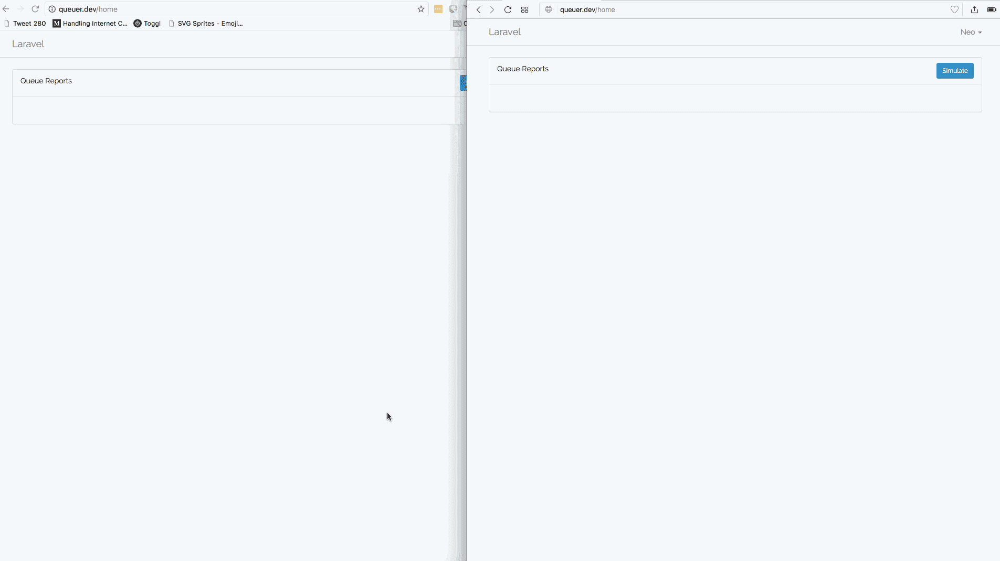

# 实时监控 Laravel 的后台队列

> 原文：<https://medium.com/hackernoon/monitoring-laravels-background-queues-in-realtime-629cf3fac5c5>

> 你需要在你的机器上安装 PHP 7 或更高版本，Laravel CLI，Composer，Node 和 npm。你应该对 PHP 和 Laravel 有所了解。

当构建大型应用程序时，使其具有可伸缩性通常是一个关注点。像页面加载需要多长时间这样的统计数据通常非常重要。因此，像处理大型图像、发送电子邮件和短信这样的事情可以推到后台队列中，稍后再处理。

但是，因为队列在后台工作，所以它们有时会失败。然后，可能有必要能够监控后台队列。

在本文中，我们将考虑实时监控 Laravel 后台队列的方法。我们将假设我们创建了一个发送电子邮件的应用程序。电子邮件将在后台排队，稍后发送。然后，我们将有一个报告页面，显示已发送和未发送的电子邮件。

这是我们将要构建的内容的屏幕记录:



# 教程要求

为了完成本教程，我们需要以下东西:

*   PHP 7.0+安装在你的机器上。
*   安装在您机器上的 Laravel CLI 。
*   [Composer](https://getcomposer.org/doc/00-intro.md#installation-linux-unix-osx) 安装在您的机器上。
*   PHP 和 Laravel 的知识。
*   [Node.js 和 NPM](https://docs.npmjs.com/getting-started/installing-node) 安装在你的机器上。
*   Vue.js 和 JavaScript 的基础知识。
*   推送应用程序。在这里创建一个。
*   一个邮件陷阱帐户来测试发送的电子邮件。在这里创建一个。

一旦你准备好了这些需求，让我们开始吧。

# 设置您的 Laravel 应用程序

打开终端并运行下面的命令来创建一个 Laravel 应用程序:

```
$ laravel new app_name
```

# 设置数据库连接和迁移

安装完成后，我们可以继续设置数据库。打开`.env`文件并替换以下配置:

```
DB_CONNECTION=mysql
    DB_HOST=127.0.0.1
    DB_PORT=3306
    DB_DATABASE=homestead
    DB_USERNAME=homestead
    DB_PASSWORD=secret
```

使用:

```
DB_CONNECTION=sqlite
```

这将把 SQLite 设置为我们的默认数据库连接(您可以使用 MySQL 或任何其他您想要的数据库连接)。

在终端`cd`到你的项目的根目录。运行以下命令创建 SQLite 数据库文件:

```
$ touch database/database.sqlite
```

上面的命令将创建一个空文件，供 SQLite 使用。运行以下命令创建迁移:

```
$ php artisan make:migration create_queued_emails_table
```

打开上面的命令刚刚创建的迁移文件，用下面的代码替换`up`方法:

```
public function up()
    {
        Schema::create('queued_emails', function (Blueprint $table) {
            $table->increments('id');
            $table->string('email');
            $table->string('description');
            $table->boolean('run')->default(false);
            $table->timestamps();
        });
    }
```

现在运行下面的命令来迁移我们的数据库:

```
$ php artisan migrate
```

# 为电子邮件测试设置邮件陷阱

打开您的`.env`文件，并输入您从邮件陷阱仪表板获得的密钥。下面列出了相关的键:

```
MAIL_DRIVER=smtp
    MAIL_HOST=smtp.mailtrap.io
    MAIL_PORT=2525
    MAIL_USERNAME=null
    MAIL_PASSWORD=null
    MAIL_ENCRYPTION=null
    MAIL_FROM="john@doe.com"
    MAIL_NAME="John Doe"
```

现在，当电子邮件被发送时，电子邮件将在邮件陷阱收件箱中可见。

# 设置身份验证

我们需要做的下一件事是设置身份验证。打开您的终端，输入以下命令:

```
$ php artisan make:auth
```

这将生成一个认证框架。这就是关于身份验证您需要做的全部工作。

# 配置推动器

将`.env`文件中的`PUSHER_*`键替换为您从推钢机仪表板上获得的正确键:

```
PUSHER_APP_ID="PUSHER_APP_ID"
    PUSHER_APP_KEY="PUSHER_APP_KEY"
    PUSHER_APP_SECRET="PUSHER_APP_SECRET"
```

打开终端，输入下面的命令来安装 Pusher PHP SDK:

```
$ composer require pusher/pusher-php-server "~3.0"
```

安装完成后，打开`config/broadcasting.php`文件并滚动到`pusher`部分。用以下内容替换`options`键:

```
'options' => [
        'encrypt' => true,
        'cluster' => 'PUSHER_APP_CLUSTER'
    ],
```

# 配置其他杂项

打开`.env`文件，将`BROADCAST_DRIVER`改为`pusher`，将`QUEUE_DRIVER`改为`database`。为了确保我们有使用`database`作为我们的`QUEUE_DRIVER`所必需的表，运行下面的命令来生成数据库迁移:

```
$ php artisan queue:table
```

然后运行 migrate 命令来迁移数据库:

```
$ php artisan migrate
```

这将创建将我们的数据库用作队列驱动程序所需的数据库表。

> *💡* ***在生产环境中，最好使用 Redis 或 Memcached 这样的内存存储作为队列驱动。内存存储比使用关系数据库更快，因此性能更好。***

# 构建我们应用程序的后端

现在让我们创建应用程序的后端。在您的终端中运行以下命令:

```
$ php artisan make:model QueuedEmails
```

这将在`app`目录中创建一个新模型。打开文件并用以下内容替换其内容:

```
<?php namespace App; use Illuminate\Database\Eloquent\Model; class QueuedEmails extends Model
    {
        protected $fillable = ['description', 'run', 'email'];
        protected $casts = ['run' => "boolean"];
    }
```

在上面的代码中，我们定义了类的`fillable`属性。这将防止在我们尝试向数据库创建新条目时出现批量分配异常错误。我们还指定了一个`casts`属性，它将指示 concertive 将属性类型化为数据类型。

接下来，打开`HomeController`并使用以下代码替换内容:

```
<?php
    namespace App\Http\Controllers; use Mail;
    use App\QueuedEmails;
    use App\Mail\SimulateMail;
    use Faker\Factory as Faker; class HomeController extends Controller
    {
        /**
         * Create a new controller instance.
         *
         * @return void
         */
        public function __construct()
        {
            $this->middleware('auth'); $this->faker = Faker::create();
        } /**
         * Show the application dashboard.
         *
         * @return \Illuminate\Http\Response
         */
        public function index()
        {
            return view('home', ['jobs' => $this->jobs()]);
        } /**
         * Return all the jobs.
         *
         * @return array
         */
        public function jobs()
        {
            return QueuedEmails::orderBy('created_at', 'DESC')->get()->toArray();
        } /**
         * Simulate sending the email.
         *
         * @return mixed
         */
        public function simulate()
        {
            $email = $this->faker->email; Mail::to($email)->send(
                new SimulateMail([
                    "email" => $email,
                    "description" => $this->faker->sentence()
                ])
            ); return redirect()->route('home');
        }
    }
```

在上面的控制器中，我们有 4 个方法，大部分都是不言自明的。在这个类中，我们使用了 [Faker 库](https://github.com/fzaninotto/Faker)，它帮助我们生成随机的假值。在`simulate`方法中，我们使用 faker 库来生成一个假的电子邮件地址和描述。我们实例化一个`SimulateMail`T21。

打开终端，输入以下命令:

```
$ php artisan make:mail SimulateMail
```

打开`SimulateMail`类，输入下面的代码:

```
<?php
    namespace App\Mail; use App\QueuedEmails;
    use Illuminate\Bus\Queueable;
    use Illuminate\Mail\Mailable;
    use Illuminate\Queue\SerializesModels;
    use App\Events\{EmailQueued, EmailSent};
    use Illuminate\Contracts\Queue\ShouldQueue;
    use Illuminate\Contracts\Queue\Factory as Queue;
    use Illuminate\Contracts\Mail\Mailer as MailerContract; class SimulateMail extends Mailable implements ShouldQueue
    {
        use Queueable, SerializesModels; protected $mail; /**
         * Create a new message instance.
         *
         * @return void
         */
        public function __construct(array $mail)
        {
            $this->mail = QueuedEmails::create($mail);
        } /**
         * Build the message.
         *
         * @return $this
         */
        public function build()
        {
            return $this->subject("Queuer: Welcome to queuer")->view('email.welcome');
        } /**
         * Send the mail
         */
        public function send(MailerContract $mailer)
        {
            $this->mail->update(['run' => true]); event(new EmailSent($this->mail)); parent::send($mailer);
        } /**
         * Queue the email
         */
        public function queue(Queue $queue)
        {
            event(new EmailQueued($this->mail)); return parent::queue($queue);
        }
    }
```

> *💡* ***通过实现*** `***ShouldQueue***` ***接口，我们告诉 Laravel，邮件应该排队，而不是立即发送。***

在上面的类中，我们有一个构造函数在`queued_emails`表中创建了一个新条目。在`build`方法中，我们构建将要发送的邮件消息。

在`send`方法中，我们将`queued_emails`条目的`run`列标记为`true`。我们还触发了一个名为`EmailSent`的事件。在`queue`方法中，我们还触发了一个名为`EmailQueued`的事件。

让我们创建在上述方法中触发的事件。在您的终端中运行以下命令:

```
$ php artisan make:event EmailSent
    $ php artisan make:event EmailQueued
```

在`EmailSent`事件类中，粘贴以下代码:

```
<?php
    namespace App\Events; use App\QueuedEmails;
    use Illuminate\Broadcasting\Channel;
    use Illuminate\Queue\SerializesModels;
    use Illuminate\Foundation\Events\Dispatchable;
    use Illuminate\Broadcasting\InteractsWithSockets;
    use Illuminate\Contracts\Broadcasting\ShouldBroadcast; class EmailSent implements ShouldBroadcast
    {
        use Dispatchable, InteractsWithSockets, SerializesModels; public $mail; public function __construct($mail)
        {
            $this->mail = $mail;
        } public function broadcastOn()
        {
            return new Channel('email-queue');
        } public function broadcastAs()
        {
            return 'sent';
        }
    }
```

在上面的代码中，我们只是使用 Laravel 中的[广播](https://laravel.com/docs/5.5/broadcasting#defining-broadcast-events)向 Pusher 发送一些数据。

打开`EmailQueued`事件类并粘贴以下代码:

```
<?php namespace App\Events; use App\QueuedEmails;
    use Illuminate\Broadcasting\Channel;
    use Illuminate\Queue\SerializesModels;
    use Illuminate\Foundation\Events\Dispatchable;
    use Illuminate\Broadcasting\InteractsWithSockets;
    use Illuminate\Contracts\Broadcasting\ShouldBroadcast; class EmailQueued implements ShouldBroadcast
    {
        use Dispatchable, InteractsWithSockets, SerializesModels; public $mail; public function __construct($mail)
        {
            $this->mail = $mail;
        } public function broadcastOn()
        {
            return new Channel('email-queue');
        } public function broadcastAs()
        {
            return 'add';
        }
    }
```

这个类和`EmailSent`事件类几乎一样。略微不同的是`broadcastAs`方法。它返回一个不同的别名来广播事件。

最后，打开路由文件`routes/web.php`并用以下代码替换:

```
Auth::routes();
    Route::name('jobs')->get('/jobs', 'HomeController@jobs');
    Route::name('simulate')->get('/simulate', 'HomeController@simulate');
    Route::name('home')->get('/home', 'HomeController@index');
    Route::view('/', 'welcome');
```

太好了！现在让我们转到应用程序的前端。

# 构建我们应用程序的前端

既然我们已经设置了大部分后端，我们将创建应用程序的前端。打开`resources/views/home.blade.php`文件，将代码替换为以下内容:

```
@extends('layouts.app') @section('content')
    <div class="container">
        <div class="row">
            <div class="col-md-12">
                <div class="panel panel-default">
                    <div class="panel-heading clearfix">
                        <span class="pull-left">Queue Reports</span>
                        <a href="{{ route('simulate') }}" class="btn btn-sm btn-primary pull-right">Simulate</a>
                    </div>
                    <div class="panel-body">
                        <jobs :jobs='@json($jobs)'></jobs></jobs>
                    </div>
                </div>
            </div>
        </div>
    </div>
    @endsection
```

上面代码中值得注意的一点是`jobs`标签。这是对我们接下来将创建的 Vue 组件的引用。我们还有一个“模拟”按钮，可以引导到一条`/simulate`路线。此路由模拟对要发送的电子邮件进行排队。

打开您的终端，键入以下命令:

```
$ npm install --save laravel-echo pusher-js
```

这将安装 [Laravel Echo](https://laravel.com/docs/5.5/broadcasting#installing-laravel-echo) 和 [Pusher JS SDK](https://github.com/pusher/pusher-js) 。安装完成后，运行以下命令安装其他 NPM 依赖项:

```
$ npm install
```

# 构建我们的 Vue 组件

让我们构建前面提到的`jobs` Vue 组件。打开`resources/assets/js/app.js`文件，替换下面的代码:

```
Vue.component('example', require('./components/ExampleComponent.vue'));
```

使用:

```
Vue.component('jobs', require('./components/JobsComponent.vue'));
```

现在在`resources/assets/js/components/`目录下创建一个新的`JobsComponent.vue`文件。在文件中，粘贴以下代码:

```
<template>
        <table class="table">
            <tbody>
                <tr v-for="(job, index) in allJobs" :key="index" v-bind:class="{success: job.run, danger: !job.run}">
                    <td width="80%">{{ job.description }}</td>
                    <td>{{ job.created_at }}</td>
                </tr>
            </tbody>
        </table>
    </template> <script>
    export default {
        props: ['jobs'],
        data() {
            return {allJobs: this.jobs}
        },
        created() {
            let vm = this
            vm.refreshAllJobs = (e) => axios.get('/jobs').then((e) => (vm.allJobs = e.data))
            Echo.channel('email-queue')
                .listen('.add', (e)  => vm.refreshAllJobs(e))
                .listen('.sent', (e) => vm.refreshAllJobs(e))
        }
    }
    </script>
```

在上面的 Vue 组件中，我们定义了一个`template`。在那里，我们遍历`jobs`数组，列出每个作业的描述和时间戳。

在 Vue 组件`script`的`created`方法中，我们有一个`refreshAllJobs`函数，它使用 [Axios](https://github.com/axios/axios) (一个默认内置 Laravel 的 HTTP 请求库)向`/jobs`路由发出请求。然后，我们将响应分配给`allJobs`属性。

同样的方法，我们使用 [Laravel Echo](https://laravel.com/docs/5.5/broadcasting#installing-laravel-echo) 监听 Pusher 通道并等待事件被触发。每当事件`.add`和`.sent`被触发时，我们调用`refreshAllJobs`方法。

> *💡* ***事件名称前面有一个点是因为，在 Laravel 中，每当你使用*** `***broadcastAs***` ***方法定义一个别名时你都需要加上这个点。如果没有点，你的事件将不会被听众捕捉到。如果不提供别名，Laravel 将使用 namespace + class 作为广播事件的名称。***

打开`resources/assets/js/bootstrap.js`文件。在文件底部，添加以下代码:

```
import Echo from 'laravel-echo' window.Pusher = require('pusher-js'); window.Echo = new Echo({
        broadcaster: 'pusher',
        key: 'PUSHER_APP_KEY',
        encrypt: true,
        cluster: 'PUSHER_APP_CLUSTER'
    });
```

> *⚠️* ***确保用您的 Pusher 应用密钥和集群替换*** `***PUSHER_APP_KEY***` ***和*** `***PUSHER_APP_CLUSTER***` ***。***

最后，运行下面的命令来构建您的资产:

```
$ npm run dev
```

# 测试我们的应用

构建完成后，如果还没有启动 PHP 服务器，请通过运行以下命令启动它:

```
$ php artisan serve
```

这将创建一个 PHP 服务器，这样我们就可以预览我们的应用程序。终端上会提供 URL，但默认为 [http://127.0.0.1:8000](http://127.0.0.1:8000) 。

当您看到 Laravel 主页时，使用页面右上角的“注册”链接创建一个新帐户。现在，单击“模拟”按钮，您应该会看到一个新的排队电子邮件条目。

现在，我们将使用`queue:listen` artisan 命令手动执行队列中的流程。打开新的终端窗口并运行以下命令:

```
$ php artisan queue:listen
```

这应该开始执行它看到的任何队列。只要终端是打开的并且`queue:listen`命令正在运行，当你点击“模拟”按钮时，队列将立即运行。如果您取消了`queue:listen`命令，队列条目将保留在那里，不会被触发。

> *💡* ***在生产环境中，您无法保持*** `***queue:listen***` ***运行，您可能需要一个工作进程在后台运行；类似*** [***的东西主管***](http://supervisord.org/index.html) ***。你可以在*** ***这里阅读更多关于你如何做的*** [***。***](https://laravel.com/docs/5.5/queues#running-the-queue-worker)

# 结论

在本文中，我们已经能够使用 Pusher 和 Vue 创建一个实时的 Laravel 队列监视器。拥有可以跟踪和量化的队列会很有用。希望你从这篇文章中有所收获。如果你有任何问题或反馈，欢迎在评论区提问。

源代码可以在 [GitHub](https://github.com/neoighodaro/monitoring-laravel-queues) 上获得。

这篇文章最初发表在 [Pusher 上。](https://pusher.com/tutorials/monitoring-laravel-background-queues)