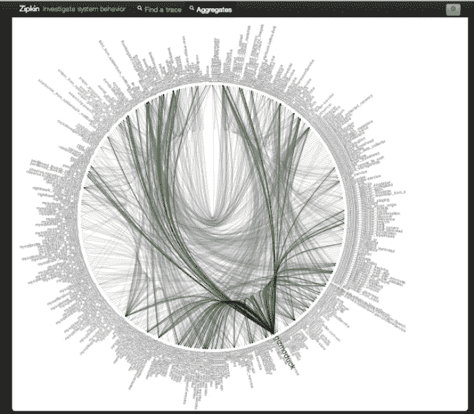

# 监控与观察

> 原文：<https://medium.com/hackernoon/monitoring-vs-observability-25ab98179814>

随着无服务器的流行，关于可观察性或缺乏可观察性(在无服务器空间内)已经有了大量的争论，并且更多的时候，无服务器的粉丝(一群高智商的个人，我很自豪是其中的一员)对任何事情都有相同的答案:做这个或那个的第三方监控工具。但是你必须明白，你不能通过在这种情况下抛出图表和警报来修补可观察性限制。

> 监控和可观察性完全是两回事。

请允许我用一个我们都太熟悉的服务来解释一下，Twitter。正如你可能想象的那样，像 Twitter 这样的产品有许多活动部件，当一些部件发生故障时，很难理解为什么或什么导致了所述问题。想象一下，有 3.5 亿活跃用户通过你的系统相互交流，发微博，点赞，发微博，转发，以及你在这个平台上可以做的任何事情。这需要跟踪很多信息，如果你曾经在这种规模的平台上工作过，你可以想象要找出为什么一条推文没有被发布或者一条消息需要太长时间才能被传递需要付出多大的努力。在他们从单一应用程序切换到分布式系统之前，有时找出某些东西不工作的原因就像打开一个错误日志文件并查看哪里出错一样简单。

当您有数百甚至数千个彼此异步通信的小服务时，说调试像 tweet 不触发这样简单的事情会很困难完全是轻描淡写。他们在 2013 年发布了一个非常酷的关于他们迁移到微服务的帖子。在这里看帖子[。](https://blog.twitter.com/engineering/en_us/a/2013/observability-at-twitter.html)

一张展示 Twitter 微服务的图表

所以回到我的观点。[Sc hwartz](https://twitter.com/xaprb)男爵说得好。

> *“监控告诉你系统是否工作。“可观察性让你问为什么它不起作用。”*

监控应用程序将获得有关您的系统的信息，并在出现故障时让您知道，而可观察性是您正在使用的应用程序或技术的一种质量，它提供了一种简单的方法来查看故障的内容和位置。

# 我们知道可观察性不是监控。那是什么？

正如工程经理@Twitter 所说，可观察性是一个系统属性，由四个支柱组成:

*   监视
*   警报/可视化
*   分布式系统跟踪基础设施
*   日志聚合/分析

对于分布式系统(读微服务)，尤其是在大规模的情况下，拥有对平台的可观察性不仅仅是必要的，这是一个不能通过仅使用警报或仅查看日志来规避的要求。你需要一个提供微观可见性的环境，以便获得正确的信息来采取行动。

继续使用我们的 Twitter 例子，他们的可观测性系统非常庞大，花了数年时间才发展成今天这样运转良好的机器。

> *“我们的时序指标摄取服务每分钟处理超过 28 亿个写请求，存储 4.5 的时序数据，每分钟处理 25，000 个查询请求”——*Antony Asta 在 2016 年出版的两部分中介绍了他们的可观测性系统的范围，其中包括架构、指标摄取、时序数据库和索引服务。检查零件[一个](https://blog.twitter.com/engineering/en_us/a/2016/observability-at-twitter-technical-overview-part-i.html)和零件[两个](https://blog.twitter.com/engineering/en_us/a/2016/observability-at-twitter-technical-overview-part-ii.html)。

这是我的两点看法，通过将监控和警报结合在一起，您可以在应用程序中获得可观察性，同时拥有一个清晰的调试解决方案，为您的数据提供清晰度。错过其中的一个方面会让你处于非常不利的地位，你会追着自己的尾巴试图找出你的应用程序出了什么问题。仅仅在某件事情发生时得到通知是不够的，知道某件事情即将发生也是不够的。您必须能够在您的平台内有效地查明问题。

# 结论

我想用一句简单的话来结束我的讲话，这句话反映了我对整个问题的看法。在无服务器空间中的可观察性是不可协商的。你必须拥有它，它不是一个可量化的属性，这意味着你不能有一点点可观察性或太多可观察性。你要么做，要么不做。

*原载于 2018 年 8 月 28 日*[*dash bird . io*](https://dashbird.io/blog/observablity-serverless/)*。*