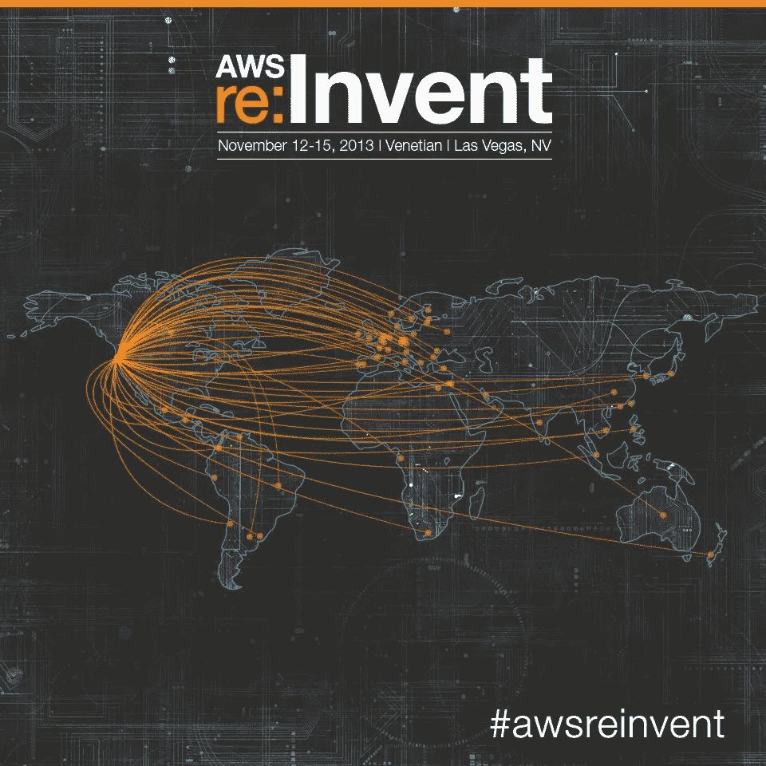
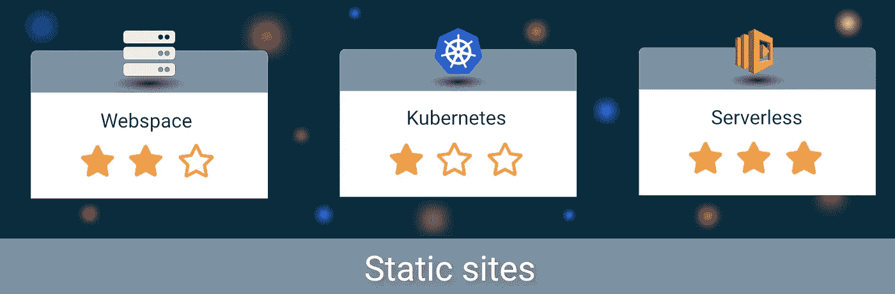
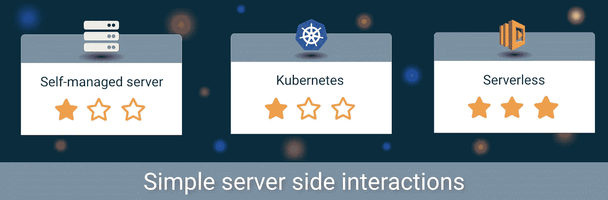
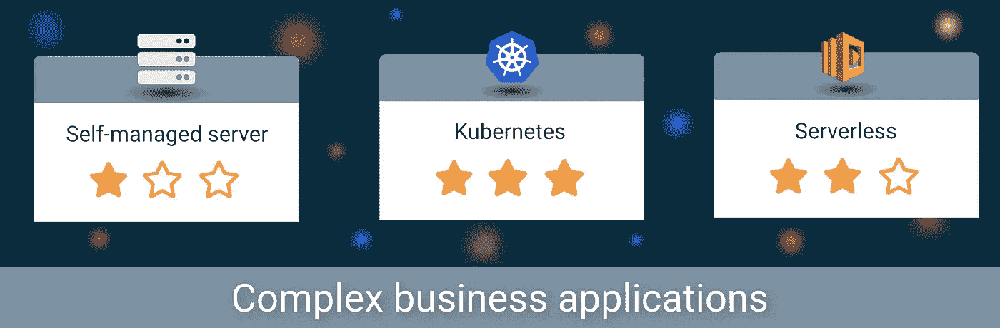
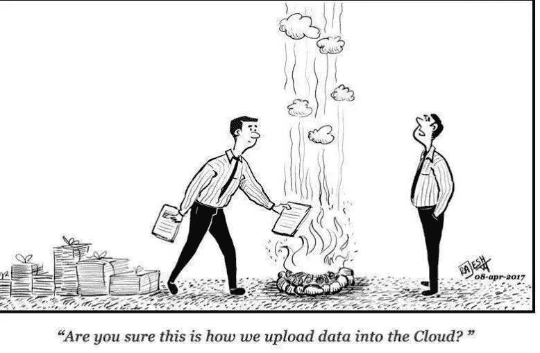

# 单体、容器还是无服务器:路在何方？

> 原文：<https://medium.com/hackernoon/monoliths-containers-or-serverless-what-is-the-way-to-go-a7b72d3a1128>

如果我问技术人员关于云的问题，我会意识到不再有炒作了。自 2006 年以来，亚马逊称为 AWS 的云允许人们通过使用简单的用户界面或基础设施代码[【1】](https://aws.amazon.com/de/blogs/aws/eight-years-and-counting-of-cloud-computing/)来管理他们的虚拟基础设施。

11 年后，AWS 将其产品扩展到 100 多种服务。有动态存储、托管数据库、图像和视频识别、机器学习、容器供应等服务。这是与开源竞争的最令人兴奋和恐惧的驱动。

在 90 年代，开源软件是一个不寻常的出现。自 2000 年以来，越来越多成熟的开源项目被创建，并在 2017 年得到广泛应用。

如今，似乎[无服务器](https://hackernoon.com/tagged/serverless)是创建现代应用程序的崭新方式。它们在很短的时间内从每秒零个请求扩展到每秒数千个请求。此外，我不参与更新服务器、设置集群等操作。

无服务器领域的创新步伐似乎越来越快。《重塑 2017》太棒了。

他们在无服务器链上增加了很多东西[【4】](https://aws.amazon.com/de/blogs/compute/serverless-reinvent-2017/)，比如:

*   基于容器的无服务器产品，
*   **Cloud9** 一个在线 IDE，用于创建和测试无服务器应用程序
*   **Lambda 的流量转移**允许逐步进行首次展示更新。

2014 年 AWS 发明了 Lambda。对我来说，这是一个有问题的概念。大多数用于经典开发的工具并不适合 lambda。此外，还有基于微服务的应用程序，它们使用 docker 和 Kubernetes 来简化操作。

很难定义什么时候先使用 monolith[【3】](https://martinfowler.com/bliki/MonolithFirst.html)，面向服务还是无服务器的方法。由于 AWS 围绕 lambda 添加了如此多的服务，我可以拥有类似的自动化和工具链来提高软件开发速度和质量。

让我们看看存在什么样的场景，并比较基本的解决方案。

# 比较

在接下来的章节中，我将讨论不同类型应用程序的可行解决方案。但我先讲一些基本概念:

## 单片应用

最常用的方法是将所有内容放在一个应用程序中。也许他们的前端和后端是分开的。独石是越来越多的大型应用。通常它们很难维护和扩展。

在下面的场景中，我将很少提到[单片](https://hackernoon.com/tagged/monolithic)应用程序。更多的时候，我会谈到网络空间，静态网站和自我管理的服务器设置，大部分时间是主机单片。

## 容器

最受欢迎的容器引擎是 [docker](https://www.docker.com/what-docker) 。这些方便的独立包可以通过容器编排软件如 [Kubernetes](https://kubernetes.io/docs/concepts/overview/what-is-kubernetes/) (k8s)进行缩放、回滚和分发。抽象允许概括操作需求，这大大简化了操作。我只需要把我的软件打包在一个容器里。举例来说，这允许我在高负载的情况下添加更多的实例，并在多台机器之间分发容器。

建立 Kubernetes 集群非常复杂。但也有管理解决方案，如谷歌的容器引擎(GCE)或 AWS 为 Kubernetes (EKS)提供的弹性容器服务。

我将主要讨论 Kubernetes，但是提到的大多数内容也适用于其他编排解决方案。

## 无服务器

完全托管的系统是无服务器的。它实际上意味着业务逻辑在小函数中运行。通过将代码上传给提供商，开发人员无需担心更新、正常运行时间、可伸缩性等问题。

在我的例子中，我大部分时间都会谈到 AWS 的 Lambda。还有其他表现非常相似的解决方案，我不想偏向任何一个解决方案。备选有 Google，Azure，IBM 函数。

# 宿主静态网站

JavaScript 使开发者能够托管实际上是静态的动态网站。我只需要使用 React 或 Angular 这样的框架，并利用它们的工具。通过执行一个命令，所有需要的文件都会生成，可以上传并在浏览器中打开。

一个简单的解决方案是为静态 html 站点购买网络空间。但是缺点是可伸缩性和灵活性。如果我有一个高负载，例如由于一个社交媒体帖子，或者我想添加一个简单的服务器端脚本，我就有点卡住了。

在这种情况下，AWS 是一个很好的选择。通过上传我的静态文件到 S3 桶，我得到了我需要的。成本大约是几美分，因为我是按带宽付费的。尽管如此，应用程序还是被高速缓存了。最重要的是，我可以很容易地获得免费的 SSL 证书，以使用安全和快速的连接。此外，证书会自动更新。一切都是可扩展的，如果我需要一些动态执行，我可以利用其他 AWS 服务。

我想我不需要解释为什么基于容器或基于裸机的解决方案绝对是大材小用。

**Winner: AWS with S3 and CloudFront.**

# 具有简单服务器端交互的主机站点

许多网站都有动态部分，如:

*   联系方式，
*   谷歌验证码或
*   可以更改的元素，如备忘录、待办事项或类似的应用程序。

## 网络空间和自我管理的服务器

类似于一个简单的 HTML 网络空间提供商，我也可以购买 PHP 或其他语言的网络空间。我将最终需要我的运行时或未安装的扩展的特殊版本更新。随着时间的推移，虚拟服务器可能是最合适的。不管怎么说，这个解决方案很便宜，但是随着我的负载越来越贵。没有什么比得上自动缩放。此外，我需要管理我的虚拟服务器。安装新的更新、增加安全性和监控非常具有挑战性。

## 库伯内特斯

这是我第一次想到基于 Kubernetes 的解决方案。我们将创建两个小型服务:

*   一个用于静态部分
*   一个是动态部分。

一旦出现更多的需求，我们可以扩展现有的服务或者添加另一个服务。

自动扩展和无停机部署是免费的。我需要为每个服务设置自动构建。这是一项具有挑战性的任务。我需要

*   构建应用程序，
*   包装码头集装箱和
*   将它们部署到生产中。

这是最大的缺点。与我本地开发系统实际需要的相比，为 Kubernetes 准备东西感觉很重。但是如果我有一个服务的良好基础，添加另一个服务就不会那么难了。

## 无服务器

在 AWS 中，我将使用与静态情况类似的方法。我仍然会在一个公共的 S3 桶中托管静态站点。一旦动态内容增加，我们可以添加一个 Lambda 函数。尤其是简单的场景，比如简单的 CRUD 用例或者 google captcha 的验证是很容易的。通过添加 API Gateway、Lambda 和 DynamoDB，我们拥有了一个可扩展的系统。成本仍然很低，如果我保持小逻辑，就没有什么可维护的了。

## 结论

K8s 和 serverless 比较起来好像差不多。但是定价和配置差别很大。鉴于我不知道任何工具，从头开始设置 AWS 托管服务仍然更容易，因为一切都以一种很好的方式集成。相比之下，如果我试图在 Kubernetes 中构建自定义容器并建立自己的 git 存储库 GitLab、GitLab-CI，我需要做一些调整。

此外，我需要大量的 k8s 资源。因此，与无服务器解决方案相比，成本更高。例如，我需要 k8s 本身的一些资源，我将运行类似 Jenkins / GitLab-CI 和我的服务。这将花费每月大约 40 美元。最大的一部分来自我的 CI 基础架构。此外，我需要手动更新我的图像。否则，他们会在一个糟糕的时刻堕落和崩溃。AWS 的成本取决于我使用东西的频率，因为执行我的构建管道只需要几分钱。

无论如何，无服务器仍然更容易建立，维护成本较低。

**Winner: AWS with S3, Cloudfront, lambda, DynamoDB**

# 运行复杂的业务应用程序

许多应用程序要么从一开始就很复杂，要么随着时间的推移会变得越来越复杂。我将电子商务商店定义为一个复杂的例子。有不同的领域。支付、产品列表或运输等领域是以某种方式相互交互的领域。

与多个开发人员一起很好地处理复杂的应用程序是一个企业长期成功的关键。否则应用就会腐烂，变成一团大泥[【5】](https://en.wikipedia.org/wiki/Big_ball_of_mud)。如果是这样，我迟早会开始重构或重写我的应用程序。通常，这种情况会随着时间的推移而发生。问题是它退化的速度有多快，有多少发育良好的部分可以重复使用。

我认为我们可以跳过简单的网络空间解决方案策略。我需要一个结构良好的持续集成平台和一套全面的测试。它们会变得很慢，我需要经常优化它们/提升资源。

## 自我管理的服务器

如果我有简单的服务器，我需要为自己维护一切。我完全控制我的测试、集成和生产系统。多台机器需要有相似的设置。我将使用工具来自动管理和配置机器。此外，开发人员为他们自制的工作基础设施感到自豪，我可以处理繁忙的高峰，这也意味着服务器大部分时间处于空闲状态。

无论如何，开发团队需要大量的时间来保持运行和修复现有的问题。在这种情况下，运营始终是一个瓶颈，因为最重要的是创造商业价值。大约 15%的工作需要完成，与监控和调整生产系统有关。像 canary releases 这样的高级技术很难实现，因为没有足够的时间。

另一个缺点是，在测试和生产系统上运行另一个应用程序似乎很有挑战性。添加新服务非常困难，因为运营工作量很大。

## 库伯内特斯

此外，我可以使用类似 Kubernetes 的容器编排软件。这大大简化了操作要求。我有许多现成的有用的东西，比如滚动更新、回滚和自动缩放。开发人员可以轻松地构建应用程序原型，并将其投入生产。

如果我遵循一定的规则，日志记录和相关的指标也可以工作。docker 容器的不同技术需要一个集成策略。但总的来说，Kafka 或 HTTP 是一个被广泛支持的工具/协议。

我在自我管理解决方案方面遇到的所有挑战现在都是可管理的。具有简单服务器端交互的*主机* s *站点*示例的最大缺点是持续集成和部署工具的成本和维护。但是在这种情况下，这种努力是完全值得的，与特性开发工作相比，这个比率是合理的。

## 无服务器

目前，无服务器似乎很适合简单的静态和动态应用程序。如果我有复杂的业务模型，我被迫创建数百个 lambda 函数。我需要在总体解决方案策略上投入更多的精力。如果我创建一个又一个函数，一遍又一遍地重复同样的事情，结果不会很好。业务逻辑有需要满足的不变量、策略和一般规则。我需要集中处理这件事。

有不同的方法。但是一种方法是为我的业务逻辑创建一个库，在 lambda 函数中使用，集中我的业务的重要定义。

如果我第一次接触 AWS，它仍然是令人无法抗拒的。随着项目开始发展，我希望:

*   版本控制系统(GIT) (AWS 代码提交)和
*   测试和部署的自动化(AWS 代码管道、云形成、代码构建、代码部署)。

这也是一个很大的部分，但类似于 k8s 解决方案，一旦周围的一切都设置好了，扩展通常很简单。

最佳实践是保持 lambda 函数较小，并将某些与其他区域没有依赖关系或只有少量依赖关系的区域分割开来。这允许这些领域的独立开发，而不会对其他团队的领域造成太大影响。例如，在电子商务商店中，我应该将商品库存计算与我的支付逻辑分开。两者都利用了一个客户。但是干扰不多。

## 结论

Kubernetes 似乎很适合这里。在无服务器环境中拥有所有逻辑是一项具有挑战性的任务。如果我的云提供商改变了一些东西，我也需要调整我的东西。此外，在本地运行整个堆栈是不可能的。无论如何，模拟生产行为是很难的，但是……如此严重地依赖别人的系统是非常可怕的。

**Winner: Kubernetes**

# 结束语

虚拟/裸机服务器将随着时间的推移而减少，因为它们无法再与完全托管的云产品竞争。只有在极少数情况下，我才会选择自我管理的服务器环境。不要误解我，我喜欢管理我自己的服务器，理解幕后发生的事情仍然很重要。

但是，如果我向后靠，想想我发展中的瓶颈是什么，那是常规操作。此外，成本也很重要，Kubernetes 和 serverless 等云产品允许我们按需扩展。这不仅对我们的生产系统很重要。拥有快速的测试系统也很重要，这也是特性开发的瓶颈。

我通常想要的是开发业务逻辑，用成熟的技术运行。我们不想考虑可伸缩性，**它应该只是工作**。

如果你对无服务器的例子感兴趣，请查看[我的 git 库](https://github.com/Journerist/serverless-todolist)。它包含一个简单的 todo 列表示例。Lambda 函数是用 Cloud9 创建的。它还包含一个用于创建 lambda 函数变更集的基本 AWS CodeBuild 文件。这些可以用来以受控的方式更新正在运行的应用程序。

我感谢任何评论和反馈。此外，如果你喜欢这本书，就为它鼓掌(多次)。

# 参考

[1][https://AWS . Amazon . com/de/blogs/AWS/八年云计算计数/](https://aws.amazon.com/de/blogs/aws/eight-years-and-counting-of-cloud-computing/)

[2][https://SD times . com/Amazon/Amazon-introduces-lambda-containers/](https://sdtimes.com/amazon/amazon-introduces-lambda-containers/)

[https://martinfowler.com/bliki/MonolithFirst.html](https://martinfowler.com/bliki/MonolithFirst.html)

[4][https://AWS . Amazon . com/de/blogs/compute/server less-reinvent-2017/](https://aws.amazon.com/de/blogs/compute/serverless-reinvent-2017/)

[https://en.wikipedia.org/wiki/Big_ball_of_mud](https://en.wikipedia.org/wiki/Big_ball_of_mud)

[6][https://www . thoughtworks . com/de/insights/blog/monoliths-are-bad-design-and-you-know-it](https://www.thoughtworks.com/de/insights/blog/monoliths-are-bad-design-and-you-know-it)