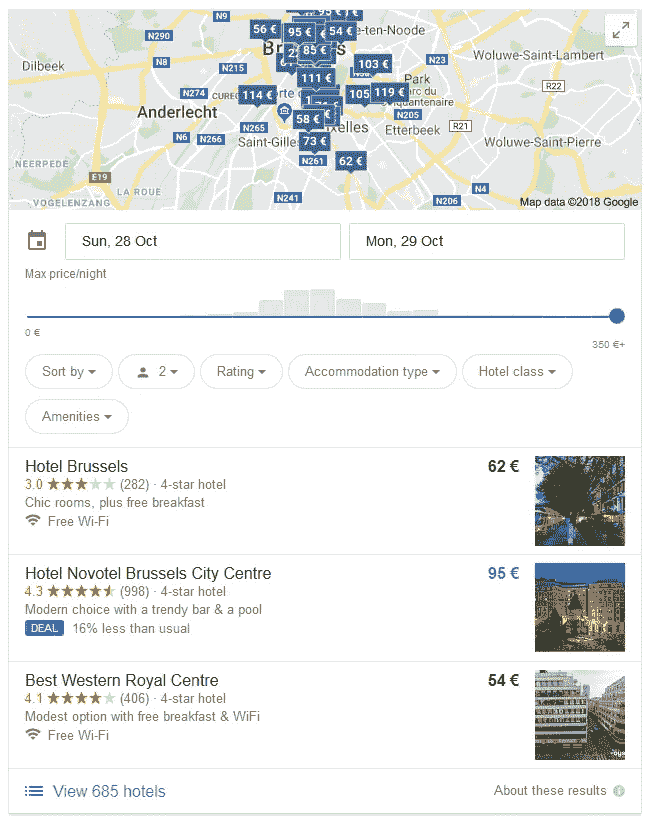
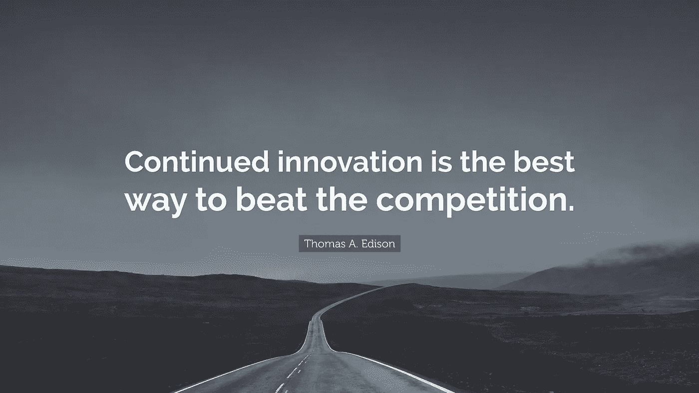

# 垄断:创新功能版

> 原文：<https://medium.com/hackernoon/monopoly-innovative-functionality-edition-c449df007678>

## 创新的想法和功能如何被大公司“偷走”。

[Image from Pexels](https://www.pexels.com/photo/monopoly-board-game-on-brown-wooden-tabletop-776654/)

像大多数人一样，我喜欢在睡觉前通过*而不是*限制我的屏幕时间来赎罪。所以当我在床上玩笔记本电脑的时候，屏幕太亮了。幸运的是，有一个[不错的小软件](https://justgetflux.com/)可以改变我的屏幕，这样在黑暗的环境中我的眼睛会感觉很好很舒服。我的手机连接在房间另一边的充电器上，它亮了起来，引发多巴胺的短信提醒我起身去看一看。幸运的是，[还有一个不错的小软件](https://mightytext.net/)，可以让我直接从舒适地放在膝盖上的笔记本电脑上查看信息和来电。

这条信息是关于目前工作中的项目，提醒我要睡一觉，以便保持精力充沛，准备好应对第二天工作中会遇到的挑战。哎呀，我差点忘了:我得预订明天的团队午餐！我迅速[查看了我工作地点附近几家酒吧和餐馆的](https://www.yelp.com)收视率和[营业时间](https://www.openinghours-shops.com/)。我预订了房间，然后就去睡觉了。*“嘿谷歌，关灯吧”*。

第二天早上，我一边浏览 Reddit，一边喝着咖啡醒来，哇，这是一幅很好的山脉照片！想知道这可能是哪里，我打开评论，但位置是无处可寻。别担心，一个快速的[反向图片搜索](https://www.tineye.com/)将我指向原始图片，我应该去的令人惊叹的地点列表又增加了一个新条目。准备出发去工作，我只需要[查看交通](https://waze.com)这样我就知道如何避开那些烦人的交通堵塞。

由于科技的发展，我们的生活变得容易多了。我们的智能手机现在是我们大脑的一个[延伸](https://www.theverge.com/2016/6/2/11837854/neural-lace-cyborgs-elon-musk)，让我们面对现实吧，没有它我们无法生活。或者至少，*不希望*生活中没有它。执行我们的日常任务变得更加有效，这主要归功于新的和创新的[应用](https://hackernoon.com/tagged/apps)、想法和功能。

每年，成千上万的初创公司试图用他们新的、突破性的产品征服市场，但只有少数几家真正做到了。但不幸的是，一种可怕的趋势正在变得正常:大型科技公司采用了许多这些新技术，而最初的发明者并不总是获得利润。

对于我在引言中提到的每一种产品，大型科技公司之一都创造了自己的替代产品来取代它。由于越来越多的人使用他们的产品，当他们的设备默认提供相同的功能时，消费者将不会经历安装第三方应用程序的麻烦。让我们来看看:

*   [f . lux](https://en.wikipedia.org/wiki/F.lux)2009 年问世。2017 年 4 月 11 日，微软推出了 Windows 10 的 Creators 更新，其中包括[夜灯](https://www.howtogeek.com/302186/how-to-enable-night-light-on-windows-10/)。 [iPhone](https://support.apple.com/en-ph/HT207570) 、 [MacOS、](https://support.apple.com/en-us/HT207513)和 [Android](https://www.howtogeek.com/270552/how-to-enable-a-night-mode-in-android-to-reduce-eyestrain/) 也支持类似的功能。
*   MightyText 成立于 2011 年。同样，随着 Windows 10 的 Creators 更新，用户可以[将手机连接到电脑，并从那里发送/接收短信](https://www.tomshardware.com/news/how-to-reply-android-sms-windows-10,36750.html)。Android 也提供[类似的功能](https://messages.android.com/)，MightyText [写了一篇博文来突出自己](https://blog.mightytext.com/mightytext-versus-android-messages-5628a43a6b53)。
*   Yelp 和猫途鹰都提供了一个用户可以对商业服务进行评价和评论的平台。Google now [默认提供这一功能](https://developers.google.com/search/docs/data-types/review)，在谷歌上快速搜索任何一家企业，不仅会提供搜索结果，还会提供以前客户的评级列表。

但是餐馆和酒吧并不是谷歌显示评级的唯一事物；每一种业务都可以在平台上评级。Google now 还支持寻找住宿的地方。他们仍然会把你引向热门的预订网站，但首先访问这些网站的动机正在消失。顺便说一句:他们还显示营业时间，这就把我们带到了单子上的下一个项目。🎉🎉

*   存在各种检查营业时间的网站，但现在谷歌也提供这些信息，防止消费者需要访问第三方替代品。
*   TinEye 成立于 1999 年，当时是一家名为*的公司。他们声称是第一个使用图像识别技术的[网络图像搜索引擎](https://en.wikipedia.org/wiki/TinEye#History)。同样，他们的主要服务是搜索引擎，谷歌在他们自己的产品中采用了这一特性。就像所有相似的产品一样，每个产品都有各自的优缺点。*
*   [Waze](https://en.wikipedia.org/wiki/Waze) 是一款出色的 GPS 应用程序，为您提供所需信息，让您的通勤或驾驶体验尽可能达到最佳状态。幸运的是，Big Tech 没有选择仅仅复制它们，而是在 2013 年被谷歌收购。Waze 仍然是一个应用程序，谷歌地图[使用了他们的一些技术](https://en.wikipedia.org/wiki/Waze#Google_subsidiary_(2013%E2%80%93present))。

不胜枚举，没必要一直总结例子；看起来，我试图说大型科技公司将创新功能作为原生功能是一件坏事。

[Image from QuoteFancy.](https://quotefancy.com/quote/916689/Thomas-A-Edison-Continued-innovation-is-the-best-way-to-beat-the-competition)

当然不是坏事。至少，对我们消费者来说不是这样。每当一家大公司为他们的产品添加功能时，我们的生活就会变得更加轻松，而在过去，这需要我们求助于第三方替代品。唯一的缺点是，有时候，提出创新想法的人和公司会被推到一边。但是他们对此无能为力。你不能为想法申请专利。

不过，你能做的是提供一个如此出色的产品，以至于更大的公司会想要购买你的产品，而不是试图推出他们自己的版本。