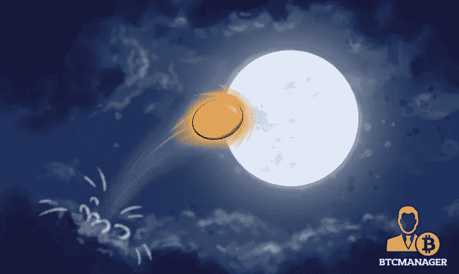

# 月球拍摄寻找珍珠:牡蛎协议(PRL)

> 原文：<https://medium.com/hackernoon/moonshot-finding-a-pearl-oyster-protocol-prl-a2064dc86890>

每周*BTC 经理*和 JaketheCryptoKing 打算探索一个新的 [**登月**](https://btcmanager.com/guide/moonshot/) **机会。目标是找到一个能够真正“月亮”的**[**alt coin**](https://btcmanager.com/news/altcoin/)**。百分之二到三百的回报是很好的，但是六个月后你的钱翻十倍怎么办？这些硬币存在于加密货币市场中；他们只需要被找到。Moonshot:牡蛎协议 PRL。**

# 密码市场的状况

币安黑客攻击的传言加上 SEC 的进一步评论，将 BTC 从 3 月 4 日超过 11，500 美元的高点推至 3 月 9 日的 8400 美元以下。本周发生的第二件对市场产生巨大影响的 FUD 事件是[币安据称遭到黑客攻击。这是币安一再否认的谣言。币安评论说，没有资金损失，他们的网站运行良好，交易者使用机器人和 API 出现了问题。即使证交会的消息是全新的，或者币安确实遭到了黑客攻击，加密市值在一周内从超过 5 亿美元下降到不足 3.5 亿美元的结果也是荒谬的。密码市场变化无常，不稳定，对情绪的微小变化反应过度。本周(SEC ),重复旧消息并对其进行负面报道的文章引发了恐慌和市场调整。币安黑客攻击的传言加上 SEC 的进一步评论，将 BTC 从 3 月 4 日超过 11，500 美元的高点推至 3 月 9 日的 8400 美元以下。](https://btcmanager.com/bitcoin-price-below-10000-regulatory-fears-rumors-of-binance-hack/)

本周发生的第二件对市场产生巨大影响的 FUD 事件是[币安据称遭到黑客攻击。这是币安一再否认的谣言。币安评论说，没有资金损失，他们的网站运行良好，交易者使用机器人和 API 出现了问题。即使证交会的消息是全新的，或者币安确实遭到了黑客攻击，加密市值在一周内从超过 5 亿美元下降到不足 3.5 亿美元的结果也是荒谬的。密码市场变化无常，不稳定，对情绪的微小变化反应过度。本周(SEC ),重复旧消息并对其进行负面报道的文章引发了恐慌和市场调整。](https://btcmanager.com/bitcoin-price-below-10000-regulatory-fears-rumors-of-binance-hack/)

# 什么是登月？

将一个平衡的投资组合与一些投机行为结合起来是分散投资的一个重要方面。Moonshots 和 ico 是加密货币市场风险最高的方面，应该只对那些寻求最高风险、最高回报投资的投资者有吸引力。Moonshots 不是你的投资组合中需要每天关注的部分，也不应该在当天交易。这是技术，也是你长期信任的团队。直到他们带你去月球。

当加密货币超过 100%时，总是令人兴奋的。当市场看涨时，小盘股的投机者往往会反弹，产生比 BTC 高得多的回报，然而，在回调期间，他们也会损失比 BTC 高得多的百分比。Moonshots 永远不应该是一个人的全部投资组合，但如果你选择在加密货币领域投资/赌博，拥有一些 moonshots 会为你的投资组合创造一个非常令人兴奋的方面。这个星期的 Moonshot，PRL，是一个多种原因的最爱！

# 什么是牡蛎协议(PRL)？

**牡蛎—催乳素**

Oyster (PRL)将于 2018 年 4 月 6 日举行 SHL token 空投。加密是相当独特的，因为金钱会定期转向“下一个最好的东西”叉，空投，和其他重大新闻不断有个人轮换他们的资金到新的硬币。最近，ZCL 与 BTC 分道扬镳，随着人们将资金转向新的机会，ZCL 价格暴跌。其中包括 XMR fork 或 ETC 空投。PRL 最近还宣布加入由机构群体投票决定的 NextExchange。PRL 背后有一个庞大的社区，能够做一些事情，如将 PRL 添加到交易所。牡蛎(PRL)是一个伟大的[加密货币](https://hackernoon.com/tagged/cryptocurrency)，但他们的重要新闻发生在三周内提供短期积累。

PRL 专门为 web 主机提供从访问其网站的用户中获利的方法。大多数人会认为唯一的盈利方式是通过付费广告。然而，PRL 在[区块链](https://hackernoon.com/tagged/blockchain)上创建了一个独特的代码行，允许个人计算机为网站贡献一个不明显的散列能力。这将允许在 PRL 网络上确认交易，为网络主机提供收入流。网络主机和个人都很满意，因为广告消失了，但主机仍然有利可图。

PRL 即将实现他们的目标。他们刚刚发布了他们的 Testnet B. “牡蛎区块链”在他们的网络上发送的交易中，只使用用户电脑的很小一部分进行确认。他们的试验网已经证明这不仅是可能的，而且是可行的。想象一个没有广告的互联网。

接下来的几周提供了多种催化剂来解释为什么 PRL 应该在短期内积累。PRL 将在 2018 年 4 月 6 日以 1:1 的比例空投 SHL 令牌。SHL 令牌不会通过 ICO 销售，仅提供给在受支持的钱包或交易所中拥有 PRL 的 PRL 持有者。

一旦本月的分叉和空投结束，预计 XMR 分叉的资金将转入 PRL。PRL 也刚刚完成了象征性的燃烧，减少了超过 10%的总循环供应量。在接下来的 30 天内，我们将宣布对 exchange 的支持。Bittrex 一直等到 ZCL 分叉前六个小时才宣布支持比特币私人(BTCP)。随着资金作为“下一个最好的东西”流入 PRL，预计价格将迅速向北移动。

每枚硬币 0.85 美元，市值 6100 万美元，这是在整个市场将持有的股票转入 PRL 之前积累股票的最佳时机。PRL 有一个空投，令牌燃烧，功能测试网 B(几乎在 mainnet)，并且是本月多个空投/分叉的最后一个。

**阅读其他探月访问:**

*****阅读国王之前的文章，了解他目前推荐哪些 ICO，或者直接与国王取得联系，可以在 Twitter (@JbtheCryptoKing)或者***[***Reddit***](https://redd.it/81hj5q)***(ICO 更新和每日报道)。*****