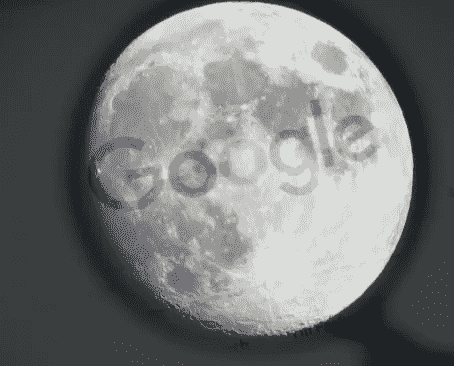
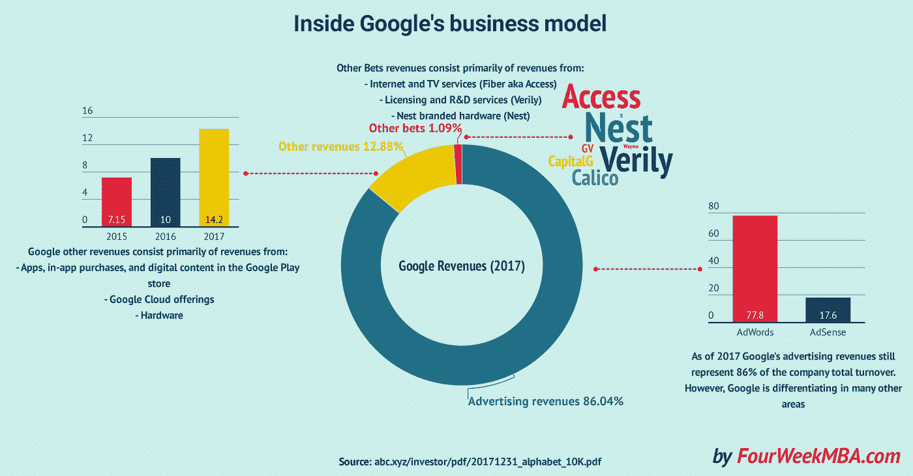
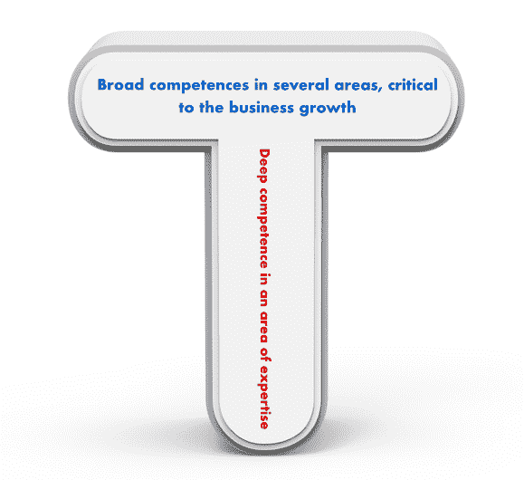
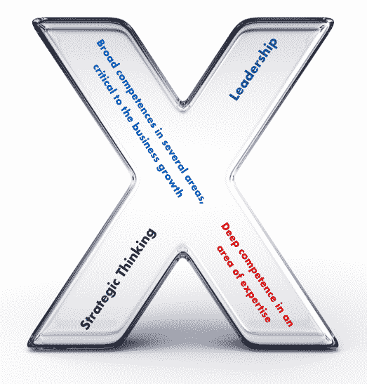

# Moonshot 思维:增长营销是所有关于 10 倍规则

> 原文：<https://medium.com/hackernoon/moonshot-thinking-growth-marketing-is-all-about-the-10x-rule-f2b3189db7db>

> 当几乎每个公司的研究实验室都试图改进母舰的核心产品时，X 被认为是一种反公司的研究实验室；它的工作是解决除谷歌核心业务之外的任何地方的重大挑战。

这一切都是从征服网络的搜索引擎[谷歌](https://fourweekmba.com/how-does-google-make-money/)开始的。早在 20 世纪 90 年代末，[谷歌是搜索行业的最后一批行动者之一，然而它比竞争对手强 10 倍。此外，它的创始人佩奇和布林有着 10 倍于常人的思维定势，有着远大的想法。当他们为公司设定任务时，他们没有说“我们将建立一个有竞争力的搜索引擎。”](https://fourweekmba.com/first-mover-advantage/)

他们说，“我们的使命是组织世界上的信息，并使其普遍可用和有用。”这个任务对于两个年轻的博士来说可能听起来很荒谬，他们更多的是学者而不是来自商业世界的人。然而，这些学者设法建立了一个业务，在 2017 年净赚超过 1100 亿美元，主要来自广告:

然而，佩奇和布林创造了该公司的一个创新危害，称为 Google X，其目的是独立于该公司的[核心商业模式](https://fourweekmba.com/what-is-a-business-model/)解决重大挑战。

正如拉里·佩奇在 [2013 年创始人致股东的信](https://abc.xyz/investor/founders-letters/2013/)中所指出的:

> *当你从基本原则出发，不受既定做事方式的束缚时，你在一个敬业的小团队中所能取得的成就令人惊叹。然而，随着时间的推移，我认识到让团队变得超级雄心勃勃非常困难，因为大多数人都没有接受过这种空想思维的教育。他们倾向于认为事情是不可能的，或者害怕失败。这就是为什么我们花了这么多精力在谷歌雇佣独立思考者，并设定远大目标。因为如果你雇佣了合适的人，并且有足够大胆的梦想，你通常会成功的。即使你失败了，你也可能会学到一些重要的东西。*

我们可以从谷歌 X moonshot 思维中学到很多，并将其应用到你的业务增长中。

# moonshot 在想什么？都是 10X 左右！

正如谷歌 X 的负责人阿斯特罗·泰勒指出的:

> *背景很重要，期望很重要，人很重要，资源很重要，但这不是这个世界上最大的问题，可悲的是，它们本质上大多是军事性质的，你把大量真正聪明的人聚集在一起，你知道不是 5 个或 10 个，而是 100 个或更多，你给他们资源，但更重要的是期望他们会创造奇迹。*

这是 moonshot 在行动，它从创造一种迫切感开始。

# 制造紧急情况

人类与生俱来的事情之一就是生存。问题是大多数文化和企业文化创造了一种正常的感觉，这让我们感到安全。这种感觉扼杀了幻想。Moonshot 思维始于这样一种生活哲学:把每一天都当作生存的最后一天，也是最重要的一天。这与[杰夫·贝索斯的《第一天](https://fourweekmba.com/jeff-bezos-day-1/)》没有什么不同。

# 背景是登月思维的王道

> *创造环境这是最难的部分视角转变是最重要的，这就是为什么比增长 10 倍更重要，效果更好当你追求 10%的优势时，你是在进行一场智慧竞赛你是在让你的所有员工与世界上的所有人进行智慧竞赛他们不会赢，不管你给他们多少钱，但如果你给了他们，你就推动他们 他们的期望和变得古怪的自由，这是空想，然后他们可以进行视角转换，不仅如果你的目标是 10 倍而不是 10%，这几乎不会难 100 倍，回报是 100 倍，所以你已经知道你的投资有更好的回报，但有时真的更容易，原因是因为视角转换实际上相对于比你周围的人更聪明来说是廉价的。*

Astro Teller 还指出了创造一个让登月思维成为规则的环境的重要性。对他来说，这是最具挑战性的部分。一旦你有了背景，你就为剩下的做好了准备！

# 放弃增量变化

渐进式变革与大规模变革一样困难，如果不是更困难的话。为什么？你和其他人竞争寻找一个相似问题的解决方案。如果你换个角度，问一个不同的问题。例如，当谈到增长时，常见的模式是看到企业主考虑“今年我如何将业务增长 30%？”

带着这种想法，你会寻找传统的解决方案，在许多情况下，是由他人预先包装好的。你会用旧的公式来解决新的问题，并坚持下去，直到你的企业失败为止。相反，如果你开始问“我如何让我的业务增长 10 倍？”这改变了一切！

突然之间，你需要寻找一个新的解决方案，你需要变得有创造性，并且痴迷于你头脑中的原始问题。没有人能给你答案，只有你自己。这时你就开始接受 10 倍的态度了！

# 拥抱 10 倍的态度

正如彼得·泰尔在他的书《零比一》中指出的，当你创造垄断时，你就赢了。当谷歌接管搜索市场时，它是一个[的后来者](https://fourweekmba.com/first-mover-advantage/)，然而它有着 10 倍的态度，它想要主宰信息市场。当[脸书](https://fourweekmba.com/how-does-facebook-make-money/)接管社交媒体行业时，它也是一个后来者。然而，马克·扎克伯格考虑的是统治世界！

10 倍的态度需要一个大胆的愿景，同时也需要一种创造性的方式来思考问题，它从基本原则开始。

# 这一切都始于从基本原则出发的推理

> *在每一个有首要原则、原因或要素的系统研究(方法)中，知识和科学来自于对这些知识的获取；因为我们认为我们知道一些事情，以防我们获得主要原因的知识*

正如维基百科[所指出的，从第一原理进行推理意味着挖掘主要原因。](https://en.wikipedia.org/wiki/First_principle#cite_note-2)

现代世界的很大一部分是建立在主要发生在 19 世纪和 20 世纪初的假设之上的。这些假设中的许多，如果被进一步质疑，可以变成基本原则。一组无法进一步检验的假设。在科学界，遵循第一原则意味着更接近自然。在商业世界中，这可能意味着提出正确的问题，而不是坚持任何人都在问的问题。

# 瞄准不可能的事，但让它可行

在大多数情况下，没有取得成果并不是因为设立了一个过于雄心勃勃的目标。恰恰相反，正如 Grant Gardone 在 [10X 规则](https://www.amazon.com/10X-Rule-Difference-Between-Success/dp/0470627603)中指出的，在许多情况下，失败是由于目标不够远大。不仅如此，这是不够的可操作性。事实上，要开始让不可能的事情发生，你需要有一个明确的方向，并能够采取大规模的行动！

> *登月没有剧本——我们喜欢这样。建造处于不可能边缘的东西意味着我们必须接受模糊性，并准备好修补、试验和学习通往未来的道路。负责任地不负责任地，我们生活在无畏与谦逊、理想主义与务实之间的甜蜜点。我们热情而冷静地提出尖锐的问题，寻求不同的观点，并在怪异和意想不到的地方寻找灵感。*

正如在 [Google X](https://x.company/careers-at-x/) 上所指出的，没有适合登月思维的剧本。然而，它始于拥抱模糊，并在大胆和谦逊之间，在理想主义和务实之间找到最佳平衡点。在不断涌现大胆解决方案的边缘。

# 先做最难的事情

商业中的一个常规思维模式是从简单的问题开始，解决它们，建立一个可能存在几年的企业。如果你的目标是建立一个企业，尽管当前的变化很快，但它将持续几十年，你需要从最困难的问题开始，一个似乎无法解决的问题，并且其中有社会责任的成分。

# 采取大规模行动

一旦你投入到登月思维中，并应用 10 倍法则，就到了采取大规模行动的时候了。你再也负担不起与普通人同等水平的努力；你需要拍 100 倍。

你需要呼吸你想要解决的问题；你需要认同它。这是一种近乎疯狂的痴迷，但只对那些从外面看的人而言。对你来说，这种心态意味着采取世界上只有少数人能做到的行动。

# 忘记 T 型；都是关于 X 型人的

t 型身材的人现在已经成为商界不可或缺的一部分。正如故事所说，T 形轮廓是指一个人在一两个领域有深刻的理解和专业知识，并在其他几个领域有广泛的知识:

***By FourWeekMBA.com***

T 形轮廓的问题在于，它不会让你实现你的雄心壮志。我认为自己是 T 形轮廓，但我知道它的局限性。换句话说，作为一个 T 型的人，我没有能力带领一个小团队朝着 10 倍的目标前进。

然而，如果你想大获成功，你需要开始增加权威性和领导力作为关键技能。这就是当你从 T 形剖面跳到 X 形剖面的时候！

***By FourWeekMBA.com***

X 形是 T 形的演变。T-shaped 明白协作是成长的关键；X 型轮廓的人明白，领导能力和战略思维是推动一个小型或大型团队朝着需要大规模行动的目标前进的关键因素。因此,“X”形同时也是“T”形轮廓，是组织内公认的领导者！

# 从长远来看，为什么 10 倍思维比增量思维更便宜

许多人认为 10 倍思维成本高昂，需要大量资源。反而 10X 思维恰恰相反。它是关于寻找廉价的、创造性的解决难题的方法。这也需要一路上经历许多失败，然而这个世界变成了你的实验室，失败只是成长过程中的又一步！因此，从长远来看，10 倍思维不仅成本低廉，而且会给你的企业带来巨大的投资回报。

*原载于 2018 年 10 月 25 日*[*【fourweekmba.com】*](https://fourweekmba.com/moonshot-thinking-and-10x-rule/)*。*