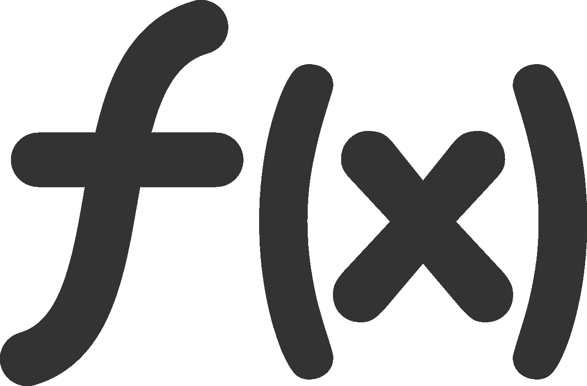
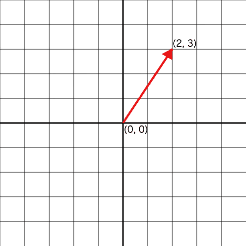

# 更多功能:重构二维向量库的故事

> 原文：<https://medium.com/hackernoon/more-functional-refactoring-a-vector-library-4bf3d6b88612>



这篇文章是关于我如何用函数式编程风格重写我的库 [**vec-la**](https://github.com/francisrstokes/vec-la) 。 **vec-la** 是一个小型 2d [线性代数](https://en.wikipedia.org/wiki/Linear_Algebra)库，它将[向量](https://en.wikipedia.org/wiki/Euclidean_Vector)和[矩阵](https://en.wikipedia.org/wiki/Matrix_(mathematics))建模为*普通 javascript 数组*。这篇文章*并不是关于*数学和线性代数的——你不需要知道那么多就能从中获得一些价值。

## 速成班:什么是向量？

如果你不知道，向量基本上是一个有序的数字集合。一个 *2D* 向量只是两个数的有序集合。如果你熟悉像(2，3)这样的坐标，那么你会直观地知道什么是矢量。



Vectors can be visualised as arrows on the plane

但是向量也可以看做空间中的箭头；它有一个方向(箭头指向的地方)和一个量级(箭头有多长)。这很重要，因为这意味着向量不仅仅可以表示空间中的点，还可以表示一个方向上的速度。

在许多方面，向量就像正常的数字。你可以增加、减少和缩放它们，但是你也可以做其他很酷的事情，比如旋转和反射它们。这就是 *vec-la* 的意义所在——它为你提供了以编程方式操纵这些数学对象的工具。

我主要使用 **vec-la** 来构建[程序动画](http://codepen.io/fstokesman)和游戏，尽管向量和矩阵的用例非常广泛。

## 目标

所有这些都解决了，原始项目和重构的主要目标都是脱离许多其他库采用的方法；基于类的向量模型，其中操作是使向量变异的**方法**。

避免状态突变是近几年来越来越普遍的想法。尤其是 Redux 让这一点成为了 javascript 社区的焦点。

相反，vec-la 使用[纯函数](https://en.wikipedia.org/wiki/Pure_function)总是返回一个新的副本。为了说明这些差异，让我比较另一个(更流行的)库， [victor.js](http://victorjs.org/) 。

Creating vectors

在正常情况下，Victor 需要创建一个专门的对象，但是它也公开了一个从数组创建的 API:

```
Victor.fromArray([15, 22])
```

虽然实际上比用新的。

Adding vectors

使用**添加**，可以看到*突变*的想法进来了。将 *vic1* 加到 *vic2* 的结果实际存储在 *vic1* 中。如果你想在之后继续使用 *vic1* 的话，这是很烦人的。 *vec-la* 总是会返回一个新的向量，所以你永远不会有担心 **vec1** 和 **vec2** 会发生什么的心理负担。

Scaling vectors

在 *victor* 中乘法也是如此——它使你正在处理的向量发生变异。这通常会导致意想不到的和难以发现的错误。要了解原因，请参考以下代码:

**a** and **b** are actually the same object now

Victor 也不支持其他一些比 vec-la 更高级的功能，比如使用矩阵。如果你不知道矩阵是什么，这里有一个简单但不精确的解释:

> 矩阵是排列成表格的一组数字。有一种特殊的方法可以把这些数字和一个向量或矩阵结合起来，得到一个新的向量或矩阵。这种运算叫做矩阵乘法。我发现把矩阵想象成一种转换函数的定义是很有帮助的。

Matrices like this are not what you might call “readable”

手工编写矩阵既麻烦又难以阅读，因此有一个 API 使用一个[*fluent*](https://en.wikipedia.org/wiki/Fluent_interface)[builder 模式](https://en.wikipedia.org/wiki/Builder_pattern)来简化创建:

Behold! A matrix that actually describes what it’s effect will be

## 功能上的提升

你可能已经说过 *vec-la* 非常实用。

*   它与函数一起工作，而不是方法
*   它从不改变论点
*   接受或返回向量的函数很容易组合在一起——它们组成

但是它也有一些缺点:

*   这些功能不是可定制的
*   他们经常以“错误的”顺序对待论点
*   ***matrix builder***将一个特殊的对象引入到混合数组中，它不是一个简单的数组

如果你不了解 currying 和参数顺序，可以看看我的文章 [*制作函数式编程点击*](https://hackernoon.com/making-functional-programming-click-836d4715baf2) *。在那里，我会深入讨论这些概念的细节。*

让我们来看看如何解决这些缺点。

## 这些功能不是可定制的

这是一个相当简单的解决方法，但是实际上需要与确定参数顺序结合起来。正如我在刚才提到的文章中所说:

> 规则通常是**把数据作为最后一个参数**

大多数情况下，这些数据是你想要操作的向量。让我们用**比例**函数来看问题:

该函数将向量 **v** 和比例因子 **sc** 作为参数。由于这种顺序，您不能以有用的方式部分应用该功能；更有可能的是，你想用相同的*缩放因子来缩放*不同的*向量，而不是用不同的*缩放因子来缩放*相同的* *向量*。如果你交换参数，你可以得到一个更有意义的函数。

图书馆里还有几个这样的函数。**变换**取一个向量和一个矩阵，并根据矩阵变换向量。假设你有一个由向量数组定义的形状。如果你想变换每个点，你可以这样做:

如果我们转换参数，我们可以创建一个部分应用的变换函数，它将始终使用我们的矩阵:

这更具表现力和可重用性。如果你有另一个形状或点，你可以用同样的函数来变换它。在我们被迫创建一个可以隐式访问矩阵的箭头函数之前。

作为最后一个例子(还有很多)，有一个方便的函数叫做**rotatepointround**，它接受一个要旋转的向量，一个用作旋转原点(控制点)的向量，以及一个角度。如果你想围绕同一点旋转一组向量相同的角度，更好的顺序是角度，旋转原点，向量。

很有可能你在想反例和例外，因为它们确实存在。在这种情况下，我们可以使用一种叫做组合子的东西来动态地重新排列论点。组合子是任何以一个函数作为输入，产生一个函数作为输出的函数。

假设我们有一个向量和一个矩阵数组。我们想要生成一个向量数组，其中一个向量由所有不同的矩阵转换而来。在这种情况下，我们要翻转 transform 的参数。我们可以编写一个通用组合子来实现这一点，而不是编写一个特殊的自定义函数:

这是一个不太常见的用例，但是有一个像 **flip2** 这样的功能，当它出现时就很容易管理。像**库里**一样，你会在所有主要的功能库中找到 **flip** 的实现，比如 ramda 或者 sanctuary。

## matrixBuilder()问题

我们已经解决了前两个问题，如果我们需要处理不寻常的情况，还保留了运行时参数重排的可能性。但是仍然存在矩阵生成器的问题。

新库中的所有函数都支持函数组合，但流畅的界面却不支持；你要一直调用方法，直到矩阵准备好，然后调用 *get()* 释放矩阵值。(如果不知道什么是函数构成，看我之前提到的文章)

让我们看一下原始的 matrixBuilder 代码。

**vMatrixBuilder** 函数接受一个矩阵(或者什么都不接受，这意味着*单位矩阵*)并返回一个带有旋转、缩放等方法的对象。从这些方法中的每一个，它返回一个新的 matrixBuilder，这个新的 matrix builder 由旧的矩阵和一个执行给定操作的新矩阵组成。

作曲这个词应该马上就会出现在你面前。事实证明，有一种方法可以获得两个矩阵，并对其中的数字进行复杂的求和，然后得到一个新的矩阵，对两个矩阵的信息进行编码。

我们称之为运算矩阵组合，疯狂的是，这与函数组合完全相同(当然这并不疯狂——数学往往是一个经过深思熟虑的概括过程，因此这些类型的重叠经常发生)。

这可能是整篇文章中最吓人的一段代码。我展示了 **mCompose** 函数，只是为了说明有某种方法可以组成矩阵，但是理解并不重要(从这个实现来看，基本上是不可能的)。[如果你想知道所有的数学原理，我推荐 3blue1browns 的“线性代数的本质”系列](https://www.youtube.com/playlist?list=PLZHQObOWTQDPD3MizzM2xVFitgF8hE_ab)。

其余部分的工作方式与 **matrixBuilder** 完全相同——它通过将 **mCompose** 部分应用于特定矩阵来创建矩阵。就像 **matrixBuilder 一样，**你需要用一个矩阵来开始整个事情，在这两种情况下它通常是单位矩阵。毫不奇怪，单位矩阵就像编程中的**单位**函数——当你把它应用于矩阵或向量时，你得到的和你输入的一样。

现在，我们可以通过纯粹的函数组合来表达矩阵的构建，并且我们不局限于某个特定 API 公开的那种方法。

## 摘要

以这种方式重新构建库可以提高与其他库的互操作性——尤其是像 ramda 这样的函数库，我喜欢使用它。要查看所有这些结合在一起的示例，请查看 codepen 上的这个程序动画。

我承认 matrix builder 在概念上是一个更简单的界面，但是它牺牲了 T2 的灵活性和 T4 的通用性来实现这个界面。我认为图书馆和方法都有它们的位置。

在 github 上既可以看到新的 [**vec-la-fp**](https://github.com/francisrstokes/vec-la-fp) ，也可以看到原来的[**vec**](https://github.com/francisrstokes/vec-la)**-la**。它们都有大约 150 行的实际代码，所以这是一个非常容易理解的项目。

如果你喜欢这篇文章，请在这里或 twitter 上给我留言，让我知道。

我正在开始一个名为“探索 ramda”的系列，在这里我将写关于使用 ramda 库在 javascript 中结合函数式风格的文章，所以如果你感兴趣的话，请在 medium 上关注我。