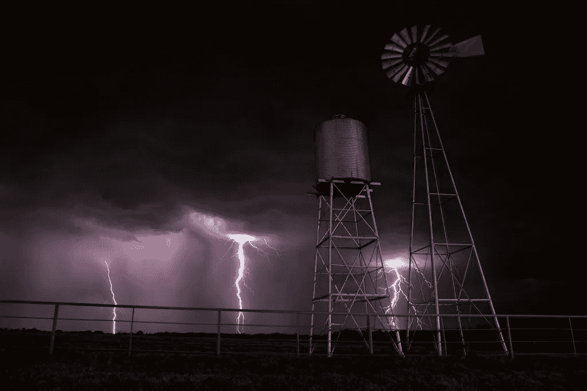

# 更多关于绿色能源和比特币的信息

> 原文：<https://medium.com/hackernoon/more-on-green-energy-and-bitcoin-b193fcf65024>

在我的文章[“绿色能源和比特币”](https://hackernoon.com/green-energy-and-bitcoin-eb7961f38382)中，我认为关于比特币环境影响的主流担忧基本上是对该技术基本原理的误解。通货膨胀刺激了无意义的消费，但比特币没有。除此之外，文章还举例说明了比特币挖矿如何被用作储存剩余电力的元手段。比特币领域的最新发展显示，事情远不止如此。

目前的比特币协议每秒可以处理大约 7 笔交易。目前保护这七个交易的散列能力简直令人吃惊。一些估计称，这比整个爱尔兰的能源消耗还要多。即使对比特币最狂热的支持者(是的，确实包括你的支持者)来说，这也是一种巨大的浪费。我们所构建的是一个超越诺克斯堡级别的安全基础设施，仅围绕几个虚拟金条。为什么？为什么这是必要的？对于基础层事务来说，情况并非如此。但是现在我们有了闪电网络。一项新兴技术*建立在比特币协议*之上，极大地*提高了其交易能力。*

安全*有*在先。如果没有一个完全安全、防篡改、完全分散的基础层，就没有任何东西可以用来构建照明。比特币不仅仅是可编程的货币，它还是可编程的信任。它超级安全的基础是它如此特别的一个重要原因。这不是故事的结束，而是开始。闪电网络是第一个大型第 2 层解决方案，但还会有更多。一旦你意识到比特币的潜力，你也会意识到为什么它是以这种方式构建的，为什么它如此成功，以及为什么关于它的观点大多是徒劳的。关于比特币的观点要想产生任何影响*就需要至少 95%的用户持有这种观点。因此，如果你担心比特币的能源消耗，停止抱怨，做一些实际上有助于它的事情。采用 SegWit，运行一个闪电节点，建立一些东西。比特币不在乎你的看法，就像氛围不在乎政治一样。*

*还有一点是，矿业公司倾向于选择绿色能源比例高的国家进行运营。这是*而不是*的巧合。即使没有补贴，绿色能源也越来越便宜，矿商需要提前计划。此外，绿色能源替代品提供了化石燃料无法提供的独立性。有朝一日，在一个风和阳光充足的寒冷国家，一个采矿场可能会成为一台完全自给自足的赚钱机器。一旦服务器启动，涡轮机启动并运行，太阳能电池板就位，你只需打开开关，让它自己运行。一个程序可以根据提供的能量启动或停止服务器。一种将阳光和风能直接转化为金钱的方法*已经被发明出来。我们正处于许多革命同时发生的边缘，但绿色能源革命可能是最重要的一次。陈词滥调和政治不会拯救地球，但技术解决方案会。绿色能源需要在经济上可行。那是门槛。这是我们应该追求的目标。比特币将在其中发挥作用，只有时间能告诉我们这个作用会是什么。顺便说一下，时间就是金钱。**