# 令牌绑定曲线的更多价格函数

> 原文：<https://medium.com/hackernoon/more-price-functions-for-token-bonding-curves-d42b325ca14b>

继上周由《Solidity 中的 [*数组*](https://blog.aventus.io/arrays-in-solidity-788350f55ce5) 和 [*在 Solidity 中使用字符串*](https://blog.aventus.io/working-with-strings-in-solidity-473bcc59dc04) 的作者 Alexandre Pinto 撰写的文章之后，今天我们继续讨论令牌绑定曲线。

在我之前关于令牌绑定曲线的文章中，我展示了 Bancor 只允许 4 种不同类型的曲线。但如果我们允许准备金率浮动，这并不一定是全部情况。今天，我检查了一些不符合该方案的变体。

# 正初始价格

我从班科尔曲线的简单变体开始。Bancor 价格曲线都可以用形式函数来表示

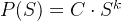

其中 *k* 可以是任意实数值，*C*≦*0。*

这个函数总是经过图的原点，也就是说，供给的代币价格 *0* 也是 *0。*

一个简单的改变是使这个价格为正数:

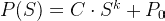

上图显示了一条这样的曲线，

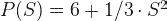

其中标准曲线从 x 轴向上推了 6 个单位。集成起来还是很容易的:

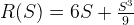

我们可以用它来计算图中两点市场的储备:

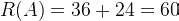

对应的市值是`108`和`27`。很容易得出结论，准备金率不是常数。看待这个问题的一种方式是，我们在一个区域中添加了一个额外的矩形，该区域具有恒定的准备金率。随着供应量的增加，下方矩形面积的相对重要性随着曲线其余部分面积的增加而降低。这意味着储备比率对于低供应量来说非常高，但会随着供应量的增加而降低。

这个比例是有下限的，我们可以直观的推导出来。固定一个我们想要计算这个比率的点 X，让价格曲线为

曲线下的面积有两部分:一部分是代表初始价格的水平线下的面积(面积 A)；另一个是这条水平线和曲线之间的区域(区域 B)。反过来，市值再次包括区域 A，以及该区域和穿过 x 的水平线之间的所有区域。如果区域 A 为 0，(即初始价格为 0)，则准备金率将为 *k* 。如果不是这样，A 区会增加准备金和市值，因此准备金率只会增加。这意味着这种初始价格不为零的曲线保证了准备金率至少是初始价格为零时的恒定比率。

这对用户来说是以更高的价格为代价的，在每笔交易中，用户必须为超额准备金支付固定的费用。

# 储备供应

标准曲线的另一个变体是市场所有者保留一些不能交易的供应。这在造币曲线(当代币被出售时，代币就被创造出来)中比在存款曲线(仅将现有代币从自己的地址转移到用户的钱包中)中更有意义。在一种情况下，这些保留的标记不会影响曲线的价格，结果只是它们好像不存在。在沉积结合曲线中，就好像这些从一开始就没有沉积在曲线中一样。

这些曲线的公式为:

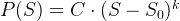

如前所述，这条曲线在左边会有相同的行为

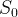

因为它在右边。像这样移动曲线的唯一效果是为第一个令牌的价格固定一个不同的值(这是实现前一部分的相同行为的更复杂的方式)。但是如果我们在点上引入一个函数的变化，它会变得更有趣

而是定义，比方说，在 *0* 和之间的水平函数

最好的方法是将两个变量结合起来，写出这样的价格函数:

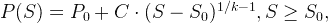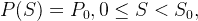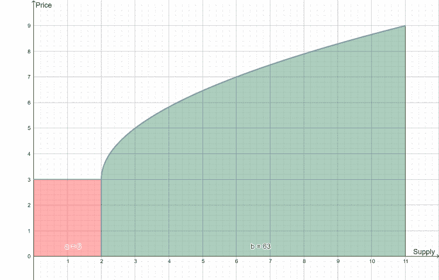

在这种情况下，市场所有者决定开始一个市场，但是以不同的价格保留第一批代币:这可以是恒定的；遵循不同的曲线；或者甚至代币可以被声明为不可交易的，并且价格函数简单地不被定义在这个范围内。它也为所有未来的代币设定了一个最低价格，从而保证了那些希望向曲线出售代币的储备供给的所有者的最低报酬。当然，这条曲线也保证了最低准备金率为 *k.*

储备本身现在必须分两部分计算，一部分用于函数的每个分支，但除此之外，这个函数在数学上没有什么新东西。准备金的计算公式如下:

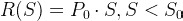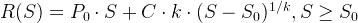

# 拟多项式函数类型

前文提到的多项式函数并没有穷尽所有的功能。如果我们放松固定准备金要求，我们可以尝试其他功能。选择函数的一个好方法是，先考虑我们希望在市场中实施的行为和激励，然后看看如何对它们建模。我们可以在 Wilson Lau 的 [*这篇文章*](/thoughtchains/on-single-bonding-curves-for-continuous-token-models-a167f5ffef89) 中看到一个这样的例子，其中导出了以下函数(一般而言):

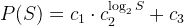

尽管指数是对数，这仍然可以改写为

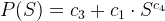

为

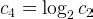

这正好落在储备供应的前一种情况下。

但是还有第二个公式，它是另一个锅里的鱼，并引入了一个全新的形状:

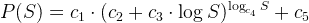

这里有 5 个不同的参数，这让事情有点复杂。我们可以这样改写上面的内容:

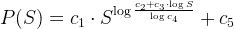

这不是一个立竿见影的改进，但澄清了一些事情:这里的主要术语是

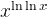

一旦它变成正值，这个函数就会变得非常缓慢。为便于参考，将`1`变为

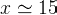

现在是`2`了

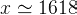

而这又转而`3`为

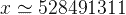

鉴于这一增长率，对于大多数实际应用来说，它可能被认为是一个常数，这将上述价格公式与一个更无聊的函数类放在一起，如

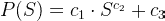

但这仅发生在 *x* 变得平滑之后。对于小值的 *x* 来说，情况完全不同，价格函数几乎垂直下降(取决于常数的选择)，直到转向并模拟一个简单的幂函数。这种最初的价值下降可能不适合正常的市场激励，所以在实施之前要好好研究你的曲线，特别是要知道市场将发挥作用的最大和最小供应范围。以下是这种类型的三条曲线的示例:

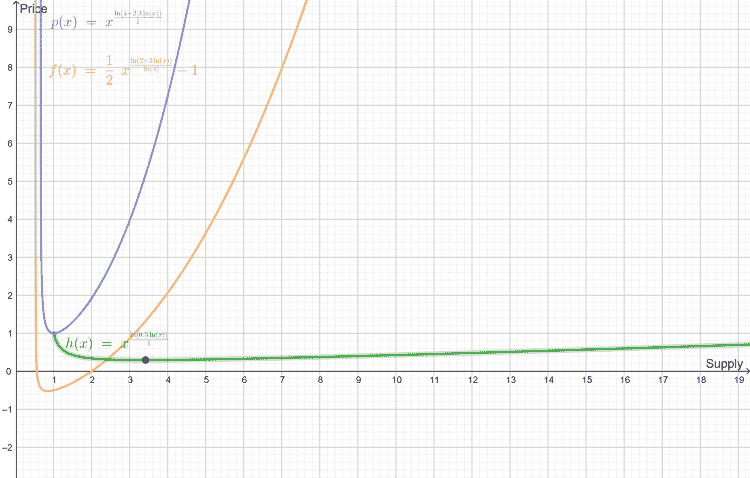

# 指数函数

最后一个例子介绍了在指数中使用变量的可能性(尽管使用了双对数函数)。这就打开了简单却引人注目的指数函数的大门。从表面上看，它的图形类似于指数大于 1 且为正变量的幂函数。当变量为负时，这些函数是完全不同的:指数函数似乎紧挨着水平轴，几乎是一条水平线，但幂函数将是图形正侧的对称函数:如果指数的分子是偶数，它将围绕 y 轴对称；如果是奇数，它将围绕原点对称。另一个区别是，幂函数会通过图表的原点，而普通的指数函数不会。但是稍微调整一下，我们可以写出一个指数，例如:

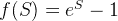

尽管有相似之处，指数函数不像幂函数:它比任何多项式函数增长得快得多(对于足够大的 *x)。*下图是一个这样的例子，显示了与上图完全相同的函数，用于中等但较大的供应值(高达 20)。看看指数函数是如何相对于其他函数起飞的。

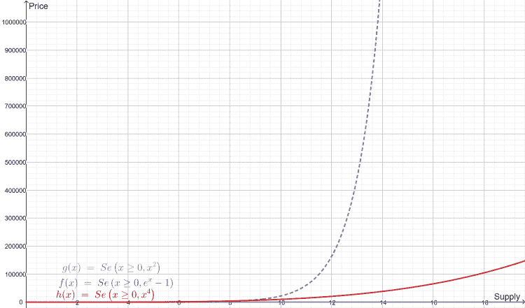

指数函数有一个非常简单的积分，我们可以很容易地检查出它不产生一个常数比。下面，我列出一个通用的指数价格函数，相应的准备金和准备金率的计算。

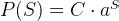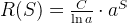

准备金率为

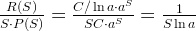

这表明它随电源而变化，因此不是恒定的。

# 对数函数

对数函数就像指数函数的镜子。指数函数增长非常快，接近垂直曲线，而对数函数增长非常慢，接近水平曲线。

下图显示了对数函数与指数的幂函数的比较

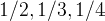

它们的近似形状是相似的，人们可以认为对数函数(虚线所示)与幂函数是同一类型。它确实超过了其他两个，从这个小例子来看，它似乎可以主宰他们。然而，这是短暂的行为。事实是，随着 *S* 趋于无穷大，对数函数变得越来越慢，直到被所有其他幂函数超越。

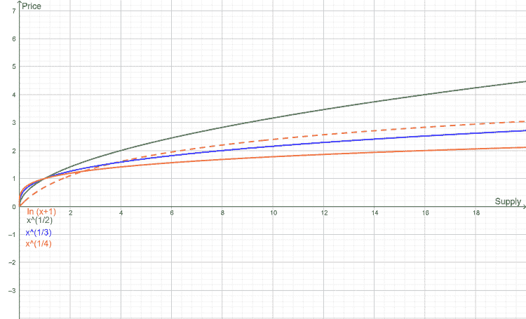

下图显示了在 *S= 90000* 附近的相同函数，这里的对数函数已经是最小的了。

的积分

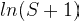

比前几个更复杂:

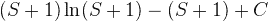

该功能的潜在缺点包括必须实现对数功能，因为这在现货供应中是不可用的。也不容易通过增加的程度来概括上述功能本身

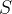

到

它在积分中包含了三角函数。更高的指数甚至没有一个封闭的积分公式。

# 负指数

对数函数的一个有趣替代可能是负指数。与无限增长并趋于无限(尽管速度非常慢)的对数不同，负指数具有真正的水平渐近线，这意味着它将逼近真正的水平函数，并且永远不会超过极限值。例如:

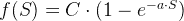

接近最大值`C`。函数的上升是陡峭的

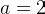

并且向近水平状态的转变几乎是突然的。为了让上升更柔和，我们可以让 *a* 小很多，只要它还是正的。

积分(以及储备)并不复杂:

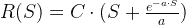

下面是一个图表示例:

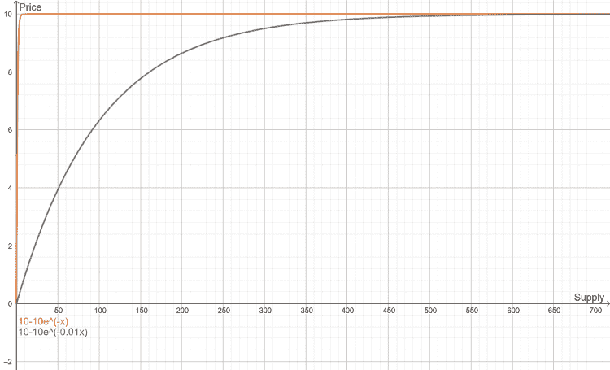

# 结论

在这篇长文中，我讨论了几种可能的令牌结合曲线(TBC)的价格函数，并谈了一些它们的性质以及如何计算它们的积分。功能的选择应该主要由期望的激励来决定，可以通过用期望的行为画一个图表，然后确定一个接近它的功能。

重要的是，任何选择都必须根据实现必要功能的难易程度进行验证。在 TBC 中，我们希望从曲线上买卖令牌。如果我们想出售或购买给定数量的代币，我们只需要计算价格函数的积分，但如果我们想购买或出售相当于给定数量的储备货币的代币，那么我们需要这个积分的反函数。

为了减轻数学负担(已经很重了)，我没有给出任何反函数。这是一个比表面上看起来更大的挑战。例如，对“正初始价格”部分中的函数的保留的逆将涉及求解这种多项式方程

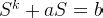

这对于 k 的高值来说并不简单。

指数函数不会造成太大的问题，在“准多项式函数类型”中更简单的函数也不会。然而，这一节中的第二类问题很难用解析的方法来求解储备及其倒数。这也适用于对数函数储备的倒数。最后，即使是负指数储备也不容易反转。

这使得在 TBC 中很难使用该列表中的大多数函数，在 TBC 中，我们想要指定货币值而不是要购买或出售的代币数量(这在金融市场中很常见)，但是可以提供不包括前者的市场。这更类似于物质世界，许多市场只是这样运作:我们通常不买价值 20 美元的苹果或肉，而是寻找特定的数量或重量。

## 关于作者

Alex 是 Aventus 的一名软件工程师，在区块链工程团队工作。他拥有 20 年的技术工作经验，完成了计算机科学博士学位和密码学博士后学位。作为研究的一部分，亚历克斯[发表了关于 Kolmogorov 复杂性、密码学、数据库匿名化和代码混淆的论文](https://www.researchgate.net/profile/Alexandre_Pinto2)。

Alex 还在 Maia 大学学院教授了七年，包括指导计算机科学和信息系统与软件学士学位课程。

这篇文章最初发表在[的博客](http://coders-errand.com/more-price-functions-for-token-bonding-curves/)上。