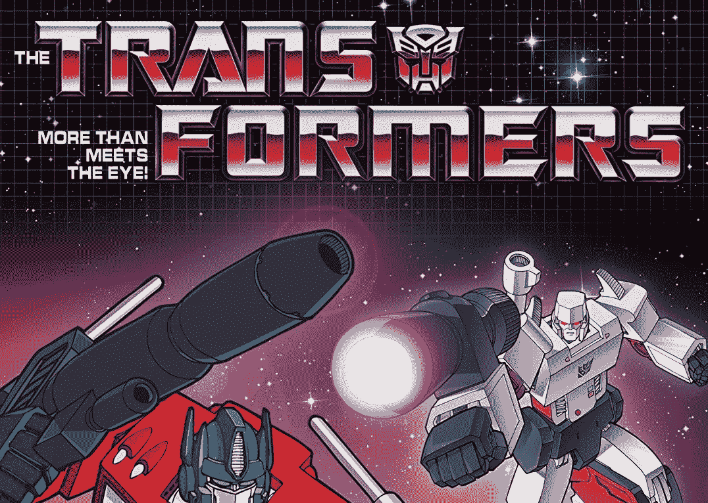
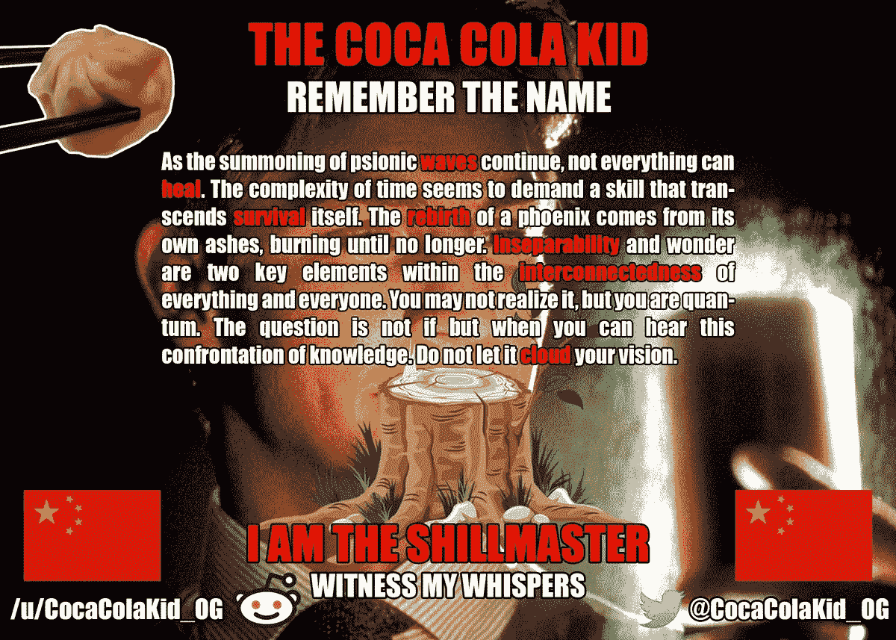
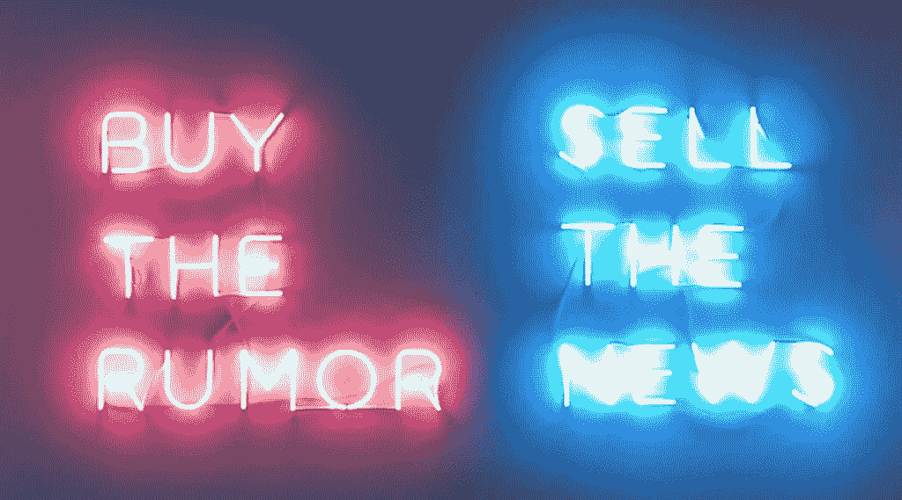
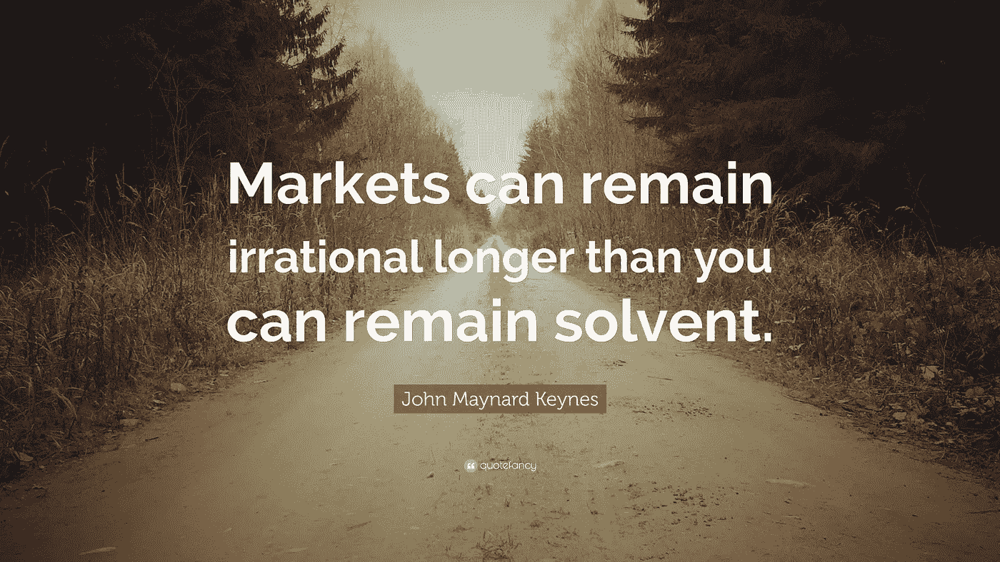

# 事情并不象初看到的那样简单..

> 原文：<https://medium.com/hackernoon/more-than-meets-the-eye-ce096def5a94>

嗨，大家好。这篇文章将致力于让你了解更多信息。投资的时候信息就是王道。总有比看上去更多的东西，是时候揭开帷幕了。在我的上一篇帖子中，我谈到了 FOMO(害怕错过)，这导致人们被烧伤。另一种方式是人们被错误地告知或者根本不被告知。我的意思是，有多少次你在 Reddit 或 Telegram 上看到人们的评论显示他们对自己投资的东西毫无头绪。请不要成为那个人。

投资时，你首先应该了解情况。因此，阅读白皮书，看看已经达到了哪些里程碑，了解更多关于团队的信息，看看发行量和市值是多少。这些只是基础，但对一些人来说，这已经是太多的努力了。

接下来要加入的是 Reddit、Slack 和 Telegram 渠道的一个链条。请仔细阅读字里行间的意思，因为很多流言蜚语，FUD(害怕不确定和怀疑)和 FOMO(害怕错过)都在这些频道里发布。是的，有时会有很多关于[月亮](https://news.bitcoin.com/wp-content/uploads/2017/06/DBmhvtFXYAE205E.jpg-large.jpeg)、[蓝宝](https://images6.memedroid.com/images/UPLOADED16/513404bb4fcdf.jpeg)和[碎片](https://www.askideas.com/media/49/Hey-I-Just-Sharted-And-This-Is-Crazy-But-I-Am-Not-Changing-Because-I-Am-Too-Lazy-Funny-Shart-Meme-Image.jpg)的迷因。但至少你笑了。

正如你所看到的，有很多信息来源你可以很容易地利用。还有很多“不太明显”的信息来源。例如，在 Google Trends 上搜索，找出更多关于连锁店的受欢迎程度和地理位置的信息。但是就像题目说的，总会有更多的。所以让我们再深入一点..

# **可口可乐小子**

有时候，只需要一个奇怪的信息来源。这就是有趣、好玩和怪异的地方。如果我告诉你，有时你可以在 [4chan](http://www.4chan.org/) 上获得投资信息，你可能会问我一直在吸什么(“Epa..这是什么地方？?" *)* 。

我给你举个例子。如果你正在投资 VeChain，你可能听说过一个绰号叫“[可口可乐小子](https://drive.google.com/file/d/1mwQRTX_IUSCUkFbzjJ2UXncWB5sl7GiW/view?usp=sharing)”的人。这个家伙总是在 [4chan](https://drive.google.com/file/d/1mwQRTX_IUSCUkFbzjJ2UXncWB5sl7GiW/view?usp=sharing) 上发布神秘的消息，当 VeChain 有事情要发生的时候。信息本身总是可以解读的，但时机总是恰到好处。所以当他写一条信息时，你知道 VeChain 的价格要么上涨要么下跌，因此这是一个极好的信息来源。谁会想到..4chan..

# 雪地里的棕榈树

我们倾向于认为只是市场推动了价格的上涨或下跌。再说一次，事情并不像看上去的那样简单。有时一条链会有意想不到的颠簸，其背后的原因可能会让你大吃一惊。让我们来看看 [Cindicator (CND)](https://coinmarketcap.com/currencies/cindicator/) 案例。这又是一个奇怪的信息来源案例。1 月 18 日，我收到了一条关于[内布里奥(NEBL)](https://coinmarketcap.com/currencies/neblio/) 的一个泵的消息。这是一个有趣的问题，因为这不是一般的“泵和转储”。

发生了什么事？这个消息来源掌握了“棕榈滩研究小组”一份名为“棕榈滩机密”的报告的内幕。是的，这是那种“让我快速致富”的报告。但问题是，这背后有很多钱。当我说很多的时候，我的意思是很多。没错，这里面有先声夺人的成分，因为据证实，这份报告背后的人在报告出来之前就买进了。

“棕榈滩机密”报告定于 21:30(取决于您所在的时区)发布，目前还不清楚会涉及哪家连锁机构。就在发布之前，消息来源发现，这将不是 Neblio，而是 Cindicator。看看 21:30 之后发生了什么。“嘣宝宝！”。

如果你看看 CND 图表，你还会发现，还没有出现真正的抛售。可能是因为使用此报告的人没有快速销售。但是如果泵是由这样的情况引起的，你就要小心了。事情并不总是像它们看起来的那样，而且会很快变糟。报告通常在 4chan 上浮动。为了您的方便，我还提供了一份最新的副本，您可以在这里找到:'[棕榈滩机密信息](https://drive.google.com/file/d/1msvBlNo6pVo6oeeVYh5U9-lYzMxxA5SU/view?usp=sharing) l '

# 买谣言卖消息

现在这是一个大的，它和时间一样古老。“买谣言卖消息”在密码中经常发生，而且一次又一次地发生。

想想像皮拉尼亚这样寻找被低估的链条的投资者。当谣言开始浮出水面，说一家连锁店可能有重大消息要宣布时，这些投资者就会开始买进。因此，在任何事情宣布之前，谣言就已经被消化了。因为谣言，一个链条的价值会被夸大。如果谣言是假的或低于预期，市场超买，这将导致立即抛售。如你所见，这是一个危险的领域。尤其是在加密领域，谣言远至“比特币将达到 1000000”和“太阳的位置将被这个区块链改变”。

让我们举一些明确的例子，这样你就能知道什么时候会发生这种情况。也许你还记得 LSK 的价格暴跌。去年 11 月底，Lisk 的价格在短短几个小时内暴跌了 20%。这次跳水背后的原因是市场在谣言的推动下，预期过高。在柏林的一次会议上，更名的实际日期被宣布，而市场却在期待更名。市场对该公告的解读似乎是更名被推迟了。这都是由于“月亮男孩”制造的谣言。价格猛跌，过了一段时间才恢复。但最终还是发生了。

在柏林会议之前，Reddits 和电报中充斥着“这将是巨大的”和“这是自切片面包以来最好的东西”。虽然 Lisk 很棒，而且我相信它的价值会增加很多，但市场反应过度了。当你在这样的时刻进入时，你会被烧伤一段时间。

让我们快进到前天。同样的事情也发生在 VeChain 身上。VeChain 的一个合作伙伴宣布，将有一个直播流，VeChain 的首席执行官(Sunny)将发表讲话，并将宣布一些重大消息。请记住，这个合作伙伴是一个真正的企业，所以即使是与区块链做一些事情对他们来说也是巨大的。

市场开始行动。价格上涨是因为谣言四起。你可以读到这样的内容:“他们将宣布与中国人民银行的合作伙伴关系”，以及“中国将与人民币进行全面加密，而 VeChain 是将要这样做的人”。每当有人试图缓和谣言时，就会有这样的信息:“你为什么这么消极，这件事会发生的，别胡说了！”会出现(一个很好的说明)。

这种情况一直持续到直播结束。就在它们上线前一刻，交易量飙升(又是一个好消息)，价格开始出现不稳定的反应(又是一个好消息)。虽然展示的东西很特别，但并无新意。毫无意外，肯定不是“月亮男孩”所期待的东西。这当然导致了大规模抛售。“然后卡波！”

另一个“买谣言卖新闻”的经典例子。这种味道你一英里外就能闻到。当警告在没有任何明确论据的情况下遭到嘲笑时，你知道得够多了。真有趣，我因为发出警告而被禁止发一些电报。所以管理员，如果你读到这篇文章(你很可能会)，我希望你死于[胯部腐烂](https://en.wikipedia.org/wiki/Tinea_cruris)。下一次，我希望你能采取负责任的行动，保护那些把最后一美元投入到看起来和闻起来都像“买谣言卖新闻”事件中的新投资者。

维琴会康复的，别担心。但请记住发生了什么，因为即将于 2 月 26 日举行的品牌重塑活动只是一个事件。品牌重塑很可能要到今年六月才能完成，我已经看到谣言开始影响这一事件。

给所有区块链 CEO 和营销人员的最后一句忠告:无论何时你有一个活动，不要大肆宣传。这将适得其反，尤其是当你对投资者不知道的事情无话可说的时候。这会让投资人对你做的事情失去信心。
最好直接发布消息，不要事先发布任何公告。当市场开始膨胀，谣言开始泛滥时，就消灭谣言。一条简单的推特就够了。看看有些连锁是怎么做的。他们只是通过一条简单的推特让世界知道。营销是非常重要的，尤其是在软件领域，但是你总是需要有所表现。

# **市场是非理性的，但总是正确的**

市场有时会表现得不理性，但如果你深究一下，你会发现它为什么会表现得不理性。以今天到期的 BTC 期货为例。如你所见，现在有一个 BTC 垃圾场正在进行。这是因为 BTC 期货的利润超过了降低 BTC 价格的成本。这是一场赌博，但似乎有些鲸鱼愿意冒这个险。

如你所见，花时间让自己了解情况是非常重要的。信息是成功的关键，尽管有时需要一对毛茸茸的大球来实际行动。

市场现在相当熊市，每 5 分钟刷新一次 Delta 或 Blockfolio 不会让你成为一个更快乐的人。持续关注熊市会让你筋疲力尽。这是一年中获取信息、坐下来享受旅程的时候了。

放假，开心，读书，理清思绪，通知自己。公牛最终会回来，但是一月和二月通常不是它们冬眠的月份。一定要保持警惕，因为在加密中你永远不知道他们什么时候会再次醒来。请记住，在这个高度不稳定的加密市场中发生的事情总是比看上去的要多。尤其是当机器人和[鲸](https://www.linkedin.com/feed/update/urn:li:activity:6359791377060032513)卷入其中的时候..敬请关注。

我希望你喜欢这篇文章。我在考虑每周写一篇文章。如果你喜欢这个想法，那么请在你可以支配的每一个渠道分享、发推特和鼓掌这篇文章。如果你有任何建议、评论、内部消息或你想让我写的东西，你可以通过古老的电子邮件方式联系我，网址是 [olivier@airwave.io](mailto:olivier@airwave.io) 。