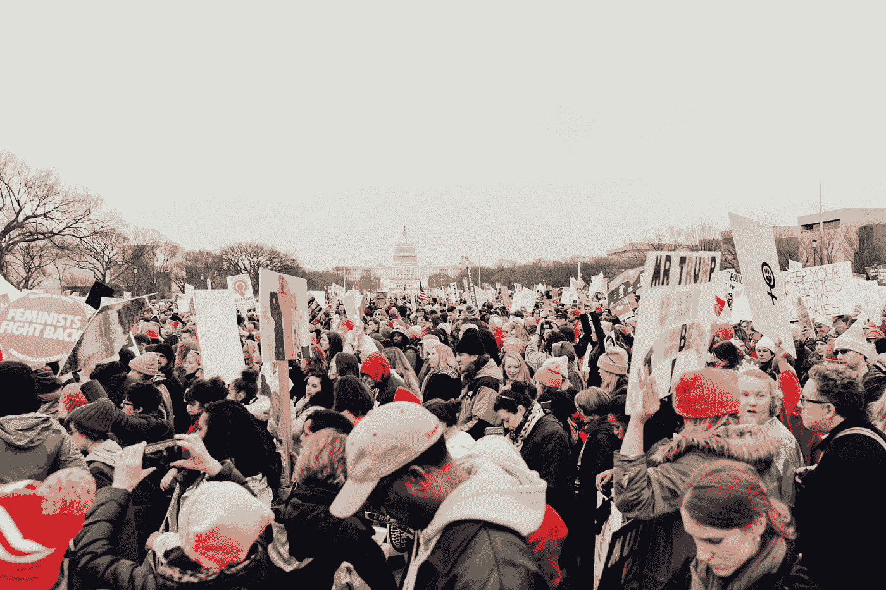
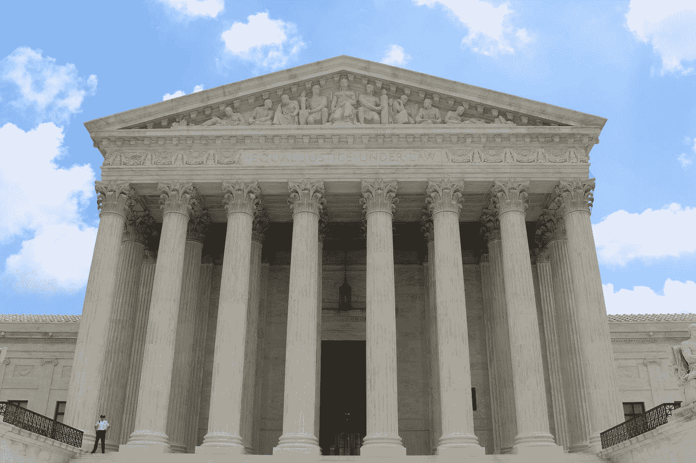
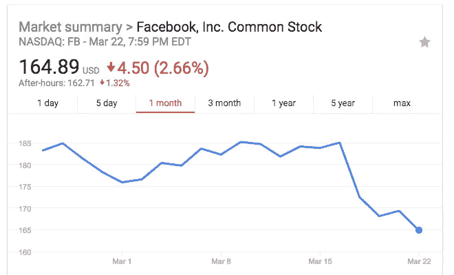

# 快速行动，打破选举

> 原文：<https://medium.com/hackernoon/move-fast-and-break-elections-39740d857762>

## 对脸书的愤怒让它变得更加强大

Photo by [roya ann miller](https://unsplash.com/@royaannmiller?utm_source=medium&utm_medium=referral) on [Unsplash](https://unsplash.com?utm_source=medium&utm_medium=referral)

现在很容易对 T2 和脸书生气。脸书又大又富有。简单。而且错了。我们需要深呼吸，想想后果。它们可能比剑桥分析更具破坏性。

首先，我们需要回答一个问题。脸书的业务是从用户那里获取数据，然后利用这些数据在不泄露数据的情况下销售广告*。*保存数据是脸书能够一次又一次销售广告的商业模式。

那么，他们怎么可能免费提供数据呢？

> 警告:下面是简短的技术性解释。如果你不感兴趣，直接跳到下面的“愤怒会带来规则”一章。

让我们快速后退一步。现在是 2011 年。我就是那些孩子中的一个。我在摆弄脸书 API。它是难以置信的开放，它是这样工作的:

*   在开发人员门户中创建脸书应用程序
*   添加授权逻辑
*   让一个人授权你的应用
*   你得到他的**唯一个人资料 id**
*   你还可以得到他所有朋友的简介 id
*   恭喜你。你现在可以使用你获得的**id 通过**任何应用**在 facebook 上查询公共信息**

这种方法创造了 Ids 的地下市场。这是剑桥分析公司用来获取所需数据的情况。他们获得了身份证。

为什么脸书 API 会这样泄漏？脸书行动迅速，大力推动平台的采用。从字面上看，他们在破坏东西:由于持续的发布，API 是不稳定的。他们经常情绪低落。不泄露数据或 Ids 并不是首要任务。他们专注于增长。他们不知道他们会快速行动并破坏选举。

脸书后来解决了这个问题，但是一旦数据出来了，它就完了。在我看来，挽回损失几乎是不可能的。即使所有的数据都从地球表面物理地删除了(这几乎无法证实)，像 Cambridge Analytica 这样的人可以使用从这些数据中创建的*统计模型*，而不用再接触这些数据。

现在，深呼吸。我会等的。

完成了吗？

好的。

我们继续吧。

# 愤怒会带来规则

Photo by [Claire Anderson](https://unsplash.com/@claireandy?utm_source=medium&utm_medium=referral) on [Unsplash](https://unsplash.com?utm_source=medium&utm_medium=referral)

很明显，所有这些愤怒将导致公众推动某种形式的监管。现在，你可能知道，不可能完全控制脸书。规章必须适用于每个人。因此，我们不得不假设，我们最终可能会监管所有的社交网络。

你真的认为任何形式的监管都可以防止上述数据泄露吗？一个不允许你一周三次发布部分泄漏的、轻微可利用的 API 的规定？真的吗？你将如何执行它？你需要当局监控所有的社交媒体数据流？每个 API 版本？

你知道当局还在哪里监控社交媒体吗？中国。朝鲜。你知道的。独裁统治。

昨天我遇到一个学生，他正在建立一个社交网络来组织抗议活动。假设我们明天就推出这些规定。你认为谁会受到影响——拥有数百万律师和公关费用的脸书？或者学生在宿舍里建立社交网络来组织抗议？

自由建立网络对我们的民主制度非常重要。监管将扼杀新的、勇敢的创业公司，并将给予*更多的权力和杠杆*给像脸书这样的公司。[毫不奇怪，扎克伯格说他对法规持开放态度](https://www.cnet.com/news/facebook-ceo-mark-zuckerberg-apologizes-for-cambridge-analytica-data-scandal/)

# 那么这将如何解决呢？

我知道这很难承认，但它已经在工作了。人们注意到了社会要求的所有规范，但在任何时候都不可能通过监管来执行。人们关心他们的数据如何被使用。同样的人将选择是否继续使用已经或正在不可信的服务。互联网上的转换成本接近于零。换句话说，你可以停止使用脸书，转而使用另一个社交网络。这就是脸书有多脆弱。它比 1998 年的微软要脆弱得多。你不喜欢吗？停止使用它。转移到另一个网络。你的电话联系人有你所有的朋友。

哦对了。一个(额外的)反向观点:

# 社交媒体从来都是政治性的，只是这一次我们不喜欢结果

阿拉伯之春。2011 年伦敦骚乱。第一次奥巴马选举。社交网络已经被用于政治目的。并不是我们现在才突然发现他们的力量和影响力。所以请不要表现出惊讶。

感谢阅读。在这一周里，我正在建立一个名为“僵尸社会”的专注于聊天机器人的初创公司。

如果你不同意，请留下评论，告诉我原因。继续吧。我脸皮厚。