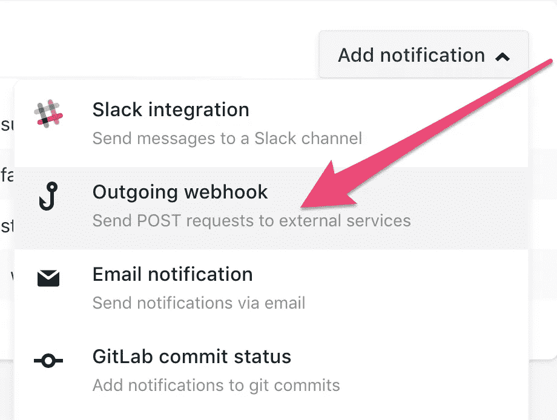

# 动作要快，发现你什么时候弄坏了东西

> 原文：<https://medium.com/hackernoon/move-fast-and-find-out-when-you-break-things-78a1d7d1cbc7>

> 匆忙中，只想设置您的站点以便在每次部署时进行测试？向下滚动到步骤 1。

当我第一次听说[帕特](https://twitter.com/thepatwalls)、[阿明](https://twitter.com/arminulrich)和[梅勒妮](https://twitter.com/_feloidea)关于 [24 小时
创业挑战](https://24hrstartup.com/)的想法时，我超级激动。我已经很久没有参加黑客马拉松了，这个周六有空，这似乎是一个完美的机会，让我从日常工作中“休息”一下，用 [Monkey Test It](https://monkeytest.it) 在极端的时间限制下，尝试从零开始构建一些东西。

哦，对了，我有没有提到它会全程直播？没有压力。将近 500 名其他热切的创造者，我将是其中之一。请随意在 Twitch 上关注我，并在本周六观看我的连枷🙈

在这种约束下，拥有测试第一/关注质量的心态有时会是一个劣势。毕竟，黑客马拉松就是为了走捷径和快速进步。但是如果我告诉你，我们可以利用可靠的帕累托原理，用最少的努力获得一些测试魔法——而且还是免费的，会怎么样呢？

这就是猴子测试的用武之地。在不到 60 秒的时间内，您可以在每次部署站点时运行自动化测试，并在出现任何问题时在收件箱中收到电子邮件。显然，我们不会太担心 SEO 和速度/资源消耗之类的事情——但断开的链接、丢失的图像和 JavaScript 错误确实会对网站的用户体验产生不利影响，在竞争的背景下，还会影响大众的青睐(阅读:投票)。

虽然您可以安排 Monkey Test 定期运行，但是在这种情况下，我们希望每次部署站点时都运行测试。

我们已经有了一些关于流行 CI 系统的说明，比如 Heroku T1 和 T2 T3，但是 T4 的制作者们现在更倾向于 Netlify 这样的 T5 快速部署服务，所以在这篇文章中，我们将快速浏览一下如何在心跳中完成配置。

Setting up your website for testing in less time than it takes to peel a banana (for a human)

# 第一步:注册

前往[登录/注册页面](https://monkeytest.it/login)，输入你的电子邮件地址。不久之后，您会收到一封带有登录链接的电子邮件。(如果您的收件箱中没有垃圾邮件，请检查)。

# 步骤 2:获取您的 API 密钥

向下滚动仪表板，记下您的 API 键。它看起来就像一长串随机字符的连字符。

# 步骤 3:配置测试挂钩

在 Netlify 中，您需要访问您的设置并配置一个新的成功构建通知 webhook。看看下面的分步导航。

Click Settings

Select “Build and deploy”

Click on “Deploy Notifcations”

Chose “Add notifcation”

Select “Outgoing webhook”

Listen for “Deploy succeeded”, add your Monkey Test It URL/Secret, then click save.

这最后一步有点棘手，因为你想插入一个相当长且看起来吓人的字符串。基本上，它告诉 Netlify 做的是使用您的个人 Monkey API 密钥进行 API 调用，并运行哪些测试。

像这样配置您的神奇字符串:

> https://api.monkeytest.it/netlify/test?on _ load = true & on _ click = true & page _ weight = false & SEO = false & broken _ links = true & asset _ count = false & SECRET = XXXX-你的秘密-API-KEY-XXXX

将*XXXX-你的秘密-API-KEY-XXXX* 位替换为你在*步骤 2 中获得的猴子测试仪表板中的 API 密钥。*

一旦你点击了保存，那么一切都应该完成了。您将能够在 Monkey Test It 仪表板中直接看到您的部署测试历史，并且如果您的任何测试失败，您将通过电子邮件自动获得通知。

仅此而已！拍拍自己的背，吃根香蕉🍌你太棒了！🐵

如果您有任何问题或只是想聊天，请随时发送[电子邮件](mailto:human@monkeytest.it)或在 twitter 上发送[DM](https://twitter.com/jesperht)。想了解最新的 Monkey Test It 和我们在那里得到的所有东西吗？也在推特上关注猴子们——它们喜欢被关注！