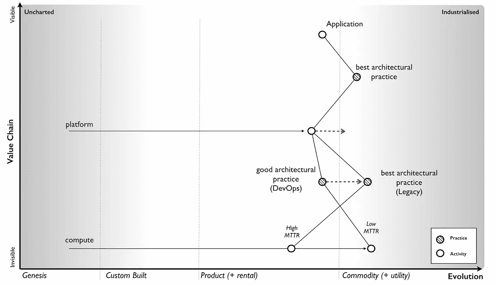
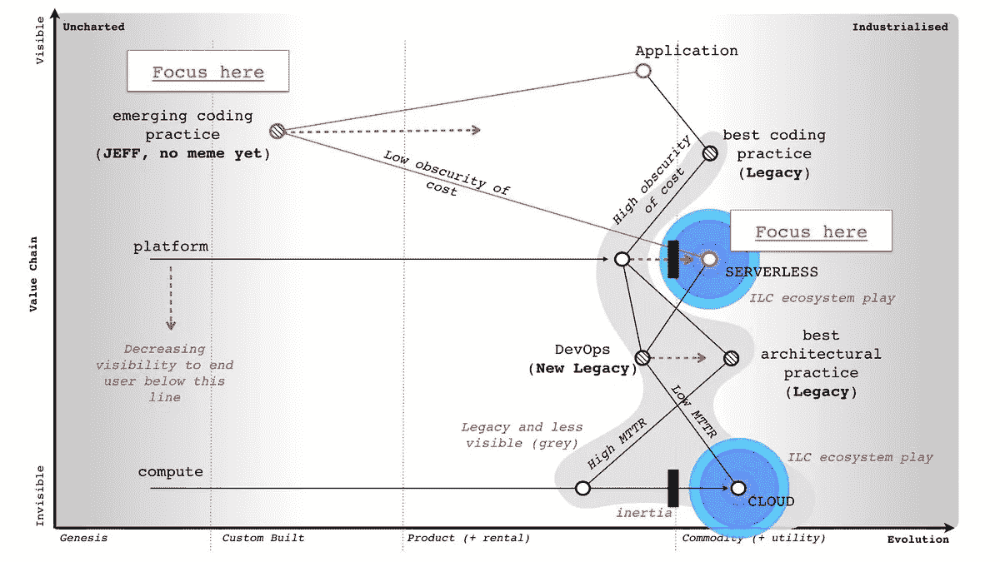

# 挪一下 devo PS——你好杰夫/诺普斯

> 原文：<https://medium.com/hackernoon/move-over-devops-hello-jeff-noops-d194f01df002>

[DevOps](https://hackernoon.com/tagged/devops) 是开发人员和运营人员的无缝结合，作为一个整体来促进快速上市。它可以被认为是将精益或敏捷原则应用于基础设施和运营的方法。它打破了组织内部的孤岛，使团队能够以更快的速度交付软件。

> “[devo PS]是一个跨学科的实践社区，致力于研究大规模构建、发展和运营快速变化的弹性系统。”— Jez Humble

在许多组织中，DevOps 仍然被大量误解，因为在 DevOps 的框架下，专门的部门紧紧抓住那些筒仓不放。对于那些已经成功消除这些孤岛的人，请做好准备，因为游戏已经在发生变化。

DevOps 致力于利用云计算，而[无服务器](https://hackernoon.com/tagged/serverless)则是新的高端产品。正如我们所知，这将需要远离开发运维，甚至更远离运营。

这篇文章探讨了不断发展的技术格局，以及为什么 JEFF 将取代 DevOps。

# 为什么是 DevOps？

第一个问题是 DevOps 为什么存在？

通过云计算的商品化，DevOps 成为可能。通过竞争，三大云计算巨头已经将计算基础设施商品化，并降低了成本。他们改变了我们大规模管理和部署应用程序的方式。传统的高平均恢复时间(MTTR)需要专门的专业运营团队。低 MTTR 云基础设施的进步降低了这种需求，并催生了 DevOps。

DevOps 帮助公司保持竞争力。这意味着利用这些云基础设施商品，而不是试图在内部复制该功能。它使交付团队能够相对轻松地在云服务上建立部署管道和基础设施，并提供卓越的安全性、支持和规模。它消除了对灾难恢复和容量规划等传统做法的需求。

Wardley Map: DevOps emerges to unlock Cloud compute as a commodity

对于采用 DevOps 的公司来说，这意味着在大规模云基础设施上更快地交付软件。

# 杰夫是谁？

好消息是这不是另一个缩写。这是一个笑话术语，Simon Wardley(云计算专家和战略家)用它来描述支持无服务器技术的架构实践的下一次发展。

NoOps 是一个更熟悉的术语，可能会成为这种新的建筑实践。

Wardley Map: New practices (JEFF/NoOps) emerge to unlock Serverless as a commodity

# 无服务器

无服务器是在云计算技术之上形成的高阶系统。它将基础设施抽象到价值链的更下游。这些技术现在使得部署和扩展应用成为可能，而无需考虑基础设施或运行时复杂性。无服务器提供基于消耗的定价，而不是始终在线服务器的成本。

这不是一个新概念，已经存在很长时间了。正在发生变化的是，通过竞争、降低成本和易于进入，无服务器日益商品化。

Zeit 和 Netlify 等新的无服务器提供商利用云计算使大规模运行无服务器变得非常容易，而且没有升级。这就像将提供者链接到您的源 repo 或运行一个 shell 命令一样简单。这是巨大的。它消除了操作，DevOps 成为传统。

这些提供商没有构建自己的计算云。像该行业的其他人一样，他们正在利用云计算的工业化，并围绕云计算构建更高层次的服务和产品。例如，Zeit 在幕后与 Azure、AWS 和谷歌云无缝集成。

# 摘要

随着技术演变成商品，它会向价值链的下游移动。这意味着它变得更加抽象，对它们上面的高阶系统来说更不可见。消费者也越来越看不到它们。

DevOps 的形成是为了使公司能够更快地行动，并部署更可靠和更大规模的软件。云计算的商品化使这成为可能。这是对变化的反应，也是更好地利用技术所需的一套实践和原则。

无服务器现在正通过其商品化再次改变游戏规则。在这种情况下，基础设施和运营在这些专业行业之外变得越来越不可见。

在未来(和现在)，公司可以大规模可靠地部署软件，而无需考虑传统或基于云的操作。这将需要一套新的实践和架构来释放它带来的竞争优势。不管是叫杰夫还是诺普斯，它都在涌现，无处可逃。

这意味着组织需要不断发展以保持竞争力和相关性。对于那些跟得上的人来说，技术的发展越来越允许他们更多地关注产品开发，而不是运营和基础设施支持方面的投资。与技术一起发展的灵活性是成功的关键。