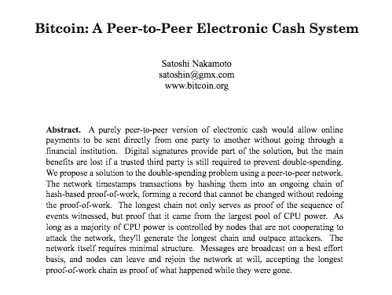

# 前进:每份 ICO 白皮书都应包含的 4 个关键细节

> 原文：<https://medium.com/hackernoon/moving-forward-4-key-details-every-ico-white-paper-should-include-1bf4c57d94b1>

Bitcoin’s white paper

不用说，在过去的一年里，我们已经以一种有点疯狂的方式看到了无数的 ico，其中许多最终成功筹集了数千万或数亿美元。与此同时，大肆宣传(即加密浪潮)也吸引了该领域的一些粗略的参与者，导致了多个欺诈项目(例如 [Prodeum](https://www.wired.com/story/cryptocurrency-scams-ico-trolling/) 、 [Centra](https://www.sec.gov/news/press-release/2018-53) 、 [BitConnect](https://hackernoon.com/bitconnect-anatomy-of-a-scam-61e9a395f9ed) 等)。)或者更一般地说，除了一份白皮书之外，不“应该”(在传统意义上)筹集资金的项目。

然而，在撰写本文时，每天仍会出现新的 ICO(参见 [Coinschedule](https://www.coinschedule.com/) 、 [ICO Bench](https://icobench.com/) 或 [ICO Rating](https://icorating.com/) )，情况也有些相似:项目白皮书是详细描述项目以及项目性质的主要公共工具，用户、投资者和研究人员都必须首先阅读白皮书，以便更好地理解项目。毫无疑问，这是一个有趣的现象。

Source: ICO Token News

此时，典型的 ICO 白皮书包括以下信息(或多或少):

*   简介(问题)
*   解决办法
*   项目描述
*   代币角色、代币动态和生态系统
*   资金用途
*   组
*   路标
*   法律免责声明

在过去的几个月里，我仔细阅读了几十份白皮书(作为管理合伙人进行研究和咨询)，我想指出的是，仅仅有一个关于项目描述、技术细节、象征性经济或团队的名义章节是不够的。

事实上，这些白皮书中肤浅的章节和模糊的内容比比皆是，以至于读者经常被迫搁置，例如，为什么一个项目需要令牌，为什么它首先需要[区块链](https://hackernoon.com/tagged/blockchain)，区块链[技术](https://hackernoon.com/tagged/technology)究竟如何被利用，为什么分散化是相关问题的关键，等等。一些白皮书质量如此之低，以至于令所有人惊讶的是，那些撰写白皮书的人能够为任何事情筹集到任何数量的资金。诚然，这很有趣，但同时也很危险。

展望未来，我相信合法性(就对区块链的技术理解、驱动动机等而言。)最终会取得胜利，这就是为什么我想在下面的文章中添加一些内容

 [## 白皮书需要回答的 4 个问题

### 成功的代币销售或 ICO 有几个必要的组成部分，但如果你不能简洁地回答这 4 个…

hackernoon.com](https://hackernoon.com/4-questions-a-white-paper-needs-to-answer-67a90840ef48) 

—并提出每份 ICO 白皮书都应以清晰、简洁的方式包含的 4 个关键细节:

# 细节#1:本机令牌有任何值的原因

这直接击中了代币经济学的核心。许多项目广泛讨论了某种形式的代币经济学、动力学和激励联合，但往往过于关注其本地代币的“卖方”而非“买方”

换句话说，项目通常基于拥有更多令牌总是更好的假设来构建他们的白皮书。尽管如此，令牌的需求方往往缺乏解释，因为从一开始就不清楚为什么令牌会有任何需求，从而有价值。

为什么一个普通用户会购买令牌来使用这个平台？每笔交易的性质是什么样的？代币的接收者(作为交易的结果)是被激励以任何方式持有代币，还是被激励立即出售代币？为什么不首先使用 ETH 而不是本地令牌呢？

我经常遇到的要点是“用户需要购买原生令牌来参与平台的令牌生态系统。”这到底是什么意思？

# 细节 2:区块链本身的内容

当然，如果存在关于在相关上下文中利用区块链的好处的实质性讨论，例如供应链、身份、健康数据行业等，这将对读者有所帮助。然而，讨论可以更进一步，帮助读者理解区块链本身记录了什么，因为它对应于区块链的相关参数，如透明度、权力下放和隐私。

对于大多数简单的 dApp(比如以太坊)，这将是用户与 dApp 交互时的交易记录。对于更复杂的项目，可以在区块链上注册的内容有了更多选择:

*   以 [Steemit](http://steemit.com/) 为例。正如其 [block explorer](https://steemblockexplorer.com/) 所揭示的，每个 block 包含多种类型的数据，如 upvotes、评论和 Steemit 帖子本身。当然，关于这一纯粹的事实可能会有争论，但绝对值得注意的是，区块链的数据不一定仅限于支付数据。
*   对于身份相关的区块链项目(如[思域](https://www.civic.com/)、[钥匙](https://www.thekey.vip)等)。)，应该明确的是，个人资料不会被登录到区块链，因为这将是对隐私的严重侵犯；相反，[哈希](https://en.wikipedia.org/wiki/Cryptographic_hash_function)是。那么一个详细的问题将是，到底是什么的散列，以及如何散列？
*   在这一点上，类似的机制(即在区块链上放置散列，而不是原始数据本身)应该适用于所有与人工智能相关的区块链项目，因为区块链还不是托管大量数据的最佳选择。每当一个项目声称人工智能、大数据、数据市场和数据科学等热门词汇时，区块链上到底记录了什么的细节在很大程度上一直是模糊的。

上述问题的原因是，区块链上的任何内容实际上都是以分散方式公开提供的任何内容。这就是透明度和隐私成为讨论话题的地方，这取决于选择哪些数据放在区块链上，要么是为了提高透明度，要么是为了其他目的。

与此同时，应该注意的更基本的一点是，选择放在区块链上的那些数据片段应该“足够重要”,首先值得一个不可信的系统(例如区块链)。换句话说，将区块链用于比特币是有意义的(因为金融数据可以受益于一个不可信的系统)，而将区块链用于无关紧要的数据(例如，男性拥有多少鲑鱼短裤)则没有意义。

# 细节#3:相关技术细节

请注意，“技术”细节和“相关技术”细节之间有着不小的区别，尤其是在区块链领域。当然，白皮书应该在一定程度上包括技术细节(例如，项目旨在利用哪个平台)。然而，问题是，许多白皮书中出现的许多技术细节在相应的区块链项目计划中往往并不相关。

例如，尽可能以最正式的方式陈述[纳什均衡](https://en.wikipedia.org/wiki/Nash_equilibrium)(以及[帕累托最优](https://en.wikipedia.org/wiki/Pareto_efficiency)或[梅特卡夫定律](https://en.wikipedia.org/wiki/Metcalfe%27s_law))的定义，在任何实际意义上都不会有助于一个人的令牌经济学模型。类似地，定义椭圆曲线的 [Weierstrass 形式](http://mathworld.wolfram.com/WeierstrassForm.html)意味着什么，以及[群论](http://mathworld.wolfram.com/EllipticCurveGroupLaw.html)如何在[椭圆曲线加密](https://en.wikipedia.org/wiki/Elliptic-curve_cryptography)的上下文中工作，在应用加密技术使数据安全时并不是最相关的。即使相关，太多多余的形式主义对任何人都没有帮助，只会让读者困惑。

另一方面，清楚地表明自己对 IPFS 的理解很重要，例如，特别是如果一个项目的成功取决于 IPFS 协议的话。除了个人的理解之外，论文(在这种情况下)必须展示项目如何利用 IPFS 以解决问题的方式实现一些有意义的事情。

如果一个人决定在白皮书中间插入一个看似技术性的数学公式(例如 [logit function](https://en.wikipedia.org/wiki/Logit) ),其原因和背景也应该非常清楚。

# 细节#4:去中心化的原因和程度

显然，权力下放的概念在过去的一年里被大肆宣传，几乎是以一种滥用的方式。大部分区块链项目在启动 ICO 之前是否已经深入思考了权力下放的影响，这是相当值得怀疑的。这是因为许多白皮书根本没有分析权力下放，以及如何以失去集中效率为“代价”让某些行业受益。

例如，白皮书应该能够回答(或至少解决):

*   在给定的行业环境中，分散模式与集中模式相比如何，
*   不管权力下放是否是解决某些问题的唯一途径，
*   权力下放的程度，
*   以及对权力下放程度的成本效益分析。

后两点特别有意思，因为权力下放的程度一直是利害攸关的热点问题，是项目和社区之间正在进行的辩论。参见[以太坊](https://github.com/ethereum/wiki/wiki/White-Paper) vs [EOS](https://github.com/EOSIO/Documentation/blob/master/TechnicalWhitePaper.md) (针对智能合约平台)[exim chain](https://www.eximchain.com/)vs[ambroses](https://ambrosus.com/index.html)(针对供应链平台) [Civic](https://www.civic.com/) vs [uPort](https://www.uport.me/) (针对身份平台) [Thunderella](https://eprint.iacr.org/2017/913.pdf) (一种试图通过让两个链并行来同时实现两个去中心化程度的协议)[比特币](https://bitcoin.org/bitcoin.pdf) vs

从本质上来说，不管具体情况如何，权力下放是绝对最佳的选择这一观点并不是最合理的。因此，白皮书确实应该对这个问题进行一些思考，而不是盲目地赞美这个时髦的词，这将有助于读者首先更好地理解权力下放的相关性。

# 结束语

总而言之，不可否认的是，区块链/ICO 领域仍然相当新，因此在许多方面都是高度实验性的。虽然目前炒作和市场之间的差距明显存在，但没有人知道市场的活跃将持续多久，或者整个空间将在未来几个月或几年内如何演变。

也就是说，随着时间的推移，越来越多的合法玩家进入这个领域，这个领域中不成熟项目的数量肯定会减少。既然如此，我希望每一份即将发布的 ICO 白皮书都能够详细阐述上述四点，更好地向读者展示与区块链相关的创新理念，从而改善整个区块链空间。