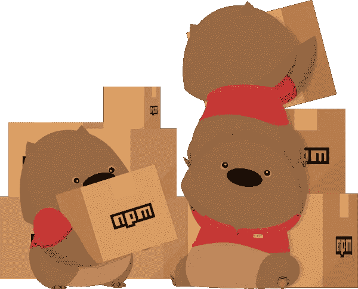

# 将项目的组件/服务转移到包中(关注点的分离)

> 原文：<https://medium.com/hackernoon/moving-projects-components-services-into-packages-the-separation-of-concerns-1f42661eac6e>

> [**基于组件的软件工程**(**【CBSE】**)，也称为**基于组件的开发** ( **CBD** )，是软件工程的一个分支，它强调对给定软件系统中广泛可用的功能进行关注点分离。](https://en.wikipedia.org/wiki/Component-based_software_engineering)

在基于组件的架构高度流行的今天，每个现代 UI 框架都提供了组件结构的方法。看看这篇[文章](/@dan.shapiro1210/understanding-component-based-architecture-3ff48ec0c238)的利弊。我在 CBA 最喜欢的就是关注点的分离😎

无论是开始一个小的项目还是有一个大的项目，关注点的分离都将是易维护性、可测试性、可重用性的关键点。如果你是 UI 工程师，你应该听说过 [npm](https://www.npmjs.com/) 包管理器。这是将可重用组件和服务转移到那里的好方法。

我为什么要这么做？☝️1。便于团队间分享
2。集成于一行- ***导入*** *包* ***从*** *【包】*
3。维护保养
4。测试
5。[语义版本](https://docs.npmjs.com/getting-started/semantic-versioning)
6。私有或公共(社区可能有助于改善)

如果你想有一个[私人套餐](https://docs.npmjs.com/private-modules/intro)也是可以的。

作为一个例子，你可以检查这个项目。

 [## 创建-反应-还原-应用-结构

### 使用构建配置创建 react redux 应用程序结构

www.npmjs.com](https://www.npmjs.com/package/create-react-redux-app-structure) 

在依赖列表中，它有 4 个公共包，由开源社区检查和改进👌([无互联网](https://www.npmjs.com/package/no-internet)，[发布-订阅-js](https://www.npmjs.com/package/publish-subscribe-js) ，[设定-区间](https://www.npmjs.com/package/set-interval)，[知名度](https://www.npmjs.com/package/famulus))。

**如何创建 npm 包？**

查看官方[文档](https://docs.npmjs.com/getting-started/creating-node-modules)。[roll up](https://rollupjs.org/guide/en)(JavaScript 模块捆绑器)可以帮助你为 JavaScript ES6 修订版中包含的代码模块创建一个新的标准化格式。

除了关注点的分离，我想提一下“模式库”作为收集用户界面设计元素的一种方式。查看这篇[文章](https://boagworld.com/design/pattern-library/)以获得更多理解💪

有些想法是这里[那里](https://www.funfunforum.com/t/does-anyone-move-projects-shareable-components-services-into-npm-packages/5218)的:

👏**感谢您的阅读。欢迎提出建议、意见和想法**👍

**如果你喜欢这个，鼓掌吧，跟着我上** [**中**](/@shystruk) **，** [**推特**](https://twitter.com/shystrukk) **，**[**github**](https://github.com/shystruk)**分享给你的朋友们**😎