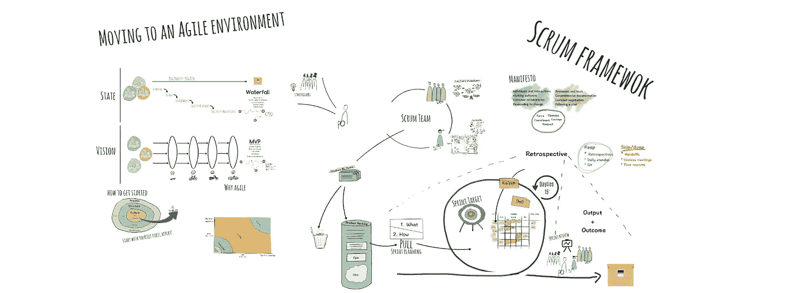

# 走向敏捷环境(第三部分)——通过经验进行 Scrum

> 原文：<https://medium.com/hackernoon/moving-to-an-agile-environment-part-iii-scrum-by-experience-35fb7b5af563>

> 亲爱的读者，我偶然看到这篇文章，想告诉你我几个月前的一次经历——从瀑布环境转移到敏捷环境的经历。我既不是敏捷专家，也不是 Scrum 专家，但是我会告诉你我从自己的经验中学到的东西，以及我从一些书籍和文章中找到的东西。这是第三部分。

我一直在和你谈论关于[敏捷](https://hackernoon.com/tagged/agile)和 Scrum 的部分 [I](https://hackernoon.com/moving-to-an-agile-environment-part-i-getting-started-4ed049d2b0c0) 和 [II](https://hackernoon.com/moving-to-an-agile-environment-part-ii-scrum-by-the-book-5733dc6bee3e) ，本质上是关于我从[书籍](https://hackernoon.com/tagged/books)，文章，博客帖子，视频……你能想到的。但从所有这些中，我发现了一些差距，一些不适合在一起的小片段，或者一些我们发现不太适合我们团队的“照章办事”的规则。

记住，**敏捷就是应该敏捷！不要试图盲目地遵循所有的“规则”。调整你的方法，让它最适合你的目的，但是说实话，如果你调整得太多了…可能你没有做对。**

我将讲述我发现对我和我的团队更重要的话题，但这并不意味着你们会面临完全相同的问题。如果你面临其他问题，请随时联系我，也许我可以帮你。

# [跨职能](https://www.scrumalliance.org/community/articles/2014/june/success-story-cross-functional-scrum-teams)团队

在第二部分[中](https://hackernoon.com/moving-to-an-agile-environment-part-ii-scrum-by-the-book-5733dc6bee3e)(部分“开发团队”)我已经说过开发团队应该是[跨职能的](https://www.scrumalliance.org/community/articles/2014/june/success-story-cross-functional-scrum-teams)。必须去掉头衔和角色，心态是*“我是负责完成这项工作的团队成员，我无法独自完成”*。这意味着，既没有“后端”也没有“前端开发人员”。

好吧，我明白了。我们的目标是让每个人都能够在没有“放手”的情况下自主地交付用户故事。这将使事情更容易管理，但…这对我们不起作用。我们在最初的冲刺阶段尝试过，但很糟糕。

我们目前正在使用 [React Native](https://facebook.github.io/react-native/) 开发一个新的移动应用，它是 [JavaScript](https://hackernoon.com/tagged/javascript) ，在服务器端我们有一个用 Java 构建的 API。我必须说，我和 Java 并没有“牵着手走下去”，这对于我和团队中的其他前端开发人员都是有效的，对于我们的后端开发人员和 JavaScript 也是如此，更具体地说，就是在这种情况下的反应。

所以…跨职能…如果我们都试图开发后端和前端，我们会严重影响我们团队的绩效/速度。但是我们决定试一试。

我们建立了两个 Scrum 团队，每个团队有 5 名开发人员(3 名 JS 熟练人员和 2 名 Java 熟练人员)，让 Java 开发人员专注于后端事务，JS 开发人员专注于前端事务。但是没花多少时间就失败了…第一次的梳理只是…糟糕。我如何对后端任务进行评估？他们已经有大量可以重用的模块和服务，不同的 SQL 和 Mongo 数据库，而我对它们一无所知。我如何知道完成某个故事的努力？他们如何衡量前端任务？他们不知道 React，可能在这个项目开始之前从未听说过 Redux，我们必须建立一个非常模块化的架构来支持多个品牌和定制，这是他们从未做过的事情。

双方都有太多东西需要学习，保持“跨职能”的心态是不负责任的。因此，我们重新安排了这两个团队，现在一个是前端团队，另一个是后端团队。每个人都有自己的故事和冲刺积压。

这使得团队管理变得更加困难，因为 Scrum 大师和产品负责人必须保持两个团队同步，以便遵循相同的路径。

我们尝试让“后端”团队总是比“前端”团队领先一步，这样前端开发人员就可以使用 API 并构建他们的 ui。但这并不总是正确的…有时产品待办事项列表中项目的优先级会发生变化，一个新的用户故事会被放在产品待办事项列表的顶部。这意味着两个团队将在下一个 sprint 中从事相同的工作。

在这种情况下，每个开发团队的一个成员坐在一起几分钟，讨论什么是“服务签名”。他们会定义:

*   API 端点
*   HTTP 方法
*   请求数据结构
*   响应数据结构(成功和失败场景)

一旦定义了这一点，前端开发人员就可以模拟 API 的响应并构建 UI。一旦后端开发关闭，前端开发人员只需删除模拟并执行`request`。

# [国防部——完成的定义](https://www.scrumalliance.org/community/articles/2008/september/what-is-definition-of-done-%28dod%29)

现在，我相信你已经知道什么是国防部了。仅仅是一组必须满足的条件，因此某个故事可以被标记为完成！这里有一个国防部的例子:

*   符合棉绒规则
*   测试覆盖率超过 80%
*   代码审查
*   UX 评论
*   证明文件

到目前为止，一切顺利，对吧？这里没什么问题。但是，如何确保所有这些条件都得到满足呢？基于审核者的批准？一开始我们会说“当然。这就是为什么我们有拉请求和代码审查”。嗯……今天我不太确定。好的，评审者在这里有一个重要的角色，他是拥有最终决定权的人，“合并或谴责！”但是我们可以让他的生活轻松一点。

我们推出了 [git 挂钩](https://git-scm.com/book/gr/v2/Customizing-Git-Git-Hooks)。现在，没有人能够执行有棉绒问题的`git commit`，测试覆盖率低于 80%的`git push`也是不可能的(除非你强迫它)。(除此之外，我们还将开始验证提交消息，以便借助 [commitizen](https://github.com/commitizen/cz-cli) 和[conventi on-changelog](https://github.com/conventional-changelog/conventional-changelog)，获得更清晰的 git 历史和自动更改日志)。

这确保了开发人员在执行拉请求时至少已经满足了这些条件，并且将评审人员从检查测试覆盖和林挺中解放出来。(我必须承认，我已经不止一次对林挺问题提出过要求)。

# 冲刺目标、故事点、团队速度

好，你如何定义你的**冲刺目标**？基于您的**团队速度**。

你如何定义你的团队速度？基于你通常在每次冲刺中完成多少**故事点**。

我们取得了多少分数？很简单，把所有标有 **done** (DoD)的故事加起来，就是你的速度。**不，“几乎完成”并不等于“完成”**！

这是我们面临的问题。

嗯，我有一个故事，只需要一点小小的改变，它就完成了。我应该在这次冲刺的速度中考虑它吗？”

"*这个故事有 8 个点，我是否应该认为在这个冲刺阶段完成了 6 个点，剩下的 2 个转移到下一个？*”

这些可能是愚蠢的怀疑，但是嘿！就像我说过的…我不是 scrum 大师，我们才刚刚开始。

我们发现，你根据最后 N 次冲刺的速度来记录团队的速度。这是一个平均值，所以…如果故事“几乎完成”并不重要。它没有进入冲刺速度，它将全部 8 个点转移到下一个冲刺，并被标记为**完成**，而实际上是**完成了！**根据“最后 N 次冲刺的平均值”,你会得到完全相同的结果。

离群值呢？糟糕透顶的冲刺，或者一半的团队都在度假？这对团队速度有什么影响？

我相信我们都有一些这样的经历。比如圣诞节，那一到两周办公室几乎空无一人。那次冲刺的速度和之前相比会很恐怖，对吧？所以干脆丢弃吧。不要把它考虑在整体的速度上。过去两三个月中的一次冲刺不应该严重影响速度，保持冲刺速度的目标是估计“到目前为止我们能做多少？”，或者“我们需要多长时间才能实现这些目标？”。那个“圣诞节冲刺”不会帮助你达到一个更好的估计。

好的，团队速度？检查！

但是“圣诞冲刺”期间办公室里的那些家伙呢？他们仍然需要一个冲刺目标，一个冲刺回顾和回顾。但是这次冲刺我们没有一半的团队，这是否意味着冲刺目标一定是之前的一半？70%, 60%?嗯，我相信即使只有半个团队也能做到。但是我们认为“嗯……也许在这个冲刺阶段有这么多有点让人不知所措”。所以我们稍微改变了一下策略。对于特定的冲刺，我们将忘记 Scrum！没错。没有冲刺规划，没有冲刺目标。这次我们将按照**看板**进行，我们将拭目以待。开发团队成员只需进入产品待办事项列表，并在它的顶部抓取一个故事。就这么简单。

# 潜在可发货产品和 CI/CD

是的……潜在的可发布产品(PSP)是你必须在每个 sprint 结束时实现的工作版本。我说的“工作版本”是认真的！“无 Bug ”,随时可以部署到生产中！但是如何实现呢？

要实现敏捷环境，你需要的最重要的东西肯定是健康的心态，人们信任并相信它。但是你也需要一些工具来帮助你的日常工作。我认为实现 PSP 不可或缺的工具之一是[持续集成/持续交付(CI/CD)](https://www.atlassian.com/continuous-delivery/ci-vs-ci-vs-cd) 设置。

有很多关于 CI/CD 的内容要谈，但我不会讲得太详细。事实上，如果你对如何执行一个 web 项目的简单设置感到好奇，你可以看看“ [CI/CD with GitHub，Travis CI and Heroku](https://codeburst.io/ci-cd-with-github-travis-ci-and-heroku-e088a24f32ef) ”。

我们的 CI/CD 与上面提到的文章中的略有不同，因为它是一个移动应用程序(Android 和 iOS 都使用 [React Native](https://facebook.github.io/react-native/) ),但最终我们拥有的设置是:

*   克隆项目(git)
*   执行林挺和测试(如果失败，则不交付)
*   构建项目
*   发布它(“交付”)

这使得我们能够在每个 sprint 结束时交付我们的项目。这种交付总是发生在“演示”环境中，只有当产品所有者决定投入生产时才进行。

问题是…单元、集成和 end2end 测试能确保我们的新版本真的是 PSP 吗？这当然有帮助，但答案是“没有”。你需要质量保证。

直到今天，我们在公司的经历是一个开发阶段，然后是一个“认证”阶段，在这个阶段可能会出现错误修复。这不符合敏捷，不符合我们新的“冲刺”方法。因此，我们的目标是在 sprint 期间跟踪团队开发，编写并执行验收测试的人，这可以是 QA 专家(首选)，甚至是开发团队成员。重要的是成为一个没有参与开发的人。在我们的团队中，我们的目标是有一个 QA 专家，但这仍然是一个 WIP。

这些是我们过去几个月面临的最大问题。我们只是从 Scrum 开始，但是我相信我们做得很好。

这些文章的目的不仅仅是向你展示 Scrum 是什么以及如何实现它。我也有机会听到你的声音。也许我做错了什么，或者有更好的方法来处理一些特定的问题。

在这种情况下，我希望得到您的反馈，并有机会学习，让我们的环境每天都变得更好。

希望这些文章对你有所帮助。

(万一你错过了，这里是部分 [I](https://hackernoon.com/moving-to-an-agile-environment-part-i-getting-started-4ed049d2b0c0) 和 [II](https://hackernoon.com/moving-to-an-agile-environment-part-ii-scrum-by-the-book-5733dc6bee3e) )。

感谢[奥雷利奥·皮塔](https://medium.com/u/cc6a2f8c742f?source=post_page-----35fb7b5af563--------------------------------)、[迪奥戈·卡多佐](https://medium.com/u/3e361db802db?source=post_page-----35fb7b5af563--------------------------------)、鲁本·弗雷塔斯和 [TRS](https://medium.com/u/80de3272af2c?source=post_page-----35fb7b5af563--------------------------------) 在这一点上的投入！