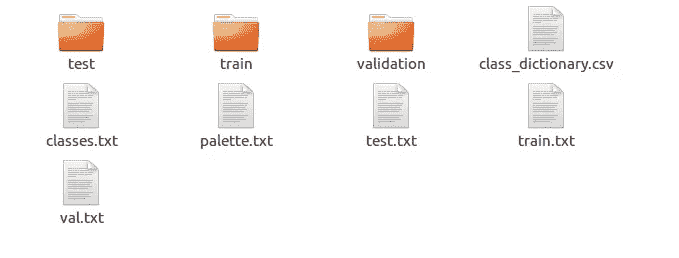
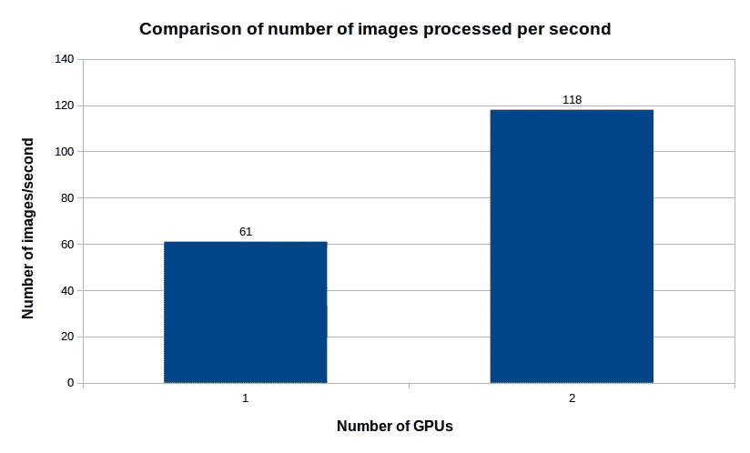
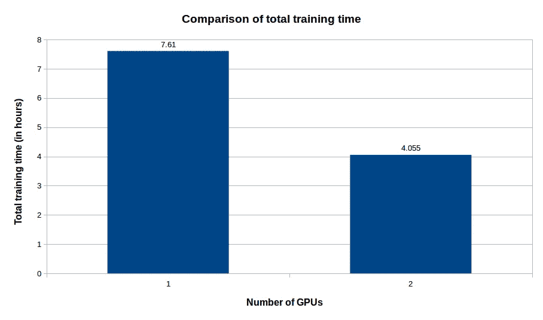

# 使用 Brain Builder 和 TensorFlow 进行多 GPU 训练

> 原文：<https://medium.com/hackernoon/multi-gpu-training-with-brain-builder-and-tensorflow-3b7aba2eb84b>

是的，造 AI 很难！数据注释、培训和部署的每一步都有其自身的挑战。这篇博文将尝试解决其中的前两个问题:

*   数据注释
*   培养

在过去的几年里，在 Neurala 公司，我们一直在开发高效的人工智能系统，目前已经部署在数百万台消费设备上！在这个过程中，我们开发了许多工具来简化我们的工作流程。我们最终决定通过公开我们的一些工具来弥合人工智能技能的差距。其中一个工具 Brain Builder 处理了前面提到的第一个问题:数据标注。

[Brain Builder](https://info.neurala.com/brain-builder) 是一个人工智能辅助的注释工具，可以无缝地融入常用的框架，如 [TensorFlow](https://hackernoon.com/tagged/tensorflow) 和 Caffe。这篇文章将带你完成将大脑构建器整合到你的人工智能工作流程中的步骤。我们将使用 Brain Builder 标记的数据和使用 TensorFlow 和 Keras 编写的模型来建立语义分割网络。

语义分割是计算机视觉经常遇到的应用之一。它的任务是用*类*标记图像的每个像素。它广泛用于图像分析，并支持智能手机上的人像模式等应用。下面的教程将描述如何使用自己的数据创建语义细分模型来对人进行细分，并使用 Brain Builder 和 TensorFlow 在多个 GPU 上对其进行训练。

# 使用大脑构建器的数据注释

数据注释是构建人工智能系统最关键的一步，因为这是你的模型所要学习的。深度学习模型的好坏取决于它所输入的数据！Brain Builder 可以帮助您管理高质量的数据集，并拥有人工智能辅助工具来加快数据管理步骤。

Brain Builder 最重要的功能之一是自动视频标记。人工智能辅助的视频标记可以让你在很短的时间内收集大量数据，方法是从以非常高的帧速率录制的视频中提取帧并标记帧。

以下视频展示了使用 brain builder 为视频中的人添加标签的过程:

AI-assisted Video Tagging using Brain Builder

正如你所看到的，仅仅通过标记视频中的第一帧，你就在几分钟内积累了近 500 个标记的人物帧！完成标记和导出数据后，您将从 Brain Builder 获得一个压缩文件，其文件夹结构如下:



Brain Builder TensorFlow export folder structure

该文件夹包含 TensorFlow 读取和处理数据集所需的所有内容。所有地面实况图像都是*类索引标记的 png*，其中图像中的每个像素对应一个类索引。文件 *class_dictionary.csv、classes.txt 和 palette.txt* 为您提供了关于类索引到其后续 R、G、B 值的映射的详细信息，您可以稍后使用这些信息来可视化您的结果。

我们现在将使用 TensorFlow 和 Keras 编写一个流行的语义分割架构，名为 [UNet](https://arxiv.org/abs/1505.04597) 。使用估算器和 TensorFlow 数据集 API，我们可以在多个 GPU 上进行训练，从而大幅减少训练时间！

(请注意，我们在实现中稍微修改了 UNet，以使实验速度更快！)

# 使用张量流估计器和数据集 API 的多 GPU 训练

Keras 与 TensorFlow 的端到端集成使得使用 TensorFlow 估算器和数据集 API 对 Keras 模型进行多 GPU 训练变得非常容易。

## 张量流估计量

**估计器**类代表一个模型，以及这个模型应该如何被训练和评估。使用估算器的一些主要优点是:

*   基于估算器的模型可以跨多个 GPU 运行，而无需更改模型代码；
*   评估者简化了开发人员之间模型实现的共享；
*   评估人员为您构建图表，并消除了明确的(相当痛苦的)会议的需要。

以下代码创建了一个 Keras 模型，对其进行编译，并将其转换为 TensorFlow 估算器:

```
dataset = TFDatasetLoader(data_dirpath, input_size, n_classes, batch_size, num_epochs)
model = UNet(input_size, n_classes)
model.compile(optimizer=tf.train.AdamOptimizer(learning_rate=0.01), loss='binary_crossentropy', metrics=['accuracy'])strategy = tf.contrib.distribute.MirroredStrategy(num_gpus=num_gpus)
config = tf.estimator.RunConfig(train_distribute=strategy)
estimator = tf.keras.estimator.model_to_estimator(model, config=config)
```

如果你熟悉 Keras，你唯一会注意到的新东西是最后三行代码。我们用于多 GPU 训练的策略叫做`MirroredStrategy`。在这种策略中，每个 GPU 都有一个图形副本，并获得一个数据子集，在此基础上计算局部梯度。一旦计算出局部梯度，每个 GPU 就会等待其他 GPU 以同步方式完成。当所有梯度都到达时，每个 GPU 对它们进行平均，并更新其参数，然后开始下一步。你可以在[这个](https://www.youtube.com/watch?v=bRMGoPqsn20)链接上了解更多关于分布式张量流训练的信息。

既然已经定义了策略，我们就使用该策略创建一个`RunConfig`对象，并使用它来调用`model_to_estimator`函数，该函数将 Keras 模型转换成一个估计器对象。

准备好估计器后，我们可以使用这两行代码简单地训练和评估它:

```
estimator.train(lambda:dataset.imgs_input_fn(mode="train"), hooks=[time_hist])
estimator.evaluate(lambda:dataset.imgs_input_fn(mode="val"))
```

在这两个调用中需要注意的重要事情是`dataset.imgs_input_fn`函数。该函数使用 TensorFlow 数据集 API 向模型提供数据。

## 张量流数据集 API

Dataset 是一个高效的数据输入 API，它与估算器和 tf.Keras 结合得很好。新输入管道的核心是`Dataset`(也许还有`Iterator`)。一个`Dataset`是一个`elements`的集合，每个都有相同的结构，其中一个元素可以是一个或多个张量。一个元素内部不同的张量叫做`components`。每个组件都有特定的数据类型和形状，但是一个元素中的不同组件可以有不同的数据类型和形状。

下面的代码片段显示了如何创建可以提供给评估者的 dataset 对象:

```
dataset = tf.data.Dataset.from_tensor_slices((image_paths, gt_paths))
dataset = dataset.map(lambda image, label: tuple(tf.py_func(
 self._one_hot_gt, [image, label], [tf.string, tf.uint8])))
dataset = dataset.map(self._data_to_tensor)
dataset = dataset.repeat(self.epochs)
dataset = dataset.batch(self.batch_size)
dataset = dataset.prefetch(self.batch_size)
```

需要注意的重要函数是`map()`函数，它允许您读取数据并以任何方式处理数据(调整大小、一键代码等)。`repeat()`让您指定想要迭代这个数据集的次数。`batch()`根据用户提供的批次大小自动对数据进行批处理，并在处理当前批次时`prefetch()`预取下一批次。

# 训练结果和速度对比

我们在两个 NVIDIA GTX1080 GPUs 上训练我们的分段模型 100 个时期。该模型仅用大约 4 个小时的训练就达到了大约 91%的像素精度。以下是我们测试中的一些比较:



正如你所看到的，使用两个而不是一个 GPU 使我们的速度提高了近 2 倍，以达到相同的精度水平。

我们希望本教程能够帮助您理解如何将 Brain Builder 集成到您的人工智能工作流中，以建立高效的数据准备和训练管道。我们欢迎来自社区的反馈，以便能够进一步改进 Brain Builder！

[你可以在这里注册大脑建造者测试版](https://info.neurala.com/brain-builder)。请在下面留下您对教程和/或大脑构建器的反馈、功能需求或任何其他问题的评论。

你可以在[这个链接](https://github.com/neurala/Neurala-Tutorials/tree/master/01_multi_gpu_tf_keras)上找到本教程的代码。