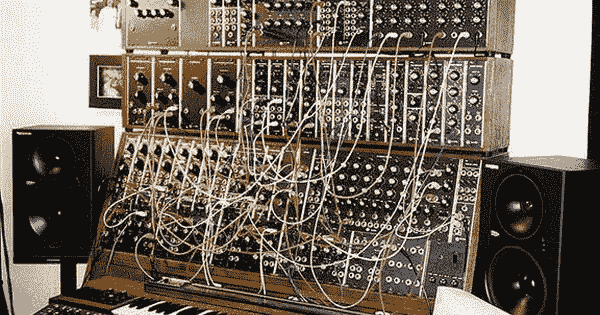

# 音乐、科技和我

> 原文：<https://medium.com/hackernoon/music-technology-and-i-caf6a620a018>

很少有人知道我有另一个自我，也许我不是蝙蝠侠，但很接近。在一个与[编程](https://hackernoon.com/tagged/programming)和[创业](https://hackernoon.com/tagged/entrepreneurship)并行的世界里，我称自己为 blackcerv。

在成为一名开发人员，甚至有一个我对技术感兴趣的想法之前，我最大的激情是音乐。从十二岁起，我每天下午都呆在房间里，用我的吉他、踏板和笔记本电脑发出奇怪的声音。

那是美好的时光。每天我都迫不及待地想离开学校回家重新开始，这不是为了出名，而是为了创造有声音的风景，把那些动觉的感觉变成现实。把我的感受转化为频率。仅此而已。

时间一直在流逝，我内心的不安依然存在，也许我很快就会花足够的时间来制造新的奇怪声音，用扭曲的电路做出新的创造。

你呢？你是否有任何激情推动你去创造伟大的事物？如果是，请告诉我。