# 音乐杂志

> 原文：<https://medium.com/hackernoon/musicmagal-c93e9dabd01a>

## 是时候有人集体推荐音乐了。

音乐爱好者？推荐系统的粉丝？如果你像我和我的朋友[丹尼尔·弗兰奇](https://medium.com/u/52a468a43db0?source=post_page-----c93e9dabd01a--------------------------------)，你热爱音乐，并广泛使用像 [Spotify](https://www.spotify.com/) 和[这样的服务。Fm](https://www.last.fm/) 获取新音乐(并追踪你的旧音乐习惯)。

这两个和其他像 [Shazam](https://www.shazam.com/) 、 [Apple Music](https://www.apple.com/il/music/) 和 [Pandora](https://www.pandora.com) (仅举几个例子)利用机器学习、信号处理、强大的硬件系统和**巨大的**音乐和用户相关数据库，安静而优雅地提供你最可能喜欢的艺术家的新专辑、曲目和播放列表。

在 Spotify 的例子中，[Discover weekly](https://www.spotify.com/il/discoverweekly/)每周都会给我一个新的播放列表，里面有 30 首新曲目，完全符合我的口味。几个朋友喜欢并分享我的音乐品味(至少在某种程度上)，并在我公开这个播放列表后关注我的版本。然而，这并没有解决一个小问题。

> 如果我们想让音乐同时推荐给我们所有人呢？

丹尼尔和我开始考虑一个假想产品的应用。如果你在参加聚会前和朋友一起玩游戏，而选择的播放列表需要让每个人都满意，该怎么办？还是学习会？还是健身房？为什么连夜总会都没有？想象一下。一个夜总会，每个人都在入口处记录他们的喜好，音乐享受在团体层面上均衡优化。

Spotify 为什么不解决这个问题？为什么这个领域的大领导者不提供一个像描述的那样的产品？我们决定研究这个问题，我们的发现导致了《音乐杂志》的诞生。

如果你更喜欢这个故事的代码版本，你可以查看 [**公共知识库**](https://github.com/alexing/musicmagal) 。

所以，让我们更深入地讨论这个问题。

# 推荐系统

Spotify, Last.Fm, Shazam, Pandora and Apple Music. Just to name a few on the music market.

有一大类 web 应用涉及预测用户对选项的反应。这样的商品叫做**推荐系统**。推荐系统的三个好例子是:

*   基于对读者兴趣的预测，向在线报纸读者提供新闻文章。
*   基于在线零售商的顾客过去的购买历史和/或产品搜索，向他们提供关于他们可能想要购买什么的建议。
*   根据用户过去的收听习惯为他们提供新的音乐(我们的项目就是基于这种情况)。

推荐系统使用许多不同的技术。我们可以把这些系统分为两大类。这两类人各有利弊。

*   **基于内容的系统**检查推荐项目的属性。例如，如果 Spotify 用户听了许多金属歌曲，那么推荐一首在数据库中归类为“金属”流派的歌曲。这导致了丰富的艺术家种类；可以推荐各种作品，包括未评级的作品。为了实现这一点，有必要通过使用实用的数据库来将用户偏好与音乐内容相关联，在该数据库中，大多数用户倾向于将少数几首乐曲评为最喜爱的。然而，还没有建立可靠的方法来做到这一点。这是因为在开发音乐检索系统方面已经投入了大量的注意力，在音乐检索系统中，代表用户偏好的查询是由用户准备的。
*   **协同过滤**系统基于用户和/或项目之间的相似性度量来推荐项目。推荐给用户的项目是相似用户偏好的项目。如果 Alex 听过《少年梦》和《停不下来的感觉》，Daniel 听过《少年梦》、《停不下来的感觉》和《Despacito》；那么亚历克斯很可能会喜欢《德帕西托》。
    一个主要的缺点是作品不能被评级。例如，不能推荐新发行的 CD 和小调。所以遇到意想不到的心仪作品的机会并不多。第二个问题是推荐作品的艺术家往往是相同的，并且通常为目标用户所熟知。这样的建议可能不尽人意或者毫无意义。

# **团体推荐**

群组推荐是一个新的任务，在这个任务中，一件商品被推荐给一群将一起消费它的用户。这项任务的挑战是模拟和匹配整个群体的口味，即使只有个人偏好是已知的。关于如何以某种方式结合个人偏好来产生群体口味，在学术文献中有各种不同的建议。在研究和阅读了大量有趣的论文后，我们决定尝试一下我们自己的定制方法。

# **工具**

在这个项目中，ython 3 是我们的主要盟友，因为所有的东西都是用这种语言开发的。有时以纯 Python 脚本的形式，但主要使用 [Jupyter 笔记本](http://jupyter.org/)和一些 Python 开发的库或框架。
[Pandas](https://pandas.pydata.org/) 是我们主要的数据分析和探索工具，我们在深度学习部分使用了 [Keras](https://keras.io/) 和 [TensorFlow](https://www.tensorflow.org/) (对！深度学习！❤).
同样，在我们工作管道的第一部分，我们使用了 [Implicit](https://github.com/benfred/implicit) ，这是一个快速的 Python 库，用于隐式数据集中的协作过滤。

# **数据集**

起初，我们的主要想法是使用 Spotify 的 Web API，或者实际上是它的 python 包装器 Spotipy 来构建我们自己的数据集。然而，为了获得大量的呼叫样本，我们需要大量的用户输入他们的凭证和大量的查询，以尽可能多地获得他们的收听历史(因为 Spotify 的 API 不允许你一次访问你的全部历史)。显然，这将是痛苦的，缓慢的，不值得的痛苦。

相反，我们在网上找到了[一个已经废弃的数据集，来源于 Last。Fm](http://www.dtic.upf.edu/~ocelma/MusicRecommendationDataset/lastfm-1K.html) 。这个数据集的关键特征是它是隐式的。这意味着我们没有直接或明确的质量衡量标准(例如，五颗星中有多少颗星)，我们有一个间接的标准:这首歌被听了多少次。因此，含蓄。在做一些探索时，我们发现了一些有趣的信息。

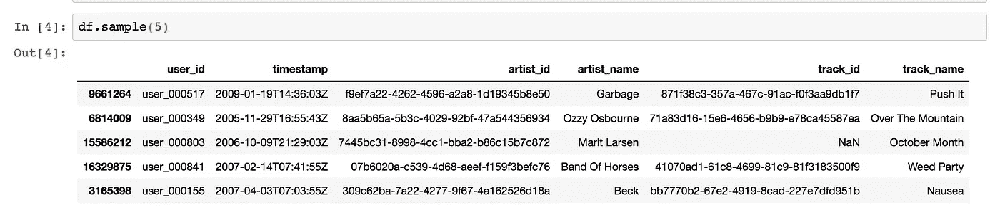

这是数据帧的样子。基本上，每一行计为曲目 *i* 的用户 *u* 的一次播放。在采样的第一行中，您可以看到用户' *user_000517* '已播放曲目'*871 f38 c 3–357 a-467 c-91ac-f 0 F3 aa 9 db 1 f 7*'，这是由“垃圾”进行的“推送”。它还包含一个时间戳。

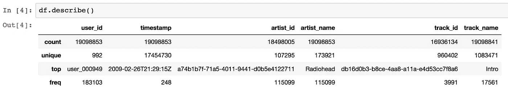

从描述中我们还得到了有趣的见解:

*   最后。调频用户倾向于喜欢电台司令
*   歌曲最常用的名字是 Intro(这很有意义)
*   我们从大约 1000 名用户那里获得了数据
*   大约有 960，000 首不同的曲目，这使得推荐系统非常多样化
*   约 10.7 万名不同的艺术家
*   唯一估计值对于 artist_id 和 artist_name 有不同的值…这意味着什么？稍后将详细介绍。

所以，顺着电台司令的线索，我们发现了以下情况:

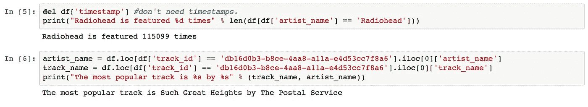

由于听得最多的歌曲不是“Despacito”或“Gangnam Style ”,我们怀疑数据集偏向于独立摇滚。

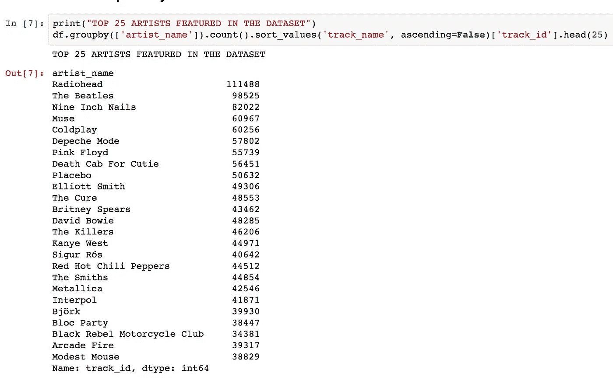

除了伊恩·柯蒂斯乐队有趣的打字错误，这证实了偏见。**数据集确实偏向独立摇滚。**还有，yey！电台司令太棒了。
那么，现在有哪些与艺人 id 和艺人名字金额不相符的呢？

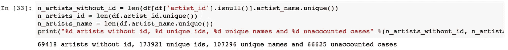

显然，一个原因是因为一些艺术家 id 是 NaN。另一个原因与一些艺术家有不同的拼写方式有关。例如:

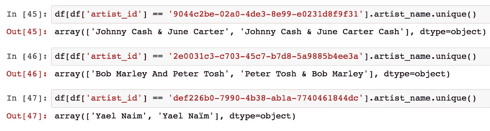

考虑到所有这些，我们决定仍然使用数据库，主要是作为我们最小可行产品的一种方式。

# 效用矩阵

在为了开始处理数据并创建模型，我们从数据框架转到了效用矩阵。

在推荐系统应用程序中，有两类实体，在我们的例子中，我们称之为用户和跟踪。用户对某些曲目有偏好，这些偏好必须从数据中梳理出来。当数据本身被表示为一个效用矩阵时，你可以把每一个用户轨迹对看作一个值，这个值表示用户对该轨迹的偏好程度。在我们的例子中，我们对该偏好的唯一度量是该用户收听该曲目的次数。我们假设矩阵是稀疏的，这意味着大多数条目是“未知的”未知的评级意味着我们没有关于用户对该曲目的偏好的明确信息。

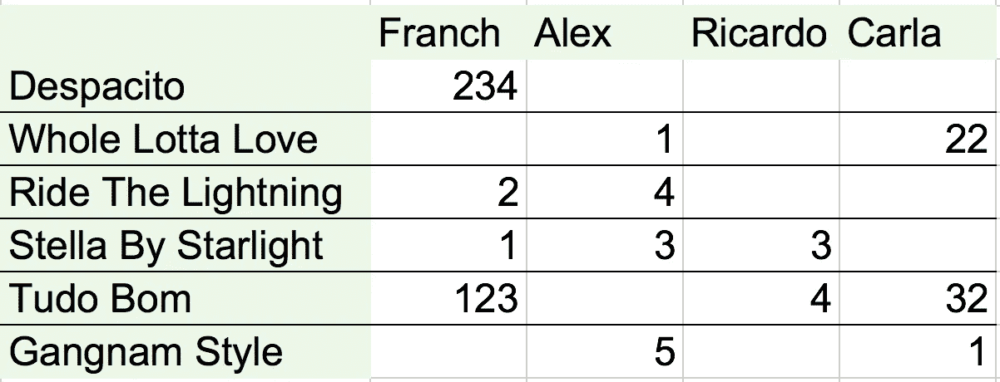

A (super) small example from our utility matrix. Users are the columns and tracks are the rows.

在我们的例子中，矩阵不仅稀疏…而且非常稀疏。

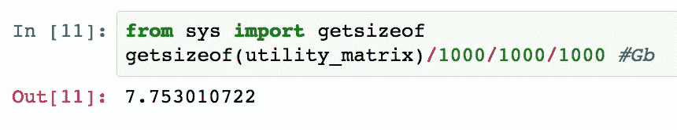

是的。7.75 的内存远远超出了我的 MacBook Pro 的处理能力。

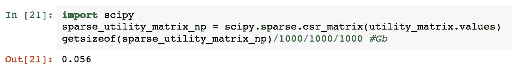

科学来救援了！csr_matrix 让我们可以舒适地使用 **56Mb 的结构**。

> 大小减少了 13844.66%！！！！

推荐系统的目标是预测效用矩阵中的空白。例如，用户 Alex 会喜欢“Despacito”吗？微小矩阵中几乎没有证据。我们还应该意识到一个在许多应用中有意义的稍微不同的目标。没有必要预测效用矩阵中的每个空白条目。相反，只需要在每行中发现一些可能为高的条目。在大多数应用中，推荐系统并不为用户提供所有项目的信息，而是建议用户应该高度重视的几个项目。甚至可能不需要找到具有最高预期收听计数的所有音轨，而只需要找到具有最高收听计数的那些音轨的大的子集。

关于数据库的闲聊已经谈得够多了，让我们深入探讨一下我们的解决方案。

# 解决办法

我们实现了一个多步骤的方法来解决这个问题。为了指导您完成整个流程，假设我们有 3 个用户想要一起听音乐，并且需要一个由 10 首歌曲组成的播放列表。

## 进场与着陆模拟器；肌萎缩侧索硬化

我们的第一步将使用交替最小二乘法，一种特别适合隐式推荐系统的算法，为每个用户提供一首(最好的)歌曲推荐。该算法将假设负面项目是隐式定义的:它假设 item_users 矩阵中的非零项目意味着用户喜欢该项目。在这个稀疏矩阵中，负片未置位。对于这一步，我们将使用[隐式](https://github.com/benfred/implicit)来计算每个建议。

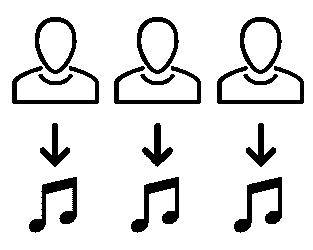

到这一步结束时，每个用户都会有最适合他们的歌曲。3 个用户，所以 3 首歌。

## 项目 2Vec

Item2vec 是基于 word2vec 的深度学习技术。Word2vec 是一种自然语言处理技术，它将单词嵌入到捕捉单词语义的向量空间中。

它首先使用训练神经网络的虚拟任务来预测单词的上下文。也就是说，假设我们有句子“猫坐在垫子上”，如果我们给这个模型单词“猫”，我们会期望它返回给我们上下文“坐在垫子上”。但这还不是有趣的部分。

如果我们忽略这个模型的输出，从它的隐藏层获取结果，我们会看到一个单词的向量空间被创建，其中相似的单词彼此接近。它有非常有趣的代数特征，例如取单词 king 的矢量，减去单词 MAN 的矢量，加上 WOMAN 的结果得到单词 QUEEN 的矢量。另一个有趣的事情是，伦敦到英国的向量之间的距离类似于巴黎和法国或者柏林和德国之间的距离。这个嵌入空间能够理解这些词的一些语义。

跟宋推荐有什么关系？我们修改了这个问题，使得用户收听的歌曲序列是一个句子，其中每首歌曲被认为是一个单词。我们训练神经网络，使其预测歌曲的上下文，然后创建一个嵌入空间，使我们词汇表中的每首歌曲都由一个向量表示，并将相似的歌曲放在一起。

起初，我们得到了一些非常有趣的结果，模型将同一张专辑中的歌曲放在一起。但是经过一些思考，我们发现这并不奇怪，因为人们倾向于按顺序听整张专辑。然后，我们用更少的迭代重新训练模型，这样它就可以稍微适应不足，并给出一些令人惊讶的建议。

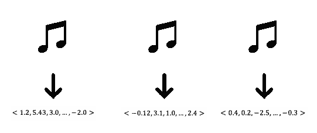

在我们的运行示例中，这意味着我们从上一步中取出 3 首歌曲，并从嵌入空间中获得 3 个相应的歌曲向量。

## **计算中位数**

无非基础代数结合基础统计学；*中位数*是将数据样本、总体或概率分布的上半部分与下半部分分开的值。

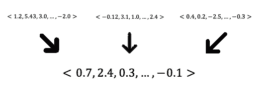

我们计算推荐歌曲向量的中值向量(即每个分量的中值)。因此，在 3 个歌曲向量中，我们获得了一个向量。

## **kNN**

kNN 是最流行的机器学习算法之一。这是一种用于分类和回归的非参数方法。在这种情况下，我们将使用它作为分类器，但只是为了获得最近的邻居，而不用担心结果。

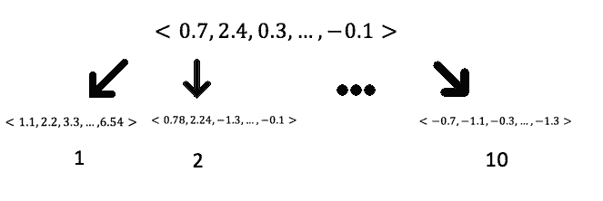

基本上，以一种简单的方式，我们将找到与上一步得到的输出最相似的 *k* 首歌曲( *k* 是我们在最终播放列表中请求的歌曲数量，因此 k=10)。我们只剩下 10 个向量。
那你可能会问的歌曲呢？

## 反向词典

向量通过一个反向字典，向量是键，歌曲是值。

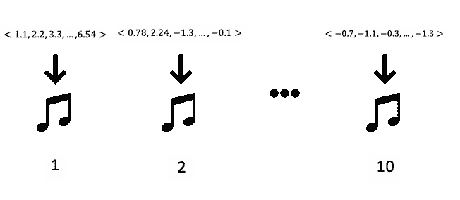

因此，从 10 个向量中我们得到了 10 首歌曲，瞧！

# 结果

我们能够将我们模型中的 0 和 1 翻译成您 Spotify 帐户中的 0 和 1。

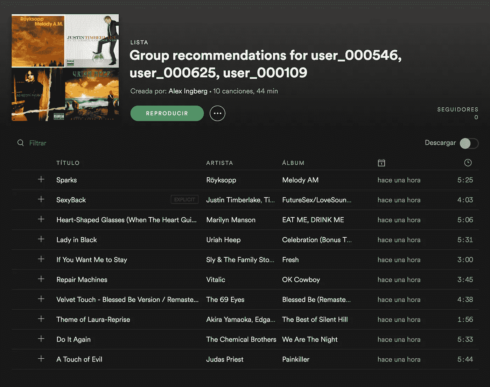

Pretty cool, huh?

# 估价

我们到达了项目的棘手部分。如果我们不能评估我们的开发和模型，我们就不能确定它是否有效，结果，工作将是徒劳的。
重要的是要认识到，我们没有关于哪些歌曲不受欢迎的可靠反馈，因为不听一首歌可能源于多种不同的原因。此外，我们目前无法跟踪用户对我们建议的反应。因此，基于精度的度量不是很合适，因为它们需要知道哪些音轨是用户不希望的。然而，观看一个节目是喜欢它的一种表现，这使得面向回忆的方法变得可行。

我们正在评估一个场景，在这个场景中，我们为每个用户生成一个有序的歌曲列表，从预测最喜欢的歌曲到最不喜欢的歌曲进行排序。然后，我们将列表的前缀作为推荐歌曲呈现给用户。让我们来看看我们使用的排名指标。

对于所有用户 u 和轨道 I，

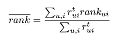

*   r_ *ui* 表示用户 u 收听歌曲 I 的次数；例如，如果 R 是效用矩阵，则 R[u，i]

rank_ *ui* 是歌曲 I 在为用户 u 准备的所有节目的有序列表中的百分比排名

等级值越低越好，因为它们表示实际收听的歌曲的等级越接近推荐列表的顶部。注意，对于随机预测，rank_ *ui* 的期望值是 50%(将 I 放在排序列表的中间)。因此，等级 50%表示算法不比随机算法好。

为了了解算法的性能，我们推荐 100 组一个人，100 组两个人，以此类推，直到人数达到最大值。由于硬件的限制，我们能够为最多 5 人的用户组测试我们的模型。我们评估每个组的分数，对于每个组的大小，我们取平均分数并绘制它们。

我们还计算了每一组的平均余弦相似性。两个用户的余弦相似性是 1 减去效用矩阵中他们的列之间的余弦距离。我们计算组中每一对用户的相似度，然后取平均值。相似性接近 1 的组是非常相似的，应该更容易向他们提出建议，而相似性接近 0 的组显示非常不相似，甚至不应该在一起。我们还对每个组的相似性进行了平均，并绘制在这里。

这是结果。

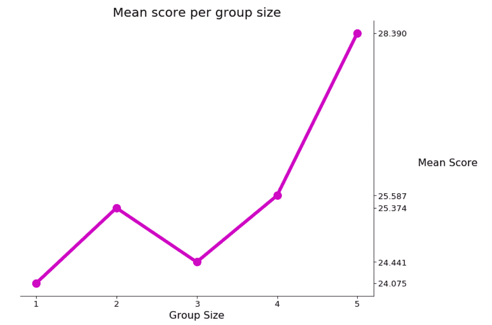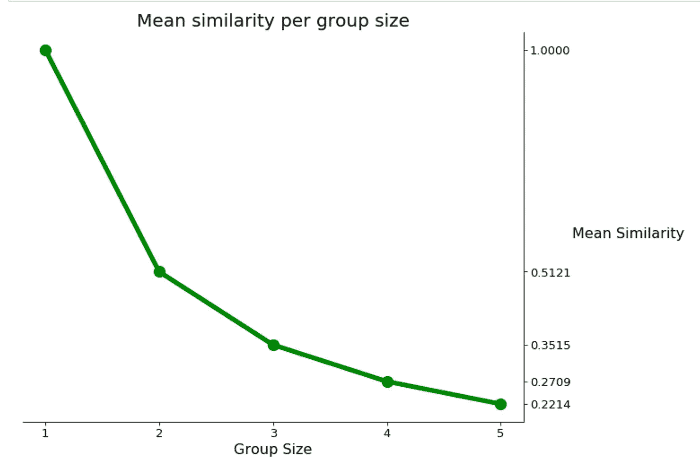

正如所料，单个用户组的相似性是 1(如果你和自己不相似，你可能会有大麻烦，伙计)，随着组的规模变大，相似性呈指数下降，这也是有道理的，因为为大组推荐应该是一项更困难的任务。

我们的结果表明，我们的推荐比随机推荐好得多，并且随着相似性的降低，它们变得更差。对于规模为 2 的组，我们有一点异常，但这可能是因为我们考虑的组数量较少。

也就是说，分数仍然在 20 到 30 之间，这表明还有很多事情可以做来改善这些结果。这是一件好事，我们仍然可以从这个项目中获得更多的乐趣！

# 未来的工作方向

我们创建的模型虽然有趣且有效，但不具有可扩展性，因为它只绑定到数据库上的 1000 万用户和 100 万首歌曲。与一家拥有更全面的数据库或快速添加一列和多行并重新训练算法的方法的大公司合作将是令人惊讶的；但与此同时，可以设计一个解决方案。

此外，我们可以尝试将我们的模型上传到云计算服务，如 AWS 或 Google Cloud，并对多达 100 名用户进行测试，看看它的表现如何。

item2vec 方法对于分组推荐来说是相当新颖的，并且有许多不同的方法可以被测试，例如为每个用户做出 K 个推荐，然后对这些推荐中的每一个取中值向量，或者将歌曲向量聚集在一起并从每个聚类中取样本，等等。

在线服务模型和编写一个好的前端用户界面也在未来的计划中。

同样，如果你想查看我们这个故事的代码版本，你可以查看 [**公共库**](https://github.com/alexing/musicmagal) 。

# **参考文献**

梅泽尔特和卡斯滕·埃克霍夫。"[评估团体的音乐推荐系统](https://arxiv.org/pdf/1707.09790.pdf)" *arXiv 预印本 arXiv:1707.09790* (2017)。

使用具有潜在用户偏好的概率模型的混合协作和基于内容的音乐推荐[。](http://winnie.kuis.kyoto-u.ac.jp/~yoshii/papers/ismir-2006-yoshii.pdf)*伊斯米尔*。第六卷。2006.

Parra，Denis 等.“[通过隐式到显式顺序逻辑回归映射的隐式反馈推荐。](http://ceur-ws.org/Vol-791/paper4.pdf)*《汽车论文集-2011》*(2011)。

胡，一帆，耶胡达·科伦，克里斯·沃林斯基。[针对隐式反馈数据集的协同过滤。](http://yifanhu.net/PUB/cf.pdf)*数据挖掘，2008。08 年的 ICDM。第八届 IEEE 国际会议。Ieee，2008 年。*

巴尔坎、柳文欢和诺姆·柯尼希斯泰因。" [Item2vec:用于协同过滤的神经项目嵌入。](https://arxiv.org/vc/arxiv/papers/1603/1603.04259v2.pdf)*信号处理的机器学习(MLSP)，2016 IEEE 第 26 届国际研讨会上*。IEEE，2016。

Leskovec，Jure，Anand Rajaraman 和 Jeffrey David Ullman。 [*挖掘海量数据集*](https://github.com/alexing10/musicmagal/blob/master/papers/Recommendation_Systems.pdf) 。剑桥大学出版社，2014 年。