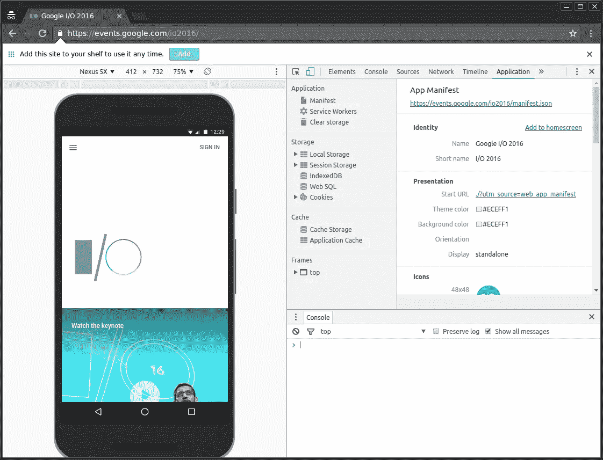
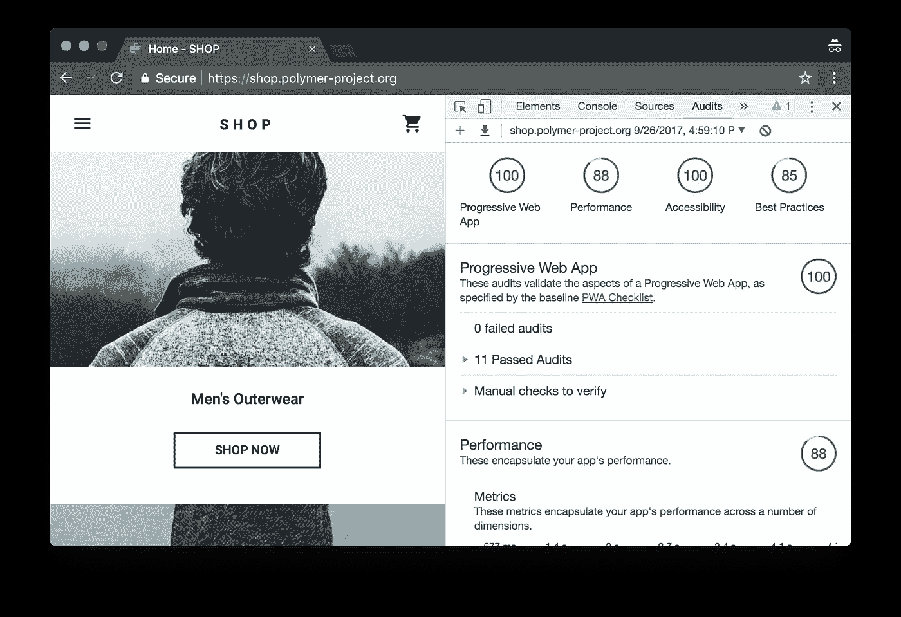

# 必须使用工具来构建更好的渐进式 Web 应用程序

> 原文：<https://medium.com/hackernoon/must-use-tools-to-build-better-progressive-web-apps-7afdda353784>

最近的浏览器增强，如服务工作者、缓存，为使用 html 和 javascript 构建名为渐进式 web 应用的应用带来了一个新的维度。当它们变得越来越流行时，我们必须知道有哪些工具可以用来构建更好的、对开发者和最终用户来说都很容易的渐进式 web 应用程序。我们可以将这些工具分类如下:

*   开发工具
*   框架特定工具
*   调试工具
*   绩效工具

# 开发工具

# 工具箱

Workbox 是一个库和构建工具的集合，可以轻松地构建离线的第一个 web 应用程序。

[https://developers.google.com/web/tools/workbox/](https://developers.google.com/web/tools/workbox/)

# webpack 的离线插件

该插件旨在为 webpack 项目提供离线体验。

https://github.com/NekR/offline-plugin

演示:【https://offline-plugin.now.sh/ 

# Pinterest 服务人员

用于创建/测试/试验服务人员的实用程序集合。

[https://github.com/pinterest/service-workers](https://github.com/pinterest/service-workers)

# PWA 生成器

[https://www.pwabuilder.com/generator](https://www.pwabuilder.com/generator)pwa . tools 从你的网站获取数据，并利用这些数据生成跨平台的渐进式网络应用

# 框架特定工具

框架特定的工具有助于应用程序创建 index.html 应用程序外壳生成，清单和软件生成。

*   [React 创建应用](https://github.com/facebookincubator/create-react-app)
*   [预动作](https://github.com/developit/preact-cli)
*   [聚合物](https://github.com/Polymer/polymer-cli)
*   [有角度的](https://github.com/angular/angular-cli)
*   [Vuejs](https://github.com/vuejs/vue-cli)
*   [Vuejs PWA 模板](https://github.com/vuejs-templates/pwa)

# 调试工具

# Chrome 开发工具

使用应用程序面板来检查、修改和调试 web 应用程序清单、服务工作程序和服务工作程序缓存。

链接:

*   [Chrome 开发工具](https://developers.google.com/web/tools/chrome-devtools/progressive-web-apps)
*   [调试服务人员](https://developers.google.com/web/fundamentals/codelabs/debugging-service-workers/)

# 绩效工具

# 灯塔

Lighthouse 是一个开源的自动化工具，用于提高网页质量。你可以在任何网页上运行它，无论是公开的还是需要认证的。它对性能、可访问性、渐进式网络应用等进行审计。

你可以在 Chrome DevTools 中运行 Lighthouse，从命令行，或者作为一个节点模块。

https://developers.google.com/web/tools/lighthouse/

# 其他人

# HNPWA

黑客新闻阅读器作为使用不同框架构建的渐进式 Web 应用程序。【https://hnpwa.com/ 

# 岩石

策划渐进式网络应用列表。[https://pwa.rocks/](https://pwa.rocks/)

# PWA 清单

构建渐进式网络应用的清单[https://developers . Google . com/web/Progressive-web-apps/清单](https://developers.google.com/web/progressive-web-apps/checklist)

本文原载于[http://www . idiotinside . com/2018/01/05/tools-to-build-better-progressive-web-apps/](http://www.idiotinside.com/2018/01/05/tools-to-build-better-progressive-web-apps/)