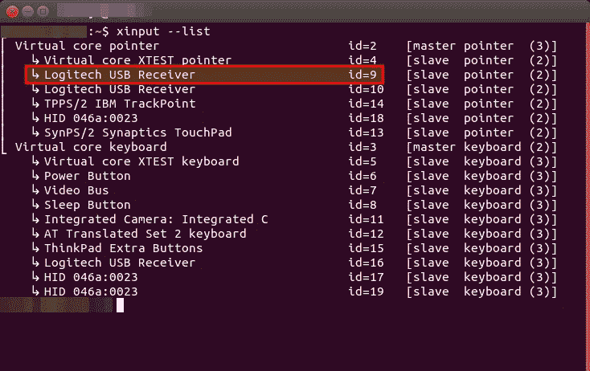
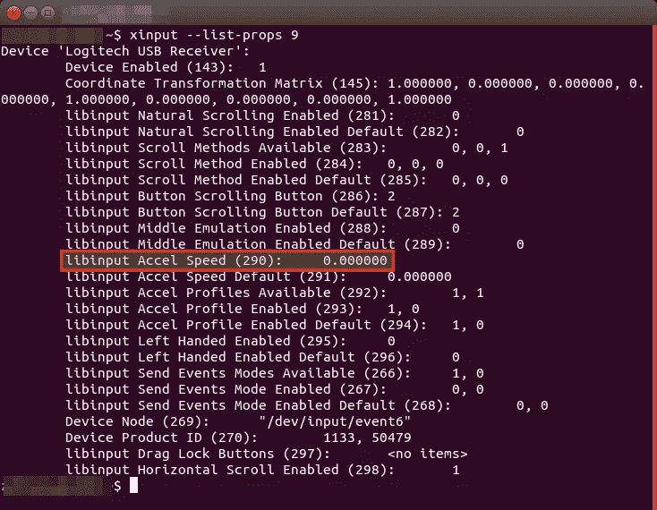

# 静音、鼠标加速和主屏幕—命令行提示

> 原文：<https://medium.com/hackernoon/mute-sound-mouse-acceleration-and-primary-screen-command-line-tips-25fe1fbd07c>


上周，一位同事找到我，想为他教室里的电脑定制一些东西。这些都是你可以在系统设置中快速调整的，但是如果你每次启动后都要这么做，那就很烦人了。因此，我们需要一个解决方案，如何从命令行完成这些事情，以便我们可以将所需的更改放入在登录时执行的脚本中。所以这里有一些快速的命令行提示。

# 静音(不静音)

在我们的 Ubuntu 图像中，声音是默认静音的。这在大多数情况下是有意义的——特别是在一些房间的计算机实验室中，例如在音乐教室或教师的计算机上，如果声音被自动打开，将会更加用户友好。这可以通过以下命令完成:

```
# unmute sound
$ pactl set-sink-mute 0 0
```

如果要再次静音，最后一个零必须替换为“1”:

```
# mute sound 
$ pactl set-sink-mute 0 1
```

# 设置主屏幕

在大多数房间中，当投影仪或屏幕通过 HDMI 开关连接时，[默认情况下屏幕是镜像的](https://openschoolsolutions.org/mirror-screens-automatically-hdmi/)。在这种特殊情况下，这位同事在“他的”房间里或多或少地独自使用计算机，并且想要一个带有扩展屏幕的设置。然而，Ubuntu 在默认情况下会将启动器放在分辨率更高的屏幕上。在这里，我们需要一个解决方案，如何通过命令行改变主屏幕，使主屏幕成为教师办公桌上的显示器。这可以用 xrandr 轻松解决。

```
$ xrandr --output DVI-0 --primary
```

*DVI-0* 是教师桌上的显示器所连接的输出。通过 xrandr -q，您可以显示所有可用的连接。

# 设置鼠标指针加速度

如何通过命令行设置鼠标指针的加速度？有不同的方法，例如使用 xset 或 xinput。我们已经决定使用 xinput。通常，您可以按如下方式设置输入设备的属性:

```
$ xinput --set-prop device-ID property-ID value
```

我们通过执行不带参数或带–list 的 xinput 来获取设备 ID。在本例中，连接了一个无线鼠标。



接下来，我们需要正确的属性 ID。我们可以从下面的命令中得到这个结果(“9”是我们的设备 ID):

```
$ xinput --list-props 9
```



要设置鼠标加速度，我们需要改变*加速度*值(属性 ID 为 290)。允许值介于-1 和+1 之间。例如，要降低鼠标加速度，我们可以使用以下命令:

```
$ xinput --set-prop 9 290 -1
```

# 结论

我们将所有这些小变化打包成一个脚本，然后通过 [postsync](http://docs.linuxmuster.net/en/latest/clients/postsync/basics.html) 将它们分发到适当的计算机。Ubuntu 和 linuxmuster.net 提供的灵活性是我们使用它的主要原因之一。

你知道哪些好看又有用的命令行技巧？

*最初发表于*[T5【openschoolsolutions.org】](https://openschoolsolutions.org/mute-sound-mouse-acceleration-and-primary-screen-command-line-tips/)*。*