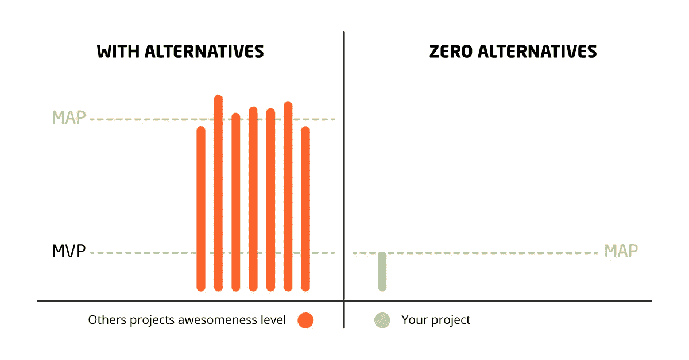

# MVP 不够。你的产品一定很棒！

> 原文：<https://medium.com/hackernoon/mvp-is-not-enough-your-product-must-be-awesome-c276ef8193fa>

构建最小可行产品(MVP)是一项不可轻视的任务。创业或企业业务必须清楚地了解这样做的目标，可能的限制和需要建立一些可怕的东西。

坦率地说:正如我们今天所知，MVP 已经偏离了 Eric Ries 大约 7 年前在他的《精益创业》一书中最初提出的概念很远了。这个想法是建立一个功能绝对最少的产品，作为一个概念的证明，以确保主要产品的想法是可行的，有一个市场。

从那时起，相当多的项目经理陷入了产品“最小生存能力”的谬论。不幸的是，在很多情况下，这意味着低劣的设计质量和有限的功能，因为为了快速实现几个核心功能，一切都被牺牲了。这就导致了我们今天所看到的情况——大量粗制滥造的 MVP 试图争夺客户的注意力，以便获得下一轮资金，并有足够的资源成为功能齐全的产品。

# 启动你的 MVP 来赢得顾客的心:增加一些魅力！

虽然这是一幅有点令人沮丧的画面，但这种情况为任何头脑灵活的企业家提供了一个独特的机会。一家初创公司要赢得观众的心，需要做的就是提供一款设计精良、性能流畅的产品，具备基本功能和一(或两)个让产品在竞争中脱颖而出的额外奖励。

是的，设计和开发一个出色的功能需要一些时间和资源。然而，慢慢地做事情，并以高质量的产品结束，总比在想要成功的人的行列中再增加一个微薄的报价要好。

当然，这一切都适用于进入人口密集的市场。当没有其他选择时，当你试图征服服务不足的利基市场时，你的 MVP 将是令人敬畏的，因为它将是独一无二的。在这种情况下，你只需要实现核心功能，解决客户的痛苦，并提供流畅的用户界面/UX。通过这种方式，您将提供一个概念证明，确保对功能全面的产品有需求。

# 关于为什么你的 MVP 必须很棒的最后想法

很明显，软件开发人员必须不时地做出取舍。然而，我们认为不应不惜任何代价牺牲产品质量。如果你正在构建一个 MVP——只要确保它解决了它想要解决的现实世界中的问题，并且有风格地这样做。包括更少的功能，但使它们运行流畅，并提供出色的用户体验。通过这种方式，你的产品将测试市场，获得积极的反馈，并产生所需的牵引力，以确保目标受众愿意购买你将在某个时间交付的全面产品。

你怎么看待给一个 MVP 加一些牛逼的概念？你在创造产品的时候也遵循同样的理念吗？请在下面分享你的经验！

*最初，我把这个故事贴在了我公司的博客上——*[https://it svit . com/blog/MVP-not-suffith-product-must-awesome/](https://itsvit.com/blog/mvp-not-enough-product-must-awesome/)