# iOS 上的 MVVM + RxSwift 第 1 部分

> 原文：<https://medium.com/hackernoon/mvvm-rxswift-on-ios-part-1-69608b7ed5cd>


在这篇文章中，我将介绍 iOS 编程中的 MVVM 设计模式，当然还有 RxSwift。本文分为两部分。在第 1 部分简要介绍了 RxSwift 的设计模式和基础知识，在[第 2 部分](https://link.medium.com/3YSCtHCUqV)中，我们有一个使用 RxSwift 的 MVVM 的示例项目。

# **设计模式**:

在首先，最好解释一下为什么我们要使用设计模式？简而言之:为了避免我们的代码变成意大利面条🍝当然这不是唯一的原因。原因之一是可测试性。有很多设计模式，我们可以指出一些流行的模式，如 **MVC** 、 **MVVM** 、 **MVP** 和 **VIPER** 。NSLondon 幻灯片中有一个很好的图片，它将设计模式与分布、可测试性和易用性进行了比较。

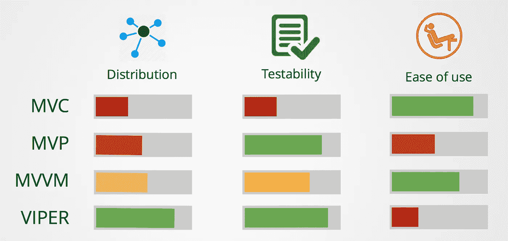

Compare of design patterns ( from NSLondon )

所有这些设计模式都有自己的优点和缺点，但最终，它们都使我们的代码更干净、更简单、更易读。这篇文章的重点是 **MVVM，**我希望你在[第二部](https://link.medium.com/3YSCtHCUqV)结束时明白原因。

因此，让我们简要地看一下 MVC，然后我们继续讨论 MVVM

## MVC:

如果你在 iOS 中做过一段时间的编码，你大概对 **MVC** 很熟悉(苹果建议用 MVC 进行 iOS 编程)。该模式由**模型**、**视图**和**控制器**组成，其中控制器负责连接模型和视图。理论上看起来视图和控制器是两回事但是在 iOS 世界中，很不幸，这两者变成了一件事(大部分)。当然，在小项目中，一切似乎都井井有条，但是一旦你的项目变得更大，控制器几乎承担了大部分责任(也被称为大规模视图控制器:D)，这导致你的代码变得一团糟，但是如果你能以正确的方式编写 MVC 并尽可能多地划分你的控制器，问题将会得到解决(大部分)。

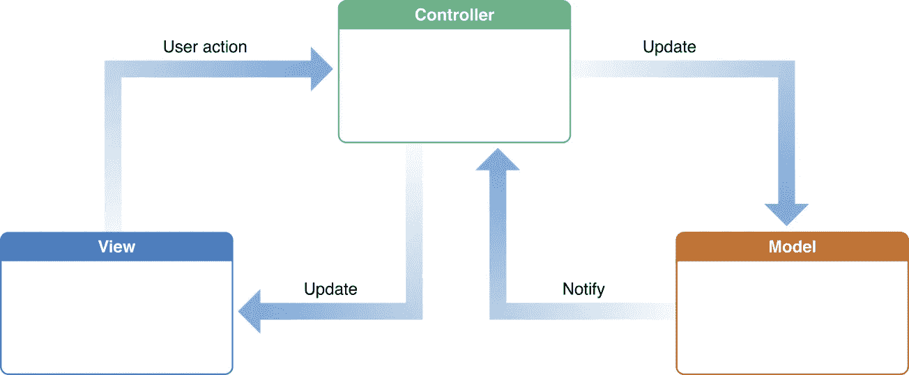

MVC from apple docs

## MVVM:

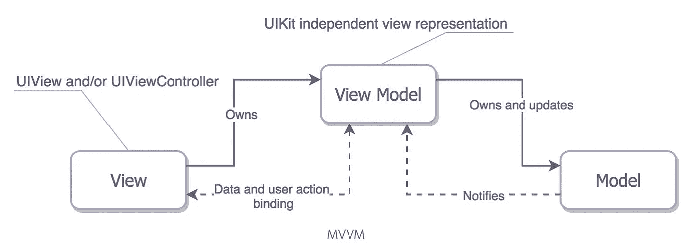

picture from github

井 **MVVM** 代表**模型**、**视图**、**视图模型**，其中控制器、视图和动画发生在**视图**中，业务逻辑、api 调用发生在**视图模型中。**事实上，这一层是模型和视图之间的接口，它将根据需要向**视图**提供数据。有一点是，如果您在 ViewModel 文件中看到以下代码，您可能在某个地方犯了错误:

```
import UIKit
```

因为 ViewModel 不应该知道视图中的任何内容，所以在第二部分中，我们将通过一个精确的例子来分析本文。

# RxSwift:

MVVM 的一个特性是数据和视图的绑定，这使得它与 RxSwift 的结合非常愉快。当然，你可以用 delegate、KVO 或闭包来实现这一点，但是 RxSwift 的一个特性是，如果你用一种语言学习它，你也可以在其他语言上重用它，因为 Rx 的 basic 在它所支持的语言中是相同的(你可以在这里找到语言列表)。现在，在这一部分，我们将解释 RxSwift 的基础知识，这也是 Rx world 的基础知识。然后在第二部分，我们将与 RxSwift 在 MVVM 开展一个项目。

## 反应式编程:

RxSwift 基于反应式编程，这意味着什么呢？

```
In computing, reactive programming is a programming paradigm oriented around data flows and the propagation of change. This means that it should be possible to express static or dynamic data flows with ease in the programming languages used, and that the underlying execution model will automatically propagate changes through the data flow. — Wikipedia
```

很可能你读完这一段后什么都不明白。我们也许用下面的例子来理解它会更好:

假设你有三个变量(a，b，c ),比如:

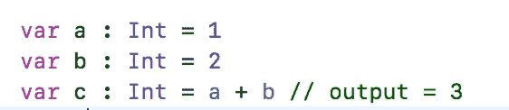

现在，如果我们将`a`从 1 改为 2，并打印`c`,它的值仍然是 3。但是在无功世界里事情是不同的，`c`值取决于`a`和`b`，这意味着如果你把`a`从 1 变到 2 `c`值会自动地从 3 变到 4，而不需要你自己去改变。

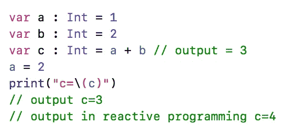

现在让我们开始 RxSwift 基础知识:

在 RxSwift(当然还有 Rx)世界中，一切都是事件流(包括 UI 事件、网络请求……)现在请记住这一点，我将用现实生活中的例子来解释:

你的手机是一个**可观察的**，它产生事件，例如响铃、推送通知……这让你注意，事实上你**订阅了**你的手机，并决定如何处理这些事件，例如你有时会忽略一些通知或回复一些通知……(事实上这些事件是**信号**，而你是一个**观察者**并做出决定)


现在让我们看看代码:

## 可观察对象和观察者(订户):

在 Rx 世界中，一些变量是**可观察的**，另一些是**观察者(或订户)。**

因此**可观察的**是通用的，如果它符合 ObservableType 协议，你可以使它成为你想要的任何类型的可观察的。

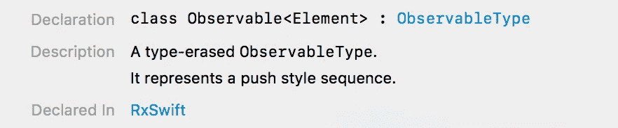

现在，让我们定义一些可观察到的现象:

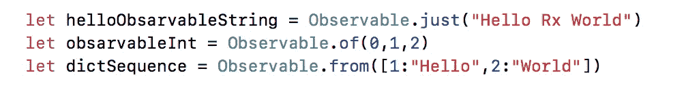

在上面例子的第一行，我们有字符串的可观察值，在第二行，我们有 Int 的可观察值，最后我们有字典的可观察值，现在我们应该**订阅**我们的可观察值，这样我们就可以从发出的信号中读取

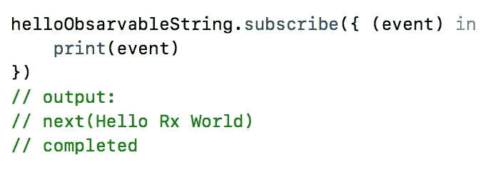

你可能会问输出中的`next`和`completed`是什么，为什么“hello world”没有打印好。我必须说，这可能是 Observables 最重要的特征:

实际上每个可观测量都是**序列**，它与[快速序列](https://developer.apple.com/documentation/swift/sequence)的主要区别在于它的值可以异步。(如果你不明白这两行并不重要，希望你能通过下面的描述理解)如果我们想用图像来说:

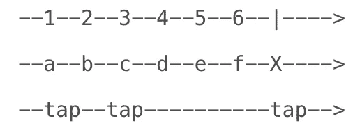

sequence of events

在上面的图像中，我们有三个可观察的对象，第一个是 Int 类型，并及时发出 1 到 6 的 6 个值，然后它就完成了。在第二行中，我们观察到字符串，并及时发出“a，b，c，d，e，f ”,然后出现了一些错误，它已经完成。最后，我们有了可观察到的姿态，但它还没有完成，还在继续。

这些显示可观察事件的图像被称为大理石图。欲了解更多信息，您可以访问[网站](http://rxmarbles.com/)或从[应用商店](https://itunes.apple.com/us/app/rxmarbles/id1087272442?ls=1&mt=8)下载该应用。(这也是[开源](https://github.com/RxSwiftCommunity/RxMarbles)👍😎)

在 Rx 世界中，每个可观察对象在其持续时间内发出 0 到…个事件(上例),这些事件由三个可能值组成:

1.  **。下一个**(值:T)

2.**。错误**(错误:错误)

3.**。已完成**

当 Observable 增加一个/多个值时，调用`next`事件，并通过相关的值属性(上面示例中的 1 到 6 个数字，a 到 f 和抽头)将一个/多个值传递给订户(观察者)。

如果可观察对象面临错误❌，则发出错误事件，可观察对象结束。(在发出上述示例中的`f`后)

如果观察完成。发出完成的事件(在上述示例中发出 6 之后)

如果我们想取消订阅并取消订阅一个可观察对象，我们可以调用 ***dispose*** 方法，或者如果你想在你的视图定义时调用这个方法，你应该使用 ***DisposeBag*** 类型创建一个变量，当你的类被初始化时，这个变量为你工作。 ***我必须说如果你不记得这个你的订户会让内存泄露*** ☠️💀 ***。*** 例如，观察值应该这样订阅:

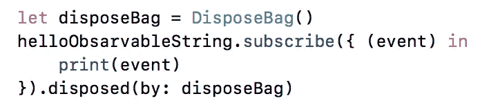

observable with disposeBag

现在让我们看看将 Rx 与函数式编程结合起来的好处。假设你有一个 Int 的 observable，你订阅了它，现在 observable 会给你一堆 Int，你可以对 observable 发出的信号做很多改变，例如:

## **地图:**

为了在信号到达其订户之前改变信号，您可以使用映射方法，例如，我们有 Int 的 observable，它发出 3 个数字 2，3，4，现在我们希望数字在到达其订户之前乘以 10，我们可以使用以下代码来实现这一点:

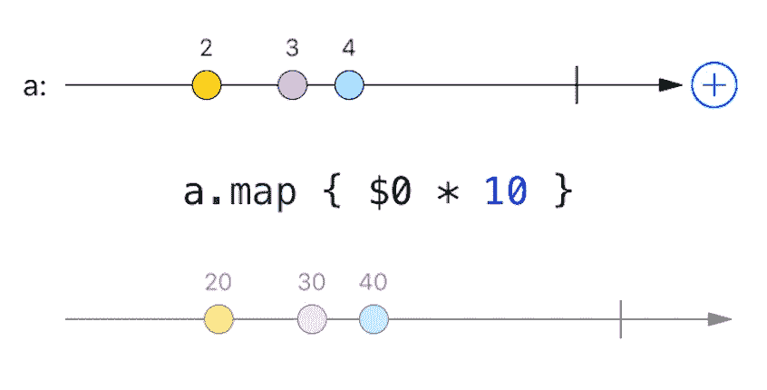

map marble

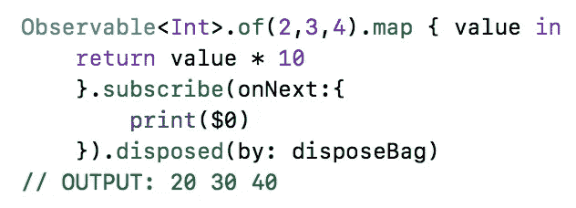

## 过滤器:

您可能希望在联系订户之前过滤一些值，例如，在上面的示例中，您希望号码大于 25:

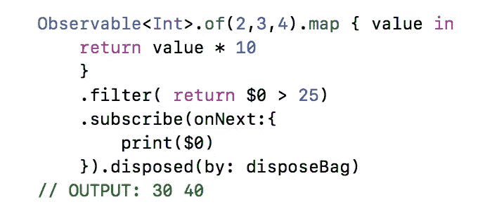

## 平面图:

假设你有两个可观测量，你想把它们合并成一个可观测量:

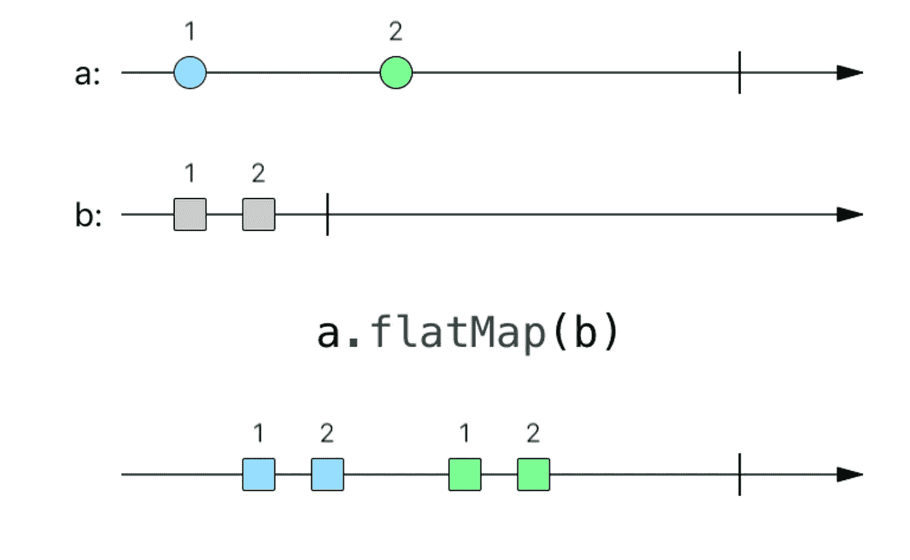

在上面的例子中，可观察对象 A 和可观察对象 B 被组合并成为新的可观察对象:

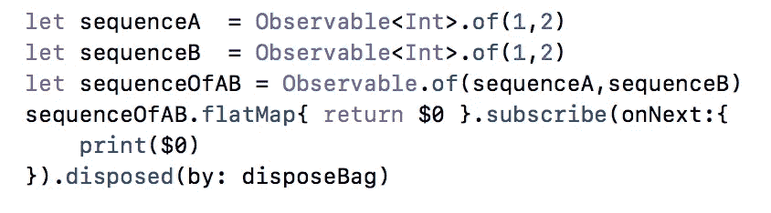

## **区分时间变化或去抖:**

这两种方法是搜索中最有用的方法之一。例如，用户想要搜索一个单词，当用户键入每个字符时，您可能会调用 search api。好吧，如果用户输入得很快，你会向服务器发出许多不必要的请求。实现这一点的正确方法是当用户停止输入时调用搜索 api。要解决这个问题，您可以使用去抖功能:

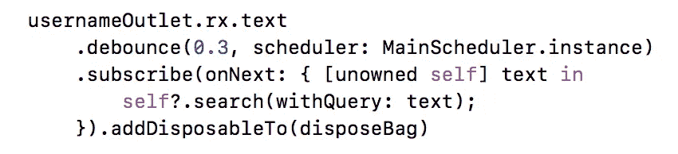

在上述示例中，如果用户名文本字段在 0.3 秒内发生变化，则这些信号不会到达订户，因此不会调用搜索方法，只有当用户在 0.3 秒后停止时，订户才会收到信号并调用搜索方法。

DistinctUntilChanged 函数对变化很敏感，这意味着如果两个信号获得相同的信号，直到信号没有变化，它将不会被发送到订阅者。

Rx 世界比你能想到的要大得多，我只是讲了几个基本概念，我认为在文章的下一部分会用到，这是一个与 RxSwift 的真实项目。

来自 [raywenderlich](https://store.raywenderlich.com/products/rxswift) 的 RxSwift 很好地描述了来自 0 的 RxSwift，我强烈推荐阅读。

您可能不会仅从一篇文章中注意到 RxSwift，因为它是 Swift 的高级概念之一，您可能需要每天阅读不同的文章才能找到答案。在[这个链接](https://github.com/mohammadZ74/handsomeIOS)中你可以看到他的 RxSwift 版块的几篇好文章。

希望在 Rx 引入 MVVM 真实项目的文章的下一部分，你会理解 RxSwift 的概念，因为用真实的例子会更容易理解。

我的推特账号是 [Mohammad_z74](https://twitter.com/Mohammad_z74) ，我的邮箱是 mohammad_z74@icloud.com✌️