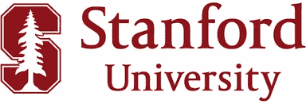
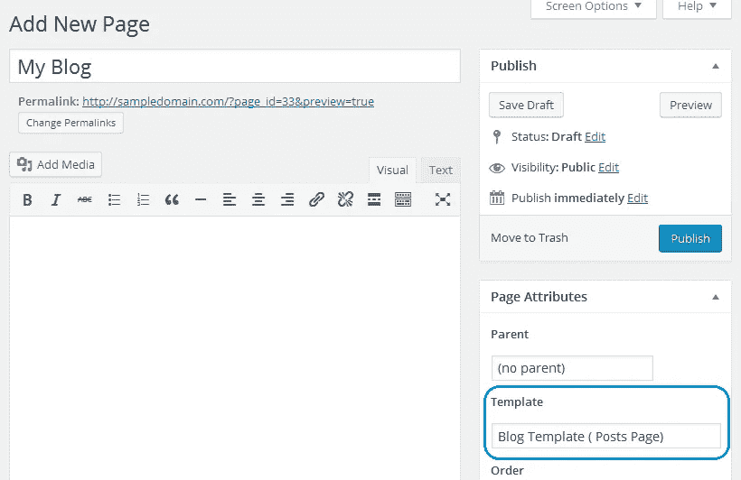
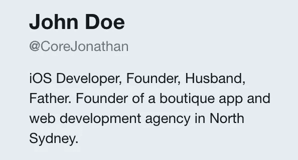
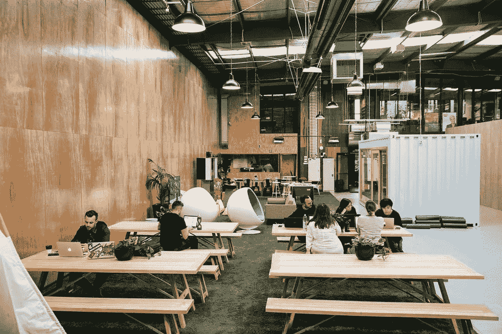
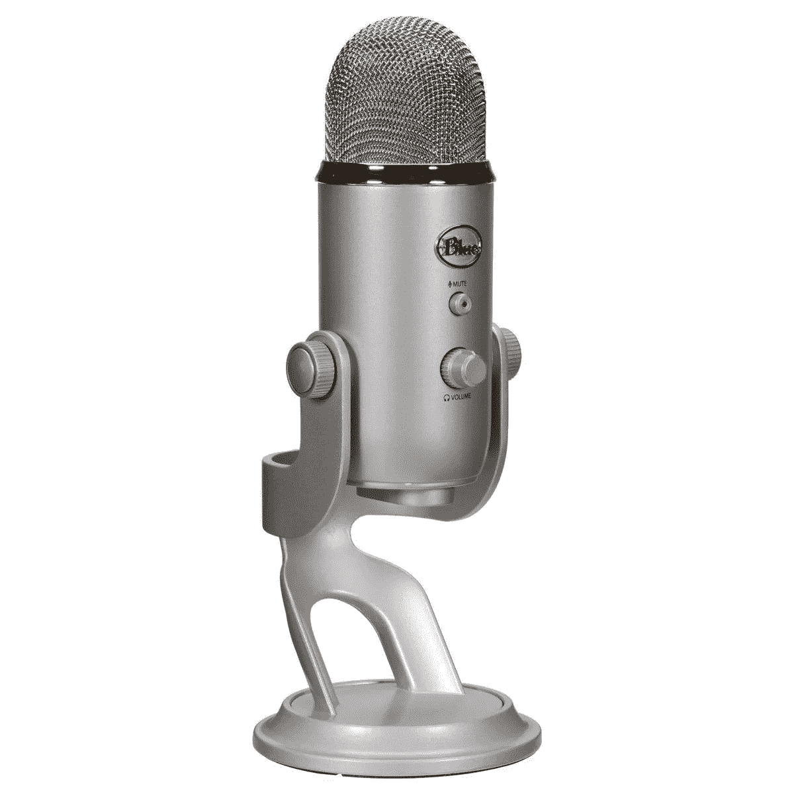
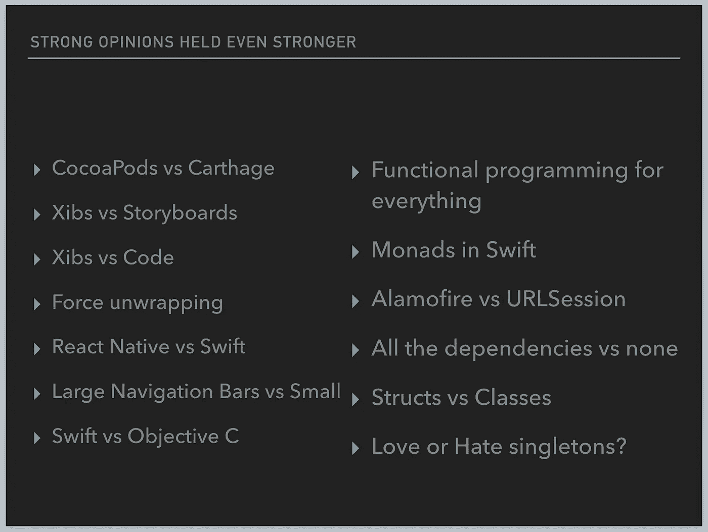
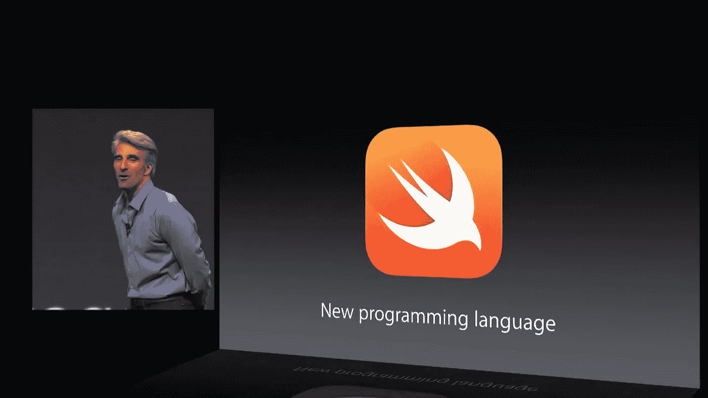
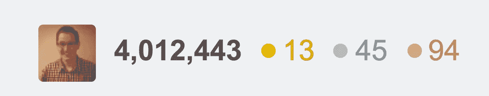
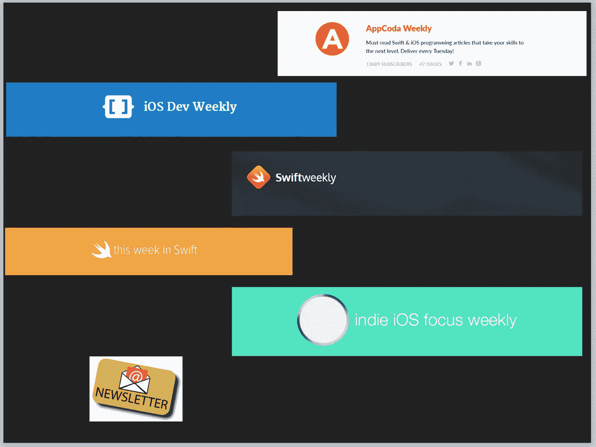
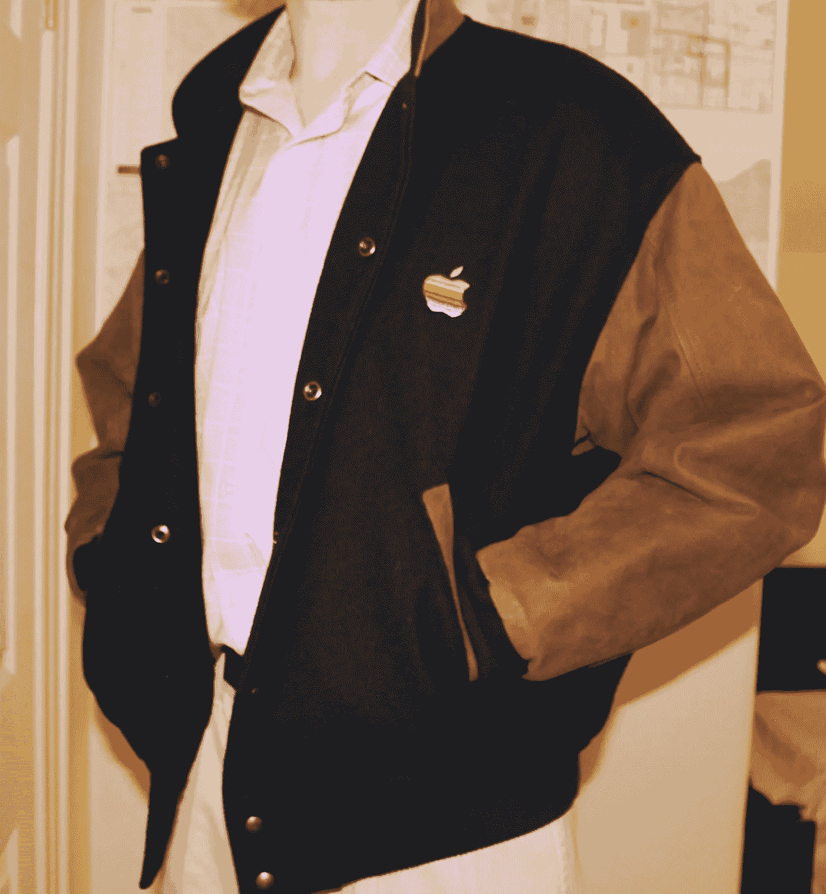

# 我的成为 iOS 开发者的 12 步指南

> 原文：<https://medium.com/hackernoon/my-12-step-guide-to-becoming-an-ios-developer-539b8c9d595e>

Don’t forget to unlock your iPhone before deploying a new development build.

**第一:**学习 Swift 和 iOS 开发。使用 iTunes U，观看[斯坦福课程](https://itunes.apple.com/us/course/developing-ios-11-apps-with-swift/id1309275316)。不经意地向朋友提及你在斯坦福在线学习的课程。不要用传统课程。

Remember watching lectures online is as prestigious as being accepted into the school. And people should know that.

**第二:**花 4000 美元买 MacBook Pro，花 2000 美元买 iPhone X。很可笑，但你告诉自己和伴侣*“这是为了工作”*。

“Babe, it’s for our future!”

**第三:**开博客。用 [swift 语言指南](https://swift.org/documentation/api-design-guidelines/)的例子写帖子。叫核心加你的名字。如果你的名字是一个音节，或者通常是缩写，那就加长，直到至少出现两个音节。使用. app 或。me 顶级域名。

But don’t actually use wordpress, build your own blog in Vapor first.

**第四:**上推特。关注[这些人](/app-coder-io/52-people-every-ios-developer-should-follow-on-twitter-25ca8915369a) *(还有 [me](https://twitter.com/samjarman) :P)开始回复。在你的简历中，假设你是一家小机构的 iOS 主管。

**第五:**开个小代理。用“精品店”来形容自己，在 WeWork 找一张桌子。用 Squarespace 建立网站，直到你知道如何建立应用程序。与你的机构一起为大公司写一个应用程序。说服他们参加他们领域的一个不知名的奖项。赢得那个奖。

Always use cafes for meetings to appear bigger than you are

第六个:开始一个 iOS 开发播客。组建一个你自己和其他 iOS 开发者开发者的小组来讨论 iOS 开发。至于名字，用一个可怕的代码引用 Cocoa，比如 Conversation.shared 或 iOSDevTips:atIndexPath:。通过阅读 GitHub 阅读材料的第一段来讨论你最喜欢的开源项目。这里的诀窍是围绕你自己，不要给你的听众增加任何价值。给床垫做广告。

If you don’t own a Blue Yeti are you really an iOS developer?

**第七:**对这些事情形成看法。越强越好。你是一名工程师，这意味着带着已经决定的解决方案到处走，忽略问题。

Remember: What worked for you that one time will work for everyone.

第八次:推销演讲，参加会议。问人家是做什么的，尽管你知道它的 iOS 开发。询问他们是否还在使用 Swift。谦逊地吹嘘自己使用 swift 这么久了，并说“哦，伙计，我记得很早就有了”或“看到 swift 这么多年来的变化真是太棒了”。记住，你学得越多，然后不得不忘记的越多，你就是一个更好的 iOS 开发者。随意询问他们是否使用*浪子*。

**第九:**加入 reddit 和堆栈溢出通过发布 r/iOSprogramming 到堆栈溢出的问题和 [r/iOSprogramming](https://www.reddit.com/r/iOSProgramming/) 到堆栈溢出的问题获得 karma 和 rep。跟进交叉发布答案。

The chrome inspector is fun eh

**第十:**开始发简讯。确保名称中包含“Weekly”。订阅其他 iOS 时事通讯，并编写一个脚本，从每个时事通讯中获取链接。周五把它电邮给你的 58 个订户。给床垫做广告。

**第十一:**担心你的事业。你是在为潜在的数百万人创造有意义的体验，还是只是把 JSON 放在屏幕上？为什么不去解决一些有趣的问题，比如担心自动扩展集群、消息队列、非 sql 数据库和云服务？有职业危机。观看 [App:人类的故事。](http://appdocumentary.com/)心情舒畅。

第十二件**:在 Ebay 上买一件 2007 年的 WWDC 夹克。穿上它。你当时在场。人们应该知道。**

*…这就是你成为 iOS 开发者的方法！*

这是在 [/dev/world/ 2018](http://www.devworld.com.au/) 上的一次**讽刺**闪电演讲，你可以在这里找到录音[。如果你喜欢更多的极客和小众喜剧，请关注我的推特账号——T20 @萨姆贾曼](https://www.youtube.com/watch?v=xdV8HjSnDKc&feature=youtu.be)。由[无结构](https://www.youtube.com/playlist?list=PLAjZyhMgkKSw1yhmpm01bwD5Rj_Tqrndn)引发的谈话。

**还有一些代表性不足的乡亲* [*太请*](https://twitter.com/samjarman/status/1039433447826026496) *。*