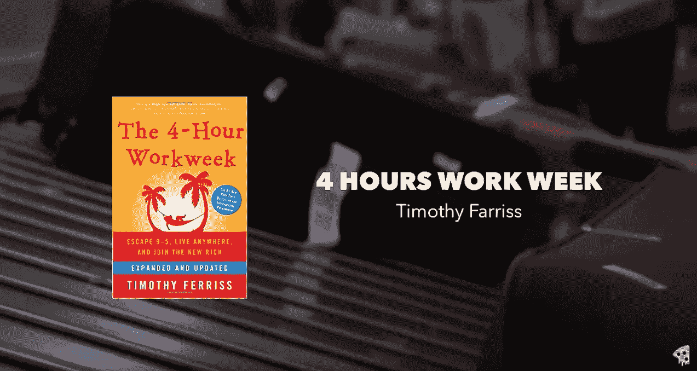
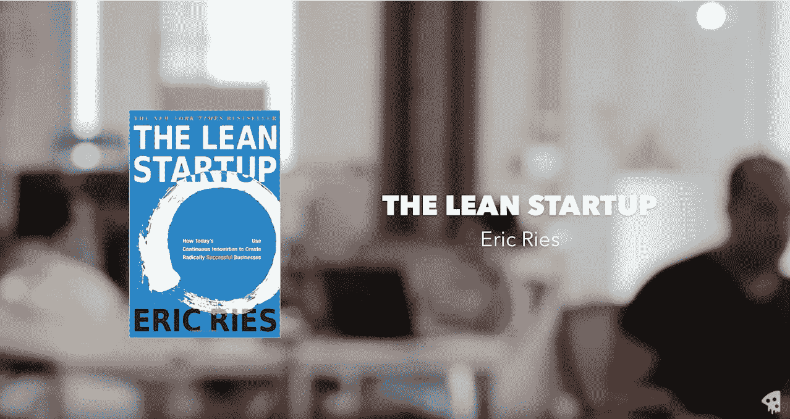
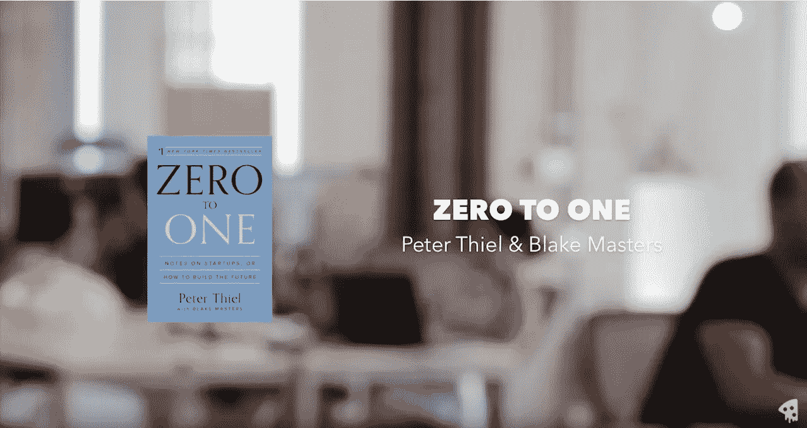

# 我的 3 本书是有抱负的创业者必读的

> 原文：<https://medium.com/hackernoon/my-3-must-read-books-for-aspiring-startup-founders-c824223448d8>

嘿，各位，在这篇文章中，我将向你们推荐三本书，它们将帮助你们成为企业家。

现在，这篇文章更多的是给那些想要获得动力以及为什么他们应该成为一名企业家的人，但是如果你已经处于那个阶段，也许会给你一些如何经营你的企业的精确例子。我相信这三本书，因为我已经在内部用它来帮助自己更有动力去创办自己的两家公司。

我要推荐的第一本书是 Tim Ferriss 的《每周 4 小时工作制》。现在我要说的是，这本书的大约一半仍然与今天的大多数人相关，而另一半则需要不惜一切代价完全避免。Tim 深入阐述了为什么你想创办一家公司，或者你如何更好地为自己设定目标，不仅是为你创建的公司，也是为你自己的生活。总的来说，当你建立完自己的公司后，你会在你想去的地方找到方向和洞察力。他也谈到了其他信息，比如自动化，让你独立的方法，不仅来自你的雇主，也来自你自己的公司。现在这本书的不足之处是关于如何做自动化任务的规定信息，在这一部分，你可以开始跳过。

我的第二条建议是任何想创业的人必读的，这是埃里克·里斯的《T2 精益创业》。建立、衡量和学习的可靠方法是每个公司都应该牢记在心的。通过使用这种方法，任何产品都可以随着时间的推移而变得更好。根据我的经验，很多人会说他们做这种测试。通常，这是幻灯片或招聘启事中的要点，仅此而已。通过阅读这本书，吸取其中的经验教训，你可以比以往更快地为你的公司开发出更好的产品。这是精益创业公司教你去弄清楚的

我的上一本书是彼得·蒂尔&布莱克·马斯特斯的《零比一》，我不是彼得政治的粉丝，但当谈到企业家精神时，这家伙知道他在说什么。在《零比一》中，彼得和布莱克深入探讨了如何才能拥有创造性思维和不容易被复制的原创想法。我发现这本书有助于获得动力。

这是我最想推荐给那些想成为企业家或自己开自由职业公司的人的三本书。不管怎样，如果你有更好的书籍推荐，请在下面的评论中告诉我你们对这个列表的看法！

感谢阅读！

TL；大卫:这是这篇文章的音频版本