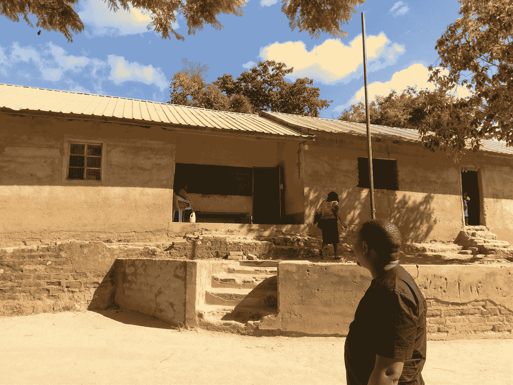

# 我在非洲的区块链冒险

> 原文：<https://medium.com/hackernoon/my-blockchain-adventures-in-africa-9d0bdc476333>

2017 年 12 月，我有机会发现了总部位于肯尼亚的 [Nurucoin](https://www.nurucoin.com/) ICO，并就此撰写了一篇[聚焦文章](https://icrunchdata.com/blog/blockchain-spotlight-on-nurucoin/)。有时，当我把这些文章放在一起时，我会对与之交谈的人/公司产生好感，在这种情况下，我会与首席执行官艾萨克·穆图伊保持联系。我会回答他的问题，向他指出对他的项目有帮助的信息。几个月后，他邀请我去参观他们在肯尼亚的公司，他们对我对他们正在开发的技术的看法很感兴趣。我同意来是因为，为什么不呢，去非洲旅行。我没有为这次旅行或这篇文章得到补偿，但我的费用是包括在内的，我提到这一点是为了充分披露。我在肯尼亚的发现，关于艾萨克和努鲁科因的目标，让我想到了一些非常重要的事情。

我在旅途中做了许多事情，其中一件是参观艾萨克出生的村庄。这距离内罗毕大约有 3 个小时的车程，最后 10 英里左右是一条土路，只能称之为公路。艾萨克的母亲仍然在他成长的学校教书，主要的不同是他们现在有纸来做笔记和做测试。艾萨克在那里上学的时候，一直到五年级，由于缺乏用品，他们都用手指在泥土中做测试。这些建筑看起来几乎像是最近考古挖掘的结果，而不是一个学习的地方。学生们现在有纸和书，但正如你在这张照片中看到的，它们的状况不好。

孩子们都穿校服去上学，但就像艾萨克去上学时一样，他们仍然没有穿鞋。他们每天在泥土中向每个方向行走 1 至 5 公里，这样他们就可以接受教育，从而决心改善他们的生活。这正是艾萨克所做的，从一个村庄开始，住在茅草屋里，没有鞋子或用品，在泥土中进行测试，他继续上大学并获得了计算机科学学位。此外，他还拥有管理信息系统的文凭和高级文凭，专门研究数据和网络安全以及计算机取证。

从这些卑微的开始，Muthui 先生已经成立了 9 家公司，以实现他帮助改善非洲同胞生活的梦想。当我们开车的时候，我们谈论了很多关于非洲和经济发展状况的话题。艾萨克可以一口气说出人口数字、国内生产总值、在世界经济排名中的地位、货币兑换率以及你想知道的关于非洲国家的任何事情。他让非洲成为技术创新中心的精力和热情显而易见。

Muthuis 先生现在的激情是区块链技术和他的 [Nurucoin](https://www.nurucoin.com/) 加密货币和 Nuruchain 技术平台。金融问题，如不稳定的货币和波动的汇率，以及政府腐败和太多的中间人在非洲的交易中，导致了一个环境，你有大量的赤贫人口，然后是富人和富人之间的人很少。在肯尼亚，自然资源是重要的，没有理由不能以一种不那么腐败的方式利用它们，以便更多的人可以赚更多的钱。肯尼亚的职业道德很强，人们为提升自己付出了惊人的努力，但也有一种倾向，那就是走上一条安全的道路，去上学，上大学，在政府部门找份工作，直到你死去。没有哪种远程办公会导致城市中令人难以置信的交通问题，在城市中，你可能要花一个小时才能走完 5 英里的路程。浪费时间造成的生产力损失是惊人的。让更多的人接受技能教育，使他们可以在世界各地远程使用，这将为经济带来更多的资金，并减少对基础设施的压力。

Nurucoin 的目标是建立一种最初将在 [Blazebay](https://blazebay.com/) 系统中使用的数字货币(类似于亚马逊，但规模较小)，并为一种可以绕过非洲目前存在的波动和汇率的加密货币奠定基础。与此同时，一项类似以太坊的名为 Nurublock 的技术也将得到发展。这个框架将允许其他公司更容易地开发基于区块链的技术来解决其他问题。Muthui 先生打算创建培训项目，可以用来帮助公民学习区块链，特别是如何为 Nurublock 开发。

这是一个巨大的愿景，许多人都赞同穆图伊先生的愿景。当我在那里的时候，肯尼亚政府 ICT 部长打电话给 Isaac，安排了一次会议讨论他正在做的事情，部长对区块链和让肯尼亚接受区块链技术非常有热情。当然有反对者，没有首先想到它的人倾向于尝试并摧毁它，但似乎没有什么能阻止艾萨克和他为努鲁科因创造的势头。我很荣幸能去那里，因为它正在起步，它将会改变非洲的游戏规则。几年后，当我们回顾这一切是如何开始的，我们会对它的现状感到惊讶。请继续关注努鲁科因和艾萨克·穆图伊。