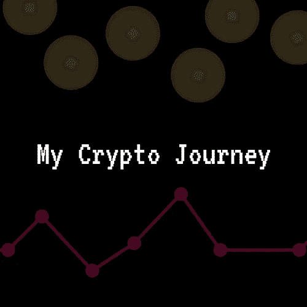
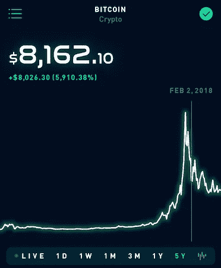
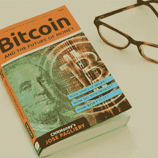
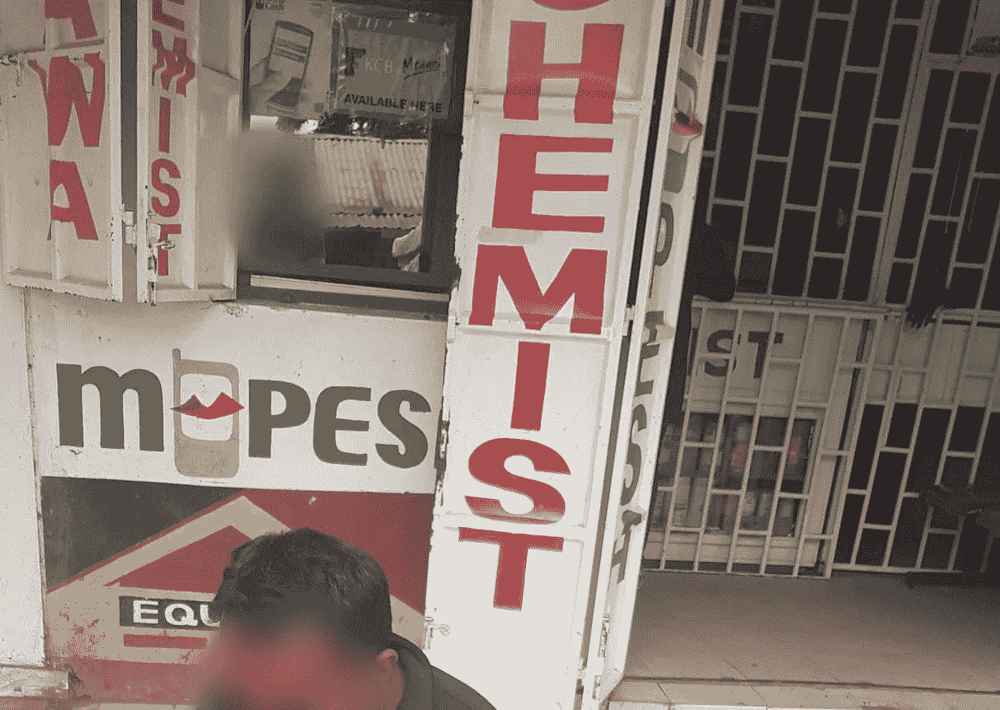

# 我的秘密之旅

> 原文：<https://medium.com/hackernoon/my-crypto-journey-55de77ba78f9>

我的职业是数据工程，我拥有经济学学士学位，直到最近，我一直是加密货币的主要怀疑者。我不是早期采用者，因为我觉得经济上的弱点使得投资风险太大。

但在崩盘后，我发现了一个有趣的视角，让我的怀疑变成了兴趣。我想分享我的想法，这样热心者和怀疑者可以更好地理解他们的对手的观点。

# 第一印象

我第一次看到比特币大约是在 2013 年，当时我正在浏览讨论比特币与丝绸之路(网站)关系的新闻文章。我在 2015 年再次遇到它，当时新闻媒体声称，在中国央行让人民币兑美元汇率在一天内臭名昭著地贬值之前，中国精英曾利用比特币将资金走私出境。

USD / CNY Exchange Rate. [Screenshot taken from Quandl.com](https://www.quandl.com/data/CUR/CNY-Currency-Exchange-Rates-USD-CNY)

在我阅读的过程中，有两个问题引起了我的注意，让我怀疑了很长时间。

## 有限的货币供应

对法定货币的一个合理抱怨是政府只是简单地印刷更多现金的能力。这是通货膨胀的一个主要原因，并最终伤害了小家伙的购买力。比特币想要向另一个方向发展:一种预先确定的货币供应量，其释放量会逐渐减少。

这不是一个新的系统，它确实有效。我们的货币一度是黄金支持的。地球上的黄金只有这么多。为了得到它，你需要挖掘它。开采的黄金越多，就越难找到更多。

然而，开发软件与开采贵金属截然不同。虽然比特币经济内部的货币供应是有限的，但加密货币的供应在理论上是无限的。有人可以通过以下方式引入新的货币供应:

1.  引入新货币(以太坊、Neo、Ripple、Stellar)
2.  分割货币的硬分叉:

*   2016 年 6 月:以太坊 DAO hack 和随后的硬分叉产生了两种货币以太坊&以太坊经典
*   2017 年 7 月:将一个比特币块的大小增加到 8mb 的硬分叉产生了比特币现金和比特币
*   2017 年 10 月:阻止 ASIC 采矿操作的硬叉子产生了新货币比特币黄金

我不认为加密货币的经济是相互隔离的——通货膨胀可能发生。

## 货币政策

另一件让我担心的事情是对经济学的放任态度，或者说缺乏货币政策。我认为，一些货币政策是必要的，以抵消经济事件的完美风暴。一个完美的例子是网络泡沫后的经济衰退。这次衰退是在一系列事件之后发生的:

*   个人和机构投资者对科技股的疯狂投机
*   科技公司失控的烧钱速度(他们花钱的速度)
*   日本的经济衰退
*   各种丑闻和诉讼
*   美联储提高了利率
*   9 月 11 日

作为对崩盘的回应，美联储(美国中央银行)介入并降低了利率。简而言之，这使得借款成本更低，是让资金再次流动的一种方式。

有些事件是在美国政府的控制之下，有些则恰恰相反。中央权力机构的优势在于，当金融崩溃发生时，有人可以进行干预，防止情况变得对所有人都不利。我的观点过去是，现在仍然是，任何经济体都需要有内在的保障。

我认为在一个自动化的系统中看到货币政策将是令人惊奇的。这样，政策就不会再闭门造车了。但似乎主要的加密货币还没有迈出这一步。我认为这是个错误。典型的例子是…

# 加密崩溃

Screenshot from my [Robinhood](https://about.robinhood.com) app

2017 年末令人震惊；加密货币的崩溃几乎和崛起一样突然。2018 年 2 月，它终于触底反弹，我在那里看到了一些有趣的事情。有趣到足以让我从高高在上的架子上爬下来仔细看看:比特币同比大幅上涨。这引起了我的注意。

有人在某个地方发现了足够的价值来安然度过危机。所以我去寻找他们的观点。他们看到了什么我没有看到的？

# 我是如何被赢得的

一个朋友送给我一本名为《T2:比特币和货币的未来》的书，作者是 Jose Pagliery 。关于比特币神秘起源和区块链背后技术的故事，谁不爱？

吸引我的章节是第六章:比特币的案例。这一章的大部分谈到了“没有银行账户”和“银行服务不足”的生活经历。

*   “无银行账户”:没有银行账户
*   “银行服务不足”:有一个银行账户，但更好地服务于替代金融服务，如支票兑现和发薪日贷款商店，这些都是出了名的昂贵。

帕格里里关于有多少人没有银行贷款的数据令人震惊。该书于 2014 年出版时，超过 25%的美国家庭和美国大城市 30%的公民都处于这种情况。对我们大多数人来说，诸如存入支票、提取现金或获得贷款等交易是无缝的，而且成本相对较低。然而，在收入较低的情况下，它们变得昂贵，并可能造成恶性循环。

*   存入支票:[如果账户余额低于最低限额，银行通常会收取费用。](https://www.huffingtonpost.com/entry/bank-of-america-charge-checking-account_us_5a68a762e4b0dc592a0e91d6)所以账户对于那些不能维持这个数额的人来说是不实际的。当人们在这种情况下收到一份薪水，他们最好的选择是去支票兑现服务，这也收取可观的费用。
*   获得现金:借记卡和供应商通常不会处理小额交易，所以为了坚持低收入预算，现金仍然是必要的。如果你收到一张政府援助卡，你需要提取现金，自动取款机就会向你收取费用。
*   接受贷款:假设你因病缺勤，发薪日贷款是唯一能借出你需要的小额贷款的服务，但利率和其他费用很高。

也许这些可以通过更好的财务规划和教育来缓解。但最终，处于这种情况下的人们将他们收入的很大一部分用于使用他们自己的钱。不可否认，我们的金融体系不是为了有效处理小额交易和服务低收入人群而建立的。

Thank you to [Omer Goldberg](/@omergoldberg) for the use of his photo displaying M-PESA signs at a local pharmacy in Kenya

本章接着描述了 M-PESA 在肯尼亚的突破性进展，正是解决了这一问题。移动 PESA 是属于肯尼亚最大的移动网络公司的一个系统，它允许用户将钱存入一个移动账户，然后互相发送短信。根据这一章，肯尼亚国内生产总值的 43%通过 M-PESA。这个系统非常成功，因为拥有手机的肯尼亚人数量远远超过拥有正式银行账户的人数。

我开始四处寻找家中银行不足的迹象。我住在以色列。在这里，银行通常要求房屋最低首付 25%(或更多)。[相比之下，美国是 3%](https://www.zillow.com/mortgage-learning/20-percent-down-payment/) 。这种 25%的最低首付加上高房地产价格使许多人无法拥有住房，并阻止了财富的积累，因为支付租金只是一个黑洞。这只是这里的银行和房地产故事的一部分。我只能想象中东其他地方的银行服务是什么样子。

这一章说服了我，因为我能够想象一个易于加入的系统为每个人提供无缝和廉价的金融服务的影响。如果真是这样，你能想象我们的全球经济会是什么样子吗？

# 展望未来

我认为实现这一目标的一个重要步骤是建立自动货币政策机制，以稳定汇率和其他经济指标。这将允许加密货币承担更多的货币角色，而不是投机性投资。

有这种想法的不止我一个人。一位朋友向我介绍了戴稳定币系统，该系统实施了一个自动货币政策系统，稳定了戴对美元的稳定币。将硬币与美元挂钩是开始向区块链系统过渡的一个很好的方式。但我希望有一天这些货币能够自行稳定和浮动(允许供求决定汇率)。

为了达到那个目标，我们需要进行大量的头脑风暴、辩论和实验。我期待看到未来会有什么新的密码发明出现，以及讨论会把我们带到哪里。

感谢阅读！如果您有任何您认为与加密货币相关的有趣资源，请随时评论或联系。如果你有问题，请随意评论&我会尽量回复你。

在 Instagram 上跟我连线[@劳伦 _ _ 格拉斯](https://www.instagram.com/lauren__glass/) & [LinkedIn](https://www.linkedin.com/in/laurenjglass/)

在亚马逊上查看我的[必需品清单](http://bit.ly/my_essentials)

访问我的网站！

Search for me using my nametag on Instagram!