# 我迄今为止的工程旅程

> 原文：<https://medium.com/hackernoon/my-engineering-journey-to-date-8250d69fd079>

这一切都是从父亲第一次让我玩烙铁开始的。我们一起用一个旧继电器做了一个简单的蜂鸣器。基本上，如果你给继电器施加交流电流，它就会发出嗡嗡声，所以我们只是把它包在一个塑料盒里，并焊接在两根电线上。我把它带到学校，给我认识的每个人看。我当时二年级。

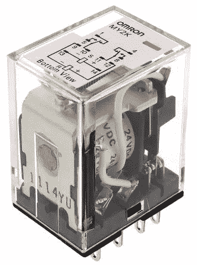

A relay

从那一刻起，电子学成了我的爱好。当我的朋友们在外面踢足球时，我在读苏联的旧书，试图让简单的电路工作，尽管我不明白到底发生了什么。

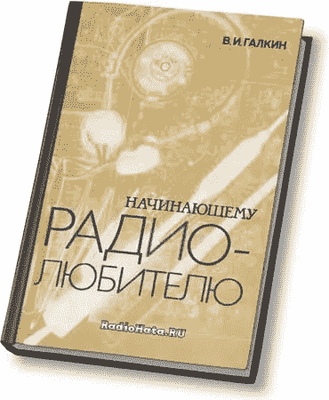

The title says “for the beginner radio-amateur”

模拟电子产品很有趣，但更复杂的电路，如调频发射机或接收机，很少对我有用。计算和调整它们需要扎实的物理知识，而我在那个年龄没有这些知识。难怪我真的被逻辑元素逗乐了。在分立世界中，这要简单得多:没有电阻或电容，只有 1 和 0。画几个里面有不同符号的盒子，用线连起来，放在木板上，砰！你有一个超级奇特的东西，一串发光二极管以特定的顺序闪烁。

我一知道电脑是什么，就立刻开始梦想拥有一台。我只有七年级的时候才有，在那之前，我最聪明的设备是一个旧的苏联可编程计算器。它教会了我**转到**、【T2 IF】以及【T4 WHILE】循环的概念。它还有一个不错的 5V DC 电源适配器，我在几十个小项目中使用过，但真正的计算机是如此令人惊叹和着迷。

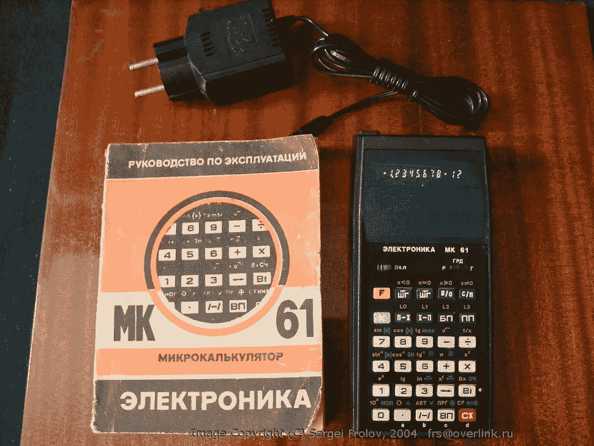

Electronica MK-61

21 世纪初是前苏联游戏俱乐部和“网吧”的时代。我把所有的零花钱都存了起来，这样我就可以每月一两次在当地邮局上网一小时。我很快学会了互联网是如何工作的，什么是*网站*、*电子邮件*和*搜索引擎*。到了六年级，我已经开始梦想拥有自己的主页了。我甚至有一个，在一个所见即所得的网站服务上创建和托管的，但它不算，因为我没有自己编程。

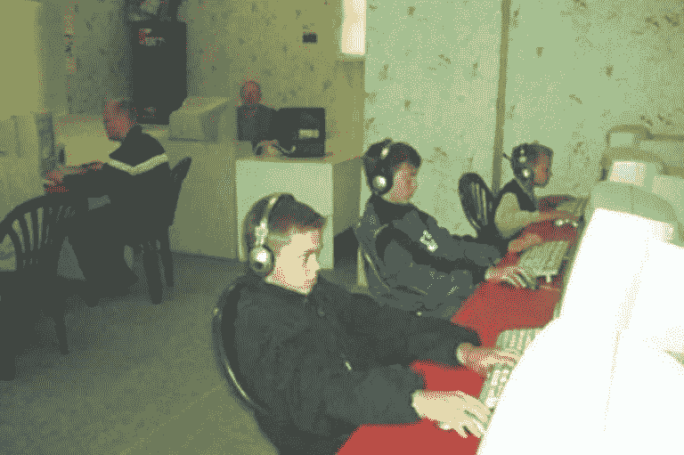

A typical computer club

就在我开始在学校读七年级之前，我有了我的第一台电脑。单核 *AMD 速龙 2000 XP* ， *512 Mb* *海力士 RAM* ， *80 GB* *希捷 Barracuda 硬盘，Nvidia GeForce 4* ，以及一个 *17 英寸三星 76BDF* CRT 显示器——对于 2003 年来说相当不错的配置。我的第一张 CD 是各种盗版(在我们这个领域没有其他的)网页设计软件的汇编，还有一个交互式的 HTML 和 JavaScript 教程。很快我正式拥有了一个主页，完全由我自己设计和实现。这是一个黄色背景的又长又笨重的东西，充满了在 Xara 3D 中被篡改的随机文本。我是这个星球上最快乐的孩子！

我不知道单词" *dynamic* 到底是什么意思，但是我确定我的"*网页*必须更加" *dynamic* "所以很快我就有了我的第一本关于真正编程语言的书:PHP**简介**。另一个是关于 Delphi 的——一个花哨的面向对象的 Pascal，由 Borland 创建。

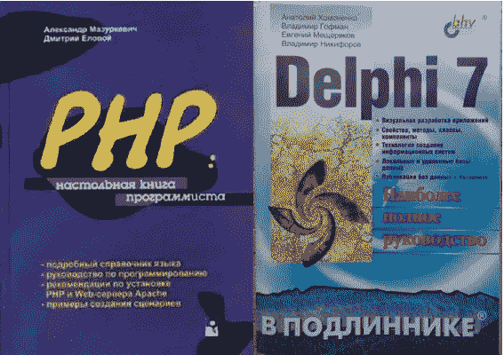

My first programming books

2000 年代早期，业余以太网局域网缠绕在每栋大型住宅楼周围。我被连接到 *z53* ，又名*区 53* ，根据我们的区号命名。我的绰号是 **BSOD** (又名*死亡蓝屏*)或者有时是*【B . s . o . d】*，甚至是*-~ =【B $ 0d】= ~-*。那是一个没有补丁的疯狂时代，*预服务包 one* windows 机器，任何人只需在终端键入`shutdown`后跟 *IP* 就可以远程重启。我在 Delphi 中创建了一个简单的恶作剧程序，我会偷偷溜进我同学的电脑，然后远程打开他的光驱，翻转屏幕，或者通过扬声器发出奇怪的声音。我几乎达到了可以监控他屏幕的状态，但突然 antiviruses 变得更聪明了，我所有的恶作剧努力都被关闭了。然而，我已经学会了一些基本的网络。

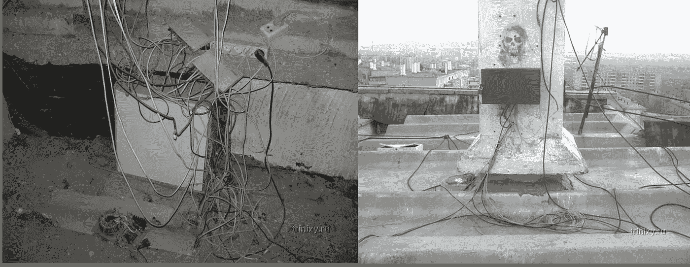

These things you would find on every roof or service floor of any residential building

大约在 2005 年的某个时候，我学校的信息学老师向我介绍了这个城市的编程俱乐部。那里的孩子们学习帕斯卡，然后参加竞赛，解决信息学奥林匹克竞赛中的各种算法难题。最好的被送到国家奥林匹克竞赛，然后从那里送到国际比赛，等等。那是一个充满有趣的人的地方，比如这个人，或者另一个人，我向他介绍了 Linux，一个月后，他已经在五年级的时候从头开始构建 Gentoo 了。

参加奥林匹克竞赛教会了我一些真正的编程和算法思维，这一直帮我到现在。那也是我开始学习英语的地方，因为我们经常在旧的国际比赛中练习，也经常在美国 T2 进行远程比赛。

竞赛很有趣，但我更倾向于“有形的”编程——制作一些许多人可以与之互动并感受结果的东西。我用 PHP 创建了一个非常基本的 CMS。它没有模板引擎，整个逻辑主要基于过度使用`include`语句。我没有什么特别的事情要告诉世界，我只是想编程，所以我只是在我的 CMS 上为别人运行一个网站，它是关于**体操**的。那个时候每个孩子都对跑酷感到恶心，所以我 CMS 的第二个用户竟然是我的一个学校朋友，他在经营一个当地的跑酷门户网站。

到 2006-2007 年，我已经掌握了不错的 HTML/PHP 技能，所以我开始偶尔做些自由职业。大部分都是简单的从 PSD 到 HTML 的合同，但是最大的一个是一个"*严肃"*的应用程序:我们从一些西班牙网站上删除新闻，通过谷歌翻译运行它们，然后用英语重新发布。对于客户来说，这是一种游戏搜索引擎排名算法的精明方式，对我来说，这是一个相当复杂的几个月的项目，这给了我第一次真正的 200 美元，我用它买了一把电吉他。

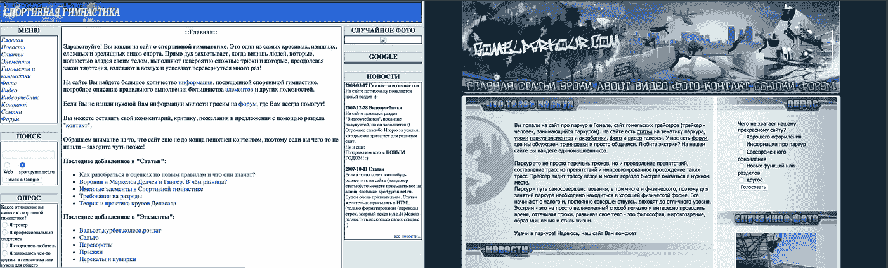

Two websites that were served by my first CMS (from web.archive.org)

我并不特别擅长编程奥林匹克竞赛，也从未参加过国际水平的比赛，但我的全国成绩让我无需通过任何考试就能进入白俄罗斯首都的一所顶尖大学。我选择了*应用数学*，专攻*信息安全*。大学教育主要由核心数学组成，直到第三年结束时，我才开始对它感兴趣，那时已经太晚了，还不及普通的编程课程。我已经获得了一些关于*密码学基础*的有用知识，但最主要的是，大学教会了我如何以最少的努力通过考试。

大学二年级后的那个夏天，我在美国度过。我和我的校友参加了一个工作旅行项目。这是一个项目，在这个项目中，你可以获得一个夏天的 *J1* 签证，然后在美国的某个地方做三个月的初级工作。第四个月你可以花在周游全国。我们的夏季目的地原来是大西洋城——新泽西的一个 b̶e̶a̶u̶t̶i̶f̶u̶l̶和 s̶a̶f̶e̶的海滨赌场城市。我们 13 个学生住在一个三居室的公寓里……
我的大多数室友都在卖冰淇淋、洗碗碟或在建筑工地工作，但我得到了我的第一份自由职业合同，与一家硅谷公司签约，报酬是洗碗碟的两倍！唯一的问题是我们的房子没有可靠的无线网络。每天早上，我必须步行 2 英里到公共图书馆，在那里工作到下午 6 点，然后转移到商场，在那里我可以从一家咖啡馆获得免费 wi-fi，并额外工作 2 个小时，直到我的笔记本电脑电池耗尽。我用 Java 为一些教育创业公司写网站剪贴。这主要是复制&修改相同样板代码的例行工作，但也有一些精华。一些站点主动保护自己不被废弃，所以我们使用了一个复杂的管道，由通过 *TOR* 连接的 *Selenium 控制的浏览器*，*分布在几个 *AWS* 机器上*，并从*重试队列*接收解析任务。如果说那份工作教会了我什么的话，那就是一项 *regexp* 技能，我几乎将它完善了。

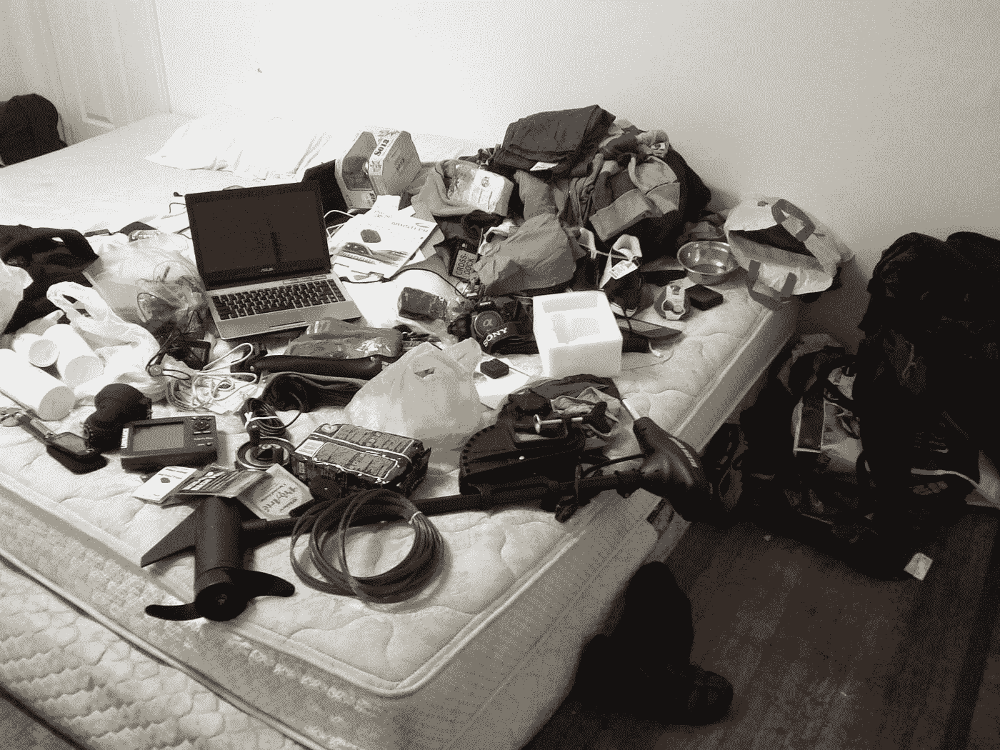

My stuff over my bed right before leaving Atlantic City

从美国旅行回来后，我和我的大学朋友安德鲁组成了一个团队，我们开始一起签订自由职业合同。我们在他的家里工作，这占用了我们大部分的时间，所以几乎没有时间在大学里学习。我们从小型的 PHP 合同开始，但是很快就转向了用各种 javascript 框架编写的 Python 和单页 web 应用程序。随着时间的推移，我倾向于后端，而 Andrew 成为了一名纯粹的前端开发人员。到了学习的最后一年，我们深深陷入了自由职业，我们不得不选择毕业后要做什么:找一份“正常”(正规)的工作，继续自由职业，或者通过雇佣更多的人来扩大规模。不用说，我们选择了后者。我的工程的下一章，现在的创业生涯就这样开始了——一家外包公司 [**Upsilon IT**](https://upsilonit.com) 。

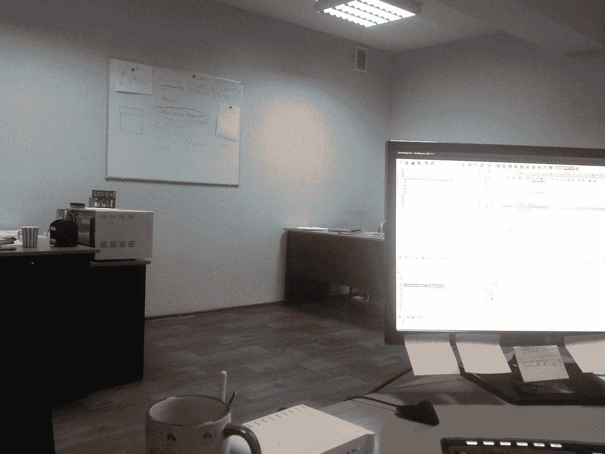

My desk at the first Upsilon IT office

Upsilon 有一个非常艰难的开始:我们没有足够的经验来完成我们正在从事的工作，我们不知道任何关于招聘的事情，也不能雇佣我们需要的人，我们不知道如何与客户打交道。我们不得不以大量的工作和足智多谋来弥补。有几次，我们遇到了这样的情况，每个客户都延期付款，而在发薪日，我们的银行账户上没有钱，所以我们不得不向亲戚借钱来支付工资。我们活了下来，一切最终稳定下来，现在 Upsilon 是一个快乐的、大约 50 人的公司，提供各种各样的网络工程。
没有什么比乌普西隆更能教会我了。除了工程技能之外，它还告诉我如何应对来自大学或比赛的*真正的*世界，而不是*假的*挑战。我学会了如何与人沟通，如何理解他们实际想要什么(*和需要*)，如何传达思想，如何招聘，如何解雇。大学没有教这些。

外包当然很有趣，报酬也很高，但我们总是想要更大的东西——我们自己的产品。

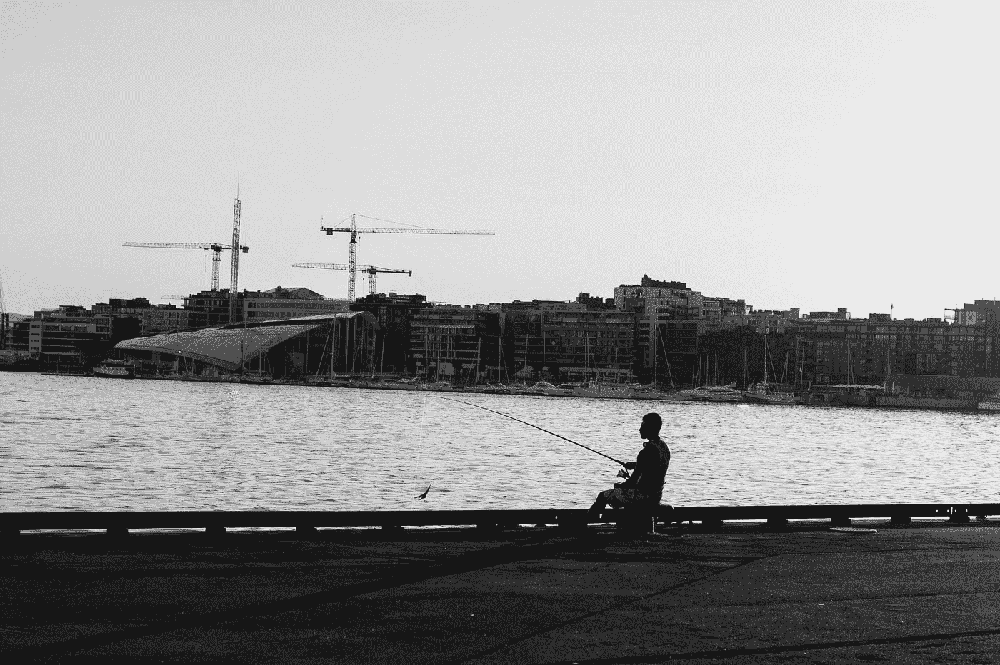

Oslo, during the trip to the client

2014 年我参加了[美国多样性彩票](https://dvlottery.state.gov/)，突然中了绿卡。我们和我妻子讨论了很多，但结论是，如果我们去——我们去硅谷，去了解真正的 IT 行业是如何运作的，以及人们是如何制造真正的东西的。

我们在 2015 年春天搬到了美国。我想尝试作为一名全职员工为一家初创公司工作，所以我把我在 Upsilon IT 的一半股份卖给了安德鲁，因为我不再帮助这家公司了。在圣克拉拉暂时安顿下来后，我开始找工作。大公司从来没有吸引过我，所以我从来没有认真考虑过它们，尽管我和一些公司碰过运气。我想近距离观察事物，我真正的目标是一个大约有 100 人的“*晚早*”阶段的创业公司。

我开始经历面试，很快意识到这不是我所期望的！我原以为它们主要是关于我的经历的对话，但是人们问我*算法*！在某种程度上，这里假设通过询问一个人 *RMQ* 和 *LCA* ，你在测试解决问题的技能。但是我已经很多年没这么做了！在最初几次面试失败后，我花了两三周时间重温高中时的经历。这很快得到了回报——白板面试变得轻而易举，我已经通过了谷歌的现场面试，但甚至在我知道结果之前，我已经接受了来自 [ThoughtSpot](https://thoughtspot.com) 的邀请——这是一家来自帕洛阿尔托的著名商业智能初创公司。我对 BI 一无所知，但工程面试如此深入，人又如此聪明，我渴望立即开始与他们合作。

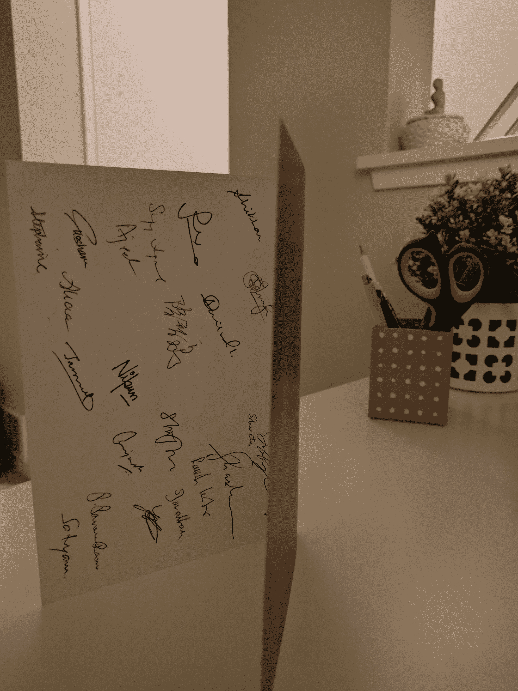

An after-interview post card signed by the ThoughtSpot engineering team

接下来的两年半，我在思想点度过。我人生中第一次接触到“大工程”。这些人从头开始编写了一个数据库，并在运送他们自己的设备，而我……我以前从未见过服务器单元。从雇主到雇员的转变也很不寻常。我现在有一个老板，甚至两个老板，我接受任务，而不是分配任务。最终，我适应了，接下来的两年半是我工程技能最显著的提升。我了解了内存数据库、高度并行计算、分布式系统、高可用性、企业产品等。等。我精通 Docker 和 Kubernetes，甚至写了一些关于它们的文章。参加了一个 OSDI 会议，学习了围棋编程。ThoughtSpot 最近成为了一只独角兽，但我在大约一年前离开了它，开始了我自己的旅程。

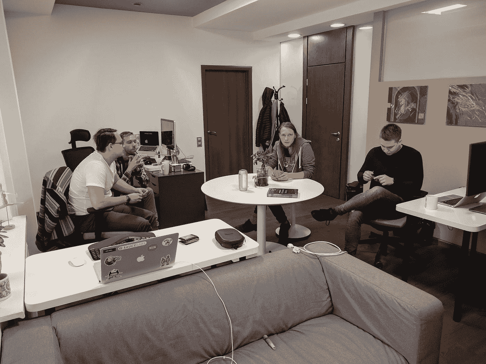

OneBar team in the Minsk office

正如我之前提到的，Andrew 和我一直想开发一个真正的软件产品，满足人们的需求。我一直认为我去硅谷是一次学习之旅，而不是职业生涯的终点，一年前我开始觉得学习已经足够了——是时候行动了！我们选择了一个我们最有经验的领域——大型分布式团队中的沟通。沟通和知识共享是任何公司生产力的本质，然而它并不适合任何项目，我们以前必须处理。我们组建了一个四人团队(由我、Andrew 和另外两个 Upsilon 的人组成)，尝试了一个不太管用的想法，现在正在研究第二个，我们觉得第二个更有潜力。我又一个人了，一切都是新的，令人兴奋的。我对我们的新项目充满热情，我正在重新学习！

最近，我不得不暂时回到 ThoughtSpot，成为一名兼职承包商，这样我就可以支持我在硅谷的生活，但我仍然将大部分时间奉献给了这个项目。我学到了很多新技能，如果我是一名普通的软件工程师，我永远也不会需要这些技能:*设计*，*营销*，*打电话*，**(！)**、*写作*、*呈现*、*讲故事*等等。尽管它没有给我带来金钱上的回报，但我已经认为整个想法是成功的，因为它本质上是一种比任何顶级大学都更好的学习体验。

到此为止，我将暂时结束我的故事，并继续从事 [OneBar](https://onebar.io) 的工作。期待撰写下一篇文章，讲述我们在构建过程中获得的所有经验！

我鼓励你，勇敢的读者，已经阅读了这篇文章的人，去看看我们正在这里[构建什么](https://onebar.io)，如果你的团队积极使用 Slack，考虑注册一个测试版。

谢谢大家！
祝好运，平安！

## 链接

[码头集装箱速度慢的另一个原因](https://hackernoon.com/another-reason-why-your-docker-containers-may-be-slow-d37207dec27f)

[Kubernetes 开发基础设施](https://hackernoon.com/kubernetes-for-dev-infrastructure-40b9175cb8c0)

[你闲暇时的知识库](https://onebar.io)