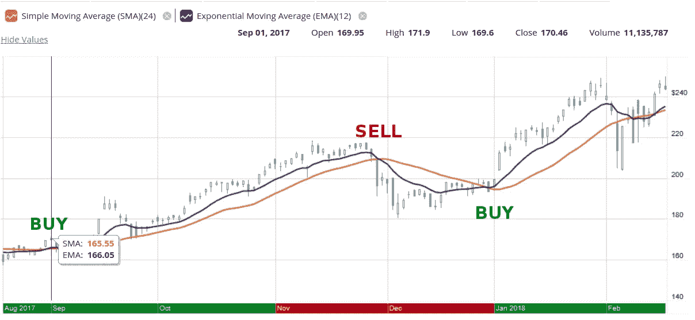
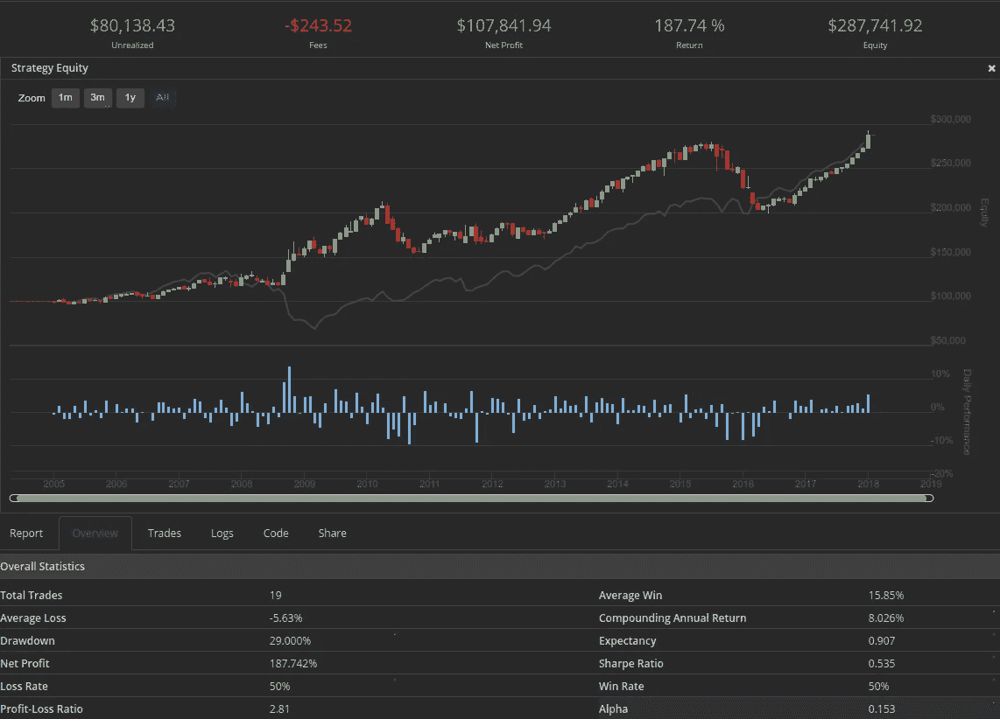
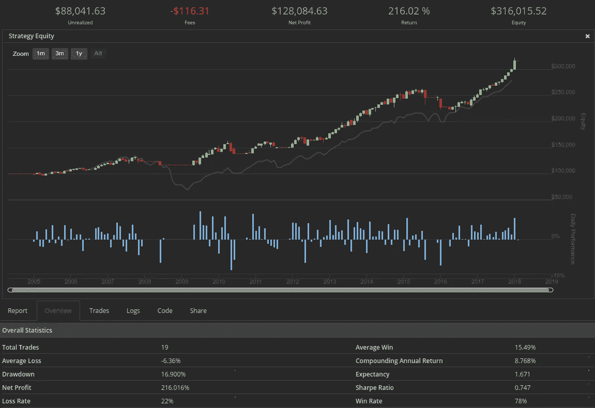
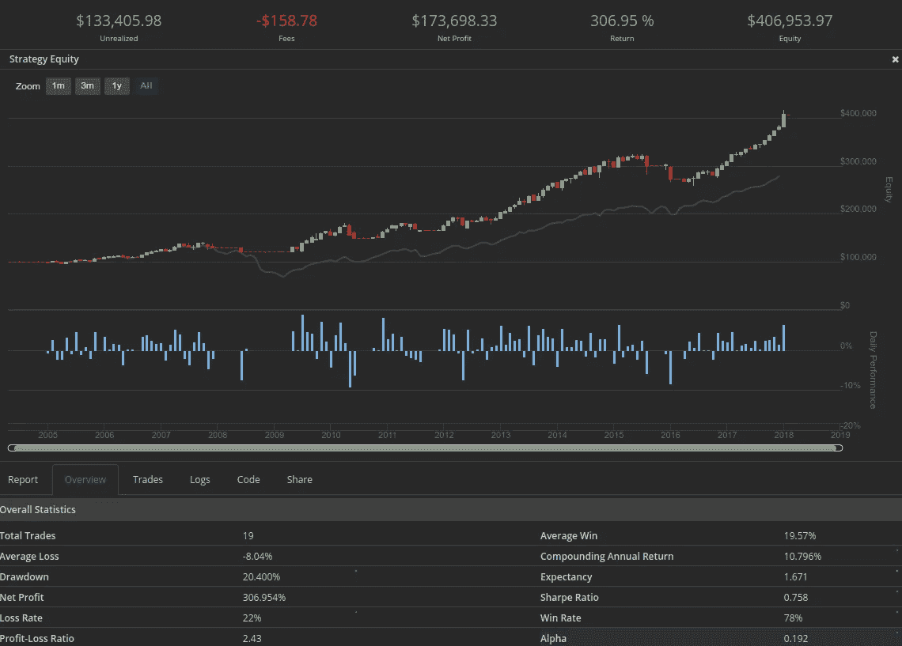
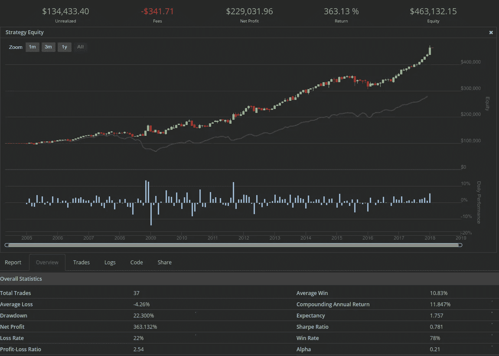
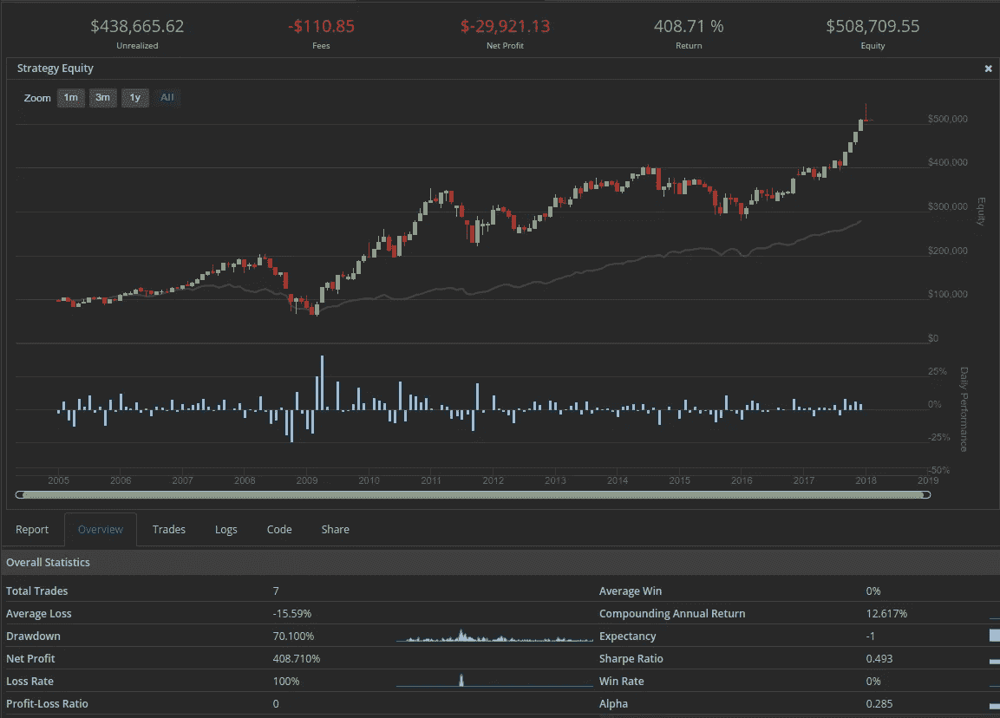
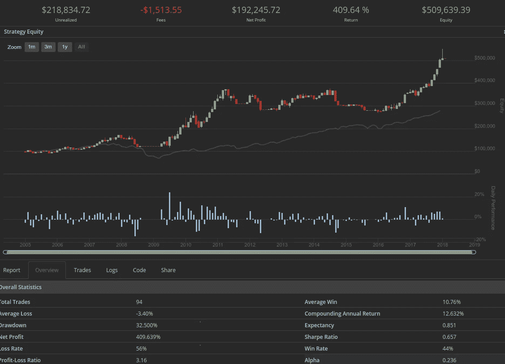

# 我对系统交易算法的第一次尝试

> 原文：<https://medium.com/hackernoon/my-first-attempt-at-systematic-trading-algorithms-21a023d37d46>

最近，我读了迈克尔·科维尔的《趋势跟踪》一书，这本书包含了大量关于 T2 系统交易者使用趋势跟踪方法的知识和采访。我被书中的数据深深打动，我决定探索更多，建立一些趋势跟踪系统，目标是在回溯测试中击败标准普尔 500 指数。

Photo Taken at Waihee Ridge, Maui

# 首先，什么是趋势跟踪？

趋势跟踪是试图利用市场的一个特点:趋势。这意味着在一段时间内，市场始终朝着一个方向运动，而不是随机波动。在书中，科韦尔用许多市场数百年的历史数据来证明这一点。

我想大多数人都会同意市场确实有趋势。我想大多数人也会同意(如果他们真的想一想的话)，整个美国退休行业是建立在美国股票将永远持续上涨的假设之上的。Covel 实际上也提出了这个问题，我认为这是值得称赞和思考的。

所以趋势跟踪不同于你在退休账户中使用的策略，它可能只是简单的买入并持有。趋势跟踪的一个特别好的优点是限制了下跌风险。所以在 2008 年，趋势跟踪策略会给你一个卖出信号，你只会损失 20%而不是 50%。这也表明你应该“做空”市场(做空)，这样你就能真正赚钱。不过，你也可以做一个更简单的长期趋势跟踪策略。

# 一个“趋势如何跟随”？

实际上这里有很多问题需要解决，也就是，你如何发现一个趋势？更具体地说，你如何足够快地发现一个趋势并买入，你如何知道它何时结束，以便在你损失太多钱之前卖出？

事实证明，有很多方法可以做到这一点。最常见的方法可能是使用移动平均线或其他[众所周知的指标](https://www.investopedia.com/articles/trading/12/using-trading-indicators-effectively.asp)来发现趋势。移动平均线很简单:你只需平均市场上最后的 n 个周期就可以得到当前值。例如，50 天移动平均线就是给定市场最后 50 个交易日价格的平均值。这是一个[“简单移动平均线”](https://www.investopedia.com/terms/s/sma.asp)，移动平均线有很多种，但基本上都是基于这个思想。

在这篇博文中，我将使用两组均线作为指标，当它们交叉时，我将把它作为买入或卖出的信号。这就是著名的 MACD [(均线收敛发散)](https://www.investopedia.com/terms/m/macd.asp)。事实上，在 Covel 的书中，许多人说他们只是使用移动平均线，他在一篇论文中概述了简单的移动平均线交叉系统如何击败许多买入并持有策略。

# 好的，第二，一个人如何“系统交易”？

系统交易只是意味着你制定了一个基于规则的交易策略。你遵循系统的规则并执行它。这和算法交易是一样的，你的规则集是 T2 算法 T3。你可以手动实现这个系统，也可以编写一个计算机程序来帮你实现。作为一名工程师，我想让事情自动化，开发出无需人工干预就能做出正确决策的系统。所以很明显我想让我的系统自动化。

自动化你的交易系统的另一个好处是，它可以让你摆脱控制它的诱惑。完全自动化迫使你坚持你的系统。我是一个有经验的投资者，但不是一个积极的交易者，所以避免这个可能的陷阱是非常有利的。

[Quantopian](https://www.quantopian.com/home) 是一家为你提供建立和回溯测试交易系统平台的公司。所有东西都是用 python 写的，他们有很多市场的数据，这些数据可以追溯到很久以前。我开始使用 Quantopian，但我最终改用了 [QuantConnect](https://www.quantconnect.com/) ，这与 QuantConnect 类似，但实际上有实时交易。只要按月付费，QuantConnect 就能让你用你的[互动经纪人](https://www.interactivebrokers.com)账户实时交易你的算法。您可以在这里用 Python 或 C#编写代码。

# 最终目标是什么？

我的目标是开发一个好的系统，可以同时交易几个市场，并且实时交易！概括地说，我的总体目标如下:

1.  在回溯测试中每 5 年击败 S&P500
2.  永远不要让每年的提款超过 25% (S&P500 经常看到 50%的提款)
3.  拥有大于 1 的[夏普比率](https://www.investopedia.com/terms/s/sharperatio.asp)(不在本文讨论范围内)。
4.  接触许多不同的市场(不仅仅是美国股票，我现在就是这样)
5.  有一个通用的策略，几乎在每个市场都表现良好

最后一个目标非常重要。如果你熟悉数据科学或机器学习，你会听说过[“过拟合”](https://en.wikipedia.org/wiki/Overfitting)。如果我的策略是如此优化，它所能做的就是击败回溯测试，它很可能在未来失败，因为我将有效地数据挖掘历史信息，以过度优化它。所以避免过度拟合是关键！

# 我们走吧。下面是基本策略。

正如我之前提到的，我将使用移动平均线。具体来说，我将使用[指数移动平均线](https://www.investopedia.com/terms/e/ema.asp)，寻找短期和长期移动平均线之间的交叉点。一个*指数移动平均线*类似于一个*简单移动平均线*，除了它被加权以支持更近的时间周期，所以你可以更快地发现趋势变化。**在下面的图表中，我绘制了不同时期的两条移动平均线，我们可以看到它们交叉。**

以上是过去几个月 Nvidia 股票的图表。我画了一个短的指数移动平均线和一个长的简单移动平均线。你可以清楚地看到交叉点出现，趋势改变方向。当短期在顶部时，你买入，当长期在顶部时，你卖出。我有标有*【买入】*和*【卖出】*的交叉盘，你可以看到这是如何盈利的。这并不总是很好，市场也不总是趋势，但在趋势市场中，这很好。

需要说明的是，我可能最终不会使用这些指标。但是下面是使用指数移动平均线作为指标的实验。

# 第一回测:移动平均交叉对只有间谍。

[SPY 是追踪](https://finviz.com/quote.ashx?t=SPY) [S & P500](https://en.wikipedia.org/wiki/S%26P_500_Index) 的 ETF 。P500 是我要超越的基准。所以我想首先保证我能仅凭趋势交易打败 SPY。**短周期是 50 日均线。长周期是 150 日均线。**没有杠杆。有长有短。[代码在这里](https://gist.github.com/a-r-d/d2ff471c27d9c8318e81d58a8e9455d8#file-main-py)。

## 结果:良好的开端

实际上，这是一个好的开始:我们保持了基准(灰线)，在最坏的情况下遭受了 29%的下降。夏普比率只有 0.535，我认为我们可以做得更好。

# 仅间谍 MACD，仅 50/150 长

我们现在要做和上面一样的事情，但是时间要长。这意味着不做空，当趋势下跌时，我们完全退出市场。其他一切都是一样的(同样的代码，我只是将“longOnly”改为“True”)。你可以在图表中清楚地看到，在大萧条时期，我们退出了市场，没有交易发生。

## 结果:大大降低了压降，提高了夏普比率

结果很有意思:2015/2016 年期间非常波涛汹涌，混淆了均线系统。通过不做空，我们省去了很多痛苦。夏普比率是对风险调整后回报的一种衡量——因此，自从我们的波动性下降以来，夏普比率大幅上升。这个系统实际上击败了市场。

# 仅间谍 MACD，50/150，仅做多，增加杠杆

我们保持一切和上面一样，但我们会增加一点杠杆。我们将以 1.25 的比率保证金买入。所以会借 25%。如果系统良好，这将增加回报，但也会增加风险。

## 结果:现在真正战胜了市场

因此，你可以从一点点杠杆(我们为此买单)中看到，复利年回报率几乎大幅提高至 10.8%。我们能做得更好吗？

# 间谍 MACD，50/150，只做多，1.25 杠杆，让 TLT 保持跌势

我们现在将稍微修改算法。我将让系统持有 [TLT(一种国债 etf)](https://finviz.com/quote.ashx?t=TLT) ，这将支付我们一些利息，同时我们等待 SPY 回到上升趋势。TLT 也应该与股票呈微弱的负相关，因此当 SPY 下降时，它可能会上升。请注意，TLT 不是通过杠杆购买的。[这里是更新后的代码](https://gist.github.com/a-r-d/d2ff471c27d9c8318e81d58a8e9455d8#file-hold-tlt-version-py)

## 结果:各项指标都有所提高

从简单地在市场之外持有美国国债，我们的回报大大提高。复合年回报率高达 **11.85%，优于 S & P500** 的回报率。这开始暗示趋势跟踪的魔力。如果我们在强劲的上升趋势中持有其他东西呢？如果我们可以测量上升趋势的强度，并且总是处于最强的趋势中，会怎么样？不管怎样，如果市场是一个趋势市场，这个简单的 2 ETF 策略似乎非常有效。

# CVX，德，卡特彼勒，F-趋势贸易

我们现在要尝试一些不同的东西。我将保持杠杆指标不变，均线交叉信号不变。但我们会交易一些周期性股票。雪佛龙(一家石油公司，当油价下跌时下跌)，迪尔和卡特彼勒是周期性的，与建筑和农业有关，最后是福特，这是周期性股票的定义。

## 这 4 只股票的普通买入并持有基准:

## 趋势交易这 4 只股票

## 交易周期性股票的结果

所以这个算法没有任何阿尔法值，但它并没有表现不佳。即使有客户流失的费用，它也做得不错。**一个巨大的优势是我们大大降低了最大压降。**买入持有一年亏了 70%，而我们的趋势交易系统只亏了 **32.5%** 。那么我们如何进一步优化呢？好吧，当事情没有趋势的时候，我不会玩买 TLT 的把戏。更好的是，我可以对趋势股票进行加权，这样所有的现金总是在上升趋势中被使用和部署。或者我可以做空。我也可以根据股票的波动性来优化均线周期。我将在下一篇文章中对这些优化进行研究。

# 结论

这只是我尝试建立一个非常简单的趋势跟踪系统的初步探索的一个快速总结。我很快会有更多的后续报道，但首先我想谈谈我们能从这次探索中学到什么。

1.  **MACD 50 天的短时期和 150 天的长时期对间谍来说都很有利。**我没有表现出来，但是我试了其他几个周期，更短的均线周期效果不太好。这是有道理的，因为 SPY 是一个指数，它是 500 只股票的综合指数。信号已经非常平滑，所以它不会很快改变趋势。也许如果你交易一只科技股，你可以使用更短的均线周期。也许交易指数根本没有意义，因为我们真的希望波动。
2.  只有当市场趋势时，它才起作用。看到 2015/2016 年市场横盘整理了吗？是的，趋势交易在没有趋势的时候是不好的。诀窍可能是衡量趋势的强度，然后找出如何只在趋势“强”的市场交易(无论你如何定义)。
3.  **如果加上杠杆，效果会更好。因为你在顺应大趋势，所以大部分时间你应该跟随市场上涨。使用杠杆似乎相当安全。Covel 在他的书中谈到趋势交易者通常使用杠杆，所以这似乎是一个有效的结论。**
4.  **龙只对股票有效**。长期来看，股票往往会上涨，所以这只可能相当有效。不过，科韦尔书中的大部分内容涉及大宗商品市场，这些市场是周期性的，不会长期呈上升趋势。因此，做空其他市场是有道理的，但可能不是股票，因为市场似乎只是暂时下跌。我认为，重要的是要记住，从长期来看，美国股票是对美国整体经济的押注。
5.  智能地同时交易许多资产需要做更多的工作。简单地买进并平均持有并不明智。如果想有效利用资本，我们必须变得更聪明。你如何识别最强的趋势，并且只买入那些趋势？你如何识别有趋势的资产？怎样才能避免在市场上砍人？如果你发现什么都不是趋势，你该怎么办？
6.  **即使你没有得到任何阿尔法，下降也是最小的**。在衰退期间避免大规模提款是一个相当大的优势。趋势跟踪在这方面很酷，因为它比买入并持有更能保护资本。

原来[贴在我的博客这里](http://www.ard.ninja/blog/my-first-attempt-at-systematic-trading-algorithms/)。随着我建立交易系统的进展，我会发布更多的帖子。