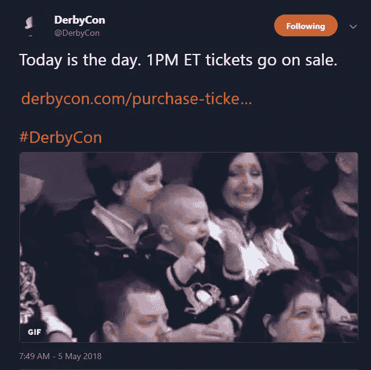
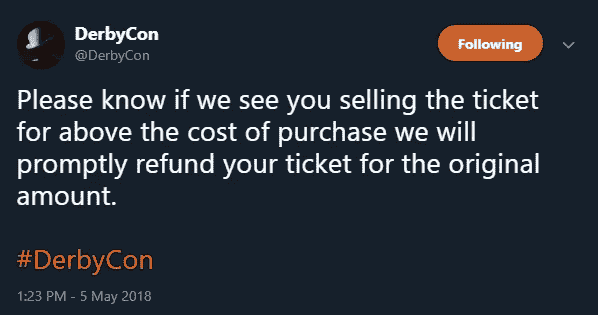
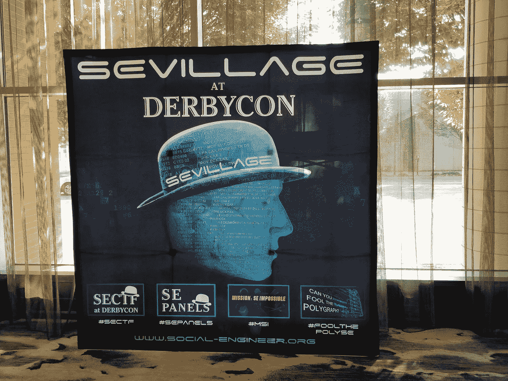
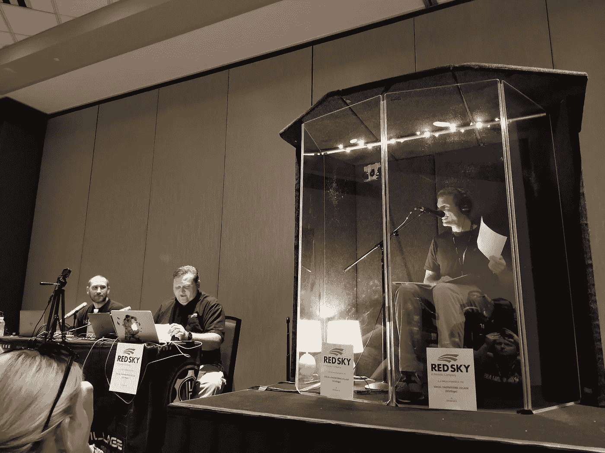
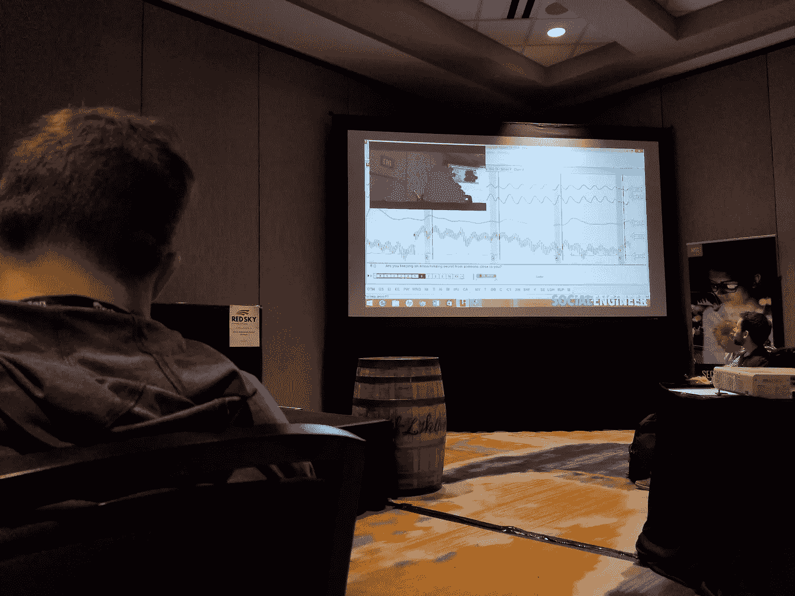
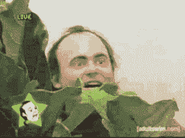
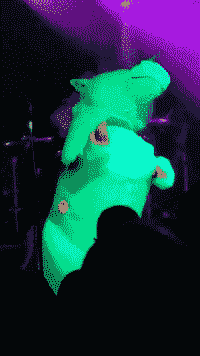
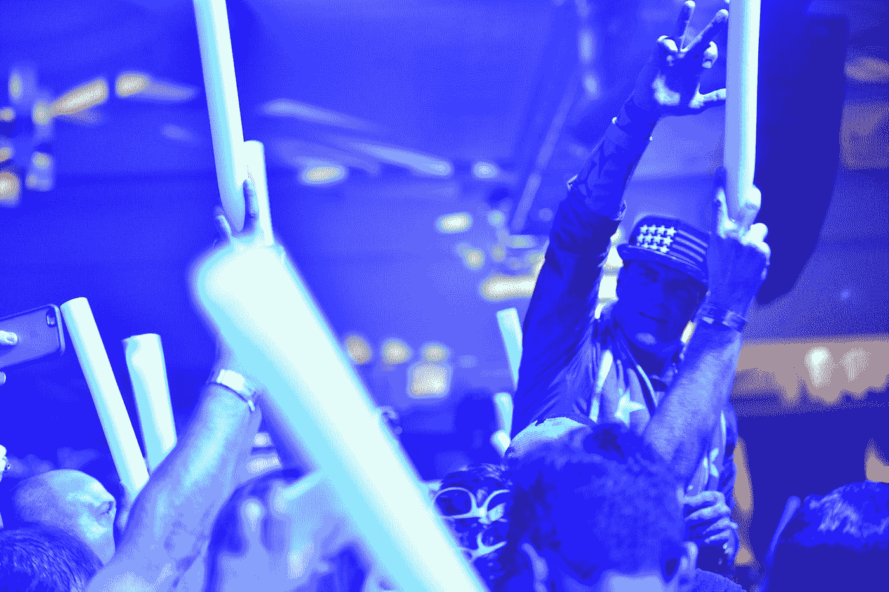
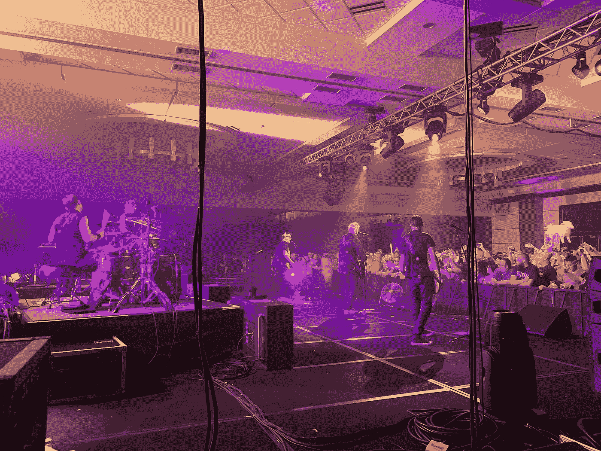
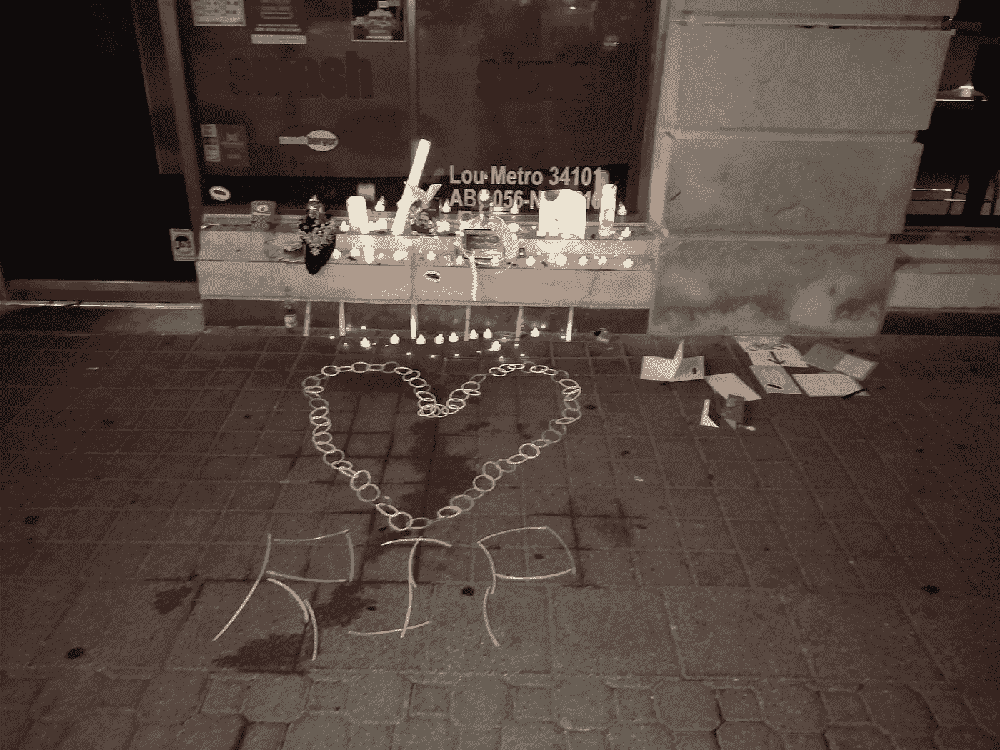

# 我的第一次德比大战:从 n00b 中学到的教训

> 原文：<https://medium.com/hackernoon/my-first-derbycon-lessons-learned-from-a-n00b-d4e937c69a66>

始于披萨店的信息[安全](https://hackernoon.com/tagged/security)大会 DerbyCon，刚刚用 DerbyCon 8.0“进化”结束了第八个年头。它大约在每年的九月底/十月初在美丽的肯塔基州路易斯维尔举办。今天我想向你介绍的是我的经验、一些通用的技巧和学到的教训。请记住，这是我第一次参加 DerbyCon，也是我第一次参加大型 InfoSec 会议(之前唯一一次是在 [BSides Cincinnati](http://www.bsidescincy.org/) )。)

# **如果你没有马上买到票，不要紧张。**

我从德比康老兵那里听说票很快就卖完了。我知道我非常想去，所以我在手机上设置了闹钟，让我知道购买的日期和时间。我准备好我最好的 F5 键，伸出我的手指。

oh boy oh boy oh boy asdkjfhasdljh

你知道吗？我很幸运，弄到了一张我需要的票。我看着 Twitter，当我看到其他人发帖说他们尝试过但没有成功时，我几乎感到内疚。但是，如果你注意听，人们开始意识到他们不能去或者在狂热中买了太多的票。好消息是，德比康不喜欢倒票，我也没看到有人在网上倒票牟利。

I hate limited stuff poachers.

所以，随着时间的推移，人们开始出售他们的门票(按面值)。一些人通过绘画或慈善方式把它们送给别人。底线是，如果你没有通过官方渠道得到一个，你并没有完全完蛋。DerbyCon Twitter 页面和社区也会经常转发这些机会。

# 查看时间表，计划好你的一天。

在德比康有很多事情在进行。我发现看时间表(可以在德比康网站上找到)和标记我感兴趣的谈话帮助我了解了所有情况。也花点时间回顾一下演讲的描述。有时我发现描述并不完全是我所期待的标题。

Uh…

还有一件很酷的事情，如果你不喜欢演讲，这里有很多工作坊或“村庄”。今年我看到了社会工程、硬件黑客、开锁、汽车黑客和物联网。(感觉好像少了点什么，不好意思！)

这些村庄全天举行活动，参加者可以学习，并争夺奖品。就我个人而言，我大部分时间都在社会工程村度过。我确实几次试图进入开锁村，但那里总是挤满了人。

Social Engineering Village

在社会工程村(由人类黑客主办)，他们举办了一些非常酷的活动。首先，他们让社会工程捕捉旗帜(SECTF ),竞争对手实时给公司打电话，试图收集具体信息。观看这些人表演他们的手艺绝对是一种享受，而且房子里没有任何空位。

Competitor making vishing calls.

后来，他们提供了注册和比赛的选项，看看你是否能击败测谎仪，他们没有对他们的问题进行任何打击。

我听到他们问诸如“你洗澡时经常小便吗？”"你曾经偷过同事的东西吗？"“你黑过前任吗？”站在同龄人面前，被这些问题弄得措手不及，需要很大的勇气。我向那些这样做的人脱帽致敬。

“Are you keeping an embarrassing secret from someone close to you?”

我一整天做的其他事情包括参加社会工程讲座(目前为止我最喜欢的)，另一个关于配置欺骗性系统(蜜罐)，IronPython 和数字取证。好消息是，如果你有一个冲突的时间表，会谈被记录下来，你可以赶上这种方式。会谈也在酒店里进行，如果你愿意，你可以在房间里观看。

# **与人交往。**

有一个*吨*的展位。我接触的每一个人都有讲义和很酷的赠品，包括 T 恤衫、[书](https://hackernoon.com/tagged/books)、胡须梳、压力球、笔等等。虽然营销团队希望你在偷走他们的赃物并逃跑之前花时间实际看看他们的摊位/产品，但我没有发现任何一个人急于让我注册任何东西，我了解了市场上一些真正有趣的产品。

如果你有一个特定的公司，你想得到赃物，你应该优先到达那里，因为东西可以很快！(尤其是 t 恤)。我一直期待得到一件值得信赖的 Sec 衬衫，但不幸的是今年错过了。我确实得到了一个[二元防御](https://www.binarydefense.com/)的，但不是我的尺寸。

“LobbyCon”或在酒店大堂闲逛，也是一次很好的经历。我独自坐在一张更大的桌子旁，慢慢地，人们开始和我坐在一起。我很享受和每个人的谈话，并解释说这是我第一次德比。每个人都向我提供了他们个人的建议和经验教训。我对一些事件有疑问，它们都有助于填补知识空白，或者给我指出可以解答的人。与其他与会者互动是我最喜欢的部分之一！有这么多聪明友好的人，我一次也没有感到不自在。

Stop lurking and talk to someone.

# 事后派对是合法的。

在漫长的德比康一天后，他们在周五和周六晚上举行了一场派对。今年，华尼拉·艾斯上了周五的头条，孩子上了周六的头条。*这是一场爆炸。*

Yaaaas dancing Unicorn

每晚开始时都有一名 DJ 上场，在主要活动开始前播放音乐，让观众热身。这包括重低音、免费啤酒和大量荧光棒。

Go Ninja Go!

随着一场在酒店会议室举行的音乐会，事情变得*喧闹*。这是一个在军舰上服役的人说的，他不得不听着所有人都在看的收音机里震耳欲聋的高频噪音。我真的会考虑明年带些耳塞，因为我们出门时我的耳朵还在嗡嗡作响。

最大的抱怨是场地本身缺乏对其他人的考虑。戴夫·肯尼迪在晚上开始的时候登上舞台，提醒人们注意个人空间，但是没有人理睬。在有了孩子的第二个晚上，一个女人背上有一个巨大的皮革的东西，看起来就像哈雷摩托车上的鞍囊。她手舞足蹈，挥舞着那个东西，就像一个破坏性的球砸向我和我的派对上的其他人。有 0%的几率她也没有意识到自己在做，她只是不在乎。我礼貌地拍了几下，似乎只是鼓励了她。我终于改变了主意，这变成了别人的问题。如果明年我听说在音乐会上不允许带包，我会很激动，因为人们用包打你会变得很烦人，而且它们会占用额外的站立空间。此外，如果我们党内的人留下了任何形式的个人空间泡沫，那么某个人或某个团体就会不假思索地把自己塞进那个空间。我是一个身高 5 英尺 7 英寸的小个子，在我们面前挤成了一个绝对的大块头。到晚上结束的时候基本什么都看不到。

*话虽如此，*我玩得很开心，这些都是小怪癖，如果这是我要抱怨的最大的事情，我认为自己很幸运。

From DerbyCon Twitter: “This moment is awesome.”

# **结论。**

总的来说，我度过了一段令人惊奇的时光。我遇到了很多很酷的人，包括传奇人物[戴夫·肯尼迪](https://twitter.com/HackingDave)，他在百忙之中抽出时间与我交谈，我学到了很多关于社会工程的知识(这也是我想要集中精力的)。之后的派对很棒，除了我提到的一些细微差别。我已经很期待明年的比赛，迫不及待地想再次见到德比康一家。

# Trevor 忘记

