# 我第一次独自参加 Riot Games 的黑客马拉松

> 原文：<https://medium.com/hackernoon/my-first-experience-attending-a-hackathon-alone-at-riot-games-d7b3780920e2>

*正如 2017 年 Riot Games 黑客马拉松第二年轻参与者所说*

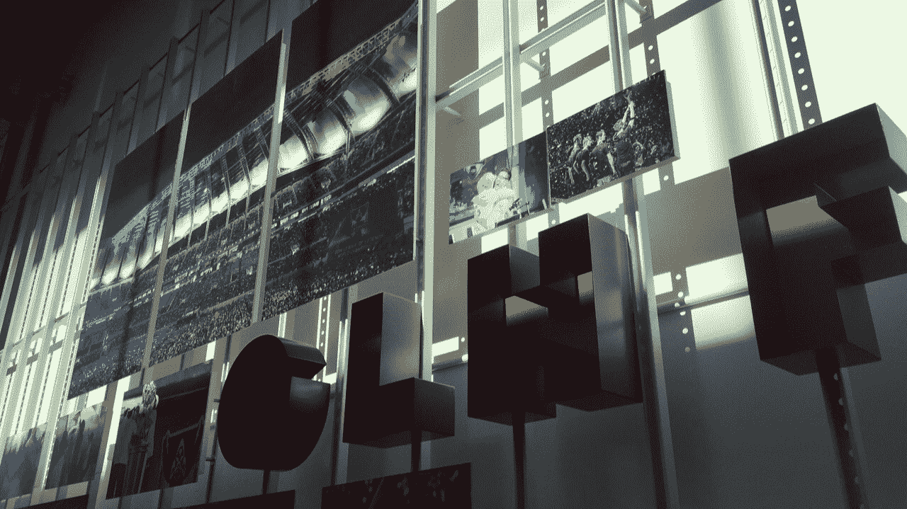

*A common phrase said by players pre-game, GLHF, is emblazoned on Riot HQ’s wall*

大约三个月前，来自世界各地的 50 多名与会者和我被选中参加了 T2 的黑客马拉松。我心血来潮申请了，觉得像其他黑客马拉松一样做点什么会很酷。我不知道，这一经历将成为我 2017 年的亮点之一。

我以前从未单独参加过当地的黑客马拉松，更不用说在洛杉矶了。我来回走了几次，试图决定是否去，模拟最坏的情况。

> *如果我找不到团队怎么办？*
> 
> 如果我在机场迷路了怎么办？
> 
> *如果我无法参与任何项目，该怎么办？*
> 
> *如果我无法与其他参与者交朋友怎么办？*

随着我内向的倾向占据了我的思想，我感觉自己好像又被推进了我的第一次黑客马拉松。

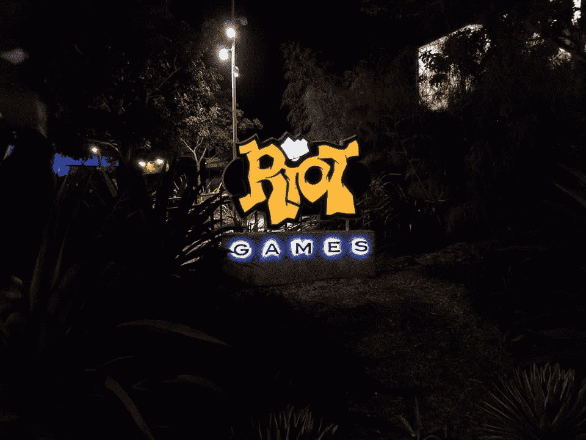

幸运的是，社区的不和谐非常受欢迎。尽管如此，与我从未见过面的人开始交谈还是很困难的，我已经在英雄联盟开发者社区共事多年了。我一直是一个比较随意的玩家，更喜欢待在我的朋友群中，和现实生活中认识的人一起排队。尽管我对许多项目感兴趣，但我仍然看不到我能做些什么，因为有许多其他开发人员比我更有才华。交叉手指，我只祈祷我会在活动中遇到一起工作的人。

# **第 0 天:到达**

快进到我飞行的前一天晚上。几周前，我从匹兹堡回来，第一次独自驾驶旧金山国际机场。在一次学术测试后，我赶到机场，当我拥抱兴奋和紧张的结合时，我的胃开始跳动。我妈跟着我上了飞机，登机前我给了她最后一个拥抱。

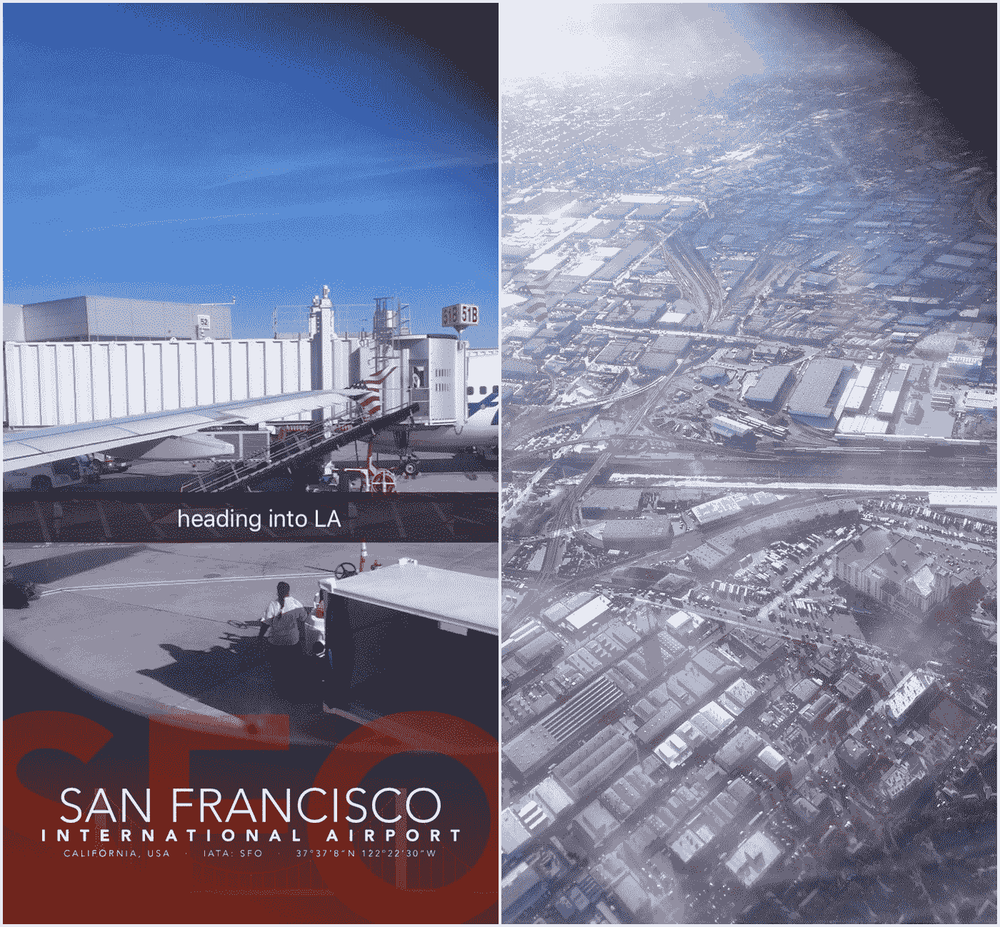

*It was a quick 1-hour flight to LA, where I caught a couple zzz’s.*

当我走下飞机进入洛杉矶国际机场，我试图找到我的眼镜，愣住了。突然意识到我把它们忘在家里了，我开始恐慌。我听说过洛杉矶国际机场是出了名的难以导航，但还是前往最近的可读标志，希望我走在正确的方向上。当我登上电梯时，我的脸涨得通红，但差点走错了楼层。感到失落，我发了一条不和谐的信息，“哦，我迷路了还是怎么的。”有人让我去找一个写有我名字的牌子，但我只看到了我的中间名。作为一个极度自我意识的人，我在拖着脚走到豪华轿车司机面前问:“这是给艾米丽·于的吗？”就凭这简单的一句话，我克服了第一个困境，来到了万豪酒店。

那天晚上晚些时候，我们一群提前一天到达的人出去探索码头，然后去布巴甘捕虾店吃晚饭。

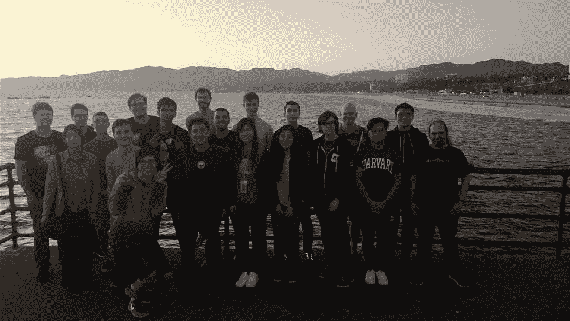

*A group of us exploring the pier the day before the hackathon started*

# **第一天:组队和黑客马拉松开始**

我的黑客马拉松体验是从一声巨响开始的，因为在到达之前，我曾预计会有和亚洲酒店一样的体验，并在前一天晚上意识到我忘记了许多必需品。这些物品中有牙膏、拖鞋、发带，还有睡衣(但我不知道牙膏是前台提供的)。因此，我起得很早，希望能悠闲地走到一英里左右外最近的沃尔格林超市。

这个决定被证明是一个不幸的决定，因为我穿着不舒服的鞋子，方向感很差。即使有了谷歌地图的帮助，我最终还是绕了一个圈走了大约 20 分钟，为了及时赶上去防暴总部的班车，我不得不不在没有扎头发的情况下冲刺。对于那些没有长头发的人来说，这是*非常*不愉快的事情。想象一下在 80 度的高温下冲刺，穿着过多的衣服，戴着几条项链或挂绳。这绝对不是一个理想的跑步环境，更糟糕的是，我已经很久没有跑步了！

在带着烧伤的脸颊和疼痛的脚后跟终于回来后，我勉强爬上我的酒店房间，及时赶回来接班车。

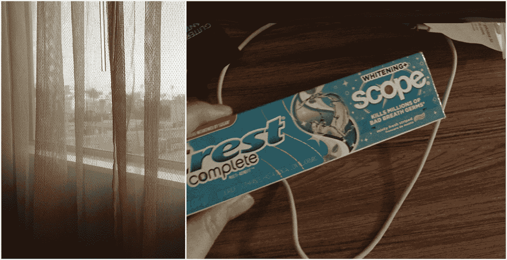

*Throwback to my impromptu Walgreens run*

我带着一个超出我能力范围的想法参加了黑客马拉松——哈哈，明白了吗？然而，在迎新活动之后，我被留在周围徘徊，意识到大多数人已经找到了一个团队。在和另一个对我的想法感兴趣的人逛了一圈后，我们俩都决定加入另一个小组，这个小组恰好是我会在余下的活动中坚持的。

当我们聚集在一张桌子周围时，我困惑地看着团队在最近的一张纸上草草写下一个计划。由于对正在发生的事情了解不多，我自愿参与部分后端工作，因为我在以前的黑客马拉松中花了很多时间作为前端开发人员。

抱歉，如果你在读这些人，我困惑了很长时间。

我刚来的时候对 JS 有一点点了解，而这恰好是我们建立我们的项目“联盟之声”的基础。联盟之声源于这样一个事实，即初学者和低 elo 玩家往往会失去对统计数据和冠军档案的跟踪，这使得游戏更容易，例如法术冷却(对他们自己和对手来说)以及其他冠军的能力。我们认为谷歌语音助手将是使参考信息变得容易的最佳平台，因为你不需要退出并中断你的[游戏](https://hackernoon.com/tagged/game)。

因为我们的团队太大了，我们的主要焦点最终是覆盖尽可能多的功能——然而我们仍然在接近黑客马拉松结束时耗尽了所有的想法。以下只是已经实现的众多召唤师中的几个，所以请随时在我们的[演示网站](https://leaguevoice.github.io/)注册你的召唤师，并在我们的 [Discord](https://discordapp.com/invite/WV4Y7Fg) 和 [GitHub](https://github.com/LeagueVoice) 与我们保持联系！

1.  **冠军建议**:“我打 mid。我应该扮演谁？”
2.  **物品建议**:“给我一个物品建议。”
3.  **游戏建议**:“给我点建议吧。”
4.  **召唤师法术冷却时间**:“安妮刚刚闪现。安妮的闪光什么时候出现？”
5.  **静态数据**:“安妮的被动是什么？”
6.  写或读笔记:“提醒我不要挑安妮的毛病”

A demo of our project, League Voice.

队员们去自助餐厅吃午饭，我去了沙拉吧，避开了排队买热食的队伍。在来参加黑客马拉松之前，我已经感到臃肿，所以这是一个双赢的局面。结果，在接下来的三天里，我会吃同一种沙拉的各种变体，回来时会有新的偏好饮食。

每天晚饭前后，与会者都会前往 Riot 的 PC bang，当我们兴奋地盯着房间周围的游戏隔间时，它会发出红色和紫色的光。安顿下来后，我们跳过不和谐部分，玩了几局《英雄联盟》(League of Legends)，我惊叹于使用 Wacom 平板电脑和使用鼠标之间的差异(但那是另一个故事了)。当我们以胜利结束我们的会议时，我们回到房间继续我们的项目，晚上 11:30 左右，我和几个团队成员跳上一辆巴士，前往酒店，期待着未来的不眠之夜。

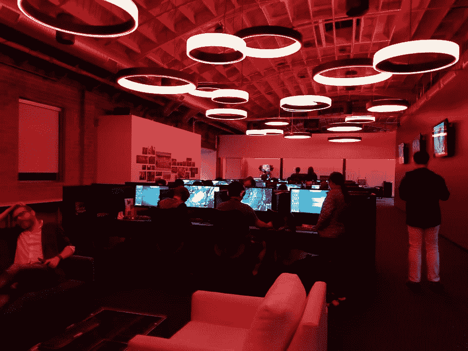

*The splendor of Riot HQ’s PC Bang in full view*

# **第二天:暴动总部之旅**

随着时间的推移，我们花时间开发新的功能和改进我们的项目。

我们分两组参观了工厂，但摄影受到限制。整个设施的设计令人惊讶，所以我非常鼓励去参观。建筑结构中有许多错综复杂的细节，体现了员工对《英雄联盟》的热情。

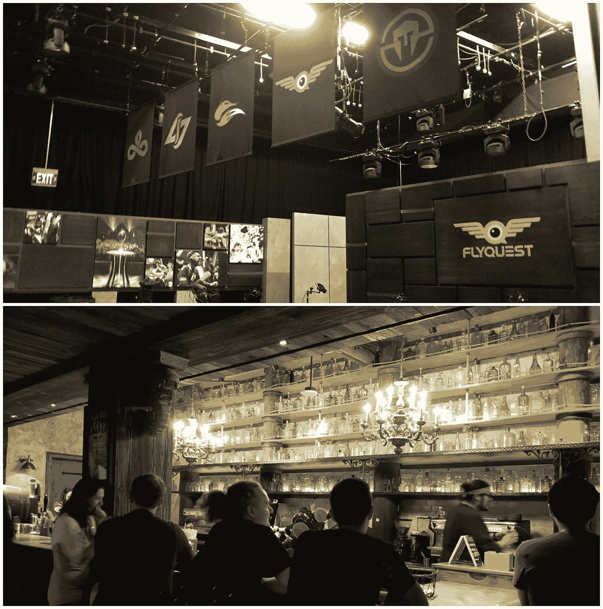

*LCS Studio and Bilgewater Bar*

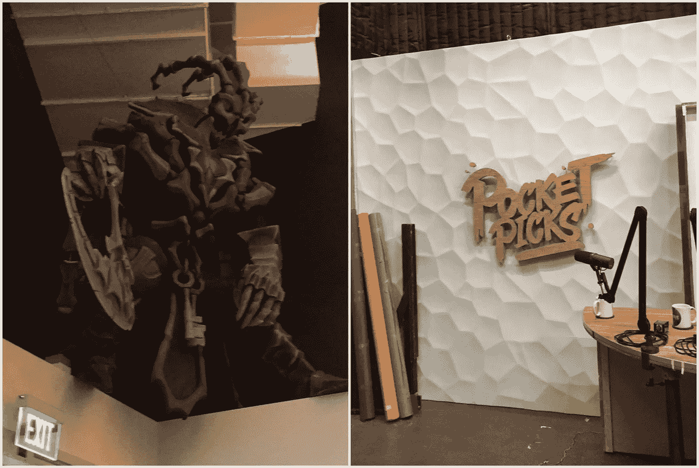

Thresh and the Pocket Picks Studio

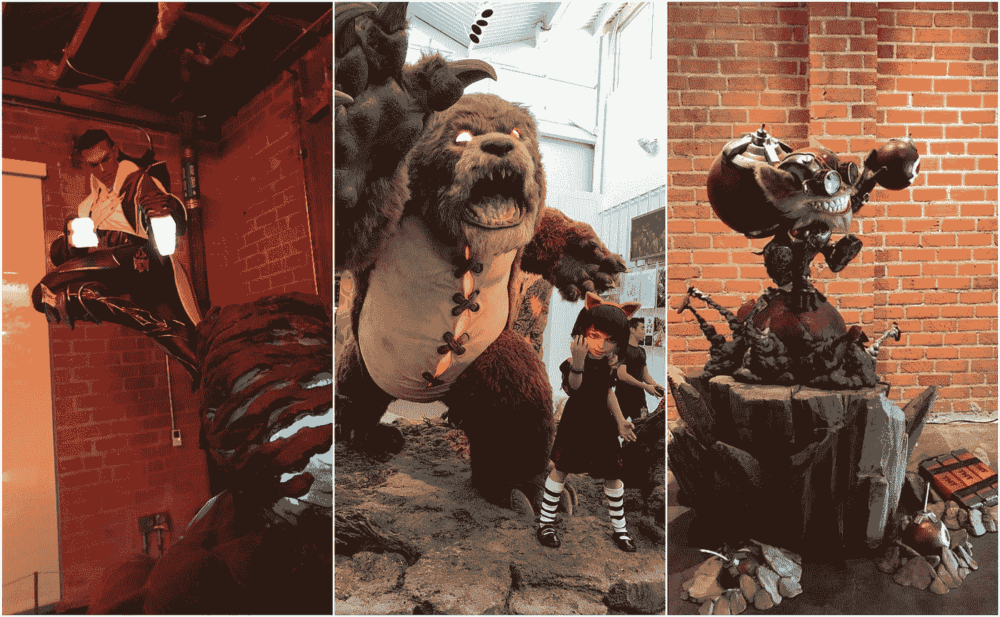

*Lucian, Annie (and Tibbers), and Ziggs*

到那天结束时，我已经完成了几个新的功能，并花时间试图将游戏时间与胜率联系起来，但不幸的是，很难实现它。我深夜回到酒店，以为我的房间会是一个理想的工作环境，但最终在班车返回前几个小时睡着了。

# **第三天:演示日**

随着代码冻结期限的临近，兴奋和紧张弥漫在空气中。我们的项目以展览的形式展示，并检查每个人的项目。

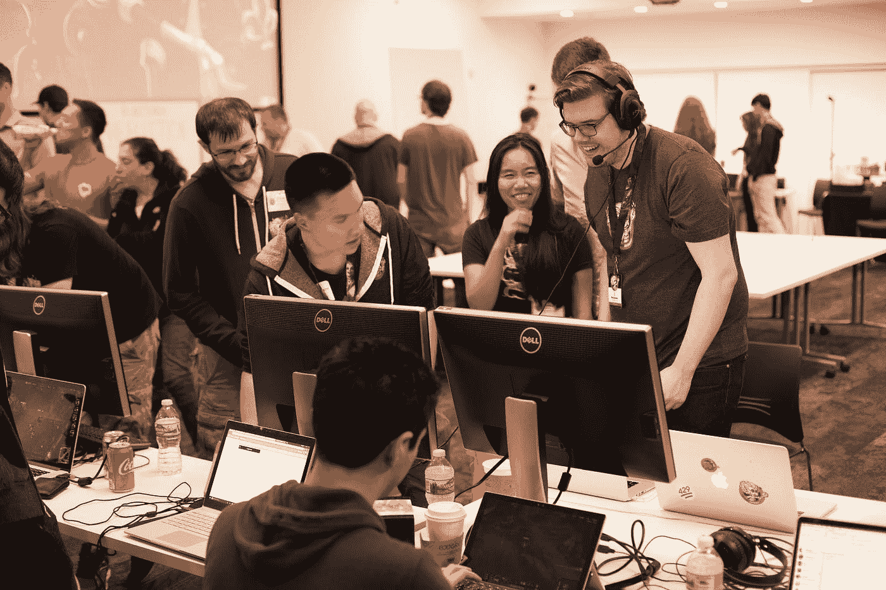

*Chan and Jake demo League Voice for Querjin*

## **Runeterra:选举**

利用他们结合的电影和艺术技巧，他们制作了一个游戏，根据你的召唤师档案来决定你最接近的符文特拉地区。

## **并行收敛:** [**GitHub**](https://github.com/TiFu/parallel-convergence)

在观看比赛的时候，人们通常会提供一些如何改进的建议。并行融合允许对游戏回放进行实时注释，允许专业教练轻松指导玩家。

## **大厅链接**

当邀请朋友玩联盟游戏时，有时很难知道 5 人堆栈是否已满，经常导致召唤师登录后发现他们不能玩。大厅链接保持一个更新的党计数，并允许玩家通过一个不和谐的邀请链接邀请其他人，让玩家可以轻松地邀请他们的朋友来玩。

## **沙发土豆**

许多人喜欢一起观看电子竞技，这在很大程度上是通过 Discord 或 Skype 进行的。他们将体验转移到虚拟现实，允许玩家在虚拟环境中一起观看电子竞技，同时获得当前游戏统计数据的虚拟表示。

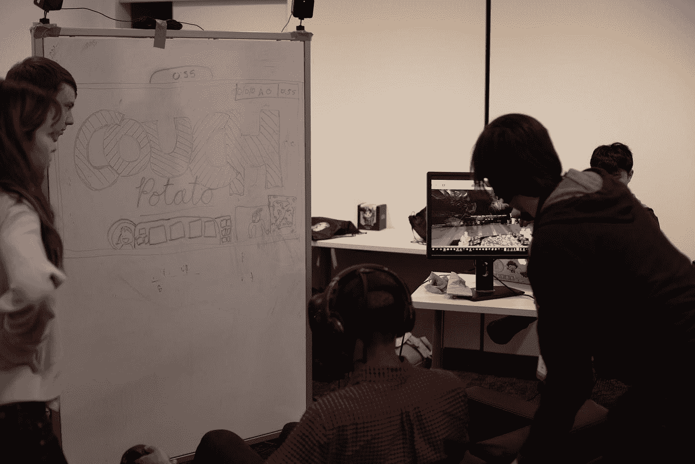

*Liam demonstrates how his team’s project Couch Potato works to a Rioter*

## **组合练习器**

召唤师经常进入一个定制的游戏，只是为了练习 cs 的机制或者弄清楚如何玩一个新的冠军。这个插件允许玩家在一个真实的目标上练习连击，记录伤害等级，跟踪连击的时间，并给出不同方式的提示。

## **Alexa 助手应用**

这个应用程序类似于我们自己的，联盟之声。它提供了关于球员能力的见解，并帮助球员提高他们的发挥。

## **闪电侠蔻驰**

召唤师经常将自己与职业者进行比较，同时试图找出如何改进的方法。这个网络应用程序挑出一个召唤师的弱点，并给出如何改进的建议。

## **构建共享者应用**

作为 Mobafire 或 Probuilds 的一个更加个性化的选择，这个 web 应用程序允许您为创建的构建和技能序列生成自己的热链接，允许玩家轻松地共享关于他们的游戏风格的信息。

## **店主:** [**GitHub**](https://github.com/Advait-M/LOLShopkeeper)

这款虚拟现实游戏通过对想要物品的“顾客”进行时间限制，帮助玩家提高了对冠军建造的了解。

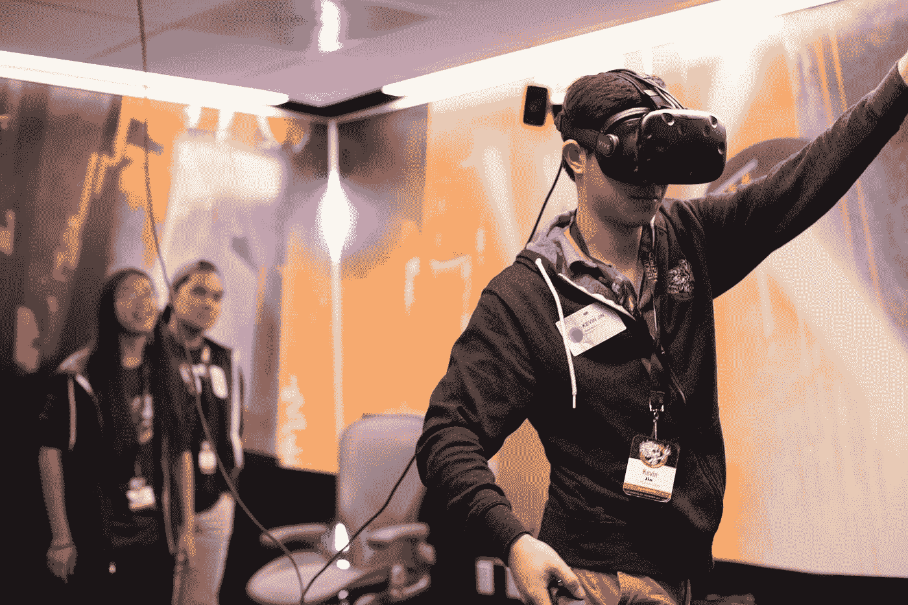

*Kevin demos Shopkeeper, equipped with a full virtual reality headset*

我在 GitHub 上找不到所有的项目，但是我链接了其中的几个！如果我忘记了一个项目，把名字搞砸了，或者你想给我一个更详细的描述，给我留言，我会纠正我的错误。

还有，大声喊出来 [Farza 的](/@farzatv)新项目，DeepLeague！

> *deep League——利用计算机视觉和对英雄联盟迷你地图+超过 100，000 张标记图像的数据集的深度学习，进一步推动电子竞技领域的人工智能研究。*

你可以点击这里查看他的项目 GitHub，点击这里阅读更多相关内容[！](/@farzatv/deepleague-leveraging-computer-vision-and-deep-learning-on-the-league-of-legends-mini-map-giving-d275fd17c4e0)

活动结束后，尽管我们已经筋疲力尽，我们还是再次前往 PC bang 放松。当我们离开 Riot 时，我感到一阵悲伤和困倦，但我们小组认为在我们离开之前探索圣莫尼卡会很有趣。通过溜进按摩浴缸玩 Ghost(一种类似黑手党的文字游戏)，逛书店，逛酸奶园，我们享受了睡觉回家前的最后时光。

# **倒影**

当我到家时，我已经处于反思阶段，回忆我的经历，告诉我的家人我决定去是多么高兴，以及基本上发生的一切。

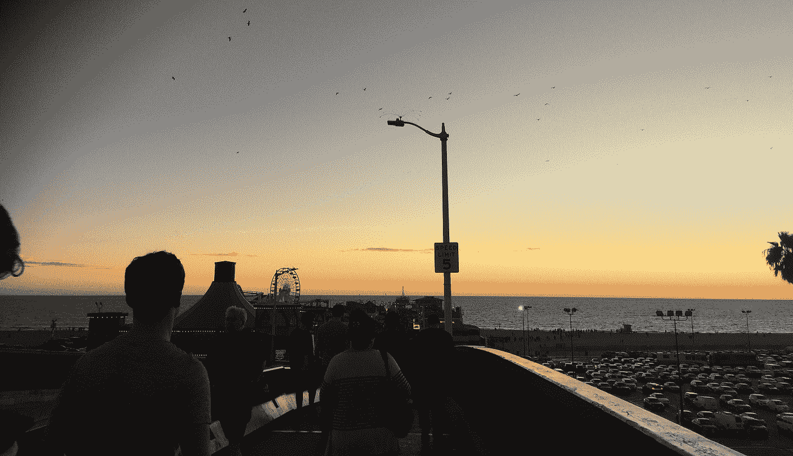

*Throwback to this beautiful sunset view from the Pier*

> 我从未有过那么多的自立和自律。

在其他黑客马拉松中，当我和我超级可靠的朋友一起去的时候，如果我感到害怕或不舒服，我总是依靠他们，所以我总是有很多乐趣，从来没有经历过对我自己强加的界限的挑战。然而，我总觉得自己少了点什么；我很少认识新的人，大部分时间都和我认识的人呆在一起。这一次，当我经历了一大堆新的经历(T21)时，这个缺口被填补了，主要是因为我缺乏自立。

> 为自己说话可以节省几个小时的时间。

正如我前面提到的，我花了一些时间试图弄清楚我应该做什么，试图掩盖我的困惑，并表现出我想如何描绘自己。然而，如果我在规划阶段问更多的问题，我就不会在最初的几个小时里困惑于我们如何将 Firebase 功能与 Google Voice 集成，也不会在黑客马拉松期间怀疑我的能力。

> 人并不可怕，也没有理由害怕接近人。

在很大程度上，很多人可能和我有同样的感受，可能分享了一些相同的内向倾向，这给了他们和我相似的经历。这绝不代表大多数黑客马拉松参与者，但它仍然是一种不可忽视的普遍性格类型。

在社交的第一个晚上之后，我无意中封闭了自己，大部分时间都和我的黑客马拉松小组在一起。然而，第二天早上来了很多新的人，因为我要去沃尔格林超市，所以没有时间和新来的人见面。因此，在展会期间，我大部分时间都在四处闲逛，查看别人的项目，却从未真正正式介绍过自己。然而，我发现我们的后黑客马拉松小组给了我一个认识其他开发人员的途径，所以一切都很好。

从另一个角度来看，作为黑客马拉松的组织者，我认为 Riot 的黑客马拉松组织得非常出色。[吉恩](https://twitter.com/gchorba)和其他工作人员做了很好的工作，确保我们总是知道发生了什么，即使我发出了迷路的假警报。当然，公司的黑客马拉松与学校或大学的黑客马拉松是不同的，因为在食物供应和资金方面可能需要满足非常不同的要求。不管怎样，整个活动进行得非常顺利，在活动过程中几乎没有打嗝。

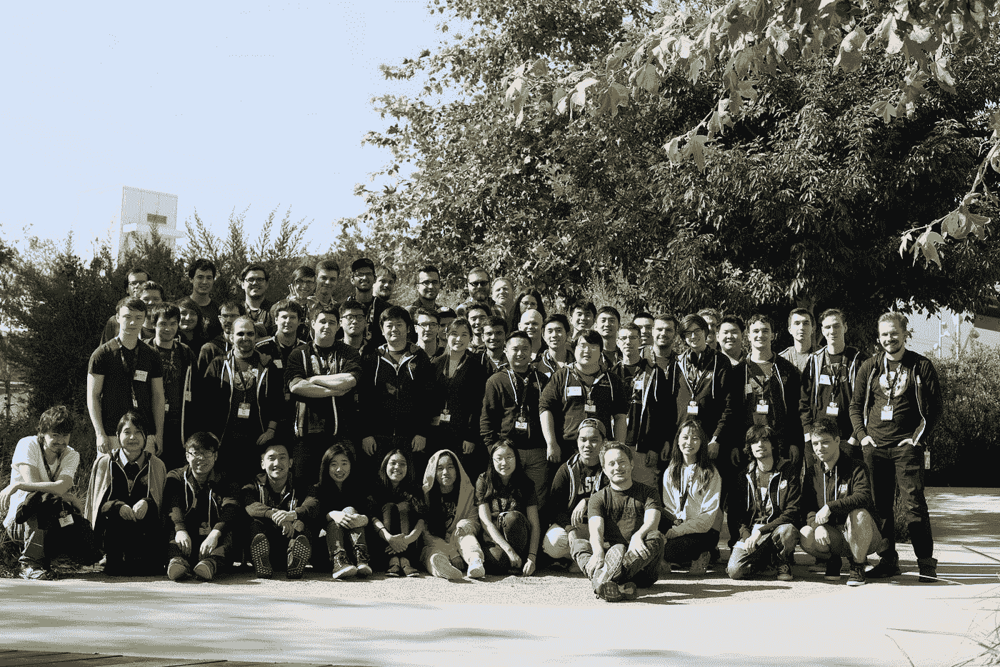

*All the attendees and the organizing crew gathered together for a post-hackathon group photo.*

最终，参加 Riot 的黑客马拉松是一次真正有益身心的经历，并且认识了来自世界各地的人:德国、英国，甚至日本。希望在未来，我们都能在未来重聚，再次在 Riot Games 打造更多惊艳的项目。

如果你喜欢听我的黑客马拉松经历，请留下👏去玩玩英雄联盟吧！