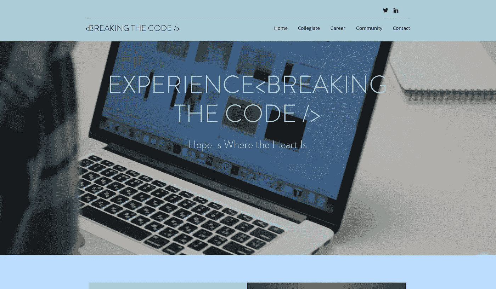

# 我创建在线社区的五步计划

> 原文：<https://medium.com/hackernoon/my-five-step-plan-to-creating-breaking-the-code-a3edfad8fc40>

[Breaking The Code](http://www.breakingthecode.xyz)

作为一名学生，我发现自己不停地走。寒假期间，我应该放松一下，狂看《网飞》。不要误解我，我确实花了几天时间穿着睡衣观察办公室，但我很快发现自己对这种仪式感到厌倦和不满足。

为了抑制我的无聊，我为自己制定了一个寒假计划。

我制作了 [breakingthecode.xyz](http://www.breakingthecode.xyz) ，这是一个[在线社区](https://hackernoon.com/tagged/online-community)，为拥有计算机科学背景的女性和少数族裔提供资源。你可以加入这个在线社区，成为一名密码破译员。

我在我的项目中使用了 S [坦福德设计思维过程指南(DTPG)](https://dschool-old.stanford.edu/sandbox/groups/designresources/wiki/36873/attachments/74b3d/ModeGuideBOOTCAMP2010L.pdf) 。下面我将解释我是如何使用斯坦福 DTPG 的。

1.  斯坦福 DTPG 的第一步是**感同身受**。我开始想到我强烈同情的人，我立即想到 STEM 中的女性，甚至更具体地说，计算机科学中的女性。作为一名计算机科学专业的女性，我知道有一些项目可以帮助女性学习计算机科学。我甚至参加了《编程的女孩》，并把它作为我现在学习 CS 的原因。尽管高中女生可以获得所有这些资源，但我注意到，一旦你真的决定学习计算机科学，这些资源就会减少。我决定为目前学习计算机科学的女性以及那些试图在这个领域开始职业生涯的女性创建一个资源。然后，我意识到我想变得更包容，为妇女和少数性别提供资源——这两个群体在 CS 中的代表性都不足。
2.  第二步是**定义**。我通过定义我可以为这些群体提供什么资源来完成这一步。我决定在学院级别提供编程、实习和教授资源。在职业层面，我会提供面试和工作资源。对于大学和职业水平，我也提供社区资源。
3.  第三步是**构思**。我在网上搜索可用的资源，并与他人交谈，试图确保我以正确的方式帮助解决这个问题，从而完成了这一步。我所说的以正确的方式帮助解决这个问题的意思是，我必须与我的潜在用户核实，并确保这是他们喜欢的东西，而不仅仅是我喜欢的东西。
4.  第四是**原型**步骤。我利用 WIX 帮助创建了这个网站。我决定使用类似 WIX 的软件，而不是自己编程，因为我的一位前老板告诉我“不要再造轮子”。我也知道我这个项目的目标不是提高我的 web 开发技能，而是尽可能创造最好的资源。我花了类型原型和用户测试。对我来说，用户测试就是我写下我希望人们能够在我的网站上做的 6 件事，然后要求现实生活中的人们做这些事。当他们试图完成这些任务时，我会观察他们，并注意他们在哪里遇到了困难，或者比我预期的花费了更长的时间。我相应地编辑了我的网站，让人们尽可能容易地浏览。
5.  最后一步是**测试**。为了做到这一步，我在尽可能多的在线网站上分享我的网站，并请求反馈。虽然我的网站已经上线了，人们也在使用它，但我觉得我似乎永远都处于测试阶段。我会不断添加我发现的新资源，并随时欢迎反馈。

访问 [breakingthecode.xyz](http://www.breakingthecode.xyz) 并随时给我反馈！

> “停泊在港口的船只是安全的，但那不是船只的目的。扬帆出海，做新的事情。”——[格蕾丝·赫柏](http://en.wikipedia.org/wiki/Grace_Hopper)