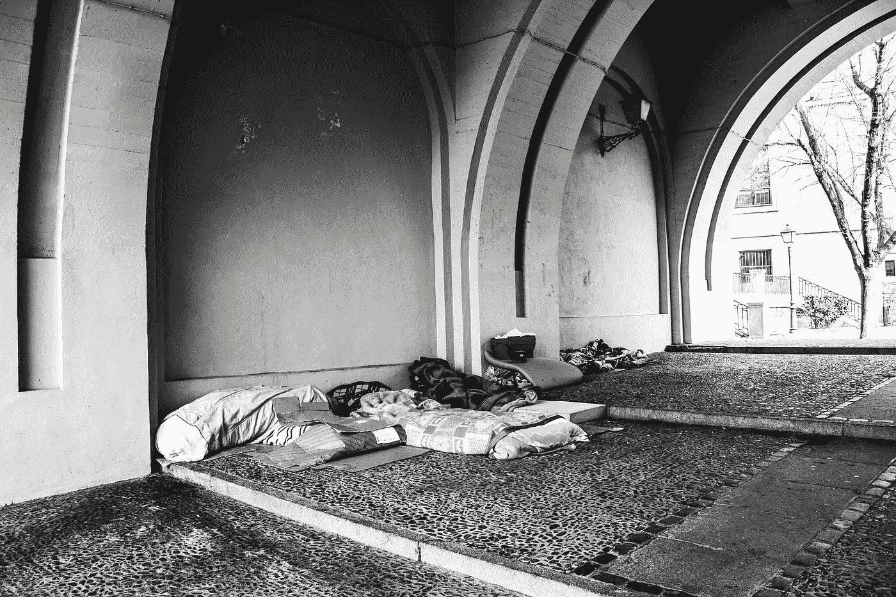

# 我无家可归的邻居和他教给我的观察

> 原文：<https://medium.com/hackernoon/my-homeless-neighbor-and-what-he-taught-me-about-observation-d603108b38d9>

我有一个古怪的邻居，住在街对面。他是一个中年秃头男人，晚上用手机看电视，睡到早上 8 点。我知道这个是因为他住在他的车里。

他做我的邻居已经几个月了，但是我们从来没有说过话。我不确定敲门问借一杯糖的老一套是否适用于他的情况。

你可以对这个人做出各种可怕的结论，但我愿意相信他是无害的。与其说他危险，不如说他有趣。

他的车是一辆漂亮的牧马人式吉普车。也许是卢比肯。我跟不上吉普车的型号。但是它是一辆昂贵的汽车。因为我见过他在遛狗的时候用手机看电视，所以我猜想他有一个可以无线上网的手机账户。甚至可能是网飞的订阅。

尽管很明显他住在自己的车里，但似乎他和我们其他人一样有着正常的生活规律。他早上就走了。他在一天结束时回来。我猜他去上班了，但谁知道呢。不知道所有的细节让他更有趣。

尽管他可能在与自己的生活状况作斗争，但我知道他是一个自豪的美国人。7 月 4 日那天，他用一面美国国旗装饰他的吉普车，这面国旗从他的司机侧窗伸出来。第二天，它就不见了。

所以如果他有手机，能接入无线网络，他一定有信用卡。考虑到他的车的良好状态，他似乎可以补充汽油，他的信用评分必须体面。

他让我想起我在皮马的一个同学，他在完成学位后住在他的小货车里。他没有钱支付大学学费和房租，所以为了教育和职业生涯的长期利益，他选择了住在自己的车里的短期痛苦。据我所知，他过得很好。绝对是更好的生活状况。甚至可能是女朋友。

我愿意相信，他教会了我一些关于观察和妄下结论的风险的有价值的东西。