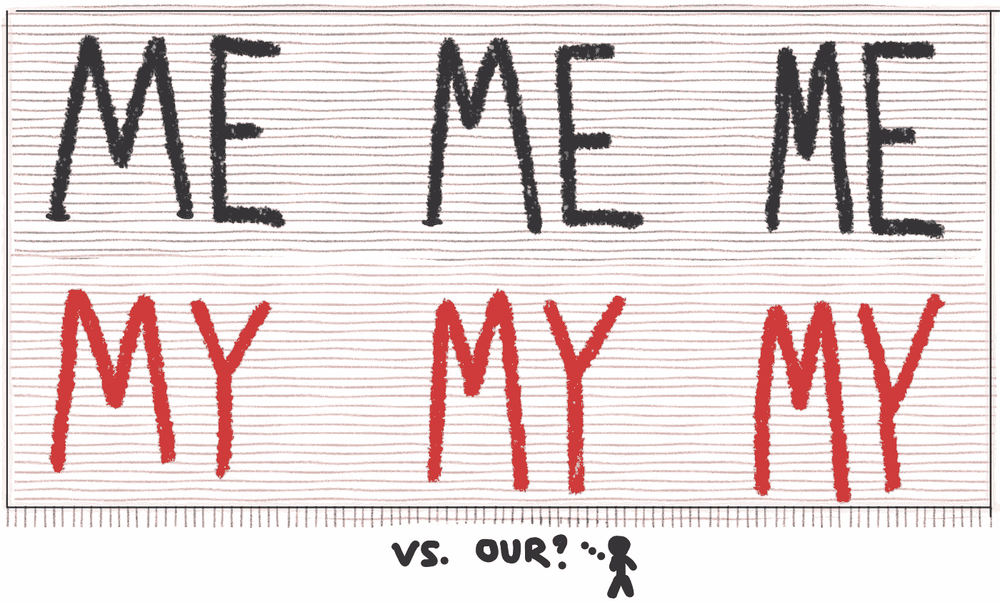

# 我的观念主义

> 原文：<https://medium.com/hackernoon/my-idea-ism-b9ef59bffe8a>

我最近一直在思考对我的观念主义的狂热崇拜。

什么是**我的理念主义**？

**我的想法主义**是需要*你的*想法“赢”。这是我们的想法主义的对立面，或者更重要的是正确的想法主义…在这种情况下，团队逐步探索解决一个令人信服的(和有价值的)问题的选项，并基于证据确定最佳前进路径。

**我的想法主义**渗透到现代组织中，尤其是在美国，在这里我们高度个人化、自信、有竞争力，并且没有长期目标([来源](https://pdfs.semanticscholar.org/a0b3/cd6db2e0038a2bb174c48560814861aeacb3.pdf))。反思一下，晋升往往取决于“将你的想法坚持到底”，而不是它是否一定是正确的想法，或者你是否授权他人想出更好的想法。我们重视果断，“远见”，有答案，并填补积压，贬低模糊性，并冒着“分析瘫痪”的风险。

会议暂停！投球成功！我们走吧！装运它！

几乎每个产品经理都会在周五下午晚些时候接到这个电话…

> 我们有一个董事会即将召开，这是非常重要的，我们提出了一些很酷的东西，我们已经计划好了！我们有什么计划？什么会激起他们的兴趣？如果绿灯亮了…你就可以拥有它了！更新卡牌，好吗？

在这种情况下，你的快速回复(我的想法主义)会得到奖励。你想出一个有说服力的故事，一些“突然出现”并且看起来连贯的故事，然后你回复…即使你有所保留。我的想法资助你的团队。**我的想法主义**让你人头落地。我的想法给你的简历提供了很好的素材。很引人注目。没有什么比整洁的功能路线图更令人欣慰的了:)

思想之战可能会很激烈。一些组织公开地让项目经理互相竞争，以获得他们的“项目”或“产品”(注意，他们的想法，或者至少是对问题的独特观点)“绿灯”。当然……在理想世界中，他们会强调解决某个特定问题的价值，但这往往不止于此。放下一些闪亮的物体——也许是一些机器学习——你就可以开始了。这可以解释为什么有咨询经验的 MBA(有做“推荐”和推销的经验)在某些环境中更有优势。

那么,**我的理念主义**只是公司运作方式的一部分吗？对于我认识的许多不是天生的“推销员”和演讲者，而是选择退后一步思考实际问题的聪明人，我当然希望不是。这同样适用于提高我们决策的质量、我们产品的质量以及我们团队的福利。

我记得曾和一位来自欧洲(来自更“集体”的工作文化)的新雇佣的高技能软件架构师交谈过。他们被技术堆栈选择的竞争和项目的“所有权”击垮了…接受没有完美的解决方案，并开始合作验证关键假设。这是一个重大转变，不是他愿意走的路。

类似地，我永远不会忘记一个软件开发人员在团队中试验性地提出了一个惊人的想法……在更多直言不讳的团队成员聚集在一起的几周后。在一些私人谈话后，我了解到他们根本就插不上嘴。这个问题持续了多年。

我的偏见是，我的想法主义最终会伤害你。至少根据我所看到的。它*能*帮助你的事业，取决于你在哪里工作。但是从长远来看(是的，在美国我们没有长期目标)，变得更擅长于给团队带来背景和数据，并激发最佳的集体解决方案将会赢得胜利。你会成为力量倍增器。

下一步:在陈述时，想象你在框定问题，这样它是完全不可知的。你能给整个团队什么样的数据/背景，让任何人都能向*推销他们的*想法。把注意力放在上下文上。集中精力解决有价值的问题。关注决策框架。你可能有一个“伟大的想法”，但是把它作为一个选项提供，并确保它符合你的框架。

转向正确的观念主义。