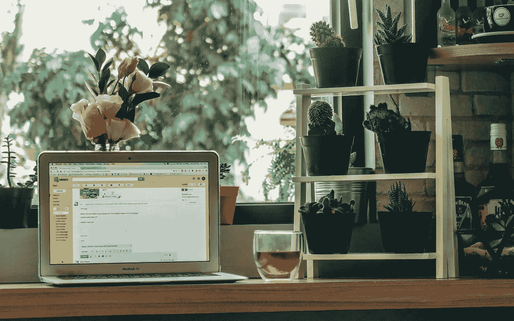

# 我对 Gmail“智能撰写”的初步想法

> 原文：<https://medium.com/hackernoon/my-initial-thoughts-on-gmails-smart-compose-e4ce9be186c2>

你有没有收到过一封看起来相当普通的电子邮件？答案很可能是肯定的。

当人们伸出手去找工作时，他们把复制和粘贴作为他们的朋友。我和许多其他人都会同意，这最终会让他们自食其果。人们会回应其他人。你越能和某人产生共鸣，越能展示你们的相似之处，就越好。

在线交流已经剥夺了我们向交流对象传达情感的部分能力——肢体语言、语调和面部反应。

我认为[谷歌](https://hackernoon.com/tagged/google)给 [gmail](https://hackernoon.com/tagged/gmail) 添加自动完成功能阻碍了沟通过程。自动完成使我们的交流更普通，更不人性化。把另一边的人移走也消除了邮件中的紧迫感。*你曾经回复过来自机器人或自动信息系统的电子邮件吗？*

在[谷歌 I/O 主题演讲](https://techcrunch.com/2018/05/08/google-io-2018-live-stream-livestream-android-chrome-home-assistant/)中，谷歌首席执行官甚至提到新的自动完成功能使他能够发送更多的电子邮件。这个评论是为了让人们认为他们将能够比现在更好地与他们的团队沟通。我认为这是因为人们忽略了越来越多的电子邮件，因为另一边的人离他们越来越远。

希望我是错的，也希望这个新的创新是有帮助的。

我喜欢科技进步，喜欢让我的生活尽可能简单，但我仍然会寄感谢卡，更喜欢面对面交谈。我重视沟通中人性化的一面，并感谢另一个人花时间与我交流。

证明我错了。在评论里告诉我为什么自动完成在[*Gmail*](https://mail.google.com)*是一个很好的进步。*