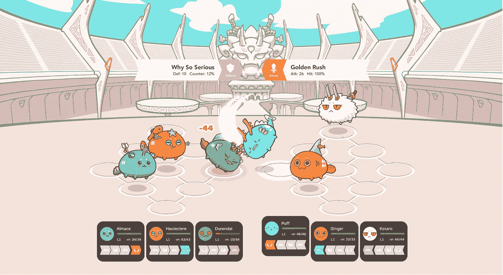

# 我的加密收藏品之旅(目前为止)

> 原文：<https://medium.com/hackernoon/my-journey-in-cryptocollectibles-so-far-acd42376dad7>

作者 Jihoz,《成长导语@ 247 ETH 的文章首次偶然发现了 Cryptokitties。
<figure class=)

 247 ETH 的文章首次偶然发现了 Cryptokitties。
<figure class=)

[Genesis sold for 247 ETH. That caught my eye.](https://medium.com/u/f4f989915036#1) 247 ETH 的文章首次偶然发现了 Cryptokitties。
<figure class=)

[我对这款产品非常感兴趣——我在大学时曾做过一篇关于豆豆娃的研究论文，论文的主题是，BB 市场崩溃的一个不受重视的原因实际上是难以鉴别和区分它们与假货。因此，Axiom Zen 将他们的收藏品(ERC 721 代币)的基因数据存储在以太坊区块链上的想法在很大程度上引起了我的共鸣。](https://medium.com/u/f4f989915036#1) 247 ETH 的文章首次偶然发现了 Cryptokitties。
<figure class=)

[我也是和父亲一起收集昆虫和化石长大的，所以我一直是一个稀有物品的收藏家。在区块链饲养和出售稀有的小猫听起来像是梦想成真！](https://medium.com/u/f4f989915036#1) 247 ETH 的文章首次偶然发现了 Cryptokitties。
<figure class=)

 247 ETH 的文章首次偶然发现了 Cryptokitties。
<figure class=)

[I’ve always been a collector.](https://medium.com/u/f4f989915036#1) 247 ETH 的文章首次偶然发现了 Cryptokitties。
<figure class=)

[Cryptokitties 激发了我对分散式游戏世界的信心。我买了. 8 ETH，把它装进了我的 MetaMask 钱包，开始扫描猫的市场，开始繁殖。](https://medium.com/u/f4f989915036#1) 247 ETH 的文章首次偶然发现了 Cryptokitties。
<figure class=)

[在接下来的几个月里，我每天花大约 20 个小时调查市场，寻找好的交易，并喂养我的小猫。我收集了大约 2000 只小猫，并在此过程中赚了不少钱。我了解了猫咪市场的来龙去脉，并成为最有技巧的花式追逐者之一。](https://medium.com/u/f4f989915036#1) 247 ETH 的文章首次偶然发现了 Cryptokitties。
<figure class=)

 247 ETH 的文章首次偶然发现了 Cryptokitties。
<figure class=)

[The first DogCat ever created, currently residing in my Fancy Cat Codex.](https://medium.com/u/f4f989915036#1) 247 ETH 的文章首次偶然发现了 Cryptokitties。
<figure class=)

[我还加入了 KittyHats 团队，担任他们的社区领导。我们是第一个将 ERC20 令牌附加到 ERC721 的团队。为丹和乔梅辛在 CryptoKitty Discord 中找到我而欢呼吧！](https://medium.com/u/f4f989915036#1) 247 ETH 的文章首次偶然发现了 Cryptokitties。
<figure class=)

 247 ETH 的文章首次偶然发现了 Cryptokitties。
<figure class=)

[KittyHats was the first project I ever personally contributed to in the space.](https://medium.com/u/f4f989915036#1) 247 ETH 的文章首次偶然发现了 Cryptokitties。
<figure class=)

[在最初的炒作开始消退，盈利变得困难之后，社区开始问:现在怎么办？](https://medium.com/u/f4f989915036#1) 247 ETH 的文章首次偶然发现了 Cryptokitties。
<figure class=)

[Cryptokitties 在推出时就像他们说的那样:区块链上可繁殖的豆豆娃。然而，在我看来，这产生了一个类似于豆豆娃的问题，一旦收藏品的价格开始下降，这种狂热就会消失。事实上，CK 现在有大约 400 个 DAU，而根据 dappsvolume.com 的数据，他们有 77，000 个账户与他们的智能合同交互。最后一只方正猫的售价为 8 ETH，而在 12 月份的热潮高峰期，这只猫的售价为 254 ETH。](https://medium.com/u/f4f989915036#1) 247 ETH 的文章首次偶然发现了 Cryptokitties。
<figure class=)

# [我相信社区期望 CK 是一个游戏，但实际上，它只是一个数据平台。隐猫更类似于游戏中还没有被创造出来的可繁殖的“皮肤”。](https://medium.com/u/f4f989915036#1) 247 ETH 的文章首次偶然发现了 Cryptokitties。
<figure class=)

[其中一些项目，如 Kittybattles 和 Kittyraces，已经开始开发，但时间会证明将“游戏开发”这一部分留给社区开发者是否是一个明智的决定。](https://medium.com/u/f4f989915036#1) 247 ETH 的文章首次偶然发现了 Cryptokitties。
<figure class=)

[3 月中旬，在 CK 的移动应用/中国发布失败后，一个我从未听说过的项目的开发者之一 Axie Infinity 找到了我。从 CK 早期开始，他就一直关注着我，对我从一条买了我第一个 ETH 的小鱼到 CK 顶级饲养员、流光和 Kittyhat 的社区经理的历程印象深刻。](https://medium.com/u/f4f989915036#1) 247 ETH 的文章首次偶然发现了 Cryptokitties。
<figure class=)

[联系我的开发者是 Trung Nyugen，他是实际上解开了 CryptoKitty 基因组秘密的参与者之一。我们讨论了区块链游戏界是如何迫切需要一款能为 ERC 721 代币增加实际效用的游戏。一个游戏，玩家可以用他们的时间和精力来升级和改善他们的代币，而不会被通过鼻子收费来“玩”。CK 已经表明，区块链有助于提供真正的所有权感，并为游戏资产的交易创造一个正常运行的市场，但当它成为一种真正的沉浸式游戏体验时，却受到了严重的阻碍。我相信，当“游戏”不再有利可图时，人们会离开它，因为对大多数人来说，CK 更多的是“工作”而不是玩耍。](https://medium.com/u/f4f989915036#1) 247 ETH 的文章首次偶然发现了 Cryptokitties。
<figure class=)

[Axie Infinity 团队拥有我称之为“第二推动者”的优势。我们在 CK 的核心产品中发现了 4 个关键缺陷，并设计了我们的游戏来避免它们:](https://medium.com/u/f4f989915036#1) 247 ETH 的文章首次偶然发现了 Cryptokitties。
<figure class=)

1.  [由于饲养成本高，没有稳定的新隐猫玩家，从长远来看，许多 eth 将流入自动出生者的手中。自动机器人是“矿工”,他们竞相验证每只小猫的基因数据，并通过这项服务获得报酬。](https://medium.com/u/f4f989915036#1) 247 ETH 的文章首次偶然发现了 Cryptokitties。
<figure class=)
2.  [你的 Cryptokitty 不可能通过你的时间和努力得到改善。事实上，如果你饲养你的隐猫，它的价值会下降。因此，与其通过“玩”来提高你的令牌，不如降低它的质量。不理想。](https://medium.com/u/f4f989915036#1) 247 ETH 的文章首次偶然发现了 Cryptokitties。
<figure class=)
3.  [因为现在小猫的效用很小，唯一真正的方法是通过稀缺性+审美来评估它们的价值。新玩家很难学习繁殖和基因系统，所以进入有很大的障碍，很难回答“我应该买什么作为我的第一只小猫”这个问题。](https://medium.com/u/f4f989915036#1) 247 ETH 的文章首次偶然发现了 Cryptokitties。
<figure class=)
4.  [Axiom 设定了 50，000 个 gen 0 的任意限制。根据他们未来用户群的规模，这可能太多了，也可能太少了——他们已经把自己逼到了一个角落。许多社区成员担心 11 月后游戏会发生什么。](https://medium.com/u/f4f989915036#1) 247 ETH 的文章首次偶然发现了 Cryptokitties。
<figure class=)

[在设计我们的产品时，我们牢记这 4 个缺陷，并相信我们已经针对每个缺陷提出了新颖的解决方案。例如，我们没有使用完全分散的自动生产系统，而是使用第三方 Oraclize 来生产轴。这使得我们能够维持 0.002 英镑的育种费，而隐猫的育种费为 0.008 英镑。](https://medium.com/u/f4f989915036#1) 247 ETH 的文章首次偶然发现了 Cryptokitties。
<figure class=)

[我们知道我们不能仅仅优化 CK 的育种、销售和配种系统。为了创造一个像泰尔在《零对一》中建议的那样的新市场，我们知道我们必须增加一个全新的层面。](https://medium.com/u/f4f989915036#1) 247 ETH 的文章首次偶然发现了 Cryptokitties。
<figure class=)

[这是以我们的战斗和玻璃容器系统的形式出现的。](https://medium.com/u/f4f989915036#1) 247 ETH 的文章首次偶然发现了 Cryptokitties。
<figure class=)

[在 Axie 宇宙中，玩家可以组成 3 个 Axie 的团队。像一只隐猫一样，每个轴都有一个独特的基因组，这些基因对应 6 个不同的身体部位。这些身体部位有相关的战斗动作，可以在 Axie 战斗中使用。](https://medium.com/u/f4f989915036#1) 247 ETH 的文章首次偶然发现了 Cryptokitties。
<figure class=)

 247 ETH 的文章首次偶然发现了 Cryptokitties。
<figure class=)

[Axies 从战斗中获得经验，然后可以用来升级/进化他们现有的身体部分，反过来，解锁新的战斗动作。我们相信，加入这种进程感将是让我们的游戏成为第一款具有真正沉浸式游戏体验的分散式游戏的关键。](https://medium.com/u/f4f989915036#1) 247 ETH 的文章首次偶然发现了 Cryptokitties。
<figure class=)

[预先存在的分散式游戏的另一个问题是由于每个动作需要在区块链上被验证而导致的高费用，耗费汽油。为了解决这个问题，我们正在与 Loom Network 密切合作，将他们的侧链缩放解决方案应用到我们的游戏中。你可以在这里阅读更多关于这一发展的信息:](https://medium.com/u/f4f989915036#1) 247 ETH 的文章首次偶然发现了 Cryptokitties。
<figure class=)[https://medium . com/loom-network/loom-SDK-projects-axie-infinity-collect-breed-and-battle-fantasy-pets-on-the-the-区块链-22e6fd11b410](/loom-network/loom-sdk-projects-axie-infinity-collect-breed-and-battle-fantasy-pets-on-the-blockchain-22e6fd11b410)

我们也在开发一个叫做玻璃容器系统的功能。就像真正的宠物经常被安置在定制的鱼缸里一样，我们意识到 ERC 721 令牌可以让我们为自己的 Axie 建造像 Axie 一样独特的家！

在未来，Axie 训练师(我们就是这么称呼他们的)将能够把他们的 Axie 放在独特的 terrariums 中，并为他们提供独特而有趣的令牌化装饰和奖杯。想象一个世界，一队 Axies 可以在他们不在战斗的时候一起闲逛，被美丽的植物、装饰品和他们从过去的战斗/比赛中赢得的奖杯所包围！

Our Mascots in an early version of a terrarium.

Axie Infinity 目前已经通过一个只有 2 名开发人员、4 名艺术家和 2 名成长黑客组成的小团队筹集了大约 1000 ETH。我们相信，我们的精益结构与通过游戏内资产代币销售实现的新融资机制相结合，展示了分散化游戏的潜力。我现在在越南，今年夏天将在亚洲各地的会议上发表演讲。六个月前，这对我来说是不可想象的。

这个领域有如此多的希望，但是分散的游戏开发者必须明白这个生态系统是脆弱的。我们必须确保将我们的球员视为我们的合作伙伴和支持者。我喜欢通过 discord、twitter 和直播与我们的玩家直接交流。如果开发者和社区之间没有直接的沟通渠道，信任就会枯竭，开发者就会失去对玩家期望和痛点的了解。

现在说这个领域会发生什么还为时过早——也许像暴雪这样的公司会转移到区块链，把我们都干掉——但我怀疑现在从事高质量分散式游戏的人将会作为游戏开发者工作很长一段时间。事实上，拥有数百万用户的传统游戏公司已经向我们寻求建议，表明我们在这 6 个月中获得的经验和知识对集中式游戏开发者非常有价值。我相信他们将很难跨越到开发分散式游戏，我们的竞争优势将持续很长一段时间。

非常爱你，

杰夫(吉霍兹)

附:如果你想与我联系并讨论我在这里提出的想法，请随时给我发电子邮件到**Jeff@axieinfinity.com**或在 Axie Infinity Discord:[https://discord.gg/68DeTqc](https://discord.gg/68DeTqc)找到我